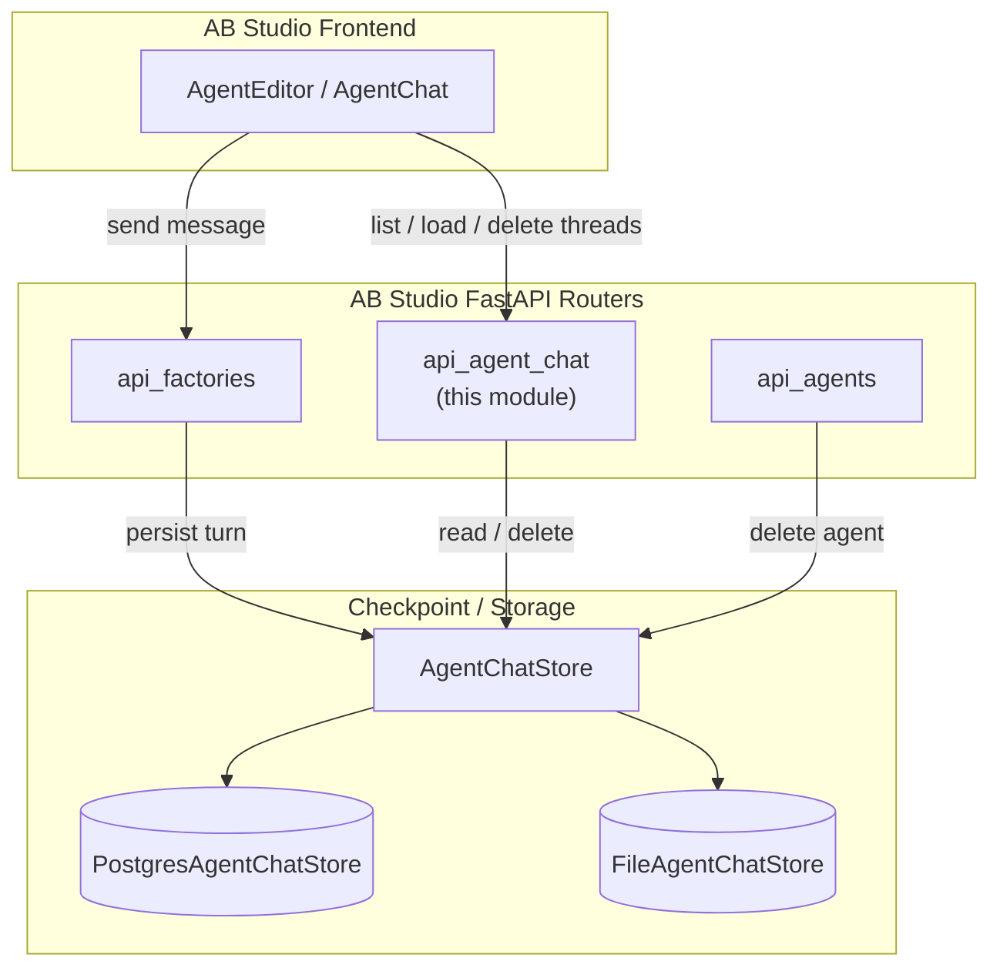
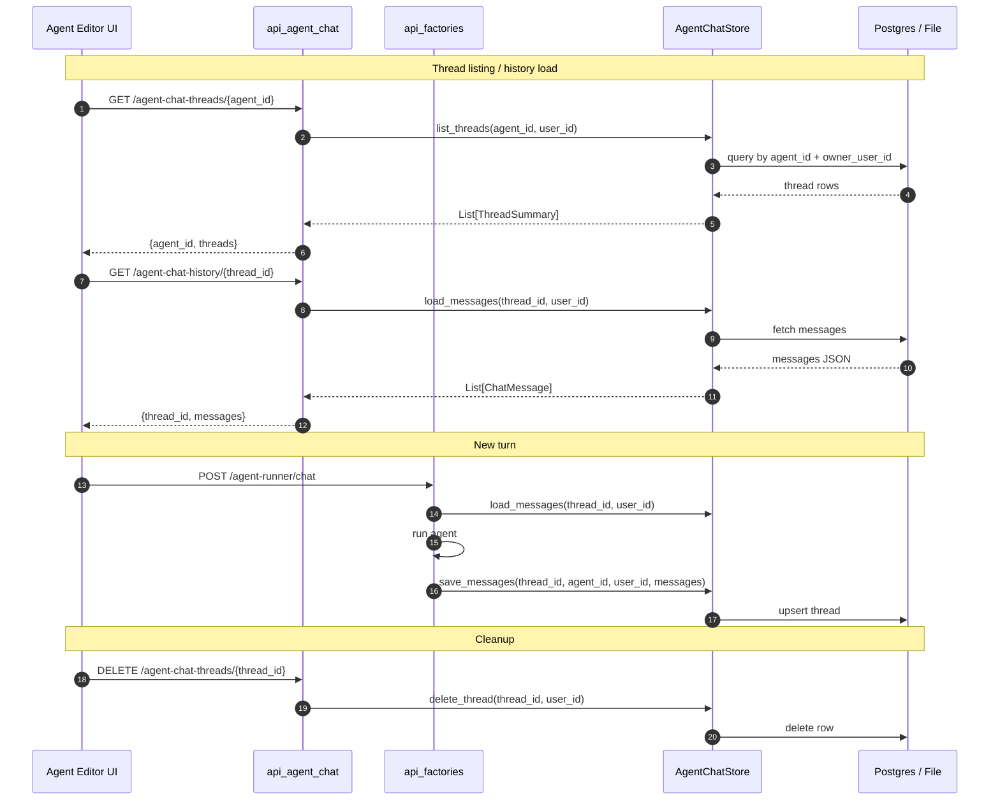
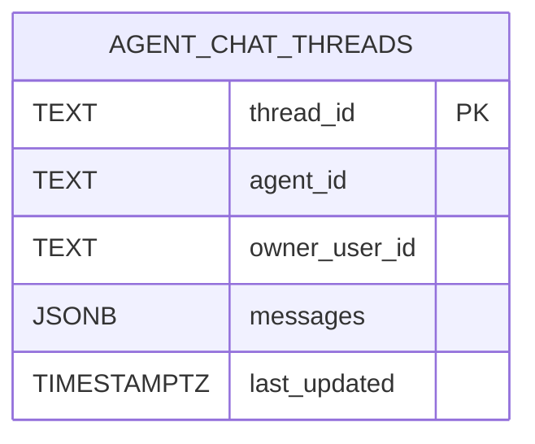

# `api_agent_chat` — Agent Chat History API

The `api_agent_chat` module exposes REST endpoints that let users manage their **per-agent, per-user chat conversation history** in AB Studio. It is the read/delete counterpart to the agent-runner chat flow implemented in [`api_factories`](api_factories.md): while [`agent_runner_chat`](api_factories.md) creates and appends messages after each agent run, this module provides the UI-facing endpoints to list threads, load a thread's messages, and delete a thread.

---

## 1. Purpose & Scope

AB Studio distinguishes between two kinds of persisted chat history:

| Kind | Module | Scope | Primary Use-Case |
|------|--------|-------|------------------|
| **Workflow chat** | [`api_chat`](api_chat.md) | `workflow_id` | Conversations that drive / debug a workflow execution. |
| **Agent chat** | `api_agent_chat` | `(agent_id, owner_user_id)` | Conversations with a deployed agent created through the agent factory. |

`api_agent_chat` is intentionally narrow: it owns **history storage metadata only**. It does not run agents, stream responses, or manage agent definitions. Those responsibilities live in [`api_factories`](api_factories.md) and [`api_agents`](api_agents.md).

### Key design decisions

- **User-scoped isolation**: every query is filtered by `owner_user_id = current_user.id`. One user cannot see another user's conversation with the same agent.
- **Single store singleton**: the module creates one `AgentChatStore` instance at startup and exposes it via `get_store()`. [`api_factories`](api_factories.md) imports this same singleton to persist turns.
- **Storage backend abstraction**: the store can be backed by PostgreSQL (`PostgresAgentChatStore`) or a local JSON file (`FileAgentChatStore`), selected by the `postgres_enabled()` configuration flag.
- **Lifecycle coupling**: `startup()` and `shutdown()` are invoked from [`app_main`](../reference/app_main.md) lifespan hooks.

---

## 2. Core Components

### 2.1 Module-level store singleton

```python
_store: Optional[AgentChatStore] = None

def get_store() -> AgentChatStore:
    if _store is None:
        raise RuntimeError("agent chat store not initialised — startup() not called")
    return _store

async def startup() -> None:
    global _store
    _store = PostgresAgentChatStore() if postgres_enabled() else FileAgentChatStore()
    await _store.startup()

async def shutdown() -> None:
    global _store
    if _store:
        await _store.shutdown()
        _store = None
```

- `startup()` chooses the backend and initializes the schema / file.
- `shutdown()` releases the reference; the shared PostgreSQL pool is intentionally **not** closed because it is owned by the platform's database layer.
- `get_store()` is imported by [`api_factories`](api_factories.md) so agent runs can persist messages without duplicating store logic.

### 2.2 HTTP Endpoints

| Method | Path | Handler | Description |
|--------|------|---------|-------------|
| `GET` | `/agent-chat-threads/{agent_id}` | `list_agent_chat_threads` | Return thread summaries for the current user and the given agent. |
| `GET` | `/agent-chat-history/{thread_id}` | `get_agent_chat_history` | Return full message list for a thread, including optional `generated_files` and `usage` metadata. |
| `DELETE` | `/agent-chat-threads/{thread_id}` | `delete_agent_chat_thread` | Delete a thread if it belongs to the current user. |

All endpoints depend on `require_access` from [`api_deps`](api_deps.md), which resolves the caller to an [`AuthenticatedUser`](../models/app_models.md) and enforces that the user has access to the `agent-chain` framework.

---

## 3. Architecture

### 3.1 High-level placement



### 3.2 Component interaction



### 3.3 Data model

A thread is stored as a single record keyed by `thread_id` and scoped by `agent_id` + `owner_user_id`.



Each message in the `messages` JSONB array is a `ChatMessage` with the following shape (only `role` and `content` are guaranteed):

```json
{
  "role": "user | assistant",
  "content": "...",
  "generated_files": [ /* optional download chips */ ],
  "usage": { /* optional token / cost metadata */ }
}
```

The optional fields are surfaced by `get_agent_chat_history` so the frontend can re-render download chips and usage footers when a thread is reloaded.

---

## 4. Process Flows

### 4.1 Listing threads

```mermaid
flowchart LR
    A[Client: GET /agent-chat-threads/{agent_id}] --> B{require_access}
    B -->|401/403| C[Reject]
    B -->|AuthenticatedUser| D[get_store().list_threads]
    D --> E[Filter by agent_id + owner_user_id]
    E --> F[Sort by last_updated DESC]
    F --> G[Return summaries]
```

The summary returned for each thread includes:

- `thread_id`
- `title`
- `last_message_preview`
- `last_updated`
- `message_count`

### 4.2 Loading history

```mermaid
flowchart LR
    A[Client: GET /agent-chat-history/{thread_id}] --> B{require_access}
    B -->|401/403| C[Reject]
    B -->|AuthenticatedUser| D[get_store().load_messages]
    D --> E{Thread exists?}
    E -->|No| F[404 Thread not found]
    E -->|Yes| G[Map messages]
    G --> H[Attach generated_files / usage if present]
    H --> I[Return {thread_id, messages}]
```

### 4.3 Deleting a thread

```mermaid
flowchart LR
    A[Client: DELETE /agent-chat-threads/{thread_id}] --> B{require_access}
    B -->|401/403| C[Reject]
    B -->|AuthenticatedUser| D[get_store().delete_thread]
    D --> E{Row deleted?}
    E -->|No| F[404 Thread not found]
    E -->|Yes| G[204 No Content]
```

---

## 5. Dependencies

### 5.1 Direct code dependencies

| Dependency | Module | Role |
|------------|--------|------|
| `AuthenticatedUser` | [`app_models`](../models/app_models.md) | User identity model. |
| `require_access` | [`api_deps`](api_deps.md) | Authentication / framework-access dependency. |
| `postgres_enabled` | [`core_config`](../infrastructure/core_config.md) | Feature flag for PostgreSQL backend. |
| `AgentChatStore` | [`checkpoint`](../reference/checkpoint.md) | Abstract store interface. |
| `PostgresAgentChatStore` | [`checkpoint`](../reference/checkpoint.md) | Production PostgreSQL implementation. |
| `FileAgentChatStore` | [`checkpoint`](../reference/checkpoint.md) | Local JSON file implementation. |

### 5.2 Runtime dependencies

| Dependency | Module | Role |
|------------|--------|------|
| `app.main._lifespan` | [`app_main`](../reference/app_main.md) | Calls `startup()` / `shutdown()`. |
| `agent_runner_chat` | [`api_factories`](api_factories.md) | Writes messages via `get_store()`. |

---

## 6. Error Handling

All three route handlers wrap store exceptions in `HTTPException(500, detail=str(e))`. In addition:

- `get_agent_chat_history` returns `404` when `load_messages` returns `None` (thread missing or not owned).
- `delete_agent_chat_thread` returns `404` when `delete_thread` returns `False` (thread missing or not owned).
- `get_store()` raises `RuntimeError` if called before `startup()` has run.

---

## 7. Security & Isolation

- **Authentication**: every endpoint uses `Depends(require_access)` from [`api_deps`](api_deps.md).
- **Authorization by ownership**: the store methods always include `owner_user_id` in the query. There is no admin override in this router; administrators who need to purge agent data can use the agent-management APIs in [`api_agents`](api_agents.md) or direct store calls.
- **No PII enrichment**: the router only returns messages as persisted; any PII redaction happens upstream in the agent runner or governance layers.

---

## 8. How It Fits into the System

`api_agent_chat` is one of the smaller, focused routers in AB Studio. Its role is to complete the chat lifecycle for factory-built agents:

1. **Creation / deployment**: [`api_agents`](api_agents.md) and [`agent_factory_pipeline`](../agents/agent_factory_pipeline.md) create and register agents.
2. **Conversation**: [`api_factories`](api_factories.md) runs the agent, persists each turn, and returns the response.
3. **History management**: `api_agent_chat` lets users list, reload, and delete their conversations.

By keeping history reads separate from the runner, the module remains cache-friendly and easy to reason about: the write path is single-writer (the runner), and the read path is read-only except for explicit deletes.

---

## 9. Related Documentation

- [`api_factories`](api_factories.md) — agent runner chat and factory endpoints.
- [`api_chat`](api_chat.md) — workflow-scoped chat thread endpoints.
- [`api_agents`](api_agents.md) — agent CRUD and lifecycle.
- [`checkpoint`](../reference/checkpoint.md) — `AgentChatStore` implementations.
- [`api_deps`](api_deps.md) — authentication dependencies.
- [`app_models`](../models/app_models.md) — `AuthenticatedUser` and request models.
- [`app_main`](../reference/app_main.md) — application lifespan and startup hooks.
