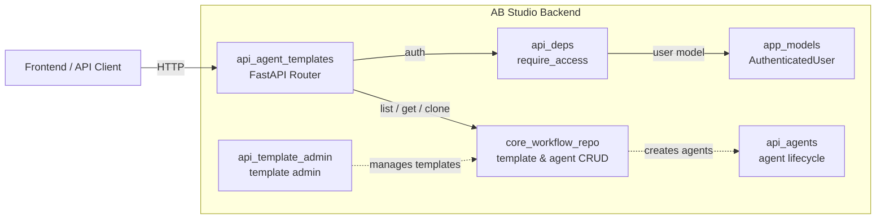
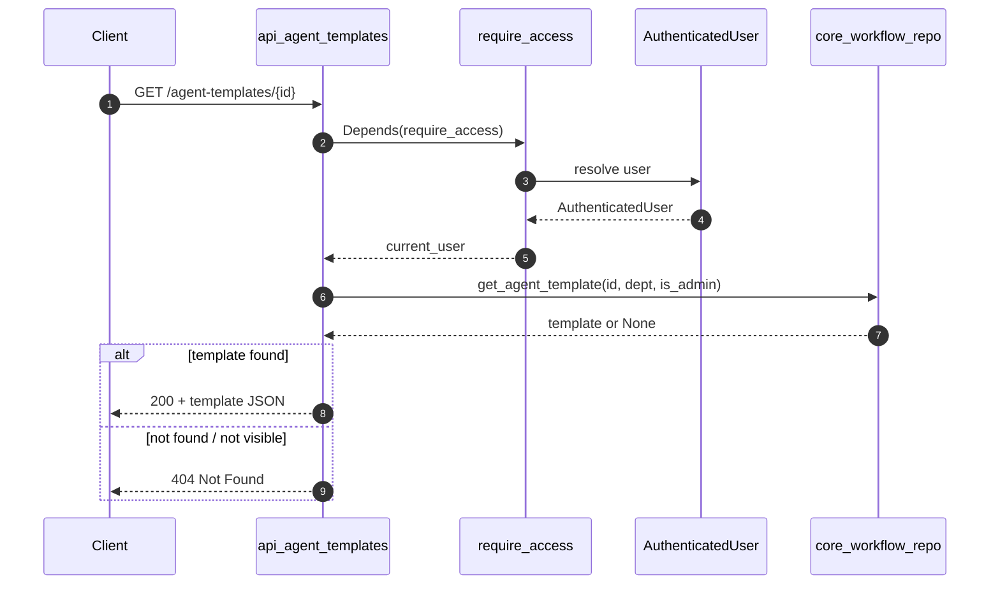
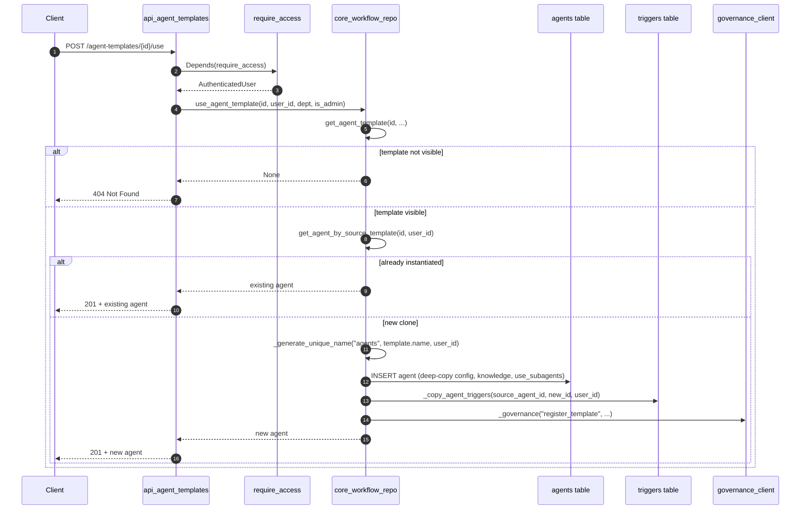

# `api_agent_templates` — Agent Template API

The `api_agent_templates` module is a FastAPI router that exposes REST endpoints for discovering and instantiating **pre-built agent templates** (agent presets) stored in the AB Studio database. It is the runtime counterpart to the agent-template seed/admin surface: users can browse templates that are visible to them, inspect a template's configuration, and create a personal agent clone from it with a single call.

This module intentionally stays thin. All persistence, scoping, cloning, and governance logic lives in [`core_workflow_repo.md`](../workflows/core_workflow_repo.md); authentication is delegated to [`api_deps.md`](api_deps.md); and the request/response models are defined in [`app_models.md`](../core/app_models.md).

---

## 1. Purpose & Responsibilities

| Responsibility | Description |
| -------------- | ----------- |
| **List templates** | `GET /agent-templates` returns agent presets visible to the caller, respecting public/private department scoping. |
| **Get a template** | `GET /agent-templates/{template_id}` returns the full template record if the caller is allowed to see it. |
| **Use a template** | `POST /agent-templates/{template_id}/use` clones the template into a new agent owned by the caller. |
| **Error translation** | Converts repository-level `NameValidationError` and missing-template cases into appropriate HTTP status codes (`409`, `404`). |

The module does **not** manage template creation, editing, or seeding — those operations are handled by [`api_template_admin.md`](api_template_admin.md) and the seeding utilities in [`core_workflow_repo.md`](../workflows/core_workflow_repo.md).

---

## 2. Architecture



### Component Roles

- **`api_agent_templates`** — Route handlers only; maps HTTP requests to `workflow_repo` calls and translates exceptions.
- **`api_deps.require_access`** — Resolves the bearer token / gateway user into an `AuthenticatedUser` and enforces that the caller has access to the `agent-chain` framework.
- **`app.models.AuthenticatedUser`** — Typed user context carrying `id`, `role`, `department`, and hierarchy fields used for ACL decisions.
- **`core_workflow_repo`** — Implements department-scoped queries, agent cloning, trigger copying, and governance registration.
- **`api_agents`** — Owns the resulting agent records once a template is instantiated.

---

## 3. Endpoints

| Method | Path | Handler | Purpose |
| ------ | ---- | ------- | ------- |
| `GET` | `/agent-templates` | `list_agent_templates` | List visible agent presets. |
| `GET` | `/agent-templates/{template_id}` | `get_agent_template_route` | Fetch a single preset. |
| `POST` | `/agent-templates/{template_id}/use` | `use_agent_template_route` | Clone the preset into a new agent (201). |

All endpoints require authentication via `require_access`.

---

## 4. Data Model

The router consumes and produces the following shapes (defined in [`core_workflow_repo.md`](../workflows/core_workflow_repo.md) and [`app_models.md`](../core/app_models.md)):

### Agent Template (response)

```json
{
  "id": "agent-tpl-abc123",
  "name": "Customer Support Agent",
  "description": "Handles L1 support queries",
  "category": "support",
  "instructions": "You are a helpful support agent...",
  "provider": "custom",
  "model_name": "gpt-4o",
  "temperature": 0.7,
  "max_tokens": 8192,
  "top_p": 1.0,
  "tools": [...],
  "skills": [...],
  "visibility": "public",
  "department": null,
  "knowledge": {"mode": "existing_kb", "kb_id": "..."},
  "use_subagents": false,
  "source_agent_id": "agent-orig-xyz"
}
```

### Created Agent (response from `use`)

Returns the same shape as an agent created through [`api_agents.md`](api_agents.md), including the new `id`, `name`, `source_template_id`, copied triggers, and preserved `knowledge` / `use_subagents` values.

---

## 5. Visibility & Access Control

Templates follow the same department-scoped visibility model as workflow templates (see [`core_workflow_repo.md`](../workflows/core_workflow_repo.md)):

- **Admins** (`role == "admin"`) see every template.
- **Non-admins** see:
  - `visibility = 'public'` templates, and
  - `visibility = 'private'` templates whose `department` matches the caller's department.

The `department` value is taken from `AuthenticatedUser.department`, which is populated from the gateway JWT / LDAP sync in [`api_deps.md`](api_deps.md).

---

## 6. Process Flows

### 6.1 List / Get Template



### 6.2 Use Template (Clone)



### 6.3 Error Handling

```mermaid
flowchart TD
    A[POST /agent-templates/{id}/use] --> B{template exists & visible?}
    B -->|no| C[404 Agent template not found]
    B -->|yes| D{already cloned?}
    D -->|yes| E[201 return existing agent]
    D -->|no| F{unique name generation}
    F -->|collision / invalid| G[409 name_conflict]
    F -->|ok| H[create agent + copy triggers + governance]
    H --> I[201 return new agent]
```

---

## 7. Component Interaction

```mermaid
graph TD
    subgraph "api_agent_templates"
        L[list_agent_templates]
        G[get_agent_template_route]
        U[use_agent_template_route]
    end

    subgraph "api_deps"
        RA[require_access]
    end

    subgraph "core_workflow_repo"
        LAT[get_all_agent_templates]
        GAT[get_agent_template]
        UAT[use_agent_template]
        CA[create_agent]
        CAT[_copy_agent_triggers]
        GVN[_governance]
    end

    L -->|GET /agent-templates| RA
    L --> LAT
    G -->|GET /agent-templates/{id}| RA
    G --> GAT
    U -->|POST /agent-templates/{id}/use| RA
    U --> UAT
    UAT --> GAT
    UAT --> CA
    UAT --> CAT
    UAT --> GVN
```

---

## 8. Dependencies

| Dependency | Module | Reason |
| ---------- | ------ | ------ |
| `require_access` | [`api_deps.md`](api_deps.md) | Authentication and framework access. |
| `AuthenticatedUser` | [`app_models.md`](../core/app_models.md) | Typed user context for ACL. |
| `workflow_repo` | [`core_workflow_repo.md`](../workflows/core_workflow_repo.md) | All template/agent persistence and cloning logic. |
| `NameValidationError` | [`core_workflow_repo.md`](../workflows/core_workflow_repo.md) | Mapped to HTTP 409. |

Related surfaces:

- [`api_agents.md`](api_agents.md) — manages the agents produced by `use_agent_template_route`.
- [`api_template_admin.md`](api_template_admin.md) — admin CRUD for the templates consumed here.
- [`api_templates.md`](api_templates.md) — workflow template endpoints (analogous but for workflows, not agents).
- [`api_catalog.md`](api_catalog.md) — factory-generated skills/tools and factory agents.

---

## 9. Design Notes

- **Thin router**: No business logic lives in `api_agent_templates.py`. This keeps the API layer testable and ensures consistency with other entity routers.
- **Idempotent instantiation**: Calling `use` multiple times for the same template returns the same agent, preventing duplicate clones.
- **Deep copy**: The clone receives independent copies of `tools`, `skills`, `knowledge`, and `use_subagents` so later edits to the agent do not mutate the template.
- **Trigger preservation**: Routines bound to the original agent are re-created for the clone via `_copy_agent_triggers`. Failures are logged, not fatal.
- **Governance registration**: Newly cloned agents are registered as template instances in the governance subsystem. Failures are swallowed so governance outages cannot break template usage.
- **Name safety**: `_generate_unique_name` guarantees the derived agent name does not collide with the user's existing agents. The route still catches `NameValidationError` defensively and returns `409`.

---

## 10. How It Fits Into the System

`api_agent_templates` sits between the **admin/seed template surface** and the **agent runtime surface**:

1. Template authors or admins create/seed templates through [`api_template_admin.md`](api_template_admin.md) and [`core_workflow_repo.md`](../workflows/core_workflow_repo.md).
2. End users browse and instantiate those templates via this router.
3. The resulting agents are ordinary agent records managed by [`api_agents.md`](api_agents.md) and executed by the agent/chat runtime.

In the broader AB Studio architecture, this router is one of several entity routers mounted under the main FastAPI application (see [`app_main.md`](../core/app_main.md)). It reuses the same gateway authentication, department-based ACL, and governance hooks as workflow templates and agents.
