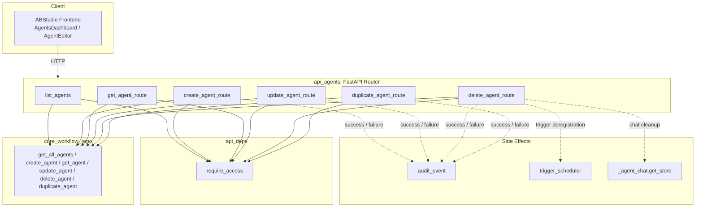
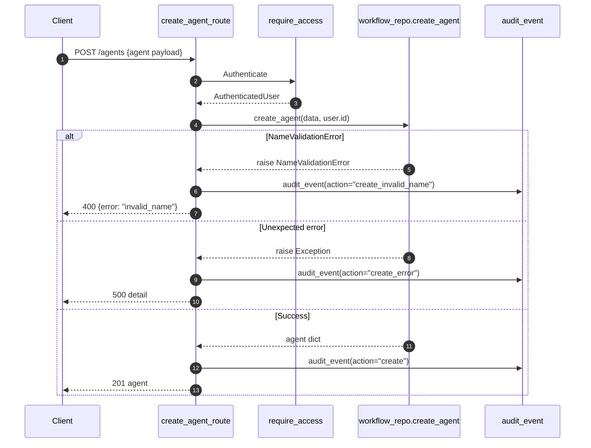
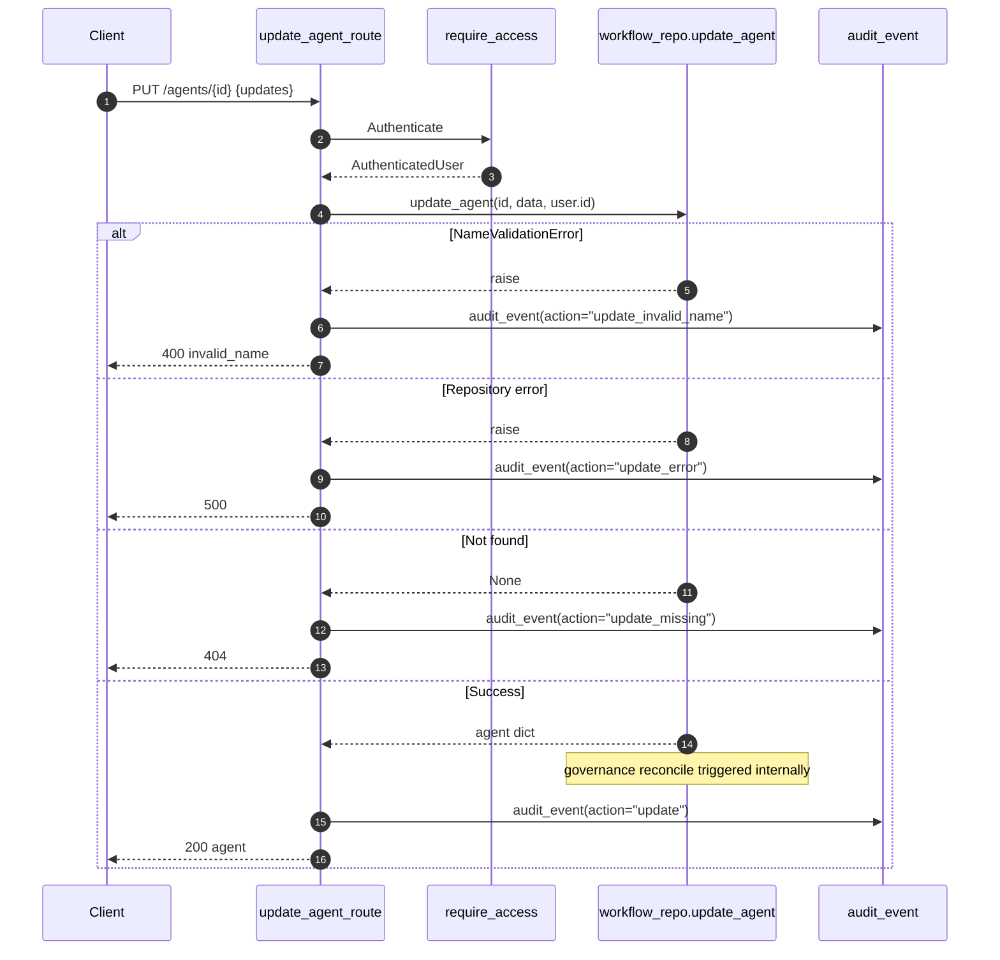
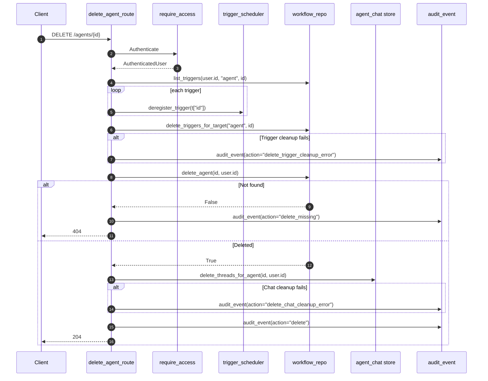
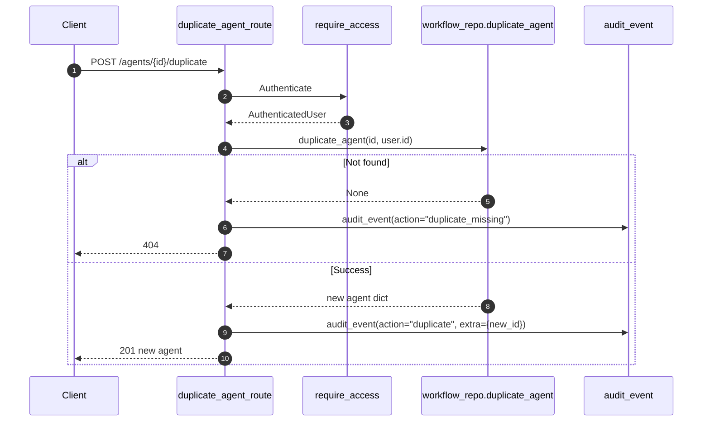

# api_agents

The `api_agents` module exposes the HTTP REST surface for managing **agent definitions** in ABStudio. It is a thin FastAPI router (`ABStudio/backend/app/api/agents.py`) that translates incoming requests into calls against the persistence layer, enforces ownership-based access control, and emits audit events for every mutating action.

Agents in this context are configurable autonomous entities composed of instructions, model settings, tools, skills, guardrails, memory configuration, knowledge sources, and optional attached workflows. The endpoints here are concerned only with the **lifecycle** of those definitions (create, read, update, delete, list, duplicate). Runtime execution of agents is handled by other modules such as [`api_factories`](api_factories.md), [`api_execution`](api_execution.md), and [`api_agent_chat`](api_agent_chat.md).

---

## Core Functionality

| Endpoint | Handler | Purpose |
|----------|---------|---------|
| `GET /agents` | `list_agents` | Return all agents owned by the authenticated user, ordered by most recently updated. |
| `POST /agents` | `create_agent_route` | Persist a new agent definition after validating its name. |
| `GET /agents/{agent_id}` | `get_agent_route` | Fetch a single agent by ID, enforcing owner access. |
| `PUT /agents/{agent_id}` | `update_agent_route` | Modify an existing agent definition; triggers governance reconciliation on success. |
| `DELETE /agents/{agent_id}` | `delete_agent_route` | Remove an agent, deregistering any associated triggers and cleaning up agent chat threads. |
| `POST /agents/{agent_id}/duplicate` | `duplicate_agent_route` | Create a copy of an agent with a unique name and copied triggers. |

All routes depend on [`require_access`](api_deps.md), which wraps gateway JWT authentication and produces an `AuthenticatedUser`. Every mutating route records structured audit events via [`audit_event`](../sdlc/core_governance.md).

---

## Architecture

### Component Responsibilities

- **Router (`api_agents`)**: Validates path parameters, maps HTTP verbs to repository calls, translates repository and validation exceptions into appropriate HTTP status codes, and emits audit events.
- **Authentication dependency (`require_access`)**: Ensures every request carries a valid JWT and resolves it into an `AuthenticatedUser` with `id`, `email`, `department`, and role fields.
- **Workflow repository (`core_workflow_repo`)**: Owns the SQL schema and transactional logic for agents, including name uniqueness checks, JSON serialization of nested config, and governance reconciliation hooks.
- **Trigger scheduler (`services_trigger_scheduler`)**: Manages scheduled triggers. During agent deletion, the router deregisters any triggers targeting the agent and removes them from persistence.
- **Agent chat store (`api_agent_chat`)**: Persists conversational threads for agents. The router requests best-effort deletion of those threads when an agent is removed.
- **Governance audit (`core_governance`)**: Records `abstudio.agent.crud` events with user identity, action, agent ID/name, and error context.

---

## Data Flow

### Create Agent

### Update Agent

### Delete Agent

### Duplicate Agent

---

## Agent Data Model

The repository persists agents in a PostgreSQL table with the following conceptual schema (see [`core_workflow_repo.md`](../reference/core_workflow_repo.md) for the exact SQL and serialization logic):

| Field | Type | Description |
|-------|------|-------------|
| `id` | string | Stable identifier, typically `agent-{uuid}` |
| `name` | string | Human-readable name; unique per owner |
| `description` | string | Short summary |
| `instructions` | string | System prompt / directive |
| `provider` | string | Model provider (e.g., `custom`) |
| `model_name` | string | Specific model identifier |
| `api_key` / `base_url` | string | Optional custom endpoint credentials |
| `temperature` / `max_tokens` / `top_p` | number | Sampling parameters |
| `tools` / `skills` | JSON array | Bound tool/skill references |
| `guardrails` | JSON object | Policy restrictions |
| `memory_config` | JSON object | Memory behavior |
| `knowledge` | JSON object | KB mode and attached documents |
| `attached_flows` | JSON array | Linked workflow definitions |
| `use_subagents` | boolean | Whether the agent may spawn sub-agents |
| `source_template_id` | string | Optional template provenance |
| `owner_user_id` | string | Row-level ownership |
| `created_at` / `updated_at` | timestamp | Lifecycle timestamps |

---

## Error Handling

| HTTP Status | Scenario | Handler |
|-------------|----------|---------|
| `400 Bad Request` | Agent name violates format/uniqueness rules | `create_agent_route`, `update_agent_route` |
| `404 Not Found` | Agent ID does not exist or is not owned by the user | `get_agent_route`, `update_agent_route`, `delete_agent_route`, `duplicate_agent_route` |
| `500 Internal Server Error` | Unexpected repository or serialization failure | `create_agent_route`, `update_agent_route` |

All error paths emit an `audit_event` with a descriptive action such as `create_invalid_name`, `update_missing`, or `delete_chat_cleanup_error`.

---

## Integration with the Rest of the System

- **Frontend**: The ABStudio React frontend consumes these endpoints through `AgentsDashboard`, `AgentCard`, and `AgentEditor` (see [`abstudio_frontend.md`](../ui/abstudio_frontend.md)).
- **Agent factory**: Conversational agent creation via the factory ultimately persists through the same repository layer; see [`agent_factory_pipeline.md`](../agents/agent_factory_pipeline.md) and [`api_factories.md`](api_factories.md).
- **Agent templates**: Pre-built agent templates are listed/applied through [`api_agent_templates.md`](api_agent_templates.md); the resulting definition is then stored via `create_agent`.
- **Catalog**: Tools and skills referenced in `tools`/`skills` are managed by [`api_catalog.md`](api_catalog.md).
- **Governance**: Updates trigger governance reconciliation in `workflow_repo.update_agent`; explicit submission/approval flows live in [`api_governance.md`](api_governance.md).
- **Execution**: Running an agent uses [`api_execution.md`](api_execution.md) and the native engine; chatting with an agent uses [`api_agent_chat.md`](api_agent_chat.md).
- **Triggers**: Agent-bound scheduled triggers are cleaned up on delete by [`services_trigger_scheduler.md`](../workers/services_trigger_scheduler.md).

---

## Security & Ownership

- Every route is protected by [`require_access`](api_deps.md), which validates the gateway JWT.
- All repository queries include `owner_user_id = %s`, enforcing row-level ownership so users cannot access or mutate other users' agents.
- Audit events include the caller's `user_id`, `email`, and `department` to support compliance and security investigations.
- Trigger deregistration and chat cleanup during deletion are performed **best-effort**: failures are audited but do not block the delete operation, preventing orphaned schedules from persisting while avoiding false negatives on deletion.

---

## See Also

- [`api_deps.md`](api_deps.md) — Authentication and authorization dependencies.
- [`core_workflow_repo.md`](../reference/core_workflow_repo.md) — Agent persistence, name validation, and governance reconciliation.
- [`api_agent_chat.md`](api_agent_chat.md) — Agent conversational thread storage and cleanup.
- [`services_trigger_scheduler.md`](../workers/services_trigger_scheduler.md) — Trigger scheduling and deregistration.
- [`core_governance.md`](../sdlc/core_governance.md) — Audit event recording.
- [`app_models.md`](../models/app_models.md) — `AuthenticatedUser` and request/response models.
- [`api_agent_templates.md`](api_agent_templates.md) — Template-based agent creation.
- [`api_factories.md`](api_factories.md) — Conversational agent factory endpoints.
