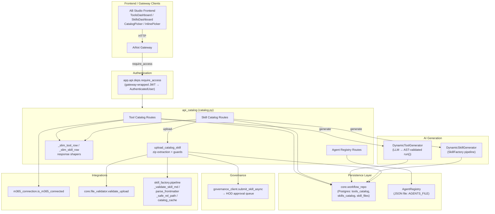
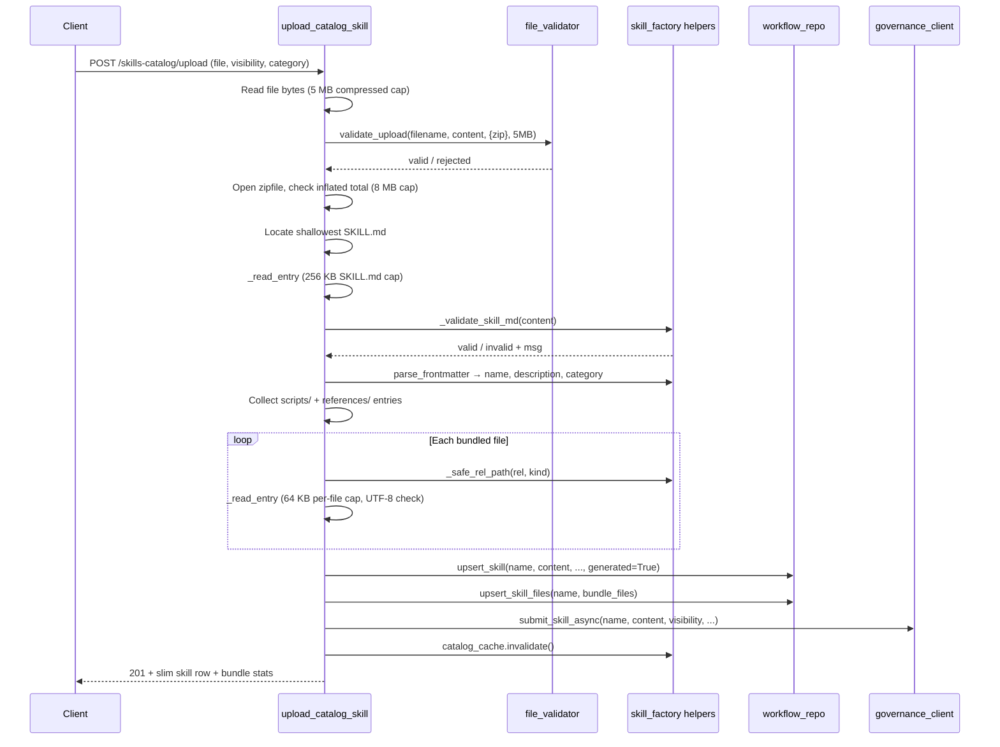
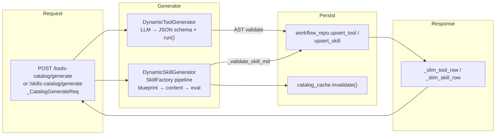
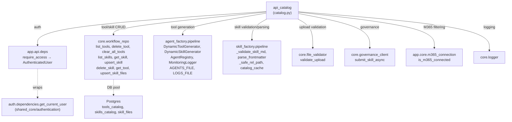
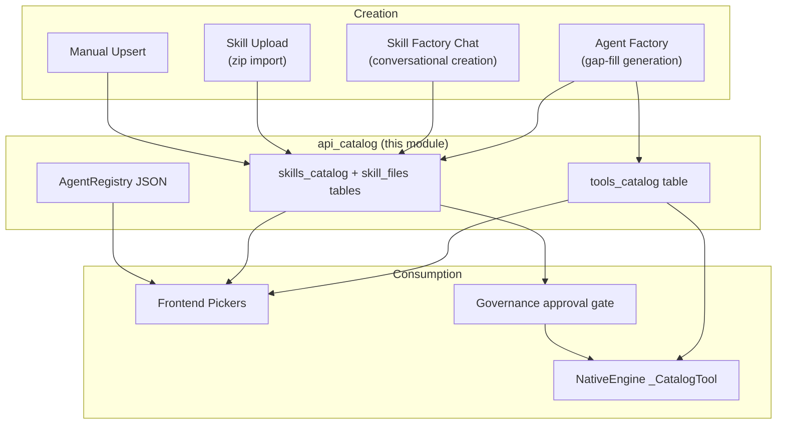

# API Catalog Module

## Introduction

The `api_catalog` module (`ABStudio/backend/app/api/catalog.py`) exposes the **Tool Catalog**, **Skill Catalog**, and **Agent Registry** REST endpoints for the AB Studio (Build Studio) backend. It is the single HTTP surface through which the frontend dashboards and factory pipelines list, create, generate, upload, and delete reusable capabilities — tools, skills, and factory-built agents — that are later attached to agents and workflows.

The module is a thin FastAPI router layer: it validates requests, enforces authentication, delegates persistence to [`core_workflow_repo`](../reference/core_workflow_repo.md), delegates AI generation to [`agent_factory_pipeline`](../agents/agent_factory_pipeline.md) and [`skill_factory_pipeline`](../agents/skill_factory_pipeline.md), and routes governance submissions through [`core_governance_client`](../sdlc/core_governance_client.md). It owns no business logic of its own beyond request shaping, security guards (zip-bomb / path-traversal protection on uploads), and M365-connection-aware filtering.

---

## Architecture Overview



### Module Boundaries

The catalog router deliberately stays stateless and logic-light. Three distinct capability domains are served from one router, each with its own persistence and generation path:

| Domain | List / Detail | Create / Generate | Delete | Persistence |
|--------|--------------|-------------------|--------|-------------|
| **Tools** | `list_tools_catalog`, `get_tool` (via repo) | `generate_catalog_tool` → `DynamicToolGenerator` | `delete_tool_route`, `clear_all_tools_route` | Postgres `tools_catalog` |
| **Skills** | `list_skills_catalog`, `get_skill_detail` | `upsert_catalog_skill`, `generate_catalog_skill` → `DynamicSkillGenerator`, `upload_catalog_skill` | `delete_catalog_skill` | Postgres `skills_catalog` + `skill_files` |
| **Factory Agents** | `list_factory_agents` | _(created by agent factory)_ | `delete_factory_agent` | JSON file (`AGENTS_FILE`) via `AgentRegistry` |

---

## Component Reference

### Request Models

#### `_CatalogGenerateReq`
```python
class _CatalogGenerateReq(BaseModel):
    name: str
    description: str = ""
```
Shared request body for both `generate_catalog_tool` and `generate_catalog_skill`. The `name` is stripped and required; `description` defaults to a templated string when empty.

#### `_SkillUpsertReq`
```python
class _SkillUpsertReq(BaseModel):
    name: str
    content: str
    description: str = ""
    category: str = "general"
```
Request body for manual skill upsert (`upsert_catalog_skill`). Skills created this way are marked `generated=False` (user-authored, not AI-generated).

---

### Tool Catalog Endpoints

#### `list_tools_catalog`
- **Route:** `GET /tools-catalog`
- **Auth:** `require_access`
- **Query params:** `include_generated` (default `True`), `include_platform` (default `False`)
- **Behavior:** Fetches all tools from `workflow_repo.list_tools()`, then filters:
  - Generated tools hidden when `include_generated=False`.
  - `service == "platform"` tools hidden unless `include_platform=True`.
  - `service == "microsoft_365"` tools hidden unless the requesting user has an active M365 OAuth connection (checked via `is_m365_connected`; **fail-safe: any error → hidden**).
- **Returns:** `{"tools": [...]}` — each row shaped by `_slim_tool_row`.

#### `delete_tool_route`
- **Route:** `DELETE /tools-catalog/{name}`
- **Auth:** `require_access`
- **Behavior:** Deletes a single tool by name via `workflow_repo.delete_tool()`. Returns `404` if not found, `204` on success.

#### `clear_all_tools_route`
- **Route:** `DELETE /tools-catalog`
- **Auth:** `require_access`
- **Behavior:** Deletes every row from `tools_catalog` via `workflow_repo.clear_all_tools()`. Returns `{"deleted": count}`.

#### `generate_catalog_tool`
- **Route:** `POST /tools-catalog/generate`
- **Auth:** `require_access`
- **Body:** `_CatalogGenerateReq`
- **Behavior:** Invokes `DynamicToolGenerator().generate(name, description)`, which calls an LLM to produce an AST-validated `def run(inputs: dict) -> dict` function plus a JSON Schema, then upserts the result into `tools_catalog`. If the generator returns an `error` key, a `400` is raised. After generation, the persisted row is re-fetched and returned via `_slim_tool_row`.
- **See:** [`agent_factory_pipeline`](../agents/agent_factory_pipeline.md) for `DynamicToolGenerator` internals.

---

### Skill Catalog Endpoints

#### `list_skills_catalog`
- **Route:** `GET /skills-catalog`
- **Auth:** `require_access`
- **Behavior:** Returns all skills from `workflow_repo.list_skills()`, each shaped by `_slim_skill_row` (name, description, category, generated flag).

#### `get_skill_detail`
- **Route:** `GET /skills-catalog/{name}`
- **Auth:** `require_access`
- **Behavior:** Fetches a single skill via `workflow_repo.get_skill()`. Returns `404` if not found. Includes the full `content` (SKILL.md body) in the response.

#### `upsert_catalog_skill`
- **Route:** `POST /skills-catalog`
- **Auth:** `require_access`
- **Body:** `_SkillUpsertReq`
- **Behavior:** Validates the name is non-empty, then upserts via `workflow_repo.upsert_skill()` with `generated=False`. Returns the slim skill row.

#### `delete_catalog_skill`
- **Route:** `DELETE /skills-catalog/{name}`
- **Auth:** `require_access`
- **Behavior:** Deletes a skill via `workflow_repo.delete_skill()`. Returns `404` if not found, `204` on success.

#### `generate_catalog_skill`
- **Route:** `POST /skills-catalog/generate`
- **Auth:** `require_access`
- **Body:** `_CatalogGenerateReq`
- **Behavior:** Invokes `DynamicSkillGenerator().generate(name, description)`, which runs the full SkillFactory pipeline (blueprint → content → validate → optional eval) and persists the SKILL.md to `skills_catalog`. On error, raises `400`. Returns the slim skill row.
- **See:** [`skill_factory_pipeline`](../agents/skill_factory_pipeline.md) for the generation pipeline and [`agent_factory_pipeline`](../agents/agent_factory_pipeline.md) for `DynamicSkillGenerator`.

#### `upload_catalog_skill`
- **Route:** `POST /skills-catalog/upload`
- **Auth:** `require_access`
- **Form fields:** `file` (UploadFile), `visibility` (default `"private"`), `category` (optional)
- **Behavior:** Imports a packaged `.zip` / `.skill` bundle into the catalog. This is the most security-sensitive endpoint in the module — see [Skill Upload Flow](#skill-upload-flow) below.

---

### Agent Registry Endpoints

#### `list_factory_agents`
- **Route:** `GET /agent-registry/agents`
- **Auth:** `require_access`
- **Behavior:** Returns all agent configs from the JSON-file-backed `AgentRegistry` (instantiated once at module load from `AGENTS_FILE`). Returns `{"agents": [...]}`.

#### `delete_factory_agent`
- **Route:** `DELETE /agent-registry/{agent_id}`
- **Auth:** `require_access`
- **Behavior:** Removes an agent from the registry via `_registry.delete(agent_id)`. Returns `404` if not found, `204` on success.

> **Note:** Factory agents are *created* by the agent factory chat/confirm flow in [`api_factories`](api_factories.md), not by this module. The catalog only exposes listing and deletion.

---

## Response Shapers

### `_slim_tool_row`
Projects a raw `tools_catalog` row into the API response shape:
```python
{
    "name", "description", "input_schema",
    "generated", "service", "code"
}
```

### `_slim_skill_row`
Projects a raw `skills_catalog` row into the API response shape:
```python
{
    "name", "description", "category", "generated"
}
```

---

## Skill Upload Flow

The `upload_catalog_skill` endpoint is a multi-stage secure import pipeline. It enforces the same constraints as the AI-generation path so an uploaded skill cannot ship larger or less-safe files than a generated one.



### Upload Security Guards

| Guard | Limit | Purpose |
|-------|-------|---------|
| Compressed zip size | 5 MB (`_UPLOAD_MAX_SIZE_BYTES`) | Caps upload bandwidth |
| Total uncompressed size | 8 MB (`_UPLOAD_MAX_TOTAL_UNCOMPRESSED_BYTES`) | Zip-bomb protection (checked against declared `file_size` before decompression) |
| SKILL.md size | 256 KB (`_UPLOAD_MAX_SKILL_MD_BYTES`) | Per-entry cap on the manifest |
| Per bundled file size | 64 KB (`_UPLOAD_MAX_BUNDLE_FILE_BYTES`) | Caps each script/reference |
| Max bundled files | 8 (`_UPLOAD_MAX_BUNDLE_FILES`) | Limits archive complexity |
| Bundled file paths | `scripts/` or `references/` only | `_safe_rel_path` rejects path traversal (`..`, leading `/`) and enforces allowed extensions |
| Encoding | UTF-8 only | Rejects binary payloads in text slots |

After a successful import, the skill is submitted for **HOD governance approval** via `governance_client.submit_skill_async` with the caller's chosen `visibility` (`public` / `private`). A failed governance submit is logged at warning level but does **not** break the upload response — the skill is saved but flagged as not-yet-approved.

---

## Data Flow: Tool & Skill Generation



Both generators are **idempotent upserts** — re-generating an existing tool/skill name overwrites the row. `DynamicSkillGenerator` additionally acquires a per-skill async lock and checks for an existing row before generating, so concurrent agent-creation requests don't duplicate work.

---

## Dependencies



### Key Dependency Notes

- **`require_access`** ([`api_deps`](api_deps.md)): Resolves to the gateway-wrapped JWT authenticator when running inside the AiNxt gateway, or a framework-access stub in standalone dev mode. Returns an `AuthenticatedUser` with `id`, `department`, `role`, `is_hod`, etc.
- **`workflow_repo`** ([`core_workflow_repo`](../reference/core_workflow_repo.md)): All Postgres persistence. Uses a shared connection pool (`get_pool_or_raise`) and runs blocking psycopg calls via `asyncio.to_thread`.
- **`agent_factory.pipeline`** ([`agent_factory_pipeline`](../agents/agent_factory_pipeline.md)): Provides the AI generators and the JSON-file-backed `AgentRegistry` / `MonitoringLogger`. `AGENTS_FILE` and `LOGS_FILE` are module-level path constants.
- **`skill_factory.pipeline`** ([`skill_factory_pipeline`](../agents/skill_factory_pipeline.md)): Provides SKILL.md validation, frontmatter parsing, safe-path normalization, and the `catalog_cache` (invalidated after any skill mutation).
- **`governance_client`** ([`core_governance_client`](../sdlc/core_governance_client.md)): `submit_skill_async` normalizes visibility and submits the skill for HOD approval off the event loop. `is_usable` (used elsewhere) enforces fail-closed governance — a skill with no approval record cannot be run.

---

## Endpoint Summary

| Method | Path | Handler | Purpose |
|--------|------|---------|---------|
| `GET` | `/tools-catalog` | `list_tools_catalog` | List tools (filtered by generated/platform/M365) |
| `DELETE` | `/tools-catalog/{name}` | `delete_tool_route` | Delete one tool |
| `DELETE` | `/tools-catalog` | `clear_all_tools_route` | Delete all tools |
| `POST` | `/tools-catalog/generate` | `generate_catalog_tool` | AI-generate a tool |
| `GET` | `/skills-catalog` | `list_skills_catalog` | List all skills |
| `GET` | `/skills-catalog/{name}` | `get_skill_detail` | Get skill detail (with content) |
| `POST` | `/skills-catalog` | `upsert_catalog_skill` | Manually create/update a skill |
| `DELETE` | `/skills-catalog/{name}` | `delete_catalog_skill` | Delete one skill |
| `POST` | `/skills-catalog/generate` | `generate_catalog_skill` | AI-generate a skill |
| `POST` | `/skills-catalog/upload` | `upload_catalog_skill` | Import a .zip/.skill bundle |
| `GET` | `/agent-registry/agents` | `list_factory_agents` | List factory-built agents |
| `DELETE` | `/agent-registry/{agent_id}` | `delete_factory_agent` | Delete a factory agent |

---

## How This Module Fits Into the System

The catalog is the **capability inventory** that feeds agent and workflow assembly:

1. **Frontend dashboards** (`ToolsDashboard`, `SkillsDashboard`, `CatalogPicker`, `InlinePicker` in the AB Studio frontend) call these endpoints to populate pickers and manage the catalog.
2. **Agent Factory** ([`agent_factory_pipeline`](../agents/agent_factory_pipeline.md)) auto-generates tools and skills to fill capability gaps detected during agent assembly, persisting them through the same `workflow_repo` functions this router exposes.
3. **Skill Factory** ([`skill_factory_pipeline`](../agents/skill_factory_pipeline.md)) and **Agent Factory Chat** ([`api_factories`](api_factories.md)) create skills/agents that subsequently appear in the catalog listings.
4. **Native Engine** ([`engine_native_engine`](../reference/engine_native_engine.md)) wraps catalog tools as `_CatalogTool` instances at execution time, reading the `code` and `input_schema` persisted by this module.
5. **Governance** ([`core_governance`](../sdlc/core_governance.md), [`core_governance_client`](../sdlc/core_governance_client.md)) gates skill usability — uploaded and generated skills require HOD approval before they can be attached to agents or executed.



---

## Cross-References

- [`api_deps`](api_deps.md) — `require_access`, `require_admin`, `AuthenticatedUser`, logging context binding
- [`core_workflow_repo`](../reference/core_workflow_repo.md) — Postgres persistence for tools, skills, workflows, agents
- [`agent_factory_pipeline`](../agents/agent_factory_pipeline.md) — `DynamicToolGenerator`, `DynamicSkillGenerator`, `AgentRegistry`, `MonitoringLogger`
- [`skill_factory_pipeline`](../agents/skill_factory_pipeline.md) — SKILL.md validation, frontmatter parsing, `catalog_cache`, SkillFactory generation pipeline
- [`core_governance_client`](../sdlc/core_governance_client.md) — `submit_skill_async`, `is_usable` (fail-closed governance)
- [`core_governance`](../sdlc/core_governance.md) — governance policy enforcement, `ToolPolicyDenied`
- [`engine_native_engine`](../reference/engine_native_engine.md) — `_CatalogTool` wraps catalog tools for execution
- [`api_factories`](api_factories.md) — agent/skill/workflow factory chat & confirm endpoints (create factory agents)
- [`api_agents`](api_agents.md) — agent CRUD (attaches catalog tools/skills to agents)
