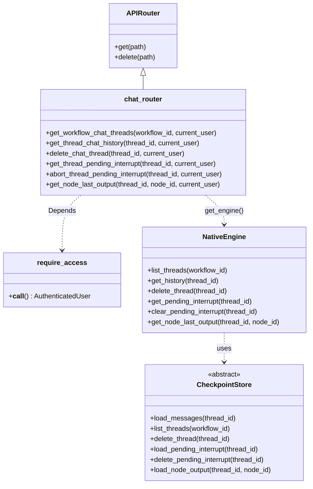
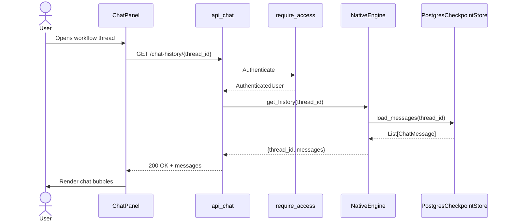
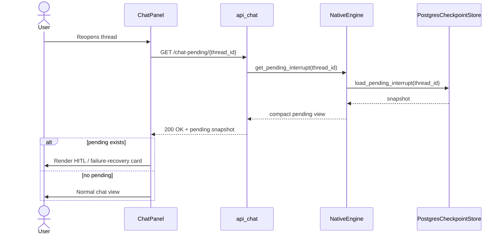
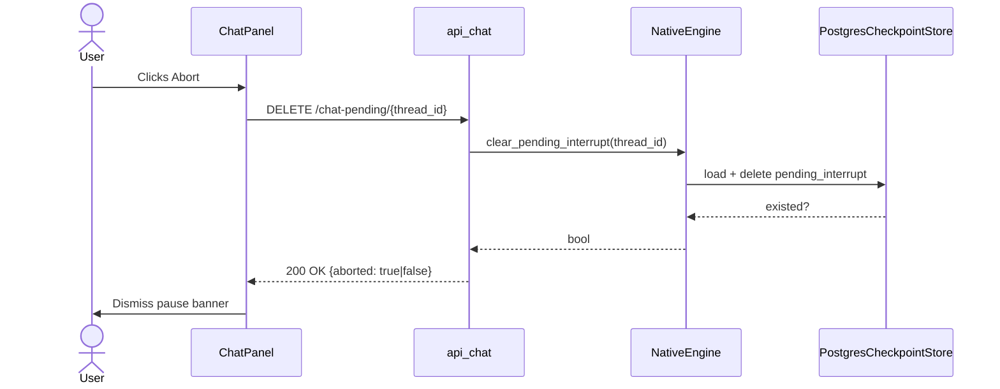

# api_chat — Workflow Chat History & HITL Interrupt Endpoints

The `api_chat` module exposes the REST surface that the AB Studio workflow editor uses to inspect, manage, and recover workflow chat threads. It is a read-heavy, thin router: every route validates the caller, delegates storage and state queries to the orchestration engine, and returns a JSON envelope. The module does not run workflows itself — execution and streaming live in [api_execution](api_execution.md) — but it owns the durable conversation metadata that survives page reloads, browser crashes, and Human-in-the-Loop (HITL) pauses.

---

## 1. Purpose & Core Functionality

`ABStudio/backend/app/api/chat.py` registers a FastAPI `APIRouter` with six endpoints grouped into three concerns:

| Concern | Endpoints | Purpose |
|---------|-----------|---------|
| **Thread inventory** | `GET /chat-threads/{workflow_id}` | List all conversation threads for a workflow, including title, last-message preview, message count, and pending-interrupt status. |
| **Thread content** | `GET /chat-history/{thread_id}`<br>`DELETE /chat-threads/{thread_id}` | Fetch the persisted message list for a thread, or permanently delete the thread and its history. |
| **HITL interrupt recovery** | `GET /chat-pending/{thread_id}`<br>`DELETE /chat-pending/{thread_id}` | Retrieve the pending interrupt snapshot so the UI can re-render the pause card after reconnect; abort a paused run while preserving chat history. |
| **Loop picker helper** | `GET /node-last-output/{thread_id}/{node_id}` | Return the most recent output of a specific node, used by the Loop node configuration UI to let users pick list items visually. |

All endpoints are authenticated via [api_deps](api_deps.md)`::require_access` and call `get_engine()` to obtain the active [engine_native_engine](../agents/engine_native_engine.md)`::NativeEngine` instance.

---

## 2. Architecture

### 2.1 High-level placement

```mermaid
flowchart TB
    subgraph Frontend["AB Studio Frontend"]
        CP["workflow_editor/ChatPanel"]
        SB["workflow_editor/Sidebar"]
        LP["workflow_editor/LoopItemsPicker"]
    end

    subgraph API["AB Studio API Layer"]
        RT["api_chat router<br/>(chat.py)"]
        DE["api_deps<br/>require_access"]
        EX["api_execution router<br/>(execution.py)"]
    end

    subgraph Engine["Orchestration Engine"]
        NE["NativeEngine"]
    end

    subgraph Store["Checkpoint Store"]
        PCS["PostgresCheckpointStore"]
        FCS["FileCheckpointStore"]
    end

    CP -->|GET /chat-history/{tid}| RT
    CP -->|GET /chat-pending/{tid}| RT
    CP -->|DELETE /chat-pending/{tid}| RT
    SB -->|GET /chat-threads/{wfid}| RT
    LP -->|GET /node-last-output/{tid}/{nid}| RT
    RT --> DE
    RT --> NE
    EX --> NE
    NE --> PCS
    NE --> FCS
```

### 2.2 Component diagram



---

## 3. Endpoint Reference

### 3.1 `GET /chat-threads/{workflow_id}`

**Handler:** `get_workflow_chat_threads`

Returns a paginated-style summary of every thread belonging to a workflow. The engine's `list_threads` method queries the checkpoint store and enriches each row with:

- `thread_id`
- `title`
- `last_message_preview`
- `last_updated`
- `message_count`
- `has_pending_interrupt`
- `pending_reason` — e.g. `node_failed` vs HITL pause, so the sidebar can badge failures distinctly.

### 3.2 `GET /chat-history/{thread_id}`

**Handler:** `get_thread_chat_history`

Loads the full message transcript via `NativeEngine.get_history`. Each message is normalized to `{role, content}` and may include `generated_files` so the chat panel can re-render download cards after a reload.

### 3.3 `DELETE /chat-threads/{thread_id}`

**Handler:** `delete_chat_thread`

Permanently removes the thread and all associated messages from the checkpoint store. Returns HTTP 204 on success.

### 3.4 `GET /chat-pending/{thread_id}`

**Handler:** `get_thread_pending_interrupt`

Pollable endpoint used by the frontend when reopening a thread. If a HITL pause or failure-recovery snapshot exists, it returns a compact, frontend-safe view stripped of internal LLM message lists and raw state. The payload includes:

- `reason` — `ask_human`, `before_tool`, `after_response`, `subflow_pending`, `node_failed`, `user_cancelled`
- `node_id`, `agent`, `hitl_mode`, `workflow_id`, `workflow_name`
- HITL-specific fields: `ask_human`, `pending_tool_calls`, `output`
- Failure-recovery fields: `error`, `error_type`, `completed_nodes`, `last_input`

This is what allows a paused run to re-render its HITL card even after the live SSE stream has been lost.

### 3.5 `DELETE /chat-pending/{thread_id}`

**Handler:** `abort_thread_pending_interrupt`

Discards the pending interrupt snapshot for a thread without deleting the chat history. The engine's `clear_pending_interrupt` returns a boolean indicating whether anything was actually removed, which the endpoint surfaces as `{aborted: bool}`. This powers the **Abort** affordance on failure or user-cancelled banners.

### 3.6 `GET /node-last-output/{thread_id}/{node_id}`

**Handler:** `get_node_last_output`

Returns the most recent output produced by a specific node in a thread:

```json
{
  "thread_id": "...",
  "node_id": "...",
  "output": "...",
  "agent": "...",
  "updated_at": "..."
}
```

This enables the Loop node's connection-aware picker: when a user wires `Loop ← UpstreamAgent`, the frontend can fetch the upstream agent's last output and surface any lists inside it as clickable options.

---

## 4. Data Flows

### 4.1 Loading a thread on page open



### 4.2 Recovering a HITL interrupt after reconnect



### 4.3 Aborting a paused run



---

## 5. Dependencies

### 5.1 Internal AB Studio dependencies

| Dependency | Role | Documentation |
|------------|------|---------------|
| `app.api.deps.require_access` | Authenticates every request and returns an `AuthenticatedUser`. Falls back to framework access when the gateway is not in-process. | [api_deps](api_deps.md) |
| `app.engine.get_engine` | Returns the singleton `NativeEngine` that implements all storage-backed operations. | [engine_native_engine](../agents/engine_native_engine.md) |
| `app.models.AuthenticatedUser` | Pydantic model carrying user identity, department, and hierarchy flags used for ACL and audit. | [app_models](../core/app_models.md) |

### 5.2 Storage layer

The engine delegates persistence to a `CheckpointStore` implementation selected at startup:

- `PostgresCheckpointStore` when `POSTGRES_HOST` is configured.
- `FileCheckpointStore` as a local fallback.

See [checkpoint](../agents/checkpoint.md) for the store interface and persistence semantics.

### 5.3 Related API modules

| Module | Relationship |
|--------|--------------|
| [api_execution](api_execution.md) | Owns `POST /run-workflow`, `POST /run-workflow-stream`, and `POST /resume-workflow-stream`. Those endpoints write messages, snapshots, and node outputs; `api_chat` reads them. |
| [api_workflows](api_workflows.md) | Defines and persists the workflow graphs that produce the threads managed here. |
| [api_agent_chat](api_agent_chat.md) | Similar chat-history surface, but for standalone agent runner threads rather than workflow threads. |

---

## 6. Error Handling & Operational Notes

- All handlers wrap engine calls in a `try/except` and translate unexpected exceptions into HTTP 500 with the exception string as the detail. Validation and auth errors are raised by the dependencies before the handler body runs.
- The module is intentionally thin; business rules such as ACL filtering, compliance redaction, and HITL decision replay live in the engine and store layers, not in the router.
- Thread deletion is permanent and cascades to messages and any pending interrupt snapshot through the store implementation.
- The `node-last-output` endpoint is best-effort: if the node has not run or the store lookup fails, it returns `null` output rather than raising.

---

## 7. How It Fits Into the System

`api_chat` sits between the AB Studio workflow editor and the durable execution state. While [api_execution](api_execution.md) drives the live SSE run, `api_chat` provides the stable read surface that makes workflow conversations feel persistent:

1. **Thread listing** feeds the sidebar thread picker.
2. **History loading** restores the chat transcript on reopen.
3. **Pending-interrupt polling** closes the gap when the live stream is interrupted by a tab close, reload, or network blip.
4. **Abort** gives users a clean way to discard a paused or failed run snapshot without losing the conversation.
5. **Node last output** connects canvas configuration to real runtime data, especially for Loop nodes.

By keeping these endpoints stateless and delegating all storage to the engine's checkpoint abstraction, the module remains compatible with both file-backed local development and Postgres-backed production deployments.
