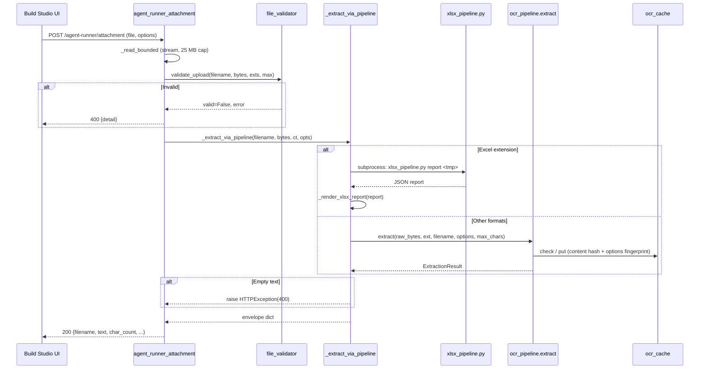
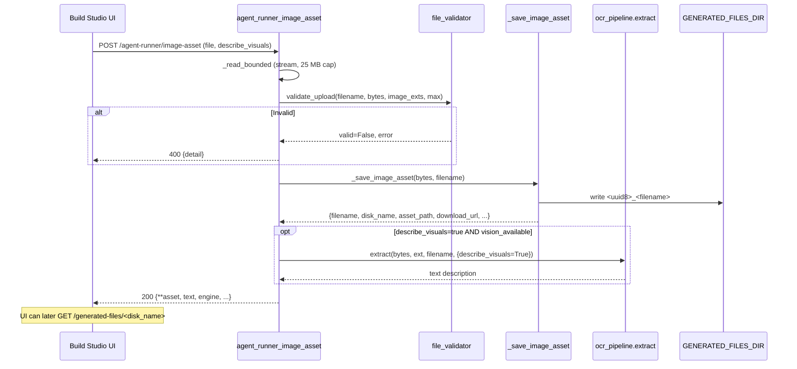
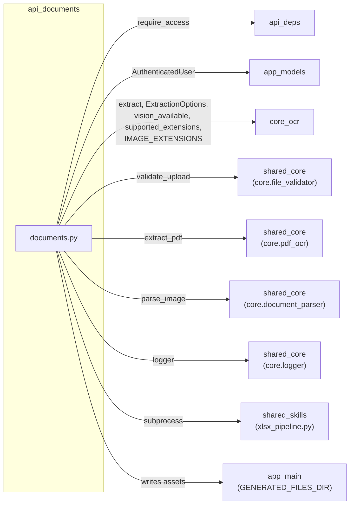

# API Documents Module

## Introduction

The **`api_documents`** module (`ABStudio/backend/app/api/documents.py`) provides the **Agent Runner attachment and image-asset endpoints** for AB Studio's Build Studio backend. It is the single entry point through which the Build Studio UI uploads documents (PDFs, Office files, images, spreadsheets) and images that an agent needs to *read* or *reference* during a conversation or document-generation task.

The module exposes three FastAPI routes on an `APIRouter`:

| Route | Method | Purpose |
|---|---|---|
| `/agent-runner/capabilities` | `GET` | Reports what the OCR/extraction pipeline can do (engines, extensions, languages, limits, runtime diagnostics). |
| `/agent-runner/attachment` | `POST` | Accepts a document upload, extracts its text/structure, and returns a model-friendly text envelope. |
| `/agent-runner/image-asset` | `POST` | Accepts an image upload, persists it to `GENERATED_FILES_DIR` as a sandbox asset the agent can reference by path, and optionally describes it via Vision. |

Internally, the module is a thin **dispatch + validation + envelope-shaping** layer. All heavy lifting -- OCR, text-layer extraction, table detection, image description, caching -- is delegated to the [`core_ocr`](#core_ocr) pipeline and supporting shared-core libraries. Excel workbooks follow a dedicated subprocess path through the bundled `xlsx_pipeline.py` skill script.

---

## Architecture Overview

```mermaid
graph TB
    subgraph Client["Build Studio UI"]
        UI[Agent Runner Chat / Editor]
    end

    subgraph ABStudio["AB Studio Backend (app.main)"]
        Router["documents.py APIRouter"]
        Deps["app.api.deps<br/>require_access"]
        Main["app.main<br/>download_generated_file"]
    end

    subgraph CoreOCR["core_ocr pipeline"]
        Pipeline["ocr_pipeline.extract"]
        Options["ExtractionOptions"]
        Cache["ocr_cache"]
        Vision["vision_available"]
    end

    subgraph SharedCore["Shared Core Libraries"]
        FileValidator["core.file_validator<br/>validate_upload"]
        PdfOcr["core.pdf_ocr<br/>extract_pdf"]
        DocParser["core.document_parser<br/>parse_image"]
        Logger["core.logger"]
    end

    subgraph XlsxSkill["Bundled Skill"]
        XlsxScript["xlsx_pipeline.py<br/>(subprocess)"]
    end

    subgraph Storage["Filesystem"]
        GenDir["GENERATED_FILES_DIR"]
    end

    UI -->|POST /agent-runner/attachment| Router
    UI -->|POST /agent-runner/image-asset| Router
    UI -->|GET /agent-runner/capabilities| Router
    UI -->|GET /generated-files/{name}| Main

    Router --> Deps
    Router --> FileValidator
    Router --> Pipeline
    Router --> XlsxScript
    Router --> GenDir
    Pipeline --> Cache
    Pipeline --> PdfOcr
    Pipeline --> DocParser
    Pipeline --> Vision
    Router --> Logger
```

### Where This Module Sits

The `api_documents` router is mounted by [`app_main`](../reference/app_main.md) (the AB Studio FastAPI application in `app/main.py`) alongside the other `app/api/*` routers. It is consumed exclusively by the Build Studio frontend's Agent Runner chat surface. The generated-files download endpoint that serves image assets back to the browser lives in `app/main.py::download_generated_file`, not in this module -- the module only *writes* assets to disk and returns a `download_url` that points at that endpoint.

---

## Component Reference

### `agent_runner_capabilities`

```python
@router.get("/agent-runner/capabilities")
async def agent_runner_capabilities(current_user = Depends(require_access))
```

**Purpose:** A lightweight, no-file-upload endpoint that lets the Build Studio UI synchronise its controls with the backend's actual capabilities.

**Returns:**
- `vision_available` -- whether a Gemini API key is configured (`ocr_pipeline.vision_available()`).
- `ocr_engines` -- `["rapidocr"]` plus `["gemini-vision"]` when vision is available.
- `supported_extensions` -- sorted union of structured-text extensions and image extensions.
- `supported_languages` -- `("en", "hi", "mr", "ta", "auto")` (surfaced for the UI language picker; actual language switching happens upstream in `core.pdf_ocr`).
- `max_size_bytes` / `max_chars` -- upload and extraction limits.
- `runtime` -- diagnostic block: Python executable path, version, and a per-library import probe (`pdfplumber`, `camelot`, `pymupdf`, `pillow`, `rapidocr_onnxruntime`, `rapidocr`). This lets the Settings drawer surface "X not installed" warnings without requiring a file upload.

**Auth:** Requires `require_access` (see [api_deps](api_deps.md)).

---

### `agent_runner_attachment`

```python
@router.post("/agent-runner/attachment")
async def agent_runner_attachment(
    file: UploadFile = File(...),
    force_ocr: Optional[str] = Form(None),
    describe_visuals: Optional[str] = Form(None),
    ocr_lang: Optional[str] = Form(None),
    current_user = Depends(require_access),
)
```

**Purpose:** The primary document-upload endpoint. Accepts a file, validates it, extracts text/structure, and returns a standardised envelope that the agent consumes as context.

**Form parameters:**
| Parameter | Type | Default | Effect |
|---|---|---|---|
| `file` | `UploadFile` | required | The uploaded document. |
| `force_ocr` | `str` (bool-like) | `False` | Forces OCR even when a text layer exists. |
| `describe_visuals` | `str` (bool-like) | `False` | Enables Gemini Vision descriptions of figures/images. |
| `ocr_lang` | `str` | `"en"` | OCR language hint. |

**Processing pipeline:**

1. **Bounded read** -- `_read_bounded()` streams the upload in 1 MB chunks, rejecting mid-stream if the total exceeds `_AGENT_RUNNER_ATTACHMENT_MAX_BYTES` (25 MB). This guards against clients that lie about or omit `Content-Length`.
2. **Validation** -- `core.file_validator.validate_upload` checks extension whitelist, magic-byte signatures (catches renamed executables), HTML `<script>` blocking, WebP signature, and size limits. See [shared_core](../reference/shared_core.md) for details.
3. **Dispatch** -- `_extract_via_pipeline()` routes by extension:
   - **Excel** (`.xlsx`, `.xls`, `.xlsm`, or spreadsheet MIME types) -> dedicated subprocess path via `_run_xlsx_pipeline()`.
   - **Everything else** -> `ocr_pipeline.extract()`.
4. **Envelope** -- Returns a dict with `filename`, `text`, `char_count`, `original_char_count`, `truncated`, `engine`, `page_count`, `warnings`, `images_extracted`, `tables_extracted`, `cache_hit`.

**Error handling:**
- `400` -- validation failure, unsupported type, no extractable text, Excel timeout/failure.
- `413` -- file exceeds size limit.
- `500` -- unexpected extraction failure (logged with full traceback).

---

### `agent_runner_image_asset`

```python
@router.post("/agent-runner/image-asset")
async def agent_runner_image_asset(
    file: UploadFile = File(...),
    describe_visuals: Optional[str] = Form(None),
    current_user = Depends(require_access),
)
```

**Purpose:** Unlike `/agent-runner/attachment` (which *extracts text*), this endpoint **persists** an uploaded image to `GENERATED_FILES_DIR` so the agent can reference it by path when generating documents or images (e.g., `doc.add_picture("logo.png")`).

**Processing pipeline:**

1. **Bounded read** + **validation** -- same as the attachment endpoint, but with `_AGENT_RUNNER_IMAGE_ASSET_ALLOWED_EXTENSIONS` (image-only: `IMAGE_EXTENSIONS`).
2. **Persist** -- `_save_image_asset()` writes the file as `<uuid8>_<original_filename>` inside `GENERATED_FILES_DIR` (falling back to `app/../../tmp` if the env var is unset, aligning with `app.main`'s download endpoint). Returns asset metadata: `filename`, `disk_name`, `asset_path`, `sandbox_name`, `download_url`, `format`, `size_bytes`.
3. **Optional Vision description** -- If `describe_visuals=true` and `ocr_pipeline.vision_available()`, the image is also passed through `ocr_pipeline.extract()` with `describe_visuals=True` to produce a short text description in the `text` field.

**Response envelope** merges the asset metadata with the standard extraction fields (`text`, `char_count`, `engine`, `warnings`, etc.) so the frontend can treat both endpoints uniformly.

---

### `_extract_via_pipeline`

```python
def _extract_via_pipeline(
    filename: str, raw_bytes: bytes, content_type: str, options: ExtractionOptions,
) -> Dict[str, Any]
```

**Purpose:** The single dispatch point that decides how a file is processed.

**Logic:**
- If the extension is in `_XLSX_EXTENSIONS` or the content type indicates a spreadsheet -> `_run_xlsx_pipeline()` -> `_render_xlsx_report()`.
- Otherwise -> `ocr_pipeline.extract()`.
- If `ocr_pipeline.extract()` returns empty text, raises `HTTPException(400)` with the pipeline's warnings (or a generic "no readable text" message).

This function runs inside `run_in_threadpool` from the route so the blocking I/O does not stall the event loop.

---

### `_run_xlsx_pipeline`

```python
def _run_xlsx_pipeline(raw_bytes: bytes, filename: str) -> Dict[str, Any]
```

**Purpose:** Persist the upload to a temp file and invoke the bundled `xlsx_pipeline.py` skill script as a subprocess, returning its parsed JSON report.

**Key details:**
- The script path is resolved at import time: `skills/ainxt-skills/xlsx/scripts/xlsx_pipeline.py`.
- The subprocess is invoked as `[sys.executable, script, "report", tmp_path]` with `PYTHONIOENCODING=utf-8` to avoid Windows `cp1252` codec failures on non-Latin characters.
- Timeout: `_XLSX_PIPELINE_TIMEOUT_SEC` (60 s). A timeout yields `HTTPException(400)`.
- Non-zero exit codes yield `HTTPException(400)` with the stderr detail.
- Invalid JSON output yields `HTTPException(500)`.
- Temp file cleanup is best-effort in a `finally` block.

---

### `_render_xlsx_report`

```python
def _render_xlsx_report(report: Dict[str, Any], filename: str) -> str
```

**Purpose:** Transforms the pipeline's JSON report into a model-friendly text block containing:
1. A **human-readable summary** -- per-sheet columns (name, dtype, purpose, stats), validation issues (duplicates, empty columns, per-column issues), and integrity-check status.
2. **Full data as CSV per sheet** -- every row of every sheet (truncated on clean row boundaries within a character budget) so the agent can quote precise figures without hallucinating. Includes a column legend mapping Excel column letters to names.

The output is capped at `_AGENT_RUNNER_ATTACHMENT_MAX_CHARS` (60 000 chars) by the caller.

---

### `_extract_scanned_pdf_text`

```python
def _extract_scanned_pdf_text(path: str, filename: str) -> str
```

**Purpose:** A hybrid fallback for scanned PDFs, used when the primary pipeline path needs augmentation.

**Strategy (two-tier):**
1. **Path 1 -- Local hybrid OCR (preferred):** `core.pdf_ocr.extract_pdf()` -- RapidOCR-onnxruntime based, no external API, no Gemini key required. This is the primary path for the NPCI circular use case.
2. **Path 2 -- Gemini Vision per page (legacy fallback):** If `pdf_ocr` is unavailable or returned empty, falls back to rendering each page to a PNG via PyMuPDF (`fitz`) at 1.5x scale and sending each image to `core.document_parser.parse_image()` (Gemini Vision). Returns `""` if vision is unavailable.

> **Note:** This function is defined in the module but the primary extraction path for PDFs flows through `ocr_pipeline.extract()` -> `_extract_pdf()`, which itself calls `core.pdf_ocr.extract_pdf()`. `_extract_scanned_pdf_text` serves as a documented fallback strategy and may be invoked by the pipeline internally.

---

### `_save_image_asset`

```python
def _save_image_asset(raw_bytes: bytes, filename: str) -> Dict[str, Any]
```

**Purpose:** Persists an uploaded image to `GENERATED_FILES_DIR` with a collision-safe unique name.

**Security measures:**
- Strips directory components from the filename (`Path(filename).name`).
- Validates the extension against `_AGENT_RUNNER_IMAGE_ASSET_ALLOWED_EXTENSIONS`.
- Resolves the destination path and verifies it is within the base directory (`dest.relative_to(base)`) to prevent path traversal.
- Creates the base directory with `parents=True, exist_ok=True`.

**Returns:** Asset metadata dict with `filename`, `disk_name`, `asset_path`, `sandbox_name`, `download_url` (`/generated-files/<quoted-name>`), `format`, `size_bytes`.

---

### `_read_bounded`

```python
async def _read_bounded(file: UploadFile, max_bytes: int) -> bytes
```

**Purpose:** Reads an upload in bounded 1 MB chunks, rejecting mid-stream once `max_bytes` is exceeded. This prevents oversized files from being fully buffered before the size check, since clients can lie about or omit `Content-Length`.

---

### `_parse_bool`

```python
def _parse_bool(v: Optional[str]) -> bool
```

**Purpose:** Parses form-field boolean values. Returns `True` for `"1"`, `"true"`, `"yes"`, `"on"` (case-insensitive); `False` otherwise (including `None`).

---

## Data Flow

### Attachment Upload Flow



### Image Asset Upload Flow



---

## Dependencies



### Internal AB Studio Dependencies

| Dependency | Module | Role |
|---|---|---|
| `require_access` | [api_deps](api_deps.md) | Auth dependency -- wraps the gateway's `get_current_user` into an `AuthenticatedUser`, or falls back to a local-dev stub. |
| `AuthenticatedUser` | [app_models](../models/app_models.md) | User model carrying `id`, `email`, `role`, `department`, `ad_level`, etc. |
| `ocr_pipeline` | [core_ocr](../documents/core_ocr.md) | The central extraction pipeline: `extract()`, `ExtractionOptions`, `vision_available()`, `supported_extensions()`, `IMAGE_EXTENSIONS`. |
| `ocr_cache` | [core_ocr](../documents/core_ocr.md) | Content-hash + options-fingerprint cache for extraction results. |
| `download_generated_file` | [app_main](../reference/app_main.md) | Serves persisted assets back to the browser via `/generated-files/<name>`. |

### Shared-Core Dependencies

| Dependency | Source | Role |
|---|---|---|
| `validate_upload` | `core.file_validator` ([shared_core](../reference/shared_core.md)) | Multi-layer upload validation: blocked extensions, whitelist, executable magic-byte detection, per-extension magic, HTML `<script>` blocking, WebP signature, size limit. |
| `extract_pdf` | `core.pdf_ocr` ([shared_core](../reference/shared_core.md)) | Hybrid PDF extraction using PyMuPDF + RapidOCR-onnxruntime. Returns structured per-page results with text-layer/OCR/hybrid source labels. |
| `parse_image` | `core.document_parser` ([shared_core](../reference/shared_core.md)) | Gemini Vision image description; falls back to a placeholder if `GOOGLE_API_KEY` is unset. |
| `logger` | `core.logger` ([shared_core](../reference/shared_core.md)) | Structured logging with request/chat/span context. |

### External / Bundled Skill Dependency

| Dependency | Source | Role |
|---|---|---|
| `xlsx_pipeline.py` | `skills/ainxt-skills/xlsx/scripts/` ([shared_skills](../agents/shared_skills.md) -> `xlsx_skills`) | Standalone script that reads an Excel workbook and emits a JSON report with structure, validation, analysis, and full-data sections. Invoked as a subprocess with a 60-second timeout. |

---

## Configuration Constants

| Constant | Value | Purpose |
|---|---|---|
| `_AGENT_RUNNER_ATTACHMENT_MAX_CHARS` | `60_000` | Hard truncation cap on extracted text returned to the agent. |
| `_AGENT_RUNNER_ATTACHMENT_MAX_BYTES` | `25 * 1024 * 1024` (25 MB) | Upload size limit for attachments. |
| `_AGENT_RUNNER_TEXT_EXTENSIONS` | `{pdf, docx, pptx, xlsx, xls, xlsm, csv, html, htm, rtf, txt, json, md}` | Structured-text formats delegated to the pipeline. |
| `_AGENT_RUNNER_ATTACHMENT_ALLOWED_EXTENSIONS` | text extensions + `IMAGE_EXTENSIONS` | Full accept list (computed via `ocr_pipeline.supported_extensions`). |
| `_AGENT_RUNNER_OCR_LANGUAGES` | `("en", "hi", "mr", "ta", "auto")` | Languages surfaced in the capabilities endpoint. |
| `_AGENT_RUNNER_IMAGE_ASSET_MAX_BYTES` | `25 * 1024 * 1024` (25 MB) | Upload size limit for image assets. |
| `_XLSX_PIPELINE_TIMEOUT_SEC` | `60` | Subprocess timeout for the Excel pipeline. |
| `_XLSX_EXTENSIONS` | `{"xlsx", "xls", "xlsm"}` | Extensions routed to the Excel subprocess path. |

---

## Response Envelope Schema

Both upload endpoints return a dict with a consistent shape:

```json
{
  "filename": "report.pdf",
  "text": "## Page 1\n\nExtracted text...",
  "char_count": 12345,
  "original_char_count": 12345,
  "truncated": false,
  "engine": "rapidocr | gemini-vision | xlsx-pipeline | vision | image-asset",
  "page_count": 3,
  "warnings": ["pdfplumber not installed; using fallback"],
  "images_extracted": 2,
  "tables_extracted": 1,
  "cache_hit": false
}
```

The image-asset endpoint additionally includes:

```json
{
  "disk_name": "a1b2c3d4_logo.png",
  "asset_path": "/abs/path/to/GENERATED_FILES_DIR/a1b2c3d4_logo.png",
  "sandbox_name": "a1b2c3d4_logo.png",
  "download_url": "/generated-files/a1b2c3d4_logo.png",
  "format": "png",
  "size_bytes": 45678
}
```

---

## Security Considerations

1. **Authentication** -- All three routes require `require_access`, which resolves to the gateway's JWT-based `get_current_user` in production or a local-dev admin stub in standalone mode. See [api_deps](api_deps.md).

2. **Upload validation** -- Every upload passes through `core.file_validator.validate_upload`, which performs:
   - Blocked-extension checking (e.g., `.exe`, `.bat`).
   - Extension whitelist enforcement.
   - Executable magic-byte detection (catches renamed binaries regardless of extension).
   - Per-extension magic-byte verification (catches corrupted or disguised files).
   - HTML `<script>` tag blocking (prevents script injection via KB-indexed HTML).
   - WebP signature validation.
   - Size-limit enforcement.

3. **Bounded streaming** -- `_read_bounded` enforces the size cap on actual bytes streamed, not on a potentially spoofed `Content-Length` header.

4. **Path traversal prevention** -- `_save_image_asset` strips directory components, validates the extension, and verifies the resolved destination is within the base directory via `Path.relative_to()`.

5. **Subprocess isolation** -- The Excel pipeline runs as a separate process with a timeout, preventing a corrupt or pathological workbook from hanging the server. The subprocess inherits a sanitised environment with `PYTHONIOENCODING=utf-8`.

6. **Temp file cleanup** -- All temp files are cleaned up in `finally` blocks; cleanup failures are silently ignored (best-effort) since the OS reaps `/tmp` independently.

---

## Related Modules

- [api_deps](api_deps.md) -- Shared FastAPI dependencies (`require_access`, `require_admin`, logging context binding).
- [app_models](../models/app_models.md) -- Data models including `AuthenticatedUser`, `Workflow`, request/response schemas.
- [app_main](../reference/app_main.md) -- FastAPI application setup, router mounting, `download_generated_file` endpoint, lifespan management.
- [core_ocr](../documents/core_ocr.md) -- The OCR/extraction pipeline (`ocr_pipeline`, `ocr_cache`) that performs the actual text extraction.
- [shared_core](../reference/shared_core.md) -- Core infrastructure including `file_validator`, `pdf_ocr`, `document_parser`, `logger`.
- [shared_skills](../agents/shared_skills.md) -> `xlsx_skills` -- The bundled `xlsx_pipeline.py` script invoked as a subprocess.
- [api_kb](api_kb.md) -- Knowledge-base document upload endpoint (`upload_build_studio_doc`), a separate upload path for KB indexing (as opposed to agent-runner attachments).
- [api_factories](api_factories.md) -- Factory chat endpoints that may consume extracted attachment text as context.
