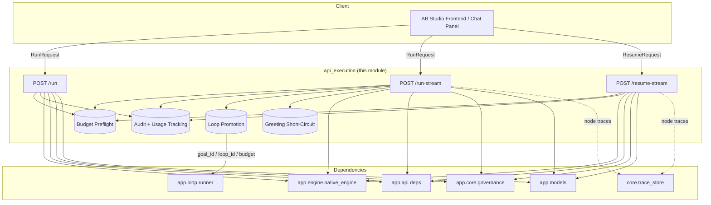
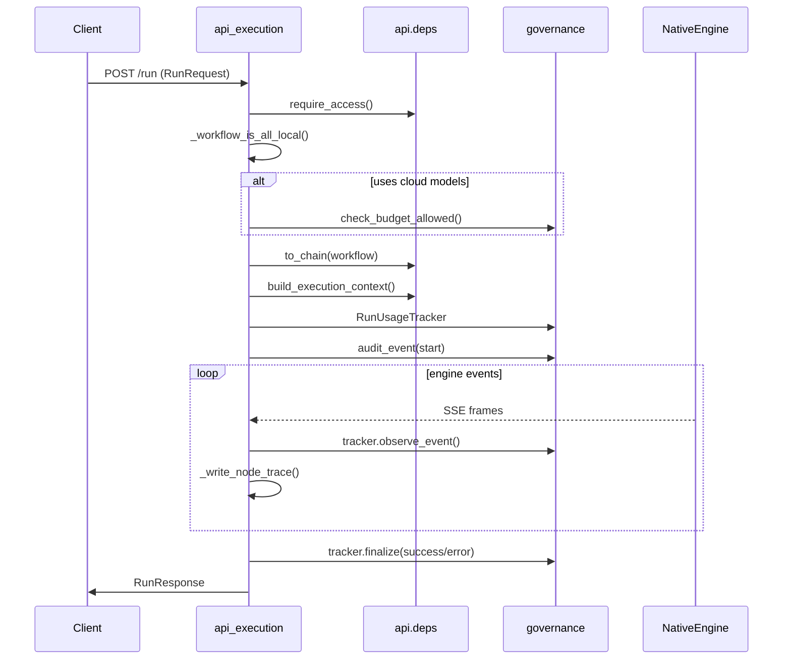
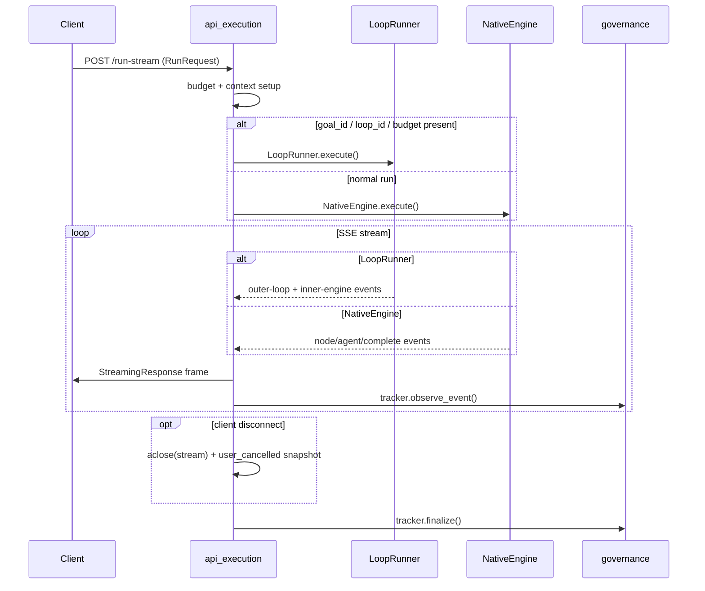
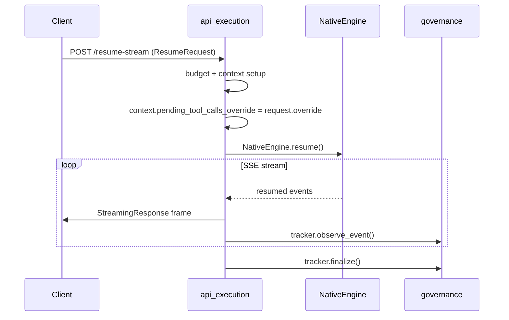
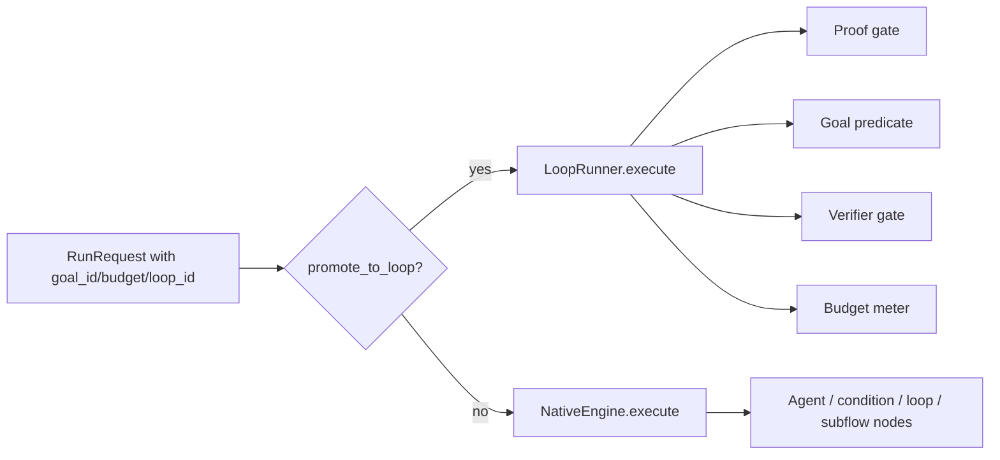

# api_execution

The `api_execution` module exposes the runtime surface for executing AB Studio workflows. It bridges the HTTP API layer with the underlying workflow engine, handling synchronous runs, Server-Sent Event (SSE) streaming runs, and resumption of paused Human-in-the-Loop (HITL) workflows.

## Purpose

This module is responsible for:

- Accepting authenticated requests to execute or resume a workflow.
- Performing budget preflight checks before invoking the engine.
- Converting frontend workflow definitions into engine-ready chain definitions.
- Building the per-run execution context (user identity, thread, attachments, loop metadata).
- Streaming engine events back to clients as SSE frames.
- Tracking token/cost usage and emitting audit events for governance.
- Promoting ad-hoc `/run-stream` calls into the outer `LoopRunner` when loop engineering fields (`goal_id`, `loop_id`, `budget`) are present.
- Resuming interrupted runs, including reviewer-edited tool-call overrides.

It intentionally does **not** implement workflow CRUD, agent assembly, or chat-thread management — those concerns live in sibling API modules and are referenced below.

## Core Components

### `run_workflow`

`POST /run` — synchronous workflow execution.

- Validates the caller via [`require_access`](api_deps.md).
- Runs a budget preflight unless every LLM-bearing node in the workflow resolves to a local model.
- Converts the [`RunRequest.workflow`](../models/app_models.md) into a [`ChainDefinition`](../reference/engine_native_engine.md) via [`to_chain`](api_deps.md).
- Builds an [`ExecutionContext`](api_deps.md) and a [`RunUsageTracker`](../sdlc/core_governance.md).
- Streams events from [`NativeEngine.execute`](../reference/engine_native_engine.md), collecting the final `output` and `thread_id`.
- Returns a [`RunResponse`](../models/app_models.md) with `status`, `output`, and `thread_id`.

### `run_workflow_stream`

`POST /run-stream` — streaming workflow execution over SSE.

- Performs the same budget and audit setup as `/run`.
- Detects loop-promotion when `goal_id`, `loop_id`, or `budget` is set and wraps execution in [`LoopRunner.execute`](api_loops.md) instead of the native engine.
- Looks up the referenced [`Goal`](api_loops.md) and [`LoopRecord`](api_loops.md) when provided.
- Short-circuits bare greetings (e.g. "hi") for deployed workflows to avoid wasting tokens.
- Forwards every engine SSE frame to the client while observing usage and writing best-effort node-level traces.
- Handles client disconnects by cancelling the stream and persisting a `user_cancelled` resume snapshot.

### `resume_workflow_stream_endpoint`

`POST /resume-stream` — resume a paused or failed workflow run.

- Loads the pending interrupt snapshot persisted by the engine and replays the human decision.
- Accepts an optional `pending_tool_calls_override` so a reviewer can edit the tool list before a `before_tool` HITL gate proceeds.
- Forwards the override into the engine via `ExecutionContext.pending_tool_calls_override`.
- Streams resumed execution events to the client with the same disconnect handling as `/run-stream`.

## Architecture

## Data Flow

### Synchronous Run (`/run`)

### Streaming Run (`/run-stream`)

### Resume (`/resume-stream`)

## Component Interaction

| Component | Responsibility | Used By |
|-----------|---------------|---------|
| `run_workflow` | Synchronous execution endpoint | Router |
| `run_workflow_stream` | Streaming execution endpoint; loop promotion | Router |
| `resume_workflow_stream_endpoint` | HITL/failure resume endpoint | Router |
| `_workflow_is_all_local` | Skips budget check only when no cloud LLM is configured | All three endpoints |
| `_write_node_trace` | Best-effort node-level observability writes | `/run-stream`, `/resume-stream` |
| `_is_greeting` / `_greeting_reply` | Bare-greeting short-circuit for deployed workflows | `/run-stream` |
| `RunUsageTracker` | Token/cost tracking and budget increment | All three endpoints |
| `audit_event` | Governance audit logging | All three endpoints |

## Loop Promotion

When a `/run-stream` request carries `goal_id`, `loop_id`, or `budget`, the route promotes the call into the loop-engineering backend:

This shares a single backend with the dedicated `POST /loops/{id}/run-stream` endpoint in [`api_loops`](api_loops.md), per the Phase 2 loop-engineering design.

## Budget and Governance

All three endpoints enforce budget preflight before invoking the engine. The check is skipped only when `_workflow_is_all_local()` determines that every LLM the workflow can invoke — including per-node models and the verifier/judge model used by evaluation-gate and loop nodes — resolves to a local model. This prevents cloud spend from bypassing budget controls.

On denial, the endpoint emits an `audit_event(action="budget_denied")` and returns HTTP 429 with code `BUDGET_EXCEEDED`.

During execution, `RunUsageTracker.observe_event()` processes `agent_usage` events to accumulate tokens, cost, and latency. `tracker.finalize()` writes the final audit record and increments budget usage.

## Observability

The module implements FR-T0-4 node-level tracing. Selected engine events (`agent_usage`, `agent_complete`, `compliance_verdict`, `injection_detected`) are persisted to the platform trace store via `core.trace_store.add_trace`. The write is offloaded to a threadpool and wrapped in a fire-and-forget task so it never adds latency to the live SSE token stream.

## Error Handling

- **Budget exceeded**: HTTP 429 with structured `BUDGET_EXCEEDED` detail.
- **Goal/loop not found**: HTTP 404 when loop-promotion fields reference missing records.
- **Engine errors**: surfaced as SSE `error` events; usage tracker finalizes with `error` status.
- **Client disconnect**: stream is explicitly `aclose()`-d so the engine can persist a `user_cancelled` resume snapshot before the ASGI task ends.

## How It Fits Into the System

`api_execution` sits at the boundary between the AB Studio frontend/chat surfaces and the workflow engine. It is a thin orchestration layer: it validates, meters, audits, and forwards, while the actual graph traversal, agent execution, tool dispatch, HITL pausing, and loop evaluation live in [`engine_native_engine`](../reference/engine_native_engine.md) and [`api_loops`](api_loops.md).

Related modules:

- [`api_workflows`](api_workflows.md) — create, update, delete, and duplicate workflows.
- [`api_chat`](api_chat.md) — list workflow chat threads, fetch pending interrupts, and abort runs.
- [`api_loops`](api_loops.md) — dedicated loop lifecycle and `/loops/{id}/run-stream`.
- [`engine_native_engine`](../reference/engine_native_engine.md) — pure-Python workflow engine that executes the chain.
- [`core_governance`](../sdlc/core_governance.md) — budget checks, audit events, and usage tracking.
- [`app_models`](../models/app_models.md) — `RunRequest`, `ResumeRequest`, `RunResponse`, `Workflow`.
- [`api_deps`](api_deps.md) — authentication, chain conversion, execution context, and log context helpers.
