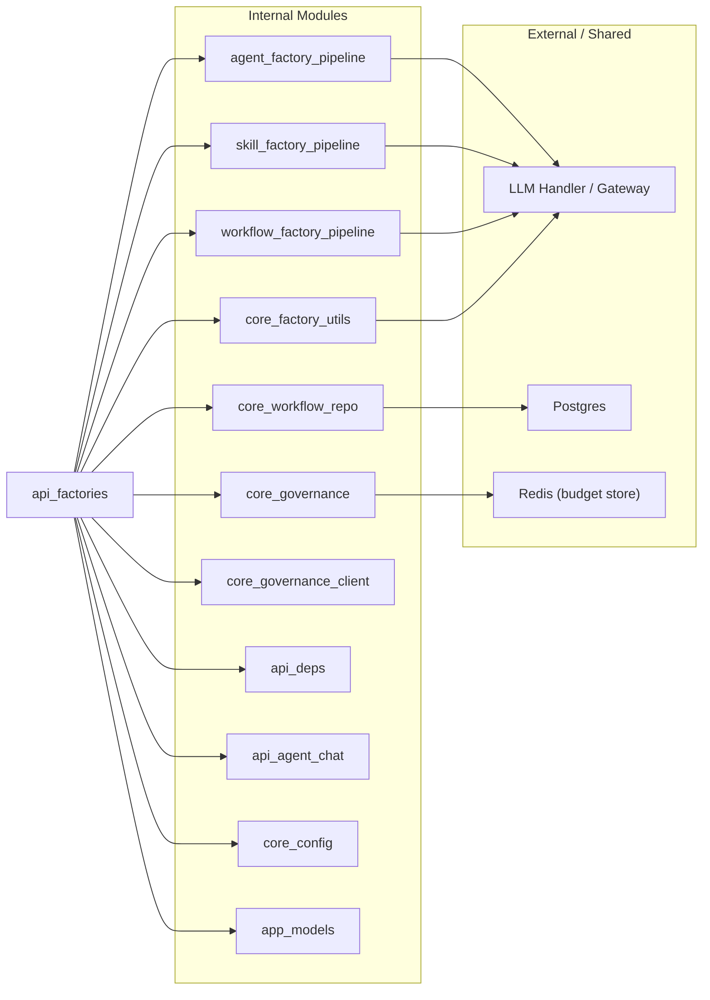
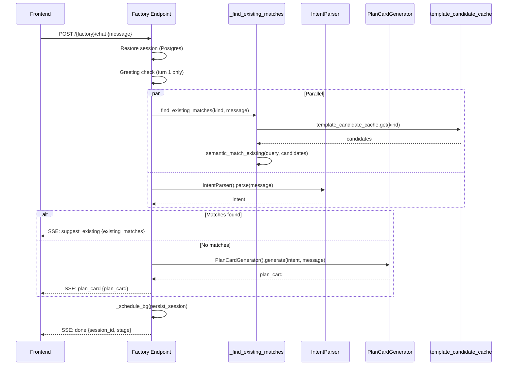
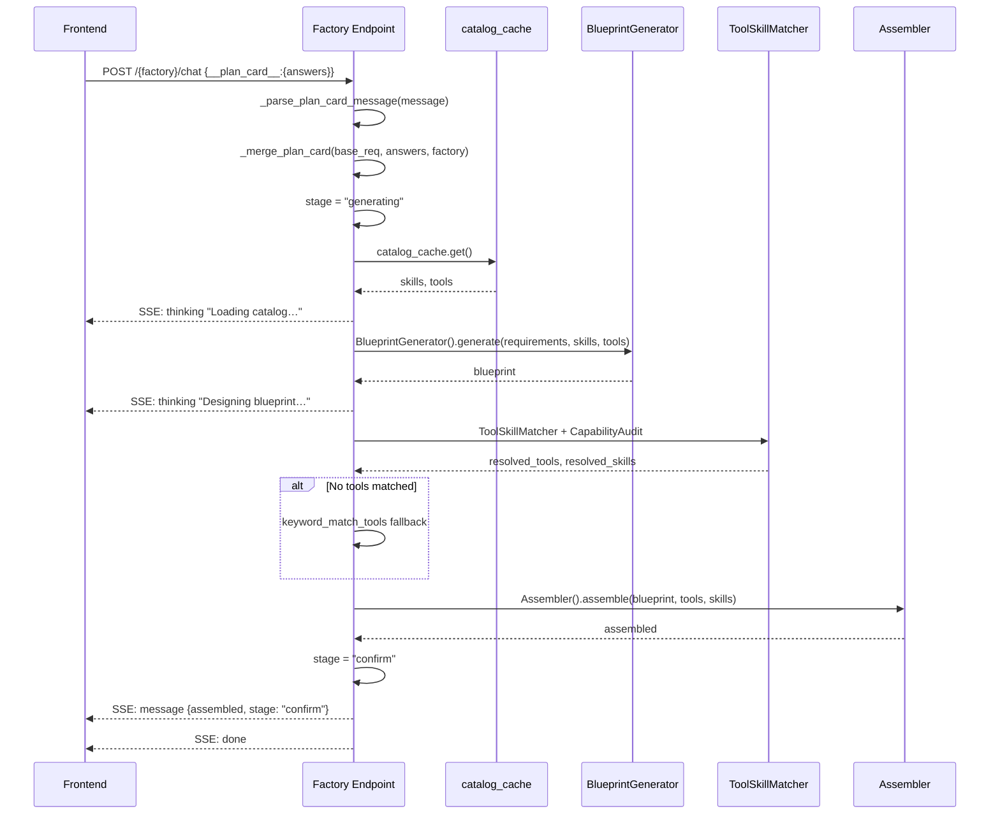
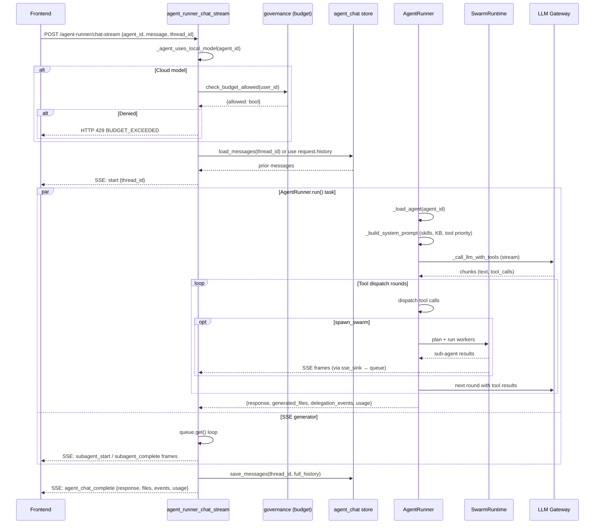
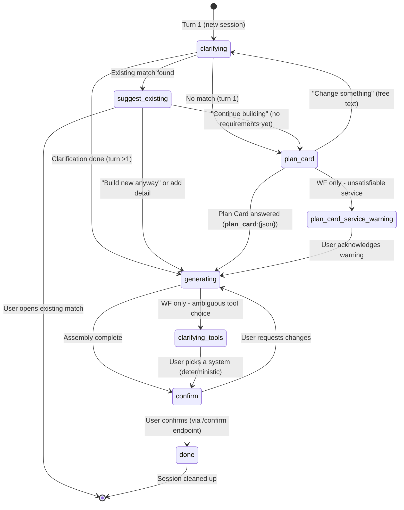

# API Factories Module

## Introduction

The `api_factories` module (`ABStudio/backend/app/api/factories.py`) is the conversational build-and-run layer for ABStudio's Build Studio. It exposes FastAPI endpoints that power four interactive "factory" experiences:

| Factory | Purpose | Key Endpoints |
|---------|---------|----------------|
| **Agent Factory** | Conversational creation of standalone AI agents with tools, skills, guardrails, and persona | `POST /agent-factory/chat`, `POST /agent-factory/confirm` |
| **Workflow Factory** | Conversational creation of multi-node workflow graphs (agents, conditions, loops) with tool/skill injection | `POST /workflow-factory/chat`, `POST /workflow-factory/confirm` |
| **Skill Factory** | Conversational creation of SKILL.md skills (with optional bundled scripts) | `POST /skill-factory/chat`, `POST /skill-factory/confirm`, `GET /skill-factory/{id}/download`, `GET /skill-factory/{id}/validate` |
| **Agent Runner** | Execute a factory-created (or any registered) agent in a chat conversation, with streaming support | `POST /agent-runner/chat`, `POST /agent-runner/chat-stream`, `POST /agent-runner/chat-direct` |

All factory chat endpoints are **Server-Sent Events (SSE) streaming** endpoints that guide the user through a multi-stage pipeline: greeting → intent parsing → existing-match check → Plan Card (structured questionnaire) → clarification → blueprint generation → tool/skill matching → assembly → confirm. The confirm endpoints persist the assembled artifact to Postgres via the [core_workflow_repo](../workflows/core_workflow_repo.md) module.

---

## Architecture Overview

```mermaid
graph TB
    subgraph "Frontend (Build Studio)"
        AFC["AgentFactoryChat.jsx"]
        WFC["WorkflowFactoryChat.jsx"]
        SFC["SkillFactoryChat.jsx"]
        AE["AgentEditor.jsx"]
    end

    subgraph "api_factories (this module)"
        AF_CHAT["agent_factory_chat"]
        AF_CONFIRM["agent_factory_confirm"]
        WF_CHAT["workflow_factory_chat"]
        WF_CONFIRM["workflow_factory_confirm"]
        SF_CHAT["skill_factory_chat"]
        SF_CONFIRM["skill_factory_confirm"]
        SF_DL["skill_factory_download"]
        SF_VAL["skill_factory_validate"]
        AR_CHAT["agent_runner_chat"]
        AR_STREAM["agent_runner_chat_stream"]
        AR_DIRECT["agent_runner_chat_direct"]
    end

    subgraph "Pipeline Layers"
        AFP["agent_factory/pipeline.py"]
        SFP["skill_factory/pipeline.py"]
        WFP["workflow_factory/pipeline.py"]
    end

    subgraph "Core Services"
        WR["workflow_repo"]
        FU["factory_utils"]
        GOV["governance"]
        GC["governance_client"]
        DEPS["api/deps.py"]
        AC["agent_chat store"]
    end

    AFC --> AF_CHAT
    WFC --> WF_CHAT
    SFC --> SF_CHAT
    AE --> AR_CHAT
    AE --> AR_STREAM

    AF_CHAT --> AFP
    AF_CHAT --> FU
    AF_CHAT --> DEPS
    AF_CONFIRM --> WR
    AF_CONFIRM --> AFP

    WF_CHAT --> WFP
    WF_CHAT --> FU
    WF_CONFIRM --> WR

    SF_CHAT --> SFP
    SF_CONFIRM --> WR
    SF_CONFIRM --> GC
    SF_DL --> SFP
    SF_VAL --> SFP

    AR_CHAT --> AFP
    AR_STREAM --> AFP
    AR_CHAT --> AC
    AR_STREAM --> AC
    AR_CHAT --> GOV
    AR_STREAM --> GOV
    AR_DIRECT --> AFP

    DEPS --> DEPS_AUTH["Gateway Auth / JWT"]
```



### Module Dependencies



---

## Core Components

### Request Models (Pydantic)

All factory endpoints use typed Pydantic request models for validation:

| Model | Used By | Key Fields |
|-------|---------|------------|
| `_AgentFactoryChatReq` | `agent_factory_chat` | `session_id`, `message` |
| `_AgentFactoryConfirmReq` | `agent_factory_confirm` | `session_id`, `tools_override`, `skills_override` |
| `_WorkflowFactoryChatReq` | `workflow_factory_chat` | `session_id`, `message` |
| `_WorkflowFactoryConfirmReq` | `workflow_factory_confirm` | `session_id`, `graph_data_override` |
| `_SkillFactoryChatReq` | `skill_factory_chat` | `session_id`, `message` |
| `_SkillFactoryConfirmReq` | `skill_factory_confirm` | `session_id`, `content_override`, `bundle_overrides`, `visibility` |
| `_BundleOverride` | Nested in `_SkillFactoryConfirmReq` | `rel_path`, `content` |
| `_AgentRunnerChatReq` | `agent_runner_chat`, `agent_runner_chat_stream` | `agent_id`, `message`, `history`, `thread_id` |
| `_AgentRunnerDirectReq` | `agent_runner_chat_direct` | `system_prompt`, `message`, `history`, `agent_name` |

---

### Shared Helpers

The module contains a rich set of shared helper functions used across all three factories:

#### Greeting Short-Circuit

- **`_is_greeting(message)`** — Detects bare greetings ("hi", "hello") using the same `GREETING_PATTERN` as the main chat classifier. Only fires on turn 1; multi-word inputs fall through to normal processing.
- **`_greeting_reply(user_message)`** — Generates a friendly reply via the Local LLM (simple tier) with a canned fallback (`"Hi! What would you like to build today?"`).

#### Plan Card Protocol

The Plan Card is a structured pre-generation questionnaire emitted on turn 1. The frontend sends answers back as a chat message prefixed with `__plan_card__:` followed by JSON.

- **`_parse_plan_card_message(message)`** — Parses the `__plan_card__:{json}` protocol string into an answers dict. Returns `{}` for non-Plan-Card messages.
- **`_original_user_prompt(session, fallback)`** — Extracts the user's first real prompt from session history, skipping `__plan_card__:` control messages.
- **`_merge_plan_card(requirements, answers, factory)`** — Maps Plan Card answer IDs onto structured `requirements` fields for each factory type (`"agent"`, `"workflow"`, `"skill"`). Unknown IDs are folded into `additional_notes` so nothing is lost. Includes explicit trigger-type mapping (`"event/webhook"` → `"event_driven"`, `"api call"` → `"api_call"`).

#### Existing-Match (Semantic Deduplication)

Before generating a new artifact, each factory checks whether an existing curated template already covers the request:

- **`_find_existing_matches(kind, query, user_id)`** — Uses the `template_candidate_cache` (5-minute TTL) and `semantic_match_existing` from [core_factory_utils](../agents/core_factory_utils.md) to find matching templates. Only curated templates are recommended — never the user's own saved items.
- **`_match_query_from_requirements(requirements)`** — Composes a short match query from gathered requirements (name + purpose/description).
- **`_existing_match_message(kind_label, matches)`** — Builds human-readable recommendation text.
- **`_strip_match_messages(messages)`** — Drops the match recommendation from conversation history once the user moves on.
- **`_wants_build_anyway(message)`** — Detects when the user chose to ignore existing matches and force generation.

#### Budget & Governance

- **`_resolve_agent_model(agent_id, owner_user_id)`** — Resolves an agent's configured model by checking Postgres first, then the legacy JSON registry, then falling back to `factory_model()`. Mirrors `AgentRunner._load_agent` resolution order.
- **`_agent_uses_local_model(agent_id, owner_user_id)`** — Returns `True` when the agent's model is a cost-exempt local model. Local models are never blocked by budget preflight. Fails safe (treats as NOT local → enforces budget) on lookup error.
- **`_enforce_agent_governance(agent_id, current_user)`** — No-op; running an agent no longer requires approval. Approval is only needed to publish an agent as a shared template.

#### Catalog & Service Helpers

- **`_validate_required_services(required_services, catalog_tools)`** — Returns declared services that have zero tools in the catalog (pre-generation validation gate for the workflow factory).
- **`_service_display(service)`** — Maps service slugs to friendly display names (e.g., `"gitlab"` → `"GitLab"`).
- **`_friendly_tool_phrase(tool_name, catalog_tools)`** — Turns a raw tool slug into a short human phrase using its catalog description.
- **`_available_services_phrase(catalog_tools)`** — Comma-separated friendly list of all services in the catalog.

#### Build & Stream Generators

- **`_build_and_stream_agent(session)`** — Async generator that runs the agent blueprint → tool matching → audit → assembly pipeline, yielding SSE `thinking` and `message` frames. Includes keyword fallback matching when the LLM-based `CapabilityAudit` returns no tools/skills.
- **`_build_and_stream_skill(session)`** — Async generator for the skill blueprint → bundle decision → content generation → assembly pipeline. Uses deterministic lint-only quality checks (no LLM critique loop) to minimize latency.
- **`_draft_and_bundle(blueprint)`** — Produces `(bundle_files, skill_md_content)` for a skill blueprint. Only runs the `SkillBundleDecider` when `blueprint["needs_bundle"]` is `True`.
- **`_lint_summary(content)`** — Deterministic, free quality summary using `_lint_skill_md`. Replaces the removed LLM critique/regenerate loop that added 10–18 serial LLM round-trips.
- **`_quality_line(summary)`** — Renders the optional quality note appended to the skill confirm message.

#### Session Persistence

- **`_schedule_bg(coro)`** — Fire-and-forget background task scheduler. Keeps strong references to pending tasks to prevent garbage collection. Used for write-through session persistence so a Postgres round-trip never delays the client's `done` event.

---

### Agent Factory

#### `agent_factory_chat` — `POST /agent-factory/chat`

Multi-turn SSE endpoint guiding the user through agent creation:

```
clarification → blueprint → tool matching → audit → assembly → confirm
```

**Session lifecycle stages:**

| Stage | Description |
|-------|-------------|
| `clarifying` | Turn 1: parse intent, check existing matches (parallel), emit Plan Card. Turn >1: conversational clarification via `ClarificationEngine`. |
| `plan_card` | Plan Card presented. User either answers (JSON protocol) or types free-text ("Change something"). |
| `suggest_existing` | Existing-match recommendations shown. User can open a match or continue building. |
| `generating` | Blueprint generation + tool/skill matching + assembly in progress. |
| `confirm` | Assembled agent shown. User can deploy or request changes. |
| `done` | Agent saved via `agent_factory_confirm`. |

**Key behaviors:**
- **Parallel early-match**: `_find_existing_matches` is fired as an `asyncio.create_task` BEFORE intent parsing so both run concurrently.
- **Keyword fallback**: When `CapabilityAudit` returns no resolved tools/skills, falls back to `keyword_match_tools`/`keyword_match_skills` from [core_factory_utils](../agents/core_factory_utils.md).
- **Confirm-stage regeneration**: If the user requests changes at `confirm`, the blueprint is regenerated with the edit request appended to `additional_notes`.
- **Session persistence**: `persist_session` is scheduled as a background task in the `finally` block so the build survives backend restarts.

#### `agent_factory_confirm` — `POST /agent-factory/confirm`

Persists the assembled agent to Postgres via `workflow_repo.create_agent`. Applies `tools_override`/`skills_override` from the frontend's picker edits. Cleans up the persisted draft session on success.

**Resolution flow:**
1. Restore session from Postgres (if evicted from in-memory cache).
2. Validate `session.assembled` exists.
3. Build instructions from `system_prompt` + persona.
4. Call `workflow_repo.create_agent` with full agent config (model, tools, skills, guardrails, memory_config).
5. Delete the factory draft session.

---

### Workflow Factory

#### `workflow_factory_chat` — `POST /workflow-factory/chat`

Multi-turn SSE endpoint for conversational workflow creation:

```
clarifying → generating → clarifying_tools (optional) → confirm
```

**Additional stages vs. agent factory:**

| Stage | Description |
|-------|-------------|
| `clarifying_tools` | When the blueprint generator leaves agents with ambiguous tool choices (2+ real services fit), ONE consolidated plain-language question is asked. The user's answer is applied deterministically (no LLM) via `_apply_tool_choices`. |
| `plan_card_service_warning` | Pre-generation validation gate: warns when a Plan Card-selected service has no tools in the catalog. |

**Key internal functions (closures within `workflow_factory_chat`):**

- **`_generate_workflow(requirements, graph_label)`** — Loads catalog, generates blueprint via `WorkflowBlueprintGenerator`, injects skills (`inject_skills_into_nodes`) and tools (`inject_tools_into_nodes`) into agent nodes. Yields SSE progress strings, then the final `workflow_data` dict.
- **`_summary_msg(workflow_data, requirements, is_update)`** — Builds a human-readable summary with agent count, structure tags (conditional branching, iterative loop), models, connections (friendly tool phrases), skills, HITL agents, KB agents, and runnability warnings for missing tools.
- **`_tool_question(workflow_data)`** — Builds ONE consolidated plain-language question for ambiguous tool choices. Returns `None` when nothing needs asking (common case → straight to confirm).
- **`_apply_tool_choices(workflow_data, message)`** — Deterministically fills ambiguous agents' tools based on the user's chosen system. No LLM call — matches the user's answer against real candidate services and attaches best-fit tools via `keyword_match_tools`.
- **`_build_and_stream_workflow()`** — Shared build sequence used by both the clarifying-done and suggest_existing paths.

**Catalog pre-warming**: A background `asyncio.create_task(catalog_cache.get())` is fired at the start of the stream so the catalog is ready by the time clarification finishes.

#### `workflow_factory_confirm` — `POST /workflow-factory/confirm`

Returns the assembled workflow data for the frontend to apply. When `graph_data_override` is supplied, the caller's edited per-node tools/skills replace the auto-generated graph. Does NOT persist to the workflows table — the frontend applies the graph via the [api_workflows](api_workflows.md) `create_workflow_route` or `update_workflow_route`.

---

### Skill Factory

#### `skill_factory_chat` — `POST /skill-factory/chat`

Multi-turn SSE endpoint guiding the user through skill creation:

```
clarifying → generating → confirm
```

**Key behaviors:**
- Uses `SkillIntentParser`, `SkillClarificationEngine`, `SkillBlueprintGenerator`, `SkillPlanCardGenerator` from [skill_factory_pipeline](../skills/skill_factory_pipeline.md).
- The `confirm` stage revision path calls `_call_llm` directly to update the blueprint JSON, then re-runs `_draft_and_bundle` to regenerate the SKILL.md content.
- Quality checks are lint-only (`_lint_summary`) — no LLM critique loop.

#### `skill_factory_confirm` — `POST /skill-factory/confirm` (201)

Persists the assembled skill (SKILL.md + bundled files) to the catalog:

1. Apply user edits (`content_override`, `bundle_overrides`) with re-validation.
2. Call `workflow_repo.upsert_skill` to persist the SKILL.md.
3. Submit to governance via `governance_client.submit_skill_async` (AI-created skills require department-HOD approval).
4. Persist bundled files via `workflow_repo.upsert_skill_files`.
5. Invalidate the catalog cache.
6. Clean up the draft session.

#### `skill_factory_download` — `GET /skill-factory/{session_id}/download`

Downloads the generated skill as a plain `.md` file. Bundled scripts are not included (they're persisted to the catalog on Save).

#### `skill_factory_validate` — `GET /skill-factory/{session_id}/validate`

Validates the generated SKILL.md against the skill spec rules via `_validate_skill_md`.

---

### Agent Runner

#### `agent_runner_chat` — `POST /agent-runner/chat`

Runs a factory-created agent with the given message and optional history. Non-streaming.

**Flow:**
1. **Budget preflight**: Skip for local models (`_agent_uses_local_model`). For cloud models, call `check_budget_allowed`. On denial, raise HTTP 429 with `BUDGET_EXCEEDED` code and audit the event.
2. **History loading**: When `thread_id` is supplied, load saved history from the agent chat store (source of truth). When omitted, start a new thread.
3. **Log context binding**: `bind_log_context` stamps agent.log lines with request_id, thread_id, user_id, span, client_source.
4. **Agent execution**: `AgentRunner.run()` builds the runtime system prompt (with skills, KB context, tool priority directives), runs a tool-dispatch loop, and returns the response + generated files + delegation events + usage.
5. **Thread persistence**: Save the full message list (including generated_files and usage) to the agent chat store.

#### `agent_runner_chat_stream` — `POST /agent-runner/chat-stream`

SSE counterpart to `/agent-runner/chat`. Streams the swarm's `subagent_start`/`subagent_complete` events in real time, then emits a final `agent_chat_complete` event.

**Streaming architecture:**
- An `asyncio.Queue` bridges the `AgentRunner.run()` task (which emits SSE frames via an `sse_sink` callback) and the SSE generator.
- A sentinel (`_AGENT_RUN_DONE`) signals completion without polling.
- Client disconnect detection via `http_request.is_disconnected()` cancels the run task.
- Persistence semantics are identical to `/agent-runner/chat` so threads can be resumed across either endpoint.

#### `agent_runner_chat_direct` — `POST /agent-runner/chat-direct`

One-off agent conversation using a raw `system_prompt` (no registry lookup). Used by the "Talk to Agent" button on non-factory workflow cards. Logs to `MonitoringLogger` with a `direct:` prefix.

---

## Data Flow

### Factory Chat — Turn 1 (No Existing Match)



### Factory Chat — Plan Card Answered → Generation → Confirm



### Agent Runner — Streaming Chat



---

## Session State Machine

All three factories share the same session state machine (with factory-specific extensions):



---

## SSE Event Protocol

All factory chat endpoints use the same SSE frame format (`data: {json}\n\n`):

| Event Type | Fields | Description |
|------------|--------|-------------|
| `thinking` | `text` | Progress indicator shown as a transient status line |
| `message` | `text`, `stage`, `data?`, `suggestions?` | Main assistant message. `data` carries `assembled` (agent/skill) or `workflow` (workflow) or `plan_card` or `existing_matches` |
| `error` | `message` | Error frame |
| `done` | `session_id`, `stage` | Terminal frame — always emitted last (in `finally` block) |

Agent Runner streaming uses a slightly different event structure with `event` and `data` fields:

| Event | Description |
|-------|-------------|
| `start` | `{thread_id}` — emitted first |
| `subagent_start` / `subagent_complete` | Swarm delegation events (forwarded verbatim from SwarmRuntime) |
| `agent_chat_complete` | Final result: `{agent_id, thread_id, response, generated_files, delegation_events, usage}` |
| `error` | `{detail, code}` — `"not_found"` or `"runner_failure"` |

---

## Authentication & Authorization

All endpoints use `require_access` from [api_deps](api_deps.md) as a FastAPI dependency. This wraps the gateway's `get_current_user` into an `AuthenticatedUser` with `id`, `email`, `role`, `department`, `ad_level`, `is_hod`, and `is_security_team` fields.

- **Session scoping**: All sessions are scoped to `current_user.id` — a user cannot access another user's factory sessions.
- **Budget enforcement**: Agent Runner endpoints enforce per-user budget via `check_budget_allowed` (see [core_governance](../sdlc/core_governance.md)). Local models are exempt.
- **Governance submission**: Skill Factory confirm submits AI-created skills to governance for department-HOD approval via `governance_client.submit_skill_async`.
- **Log context**: `bind_log_context` / `clear_log_context` stamp structured agent.log lines with request_id, thread_id, user_id, span, and client_source (`"abstudio"`).

---

## Relationship to Other Modules

| Module | Relationship |
|--------|-------------|
| [agent_factory_pipeline](../agents/agent_factory_pipeline.md) | Provides `IntentParser`, `ClarificationEngine`, `AgentBlueprintGenerator`, `AgentPlanCardGenerator`, `ToolSkillMatcher`, `CapabilityAudit`, `AgentAssembler`, `AgentRegistry`, `AgentRunner`, `MonitoringLogger`, session management, and LLM utilities. |
| [skill_factory_pipeline](../skills/skill_factory_pipeline.md) | Provides `SkillIntentParser`, `SkillClarificationEngine`, `SkillBlueprintGenerator`, `SkillPlanCardGenerator`, `SkillContentGenerator`, `SkillBundleDecider`, `SkillAssembler`, session management, and skill validation/lint utilities. |
| [workflow_factory_pipeline](../workflows/workflow_factory_pipeline.md) | Provides `WorkflowClarificationEngine`, `WorkflowPlanCardGenerator`, `WorkflowBlueprintGenerator`, `inject_skills_into_nodes`, `inject_tools_into_nodes`, and session management. |
| [core_workflow_repo](../workflows/core_workflow_repo.md) | Persistence layer for agents, skills, tools, workflows, and factory sessions. Used by all confirm endpoints and the Agent Runner for agent loading. |
| [core_factory_utils](../agents/core_factory_utils.md) | Provides `semantic_match_existing`, `keyword_match_tools`, `keyword_match_skills`, `extract_json_block`, and `call_factory_llm_with_finish_reason`. |
| [core_governance](../sdlc/core_governance.md) | Provides `check_budget_allowed`, `audit_event`, `_is_local_model`, and `increment_budget_usage`. Used by Agent Runner for budget preflight and cost tracking. |
| [core_governance_client](../sdlc/core_governance_client.md) | Provides `submit_skill_async` for governance submission of AI-created skills. |
| [api_deps](api_deps.md) | Provides `require_access` (auth), `sse` (SSE frame formatter), `bind_log_context`/`clear_log_context` (logging context). |
| [api_agent_chat](api_agent_chat.md) | Provides `get_store()` for agent chat thread persistence used by Agent Runner endpoints. |
| [core_config](../core/core_config.md) | Provides `factory_model()` for default LLM model resolution. |
| [app_models](../core/app_models.md) | Provides `AuthenticatedUser` model used across all endpoints. |
| [api_workflows](api_workflows.md) | The workflow factory confirm returns graph data that the frontend applies via the workflows CRUD endpoints. |
| [api_catalog](api_catalog.md) | The catalog endpoints manage the tools/skills catalog that the factories read from via `catalog_cache`. |
| [swarm](../agents/swarm.md) | The `SwarmRuntime` and `SpawnSwarmTool` are used by `AgentRunner` for adaptive sub-agent delegation when `use_subagents` is enabled. |
