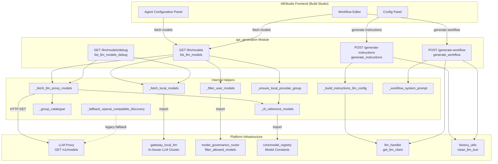
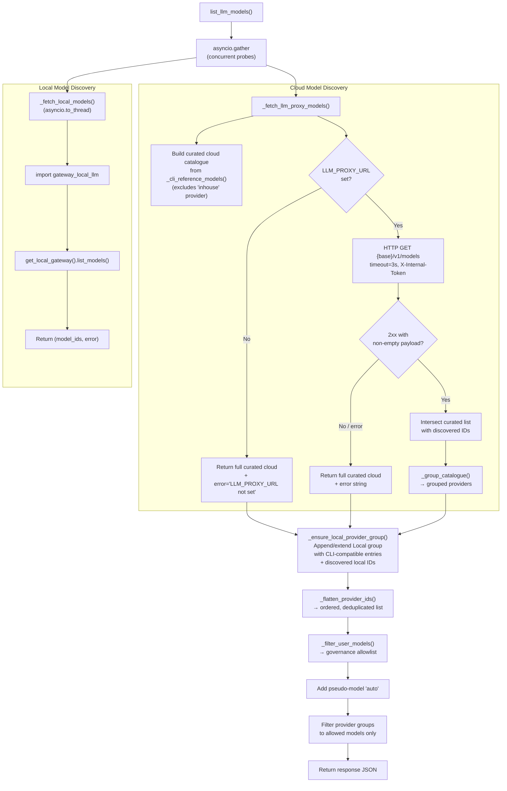
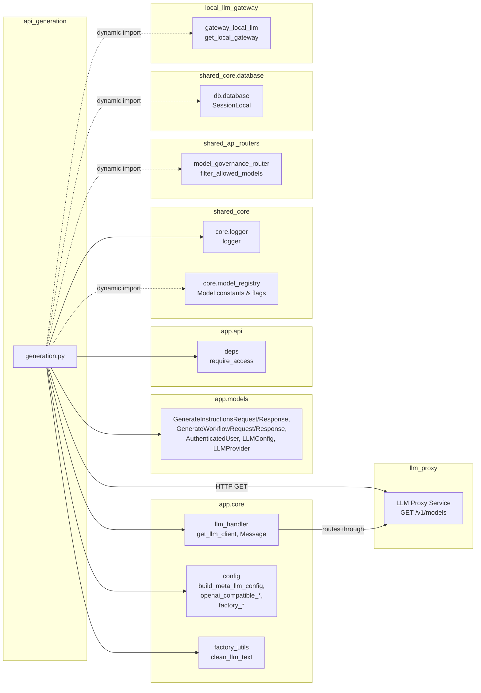
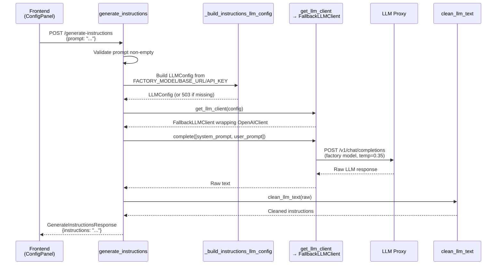
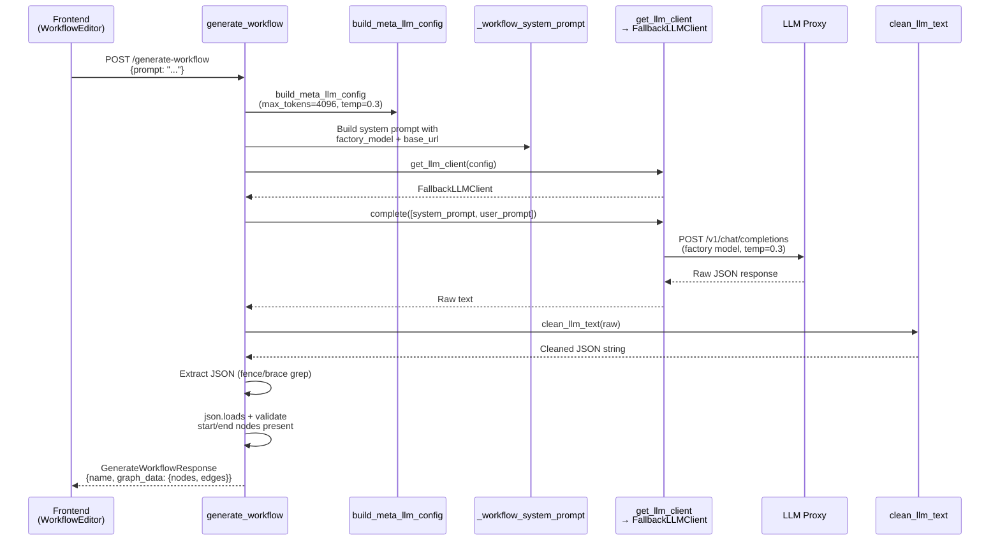
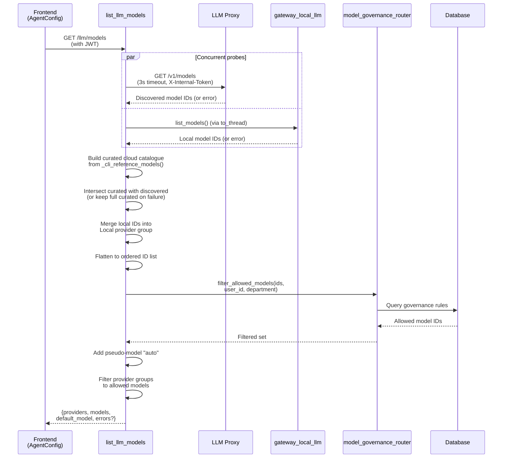
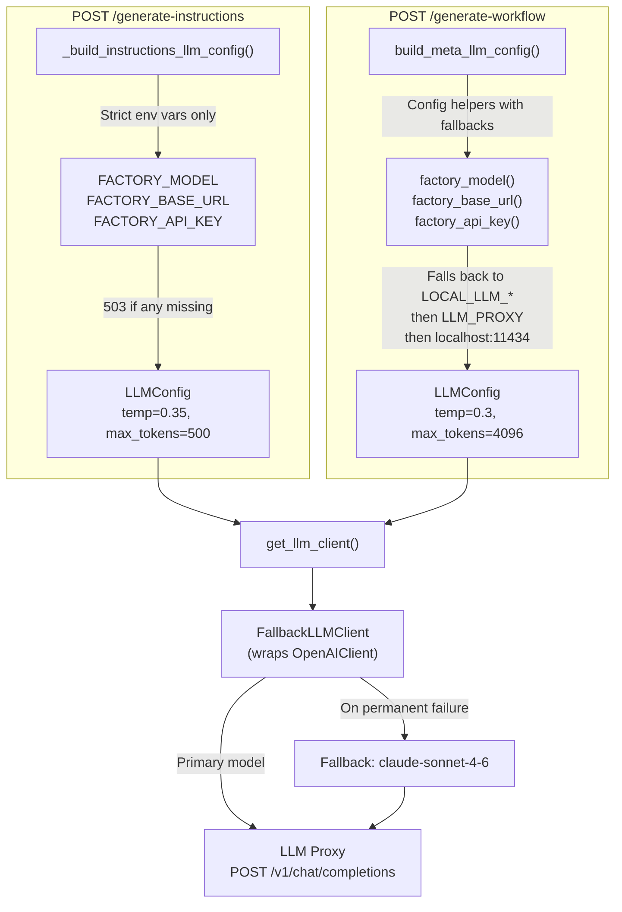

# API Generation Module

## Introduction

The **api_generation** module (`ABStudio/backend/app/api/generation.py`) provides the AI-powered generation endpoints for ABStudio's Build Studio. It exposes four FastAPI routes that serve two distinct concerns:

1. **Model Catalogue Discovery** (`GET /llm/models`, `GET /llm/models/debug`) — Assembles the full LLM model catalogue available to a user by merging a curated CLI-aligned cloud model list, a best-effort probe of the platform LLM proxy, and a direct query of the in-house local LLM cluster, then filtering the result through per-user governance rules.

2. **AI Content Generation** (`POST /generate-instructions`, `POST /generate-workflow`) — Uses dedicated factory-model LLM configurations to produce production-ready agent system prompts and multi-agent workflow JSON graphs from natural-language descriptions.

This module is a critical bridge between the ABStudio frontend (Build Studio's Agent Configuration panel and Workflow editor) and the platform's LLM infrastructure (LLM proxy, local LLM gateway, model governance, and factory model pipeline).

---

## Architecture Overview



---

## Component Documentation

### Endpoints

#### `GET /llm/models` — `list_llm_models`

Returns the full model catalogue available to the authenticated user, grouped by provider.

**Process:**
1. Concurrently probes the LLM proxy (`GET {LLM_PROXY_URL}/v1/models`) and the local LLM gateway (`gateway_local_llm.get_local_gateway().list_models()`) using `asyncio.gather`.
2. The proxy probe returns a curated cloud catalogue (Anthropic, OpenAI, Google) built statically from `core/model_registry` constants. If the proxy returns a non-empty discovery payload, the curated list is intersected with it (allowing operators to centrally hide models). If the probe fails or returns empty, the full curated list is returned.
3. Local in-house model IDs are merged into a dedicated "Local (In-house)" provider group.
4. The merged catalogue is filtered through the per-user governance allowlist via `model_governance_router.filter_allowed_models`.
5. A pseudo-model `"auto"` is always added (routing hint, never governance-filtered).

**Response shape:**
```json
{
  "provider": "ainxt",
  "base_url_configured": true,
  "providers": [
    {"provider": "Anthropic (Claude)", "models": [{"id": "...", "label": "...", "hint": "...", "tag": "..."}]},
    {"provider": "OpenAI", "models": [...]},
    {"provider": "Google (Gemini)", "models": [...]},
    {"provider": "Local (In-house)", "models": [...]}
  ],
  "models": ["claude-sonnet-4-6", "gpt-5.4", "auto", ...],
  "default_model": "claude-sonnet-4-6",
  "llm_proxy_error": null,
  "local_error": null
}
```

**Key design decisions:**
- The proxy probe uses a **3-second timeout** — it's an interactive dropdown probe, not a blocking dependency. A hung proxy must not stall the Agent Configuration panel.
- Discovery failures are **non-fatal**: the full curated catalogue is always returned so the dropdown matches the CLI's `/model` picker even on proxy builds that don't expose `/v1/models`.
- Governance filtering **fails open** (returns all IDs) if the DB isn't available (e.g., standalone dev).

---

#### `GET /llm/models/debug` — `list_llm_models_debug`

Diagnostic endpoint (SIT-only) that surfaces every source feeding `/llm/models` without applying governance filtering. Returns four diagnostic sections:

| Section | Purpose |
|---|---|
| `llm_proxy` | Proxy URL, provider groups, model counts/IDs, and error string |
| `local_llm` | Local LLM model IDs and error string |
| `orchestrator_runtime` | What `native_engine._run_agent` will actually call (base URLs, API key presence, token flag) |
| `env` | Presence flags for all relevant env vars (non-secret URLs in plaintext, secrets masked as "set"/"unset") |

This endpoint helps diagnose cases where `/llm/models` works but agent execution fails ("LLM unreachable"), or when a particular provider group is missing.

---

#### `POST /generate-instructions` — `generate_instructions`

Generates a production-ready system prompt for an AI agent from a natural-language purpose description.

**Request:** `GenerateInstructionsRequest { prompt: str }`

**Process:**
1. Validates the prompt is non-empty (422 if empty).
2. Builds an `LLMConfig` sourced **strictly** from `FACTORY_MODEL` / `FACTORY_BASE_URL` / `FACTORY_API_KEY` env vars — no `LOCAL_LLM_*` or hardcoded fallbacks. Returns 503 if any are missing.
3. Uses a carefully crafted system prompt (`_INSTRUCTIONS_SYSTEM_PROMPT`) that instructs the LLM to produce a 120–220 word, second-person, imperative system prompt with four sections: Role & identity, Responsibilities, Behaviour, Output format.
4. Sampling parameters: `max_tokens=500`, `temperature=0.35`, `top_p=0.9` — enough variation for phrasing without rambling.
5. Cleans the LLM output via `clean_llm_text` (strips reasoning blocks, code fences, wrapping quotes).
6. Returns 502 if the LLM produces an empty response; 500 for any other unexpected error (raw exception text is logged, not leaked to clients).

**Response:** `GenerateInstructionsResponse { instructions: str }`

---

#### `POST /generate-workflow` — `generate_workflow`

Generates a multi-agent workflow JSON graph from a natural-language description.

**Request:** `GenerateWorkflowRequest { prompt: str }`

**Process:**
1. Builds an `LLMConfig` via `build_meta_llm_config(max_tokens=4096, temperature=0.3)` — uses the factory model with low temperature for deterministic JSON output.
2. Uses a structured system prompt (`_workflow_system_prompt`) that constrains the LLM to output strict JSON with exactly 3 node types (start, agent, end), specific layout rules (all nodes at y=300, x increments of 300px), and edge format specifications.
3. The system prompt dynamically injects the current `factory_model()` and `openai_compatible_base_url()` so generated agent nodes are pre-configured for the platform's runtime.
4. Cleans the raw LLM output, strips reasoning blocks, extracts JSON from code fences if present, and falls back to brace-grep extraction.
5. Validates the parsed JSON contains at least one `start` and one `end` node (422 if missing).
6. Returns 422 for JSON decode errors, 500 for other unexpected errors.

**Response:** `GenerateWorkflowResponse { name: str, graph_data: dict }` where `graph_data` is `{"nodes": [...], "edges": [...]}`.

---

### Internal Helpers

#### Model Catalogue Assembly Pipeline



#### `_cli_reference_models()`

Builds the curated model catalogue that mirrors the CLI's `/v1/models` endpoint (`routers/messages_compat_router.py::list_models_compat`). Imports model constants and feature flags from `core/model_registry` (with a safe fallback to hardcoded defaults on import failure). Returns a list of model dicts with `id`, `hint`, `provider`, `label`, and `tag` fields.

Models are conditionally included based on feature flags (`ENABLE_OPUS`, `ENABLE_SONNET_5`, `ENABLE_CLI_OPUS_48`, `ENABLE_CLI_OPUS_5`, `ENABLE_GPT56_TERA`, `ENABLE_GPT56_LUNA`), allowing operators to centrally control which models appear in the catalogue.

#### `_fetch_llm_proxy_models()`

Async function that returns `(providers, error)` for the cloud model catalogue. See the flowchart above for the full decision tree. Key invariants:
- Always returns a non-empty curated catalogue (never empties the dropdown on discovery failure).
- The curated list is the source of truth; proxy discovery is an **intersection filter**, not a replacement.
- Uses `_matches_discovered_model()` for fuzzy matching (handles `provider/model` prefixed IDs).

#### `_fetch_local_models()`

Synchronous function (run via `asyncio.to_thread`) that queries the in-house local LLM cluster directly via `gateway_local_llm.get_local_gateway().list_models()`. Returns `(model_ids, error_message)`. The local LLM is on the internal network and is not fronted by the LLM proxy.

#### `_ensure_local_provider_group(providers, local_ids)`

Merges discovered local model IDs into the provider group list. Starts from the CLI-compatible local model entries from `_cli_reference_models()`, then appends any newly discovered local IDs that aren't already present. Creates a new "Local (In-house)" group if one doesn't exist.

#### `_group_catalogue(models)`

Groups a flat list of model dicts by provider label, using a stable display order: `["Anthropic (Claude)", "OpenAI", "Google (Gemini)", "Local (In-house)", "Other"]`.

#### `_filter_user_models(model_ids, user_id, department)`

Thin in-process wrapper around `routers.model_governance_router.filter_allowed_models`. Opens a DB session, calls the governance filter, and returns a set for O(1) membership. **Fails open** (returns all IDs) if the gateway process or DB isn't available.

#### `_build_instructions_llm_config(max_tokens, temperature, top_p)`

Builds an `LLMConfig` sourced **strictly** from `FACTORY_MODEL` / `FACTORY_BASE_URL` / `FACTORY_API_KEY` env vars. Raises HTTP 503 with a descriptive message listing the missing env vars if any are unset. This ensures the "Generate Instructions" meta-task always runs against the dedicated factory model, not whatever model is configured for runtime agent execution.

#### `_workflow_system_prompt()`

Dynamically constructs the system prompt for workflow generation, injecting the current `factory_model()` and `openai_compatible_base_url()` so generated agent nodes are pre-configured with the correct provider, model name, and base URL. The prompt enforces strict JSON output with exactly 3 node types, specific layout coordinates, and edge format rules.

#### `_fallback_openai_compatible_discovery(base_url)`

Legacy upstream `/models` discovery used only when `gateway.get_all_models` cannot be imported (e.g., ABStudio standalone dev server). Performs a direct `GET {base_url}/models` with Bearer auth, deduplicates model IDs (preferring non-prefixed names), and returns a custom-provider catalogue shape. Not used in the primary `/llm/models` flow.

---

## Dependencies



### Dependency Summary

| Dependency | Type | Purpose |
|---|---|---|
| [`app.core.llm_handler`](../llm/core_llm_handler.md) | Internal | `get_llm_client()` factory (wraps in `FallbackLLMClient`), `Message` class |
| [`app.core.config`](../core/core_config.md) | Internal | `build_meta_llm_config()`, `openai_compatible_base_url()`, `factory_model/base_url/api_key()` |
| [`app.core.factory_utils`](../agents/core_factory_utils.md) | Internal | `clean_llm_text()` — strips reasoning blocks, code fences, quotes |
| [`app.models`](../core/app_models.md) | Internal | Request/response Pydantic models, `LLMConfig`, `AuthenticatedUser` |
| [`app.api.deps`](api_deps.md) | Internal | `require_access` — gateway-wrapped JWT authentication |
| `core.logger` | Shared | Structured logging (`logger`) |
| `core.model_registry` | Shared (dynamic) | Model ID constants and feature flags for curated catalogue |
| `routers.model_governance_router` | Shared (dynamic) | `filter_allowed_models()` — per-user governance allowlist |
| `db.database` | Shared (dynamic) | `SessionLocal` for governance DB queries |
| `gateway_local_llm` | Shared (dynamic) | `get_local_gateway().list_models()` — in-house LLM discovery |
| LLM Proxy | External service | `GET /v1/models` discovery endpoint (best-effort, 3s timeout) |

---

## Data Flow: Generate Instructions



---

## Data Flow: Generate Workflow



---

## Data Flow: Model Catalogue Assembly



---

## LLM Configuration Strategy

The module uses two distinct LLM configuration strategies depending on the endpoint:



**Key difference:** `generate_instructions` uses a **strict** configuration that requires `FACTORY_*` env vars and returns 503 if any are missing — this is a meta-task that must always use the dedicated factory model. `generate_workflow` uses `build_meta_llm_config()` which has a fallback chain through `LOCAL_LLM_*` and the LLM proxy, making it more resilient in standalone dev environments.

Both paths flow through `get_llm_client()`, which wraps the primary client in a `FallbackLLMClient` that transparently retries on `claude-sonnet-4-6` if the primary model fails permanently. See [`core_llm_handler`](../llm/core_llm_handler.md) for full fallback semantics.

---

## Error Handling

| Endpoint | Error Condition | Status Code | Behavior |
|---|---|---|---|
| `GET /llm/models` | Proxy probe fails | 200 | Returns full curated catalogue + `llm_proxy_error` field |
| `GET /llm/models` | Local LLM probe fails | 200 | Returns catalogue without local models + `local_error` field |
| `GET /llm/models` | Governance filter fails | 200 | Fails open — returns all models |
| `GET /llm/models/debug` | Any source fails | 200 | Returns all sources with error strings per source |
| `POST /generate-instructions` | Empty prompt | 422 | "Prompt is required." |
| `POST /generate-instructions` | Missing `FACTORY_*` env vars | 503 | Lists missing env var names |
| `POST /generate-instructions` | Empty LLM response | 502 | "LLM returned an empty response." |
| `POST /generate-instructions` | Unexpected error | 500 | "Failed to generate instructions." (exception logged) |
| `POST /generate-workflow` | Invalid JSON from LLM | 422 | "LLM returned invalid JSON: {error}" |
| `POST /generate-workflow` | Missing start/end node | 422 | "LLM did not include a start/end node" |
| `POST /generate-workflow` | Unexpected error | 500 | Generic error detail |

---

## Relationship to Other Modules

- **[core_llm_handler](../llm/core_llm_handler.md)**: Provides `get_llm_client()` (the fallback-aware LLM client factory) and the `Message` class. The `FallbackLLMClient` wrapping ensures transient/permanent failures on the factory model are transparently retried against `claude-sonnet-4-6`.
- **[core_config](../core/core_config.md)**: Provides all LLM endpoint configuration helpers (`openai_compatible_base_url()`, `factory_model()`, `build_meta_llm_config()`, etc.) that resolve the LLM proxy URL, local LLM URL, and factory model settings through env-var fallback chains.
- **[core_factory_utils](../agents/core_factory_utils.md)**: Provides `clean_llm_text()` used to strip reasoning blocks (`<think>...</think>`), markdown code fences, and wrapping quotes from LLM output before parsing.
- **[app_models](../core/app_models.md)**: Defines all Pydantic request/response models (`GenerateInstructionsRequest/Response`, `GenerateWorkflowRequest/Response`, `LLMConfig`, `AuthenticatedUser`).
- **[api_deps](api_deps.md)**: Provides `require_access` — the gateway-wrapped JWT authentication dependency that converts the platform's JWT payload into an `AuthenticatedUser` with department and hierarchy fields.
- **[api_factories](api_factories.md)**: The factory chat endpoints (`agent_factory_chat`, `workflow_factory_chat`, `skill_factory_chat`) use the same `build_meta_llm_config()` and `clean_llm_text()` utilities for their conversational LLM calls, sharing the factory model configuration strategy.
- **[engine_native_engine](../agents/engine_native_engine.md)**: The `NativeEngine._run_agent` method uses the same `openai_compatible_base_url()` → `{LLM_PROXY_URL}/v1` routing path that the `/llm/models/debug` endpoint surfaces for diagnostics.
- **[api_agents](api_agents.md)** / **[api_workflows](api_workflows.md)**: The generated instructions and workflow graphs produced by this module are consumed by the agent and workflow CRUD endpoints for persistence and execution.
