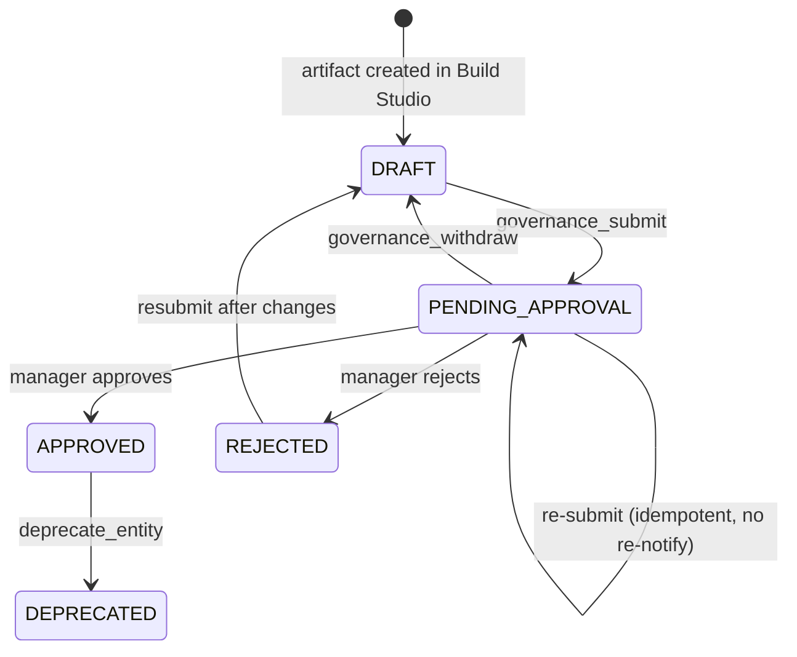
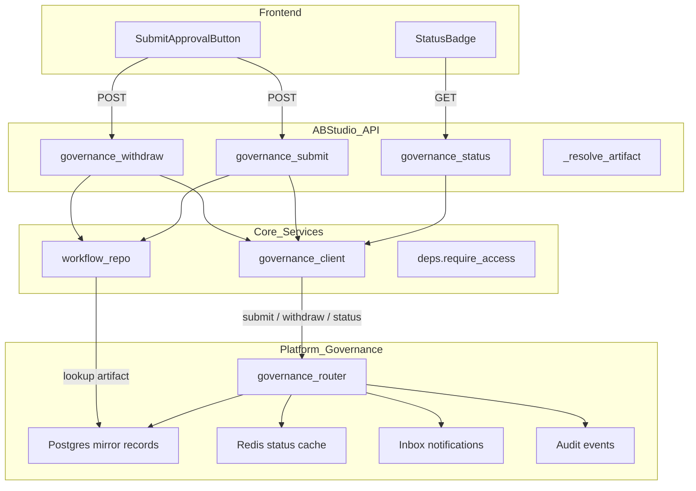
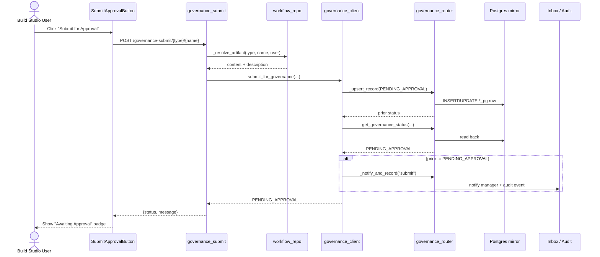
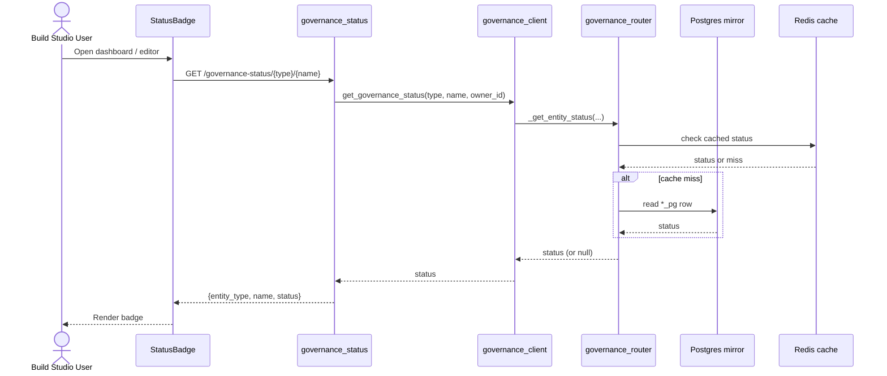
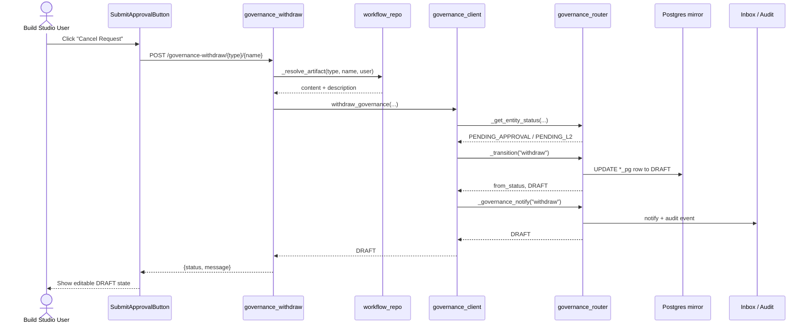

# api_governance Module Documentation

## Introduction

The `api_governance` module is the HTTP API bridge that connects **ABStudio / Build Studio** artifacts (workflows, agents, and skills) to the platform-wide governance and approval lifecycle. Build Studio stores the operational copy of each artifact in its own tables, while the platform governance system maintains a parallel mirror record (`*_pg`) that tracks approval status, department ownership, and audit history.

Because a brand-new Build Studio artifact has no governance mirror record yet, calling the platform governance endpoints directly would fail with a 404. This module closes that gap by:

1. Looking up the artifact in the Build Studio repository.
2. Building the governance mirror record on demand.
3. Driving the submit/withdraw/status operations through the shared governance client.

The module is mounted on the ABStudio base path (`/ainxt/v1/api/abs`) and is consumed by the Build Studio frontend governance features.

---

## Module Purpose and Core Functionality

The module exposes three primary REST endpoints:

| Endpoint | Method | Purpose |
|----------|--------|---------|
| `/governance-status/{entity_type}/{name}` | `GET` | Returns the current governance status of an artifact. `null` means the artifact has not been submitted yet. |
| `/governance-submit/{entity_type}/{name}` | `POST` | Submits a Build Studio artifact to the user's department manager / HOD for approval. |
| `/governance-withdraw/{entity_type}/{name}` | `POST` | Cancels a pending deploy request and returns the artifact to an editable `DRAFT` state. |

Supported entity types are:

- `workflows`
- `agents`
- `skills`

### Governance Lifecycle

### Visibility on Approval

When submitting, the caller may request catalog visibility:

- `public` (default) — visible to all users after approval.
- `private` — visible only to the submitter's department after approval.

This visibility is applied to the published template on approval.

---

## Architecture and Component Relationships

### High-Level Architecture

### Component Breakdown

#### `governance_status`

- Validates that `entity_type` is one of the supported types.
- Delegates the status lookup to `governance_client.get_governance_status`.
- Returns the status or `null` if the artifact has never been submitted.

#### `governance_submit`

- Validates the entity type.
- Resolves the artifact content and description via `_resolve_artifact`.
- Computes the submitter's department (from the JWT or by looking up the user table).
- Computes a canonical content hash for template-modification detection.
- Calls `governance_client.submit_for_governance`, which:
  - Upserts the mirror record with status `PENDING_APPROVAL`.
  - Verifies the record is readable after write.
  - Notifies approvers and records a signed audit event only on a real state change.
- Returns the new status and a confirmation message.

#### `governance_withdraw`

- Validates the entity type.
- Confirms the artifact exists and belongs to the caller.
- Delegates withdrawal to `governance_client.withdraw_governance`.
- The client prefers to route through the platform `governance_router` so that Redis, in-memory, and Postgres caches stay consistent; it falls back to a direct mirror write if the platform router is not importable (standalone ABStudio).
- Returns the artifact to `DRAFT` status.

#### `_resolve_artifact` (private helper)

- For `workflows`: searches the user's workflows by name and returns `graphData` / `graph_data` plus the description.
- For `agents`: searches the user's agents by name and returns a semantic subset of fields (`instructions`, `model_name`, `tools`, `skills`, `guardrails`, `memory_config`, `attached_flows`) plus the description.
- For `skills`: looks up the skill by name and returns its `content` and `description`.

#### `SubmitBody` (Pydantic model)

| Field | Type | Default | Description |
|-------|------|---------|-------------|
| `reason` | `Optional[str]` | `""` | Submitter note shown to the approver. |
| `visibility` | `Optional[str]` | `"public"` | Requested catalog visibility after approval (`public` or `private`). |

---

## Data Flow

### Submit Flow

### Status Check Flow

### Withdraw Flow

---

## How the Module Fits into the Overall System

### Within ABStudio

The `api_governance` module is part of the ABStudio backend API surface. It sits alongside other artifact-management routers such as:

- [`api_workflows`](api_workflows.md) — CRUD for workflows.
- [`api_agents`](api_agents.md) — CRUD for agents.
- [`api_catalog`](api_catalog.md) — skill/tool catalog management.

While those modules manage the **operational** artifact data, `api_governance` manages the **approval lifecycle** for those same artifacts.

### Relationship to Platform Governance

The actual governance state machine, approver notifications, audit logging, and SLA tracking live in the platform layer:

- `shared_api_routers.governance_router` — the canonical governance REST API and state transitions.
- [`core_governance_client`](../sdlc/core_governance_client.md) — the client library used by `api_governance` to interact with the platform router.
- [`core_governance`](../sdlc/core_governance.md) — lower-level governance utilities and policy enforcement (e.g., tool policy denial).

`api_governance` is essentially a **Build Studio-specific adapter** that makes the platform governance system aware of artifacts created inside Build Studio.

### Relationship to Frontend

The Build Studio frontend consumes these endpoints through:

- [`governance_feature.StatusBadge`](../sdlc/governance_feature.md) — polls and displays the governance status.
- [`governance_feature.SubmitApprovalButton`](../sdlc/governance_feature.md) — triggers submit/withdraw actions.

### Relationship to Execution

Once an artifact is approved, the execution paths can rely on the governance mirror record. For example, [`core_governance_client.is_usable`](../sdlc/core_governance_client.md) is used elsewhere to check whether a governed artifact may be run. A missing governance record is treated as **not usable** (fail-closed), ensuring unapproved artifacts cannot be executed.

---

## Dependencies

### Direct Imports

| Import | Source Module | Purpose |
|--------|---------------|---------|
| `AuthenticatedUser` | [`app_models`](../core/app_models.md) | Typed user context from the JWT. |
| `require_access` | [`api_deps`](api_deps.md) | Authentication/authorization dependency. |
| `workflow_repo` | [`core_workflow_repo`](../workflows/core_workflow_repo.md) | Reads workflows, agents, and skills from Build Studio tables. |
| `governance_client` | [`core_governance_client`](../sdlc/core_governance_client.md) | Submits, withdraws, and queries governance status via the platform router. |
| `logger` | `core.logger` | Structured logging. |

### Upstream Dependencies

- `shared_api_routers.governance_router` — provides `_get_entity_status`, `_transition`, `_governance_notify`, and the mirror-record upsert logic.
- Platform database (`*_pg` mirror tables) — stores the governance status.
- Redis — caches the live governance status.
- Inbox / notification system — notifies department managers of pending approvals.

---

## Error Handling and Edge Cases

| Scenario | Behavior |
|----------|----------|
| Unknown `entity_type` | Returns HTTP 404 with `Unknown entity type: ...`. |
| Artifact not found | Returns HTTP 404 with `{type} '{name}' not found`. |
| Re-submitting an already pending artifact | Idempotent: mirror record is refreshed but approvers are **not** re-notified. |
| Governance mirror write fails | `governance_client` raises a runtime error that surfaces as HTTP 500, preventing a silent orphan Inbox item. |
| Withdrawing a non-pending artifact | Returns the current status without changing it (idempotent no-op). |
| Platform router unavailable | `governance_client` falls back to direct Postgres reads/writes for standalone ABStudio deployments. |

---

## Security and Access Control

- All endpoints require an authenticated user via [`api_deps.require_access`](api_deps.md).
- Submit and withdraw operations are **owner-scoped**: the caller's `created_by` ID is passed to the platform router, which enforces that only the submitter (or an approver) can withdraw.
- The canonical content hash prevents template-modification detection bypasses by hashing only semantic fields and ignoring volatile metadata such as node positions and timestamps.

---

## References

- [`api_workflows`](api_workflows.md) — workflow CRUD API.
- [`api_agents`](api_agents.md) — agent CRUD API.
- [`api_catalog`](api_catalog.md) — skill/tool catalog API.
- [`api_deps`](api_deps.md) — authentication dependencies.
- [`app_models`](../core/app_models.md) — shared Pydantic models including `AuthenticatedUser`.
- [`core_workflow_repo`](../workflows/core_workflow_repo.md) — Build Studio artifact repository.
- [`core_governance_client`](../sdlc/core_governance_client.md) — governance client library.
- [`core_governance`](../sdlc/core_governance.md) — governance utilities and policy enforcement.
- `shared_api_routers.governance_router` — platform governance router.
- [`governance_feature`](../sdlc/governance_feature.md) — Build Studio frontend governance UI.
