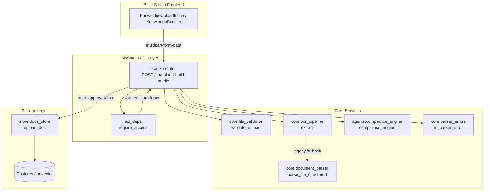
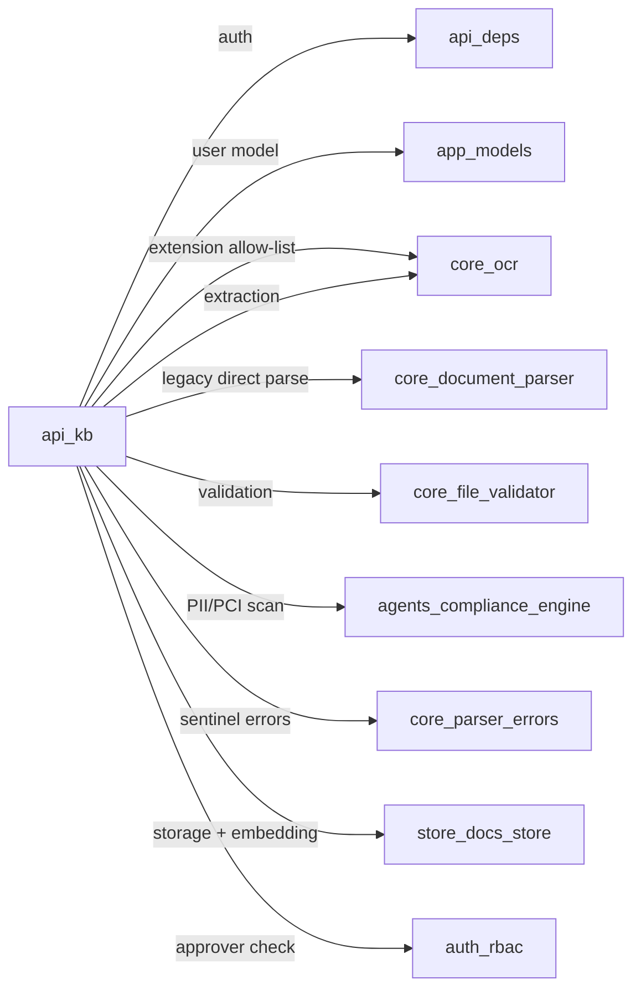
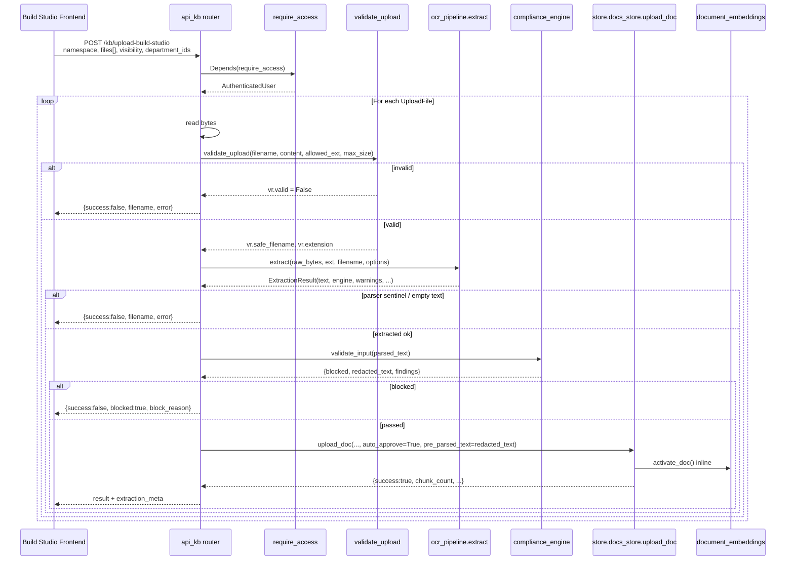

# api_kb — Build Studio Knowledge Base Upload Router

The `api_kb` module exposes a single FastAPI router that lets users upload documents directly from the **Build Studio** workflow editor into the platform knowledge base. Unlike the sidebar Knowledge Base endpoint (`routers/docs_router.py::upload_doc`), this route **auto-approves** uploaded documents so they become immediately searchable by the workflow/agent retriever (`app/core/kb_retriever.py`).

The module is intentionally a thin proxy: it reuses the same validation, parsing, compliance, and storage helpers as the platform KB route, only changing the approval semantics. This keeps behaviour consistent while giving the Build Studio surface the fast, maker-only UX it needs.

---

## 1. Module Purpose

| Concern | Responsibility |
|---|---|
| **Primary endpoint** | `POST /kb/upload-build-studio` |
| **Goal** | Ingest one or more documents into the KB and make them searchable inside the current workflow run without waiting for admin approval. |
| **Key difference from sidebar KB** | Calls `store.docs_store.upload_doc(..., auto_approve=True)`. |
| **Scope expansion** | Accepts standalone image files (`png`, `jpg`, `tiff`, `bmp`, `webp`) in addition to the structured-text formats supported by the sidebar. |
| **Non-goal** | This module does not manage long-lived document lifecycle (list, delete, approve, reject). Those operations remain in the platform router and are documented in [docs_router.md](docs_router.md). |

---

## 2. Architecture



### 2.1 Component Breakdown

| Component | File | Role |
|---|---|---|
| `upload_build_studio_doc` | `app/api/kb.py` | Main route handler. Orchestrates validation, extraction, compliance, and storage for each uploaded file. |
| `_write_tempfile` | `app/api/kb.py` | Writes raw bytes to a closed tempfile using `mkstemp`, avoiding Windows share-lock issues caused by open `NamedTemporaryFile` handles. |
| `_safe_unlink` | `app/api/kb.py` | Best-effort cleanup of tempfiles; swallows transient AV-scanner locks. |
| `_parse_with_retry` | `app/api/kb.py` | Serialises direct parser access through an `asyncio.Lock` and retries transient share-lock failures. |
| `require_access` | `app/api/deps.py` | Gateway-wrapped auth dependency. See [api_deps.md](api_deps.md). |
| `validate_upload` | `core/file_validator.py` | Extension, magic-byte, size, and HTML-script validation. See [core_file_validator.md](../core_file_validator.md). |
| `ocr_pipeline.extract` | `app/core/ocr_pipeline.py` | Hybrid extraction pipeline (structured parse, table extraction, image OCR, scanned-PDF fallback, cache). See [core_ocr.md](../documents/core_ocr.md). |
| `compliance_engine` | `agents/compliance_engine.py` | PII/PCI detection and redaction. See [agents_compliance_engine.md](../agents_compliance_engine.md). |
| `upload_doc` | `store/docs_store.py` | Shared persistence, chunking, embedding, and activation helper. See [store_docs_store.md](../store_docs_store.md). |

---

## 3. Dependencies



### 3.1 Direct Imports

```python
from fastapi import APIRouter, Depends, File, Form, UploadFile
from fastapi.concurrency import run_in_threadpool
from app.api.deps import require_access
from app.models import AuthenticatedUser
from app.core import ocr_pipeline
from app.core.ocr_pipeline import ExtractionOptions
from app.core.parser_errors import is_parser_error, PARSER_ERROR_PREFIXES
from app.core.kb_retriever import ABS_FILENAME_PREFIX as _ABS_FILENAME_PREFIX
from core.logger import logger
```

### 3.2 Lazy Imports

Heavy platform stacks are loaded only when the endpoint is actually invoked:

```python
from store.docs_store import upload_doc as _upload
from core.file_validator import validate_upload
from core.document_parser import parse_file_structured
from agents.compliance_engine import compliance_engine, BLOCKING_TYPES
from auth.rbac import can_approve as _can_approve
```

Lazy imports keep gateway boot time low and mirror the pattern used by `routers/docs_router.py`.

---

## 4. Data Flow



### 4.1 Request Shape

| Field | Type | Default | Description |
|---|---|---|---|
| `namespace` | `str` (Form) | — | Target KB namespace. |
| `files` | `List[UploadFile]` | — | One or more documents/images. |
| `visibility` | `str` | `"PUBLIC"` | `"PUBLIC"` (org-wide) or `"PRIVATE"` (department-scoped). |
| `department_ids` | JSON `str` | `"[]"` | Array of department names; ignored for `PUBLIC`. |
| `current_user` | `AuthenticatedUser` | Depends | Injected by `require_access`. |

### 4.2 Response Shape

* Single file upload → returns the result dict directly.
* Multi-file upload → returns `{"results": [dict, ...]}`.

Each result dict mirrors `store.docs_store.upload_doc` output and is enriched with non-destructive OCR metadata:

```json
{
  "success": true,
  "filename": "notes.pdf",
  "chunk_count": 12,
  "engine": "pdfplumber",
  "page_count": 3,
  "images_extracted": 2,
  "tables_extracted": 1,
  "warnings": [],
  "cache_hit": false
}
```

---

## 5. Component Interactions

### 5.1 Visibility & Department Resolution

```mermaid
flowchart TD
    A[Parse department_ids JSON] --> B{visibility?}
    B -->|PUBLIC| C[dept_ids = []]
    B -->|PRIVATE| D{is_approver?}
    D -->|yes| E[use caller-supplied dept_ids]
    D -->|no| F[dept_ids = [uploader_dept]]
```

The logic mirrors `routers/docs_router.py::upload_doc`:

* `PUBLIC` documents are visible org-wide.
* `PRIVATE` documents default to the uploader's own department unless the caller has approval rights.

Approver capability is checked via `auth.rbac.can_approve`. See [auth_rbac.md](../auth_rbac.md).

### 5.2 Filename Prefixing

`core.file_validator.validate_upload` already prefixes each safe filename with `uuid.hex[:8]_` to avoid collisions on the `(repo, file_path, chunk_index)` unique constraint. `api_kb` additionally prepends `_ABS_FILENAME_PREFIX` so that `kb_retriever._display_name` can strip it before rendering `[doc: …]` citations to the LLM. The user-visible `KnowledgeDocument.name` is set from `original_filename` upstream and is unaffected.

---

## 6. Process Flows

### 6.1 Upload & Auto-Approve Flow

```mermaid
flowchart LR
    Start([POST /kb/upload-build-studio]) --> Auth[require_access]
    Auth --> ParseDept[Parse department_ids]
    ParseDept --> ResolveVis[Resolve visibility]
    ResolveVis --> Loop[For each file]
    Loop --> Validate[validate_upload]
    Validate -->|reject| Err1[Return error result]
    Validate -->|accept| Extract[ocr_pipeline.extract]
    Extract -->|fail| Err2[Return parse error]
    Extract -->|sentinel| Err3[Return sentinel error]
    Extract -->|empty| Err4[Return empty-content error]
    Extract -->|ok| Compliance[compliance_engine.validate_input]
    Compliance -->|blocked| Err5[Return block reason]
    Compliance -->|ok/redacted| Store[upload_doc auto_approve=True]
    Store --> Enrich[Enrich with OCR meta]
    Enrich --> Loop
    Loop --> Return[Return result(s)]
```

### 6.2 Windows Share-Lock Workaround

On Windows, antivirus scanners and the OS itself can hold an exclusive share-lock on a tempfile for a short window after it is written. This caused `WinError 32` (`ERROR_SHARING_VIOLATION`) when multiple frontend workers parsed files concurrently.

`api_kb` mitigates this in three ways:

1. **`_write_tempfile`** uses `tempfile.mkstemp` and explicitly closes the file descriptor before returning the path, avoiding the open handle kept by `NamedTemporaryFile`.
2. **`_parse_with_retry`** serialises direct calls to `parse_file_structured` through a lazy `asyncio.Lock` and retries transient share-lock failures with delays `(100 ms, 250 ms)`.
3. **`_safe_unlink`** swallows `OSError` during tempfile cleanup so a lingering AV lock does not surface as a 500.

The modern `ocr_pipeline.extract` path writes and manages its own tempfile, so the lock is primarily a safety net for legacy direct-parse callers and future regressions.

---

## 7. Error Handling

| Failure | Behaviour | User-facing message |
|---|---|---|
| Invalid extension / magic mismatch / size > 25 MB | Skip file, return `success: false` | Format-specific message; lists allowed types. |
| HTML `<script>` tag detected | Skip file | `vr.error` verbatim. |
| Extraction pipeline exception | Skip file | `Could not extract text from file: {err}` |
| Parser sentinel string in output | Skip file | Sentinel text without brackets. |
| Empty extracted text | Skip file | Actionable guidance based on file type. |
| Compliance blocked | Skip file | `success: false, blocked: true, block_reason` |
| Compliance engine exception | Log warning, continue with raw text | — |
| JSON parse error on `department_ids` | Fall back to `[]` | — |

The route is intentionally **fail-open for individual files**: one bad file does not abort the entire multi-file batch.

---

## 8. Configuration & Constants

| Constant | Value | Purpose |
|---|---|---|
| `_TEXT_DOC_EXTENSIONS` | `pdf, docx, md, ppt, pptx, html, txt, xlsx, xls, csv` | Base structured-text allow-list, kept in lockstep with the sidebar route. |
| `_ALLOWED_DOC_EXTENSIONS` | `_TEXT_DOC_EXTENSIONS ∪ IMAGE_EXTENSIONS` | Final allow-list including images, computed via `ocr_pipeline.supported_extensions`. |
| `_KB_MAX_SIZE_BYTES` | `25 * 1024 * 1024` (25 MB) | Per-document size cap. |
| `_PARSE_RETRY_DELAYS_MS` | `(100, 250)` | Retry delays for transient share-lock failures. |
| `_ABS_FILENAME_PREFIX` | imported from `app.core.kb_retriever` | Citation-hygiene prefix stripped by the retriever. |

---

## 9. Relationship to Other Modules

| Module | Relationship |
|---|---|
| [api_deps.md](api_deps.md) | Provides `require_access`, the gateway-wrapped JWT dependency. |
| [app_models.md](../models/app_models.md) | Uses `AuthenticatedUser` for identity, role, and department. |
| [core_ocr.md](../documents/core_ocr.md) | Uses `ocr_pipeline.extract`, `ExtractionOptions`, and `supported_extensions` for hybrid document/image extraction. |
| [core_document_parser.md](../core_document_parser.md) | Falls back to `parse_file_structured` for direct parsing (legacy path). |
| [core_file_validator.md](../core_file_validator.md) | Uses `validate_upload` for extension, magic-byte, size, and HTML-script checks. |
| [agents_compliance_engine.md](../agents_compliance_engine.md) | Uses `compliance_engine.validate_input` and `BLOCKING_TYPES` for PII/PCI redaction and blocking. |
| [core_parser_errors.md](../core_parser_errors.md) | Uses `is_parser_error` to detect parser sentinel strings. |
| [store_docs_store.md](../store_docs_store.md) | Uses `upload_doc(..., auto_approve=True)` for persistence, chunking, embedding, and inline activation. |
| [auth_rbac.md](../auth_rbac.md) | Uses `can_approve` to decide whether a caller may scope `PRIVATE` uploads to arbitrary departments. |
| [api_documents.md](api_documents.md) | Sibling route for agent-runner attachments and image assets; shares OCR/compliance patterns. |
| [docs_router.md](docs_router.md) | Platform sidebar KB route that this module mirrors but with `auto_approve=False` and admin approval workflow. |

---

## 10. Developer Notes

* **Keep in sync with `routers/docs_router.py`**: The body of `upload_build_studio_doc` is intentionally structurally identical to `docs_router.py::upload_doc`. When platform validation, parsing, or compliance behaviour changes, mirror those changes here.
* **No additional rate limiting**: The platform rate limiter is intentionally omitted because Build Studio is an authenticated internal surface. The sidebar route still enforces limits.
* **Lazy imports**: Heavy modules (`store.docs_store`, `core.document_parser`, `agents.compliance_engine`) are imported inside the handler to keep startup fast.
* **Image support**: Standalone image uploads are accepted only on this Build Studio surface; the sidebar KB still rejects them.
* **Citation hygiene**: The `_ABS_FILENAME_PREFIX` is added purely for retriever display; it does not affect storage uniqueness, which is guaranteed by `core.file_validator`.
