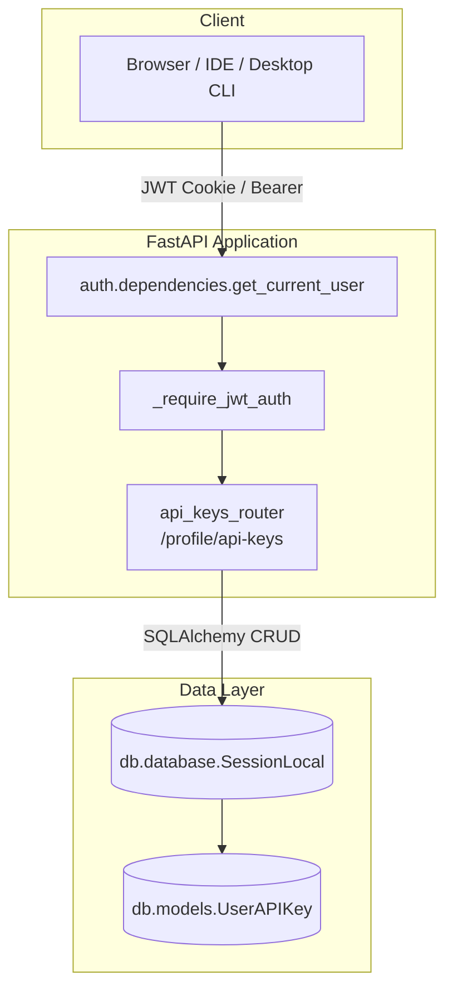
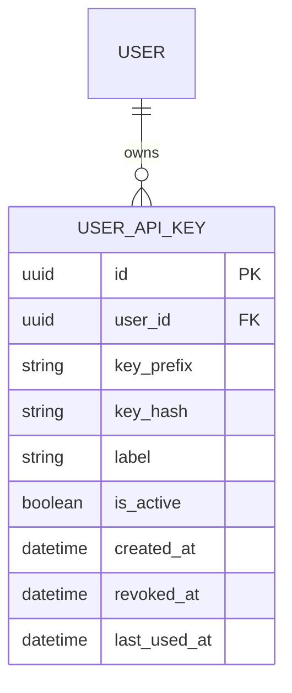
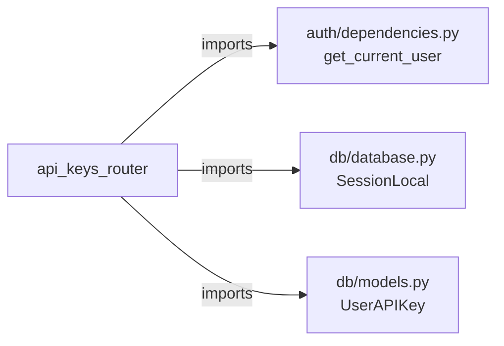
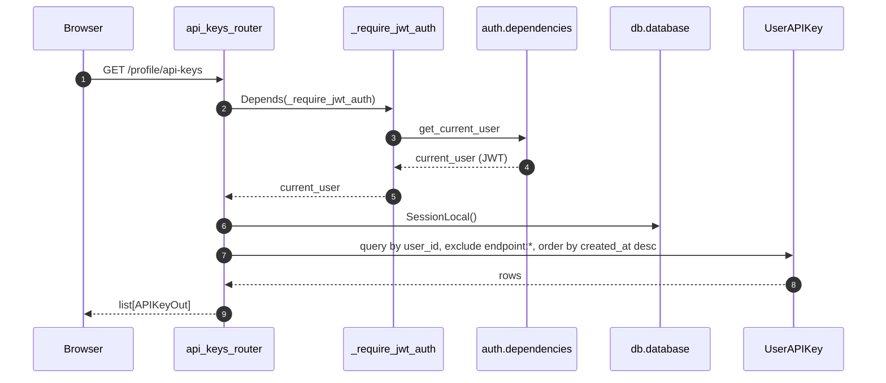
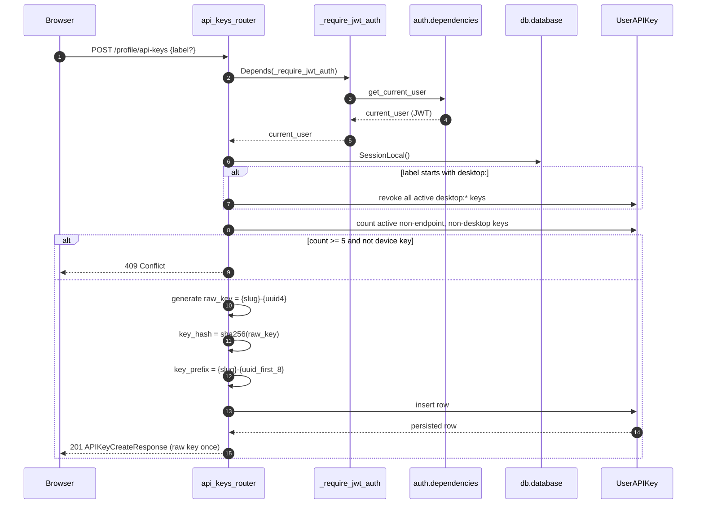
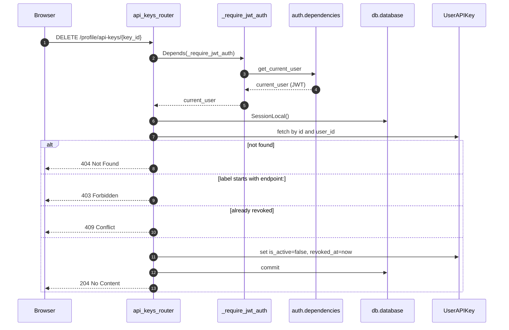
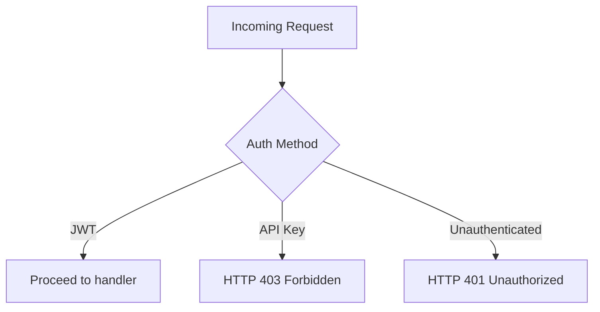
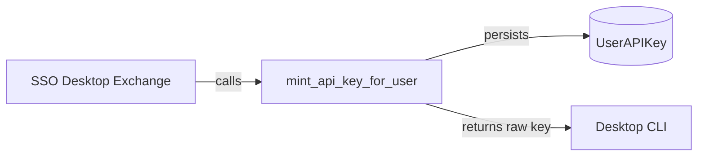

# API Keys Router

The `api_keys_router` module provides per-user API key lifecycle management for the platform. It exposes REST endpoints under `/ainxt/v1/api/profile/api-keys` that allow authenticated users to list, create, and revoke long-lived API keys used by IDE integrations, desktop clients, and other programmatic clients. The router enforces a hard cap on active user-created keys, never stores or returns raw key material more than once, and requires browser-based JWT authentication for all management operations so that a compromised API key cannot be used to mint additional keys.

---

## Table of Contents

1. [Module Purpose](#module-purpose)
2. [Architecture Overview](#architecture-overview)
3. [Component Reference](#component-reference)
4. [Data Models](#data-models)
5. [Dependencies](#dependencies)
6. [Data Flow](#data-flow)
7. [Process Flows](#process-flows)
8. [Security Model](#security-model)
9. [Integration Points](#integration-points)
10. [Related Documentation](#related-documentation)

---

## Module Purpose

`api_keys_router` is responsible for:

- **Listing API keys**: Returning a user's own keys in masked form (only the prefix and metadata are exposed).
- **Creating API keys**: Generating cryptographically random keys, hashing them for storage, and returning the raw key exactly once.
- **Revoking API keys**: Marking keys inactive so that subsequent authentication attempts fail immediately.
- **Enforcing key limits**: Capping the number of active user-created keys and recycling device-scoped keys automatically.
- **Preventing privilege escalation**: Restricting key-management operations to JWT sessions, blocking API-key-based access to these endpoints.

The router is intentionally narrow in scope. It does not validate keys during request handling, issue OAuth tokens, or manage endpoint-specific credentials directly. Those responsibilities live in the authentication layer, the endpoint management router, and the desktop router.

---

## Architecture Overview

The router is a FastAPI `APIRouter` mounted at `/profile/api-keys`. It relies on the shared authentication dependency `get_current_user` and applies an additional guard, `_require_jwt_auth`, to ensure that only browser sessions can manage keys. Persistence is handled through SQLAlchemy sessions over the `UserAPIKey` model.

### Key Design Decisions

| Decision | Rationale |
|----------|-----------|
| Raw key returned only once | Prevents accidental leakage through repeated list responses and follows the principle of least exposure. |
| SHA-256 hashing with salt-free storage | Keys are high-entropy UUIDs, so a simple hash lookup is sufficient for verification while keeping storage compact. |
| Key prefix stored in plaintext | Allows users to identify keys in the UI without exposing the secret. |
| JWT-only management | A leaked API key cannot create or revoke other keys, limiting blast radius. |
| Device keys (`desktop:*`) self-recycle | Desktop clients can re-mint credentials without hitting the user cap. |
| Endpoint keys (`endpoint:*`) excluded | Managed endpoint credentials are owned by the endpoint management module and cannot be altered here. |

---

## Component Reference

### Route Handlers

| Function | Method / Path | Description |
|----------|---------------|-------------|
| `list_api_keys` | `GET /profile/api-keys` | Returns all non-endpoint API keys for the current user, newest first. |
| `create_api_key` | `POST /profile/api-keys` | Mints a new API key, enforces caps, and returns the raw key once. |
| `revoke_api_key` | `DELETE /profile/api-keys/{key_id}` | Revokes a key by ID; endpoint keys are rejected. |

### Guards and Helpers

| Function | Purpose |
|----------|---------|
| `_require_jwt_auth` | Dependency that rejects requests authenticated via an API key, allowing only JWT sessions. |
| `mint_api_key_for_user` | Reusable helper used by other flows (e.g., SSO desktop exchange) to issue CLI credentials programmatically. |
| `_sha256_hex` | Hashes raw key material for persistent storage. |
| `_slugify` | Converts email/local-part into a URL-safe, lowercase prefix slug. |
| `_fmt` | Formats datetime objects for JSON responses. |

### Pydantic Models

| Model | Usage |
|-------|-------|
| `APIKeyOut` | Response shape for listing keys (masked). |
| `APIKeyCreateRequest` | Request body when creating a key; optional label. |
| `APIKeyCreateResponse` | Response shape on creation, includes the raw key exactly once. |

---

## Data Models

The router operates on the `UserAPIKey` model defined in `db.models`. The following conceptual schema is used:

### Field Semantics

- `key_prefix`: First segment of the raw key (user slug) plus the first eight characters of the UUID. Displayed in UIs for identification.
- `key_hash`: SHA-256 of the full raw key. Used to authenticate incoming requests without storing the secret.
- `label`: Optional human-readable label. Special prefixes are reserved:
  - `endpoint:` — managed by the endpoint management module.
  - `desktop:` — self-recycling device credentials for the desktop CLI.
- `is_active`: Soft-delete flag. Revoked keys remain in the table for audit purposes.
- `revoked_at`: Timestamp set when a key is revoked.
- `last_used_at`: Updated by the authentication layer on successful use.

For the full database model definitions, see [db_models.md](../db_models.md).

---

## Dependencies

### Direct Dependencies

- **[auth/dependencies.py](../auth_dependencies.md)** — Provides `get_current_user`, which resolves the caller from JWT or API key credentials.
- **[db/database.py](../db_database.md)** — Provides `SessionLocal`, the SQLAlchemy session factory.
- **[db/models.py](../db_models.md)** — Defines the `UserAPIKey` persistence model.

### Related Modules

- **[auth_router.md](auth_router.md)** — Handles login, token refresh, SSO, and session revocation. API keys are an alternative credential type produced by this router but consumed by the auth layer.
- **[profile_router.md](profile_router.md)** — Manages user profile settings and custom tokens. The API keys router is mounted under the `/profile` namespace conceptually.
- **[endpoint_mgmt_router.md](endpoint_mgmt_router.md)** — Owns `endpoint:*` keys. The API keys router explicitly excludes and protects these records.
- **[desktop_router.md](desktop_router.md)** — May trigger key minting for desktop clients through the shared `mint_api_key_for_user` helper.

---

## Data Flow

### Listing Keys

### Creating a Key

### Revoking a Key

---

## Process Flows

### Key Generation Algorithm

1. Extract the local-part of the user's email address.
2. Convert it to a lowercase, hyphen-separated slug using `_slugify`.
3. Generate a UUID4 and concatenate it to the slug with a hyphen: `{slug}-{uuid4}`.
4. Compute the SHA-256 hash of the raw key for storage.
5. Derive the prefix as `{slug}-{first_8_chars_of_uuid}`.
6. Persist a `UserAPIKey` row containing the prefix, hash, label, and timestamps.
7. Return the raw key exactly once in the creation response.

### Cap Enforcement Rules

| Key Type | Counted Toward Cap | Recycling Behavior |
|----------|-------------------|--------------------|
| User-created keys (no special prefix) | Yes | Oldest key revoked when cap is reached. |
| `desktop:*` device keys | No | All existing active desktop keys revoked before creating a new one. |
| `endpoint:*` managed keys | No | Cannot be created or revoked through this router. |

The cap `_MAX_KEYS_PER_USER` is currently set to `5` active user keys.

---

## Security Model

### Authentication Requirements

All management endpoints require a valid JWT session. The `_require_jwt_auth` dependency inspects the `auth_method` field returned by `get_current_user` and rejects any request where `auth_method == "api_key"`.

### Secret Handling

- Raw keys are generated with high entropy (UUID4) and a user-specific prefix.
- Only the SHA-256 hash is persisted; raw keys are never logged or stored.
- List responses expose only the prefix, label, and lifecycle metadata.
- Revocation is immediate and soft-deletes the key for audit retention.

### Privilege Boundaries

- A user can only manage keys belonging to their own `user_id`.
- Endpoint-managed keys are protected from user revocation to prevent accidental breakage of shared integrations.
- Device keys are isolated from user keys so that desktop re-installation does not exhaust the user's key quota.

---

## Integration Points

### Consumers of API Keys

API keys created by this router are consumed by the platform's authentication layer (`auth.dependencies.get_current_user`) to identify users in programmatic clients such as:

- IDE extensions via the [ide_router.md](ide_router.md).
- Desktop CLI via the [desktop_router.md](desktop_router.md).
- External scripts and automation tools.

### Programmatic Key Minting

The `mint_api_key_for_user` helper is exported for use by other server-side flows that need to issue a long-lived credential without a browser session, such as the SSO desktop exchange flow. It applies the same cap and recycling logic as the HTTP endpoint.

---

## Related Documentation

- [auth_dependencies.md](../auth_dependencies.md) — User resolution and credential validation.
- [auth_router.md](auth_router.md) — Login, SSO, session, and token management.
- [profile_router.md](profile_router.md) — User profile and custom token management.
- [endpoint_mgmt_router.md](endpoint_mgmt_router.md) — Managed endpoint credentials (`endpoint:*` keys).
- [desktop_router.md](desktop_router.md) — Desktop CLI integration and workspace indexing.
- [ide_router.md](ide_router.md) — IDE extension endpoints that consume API keys.
- [db_database.md](../db_database.md) — Database session management.
- [db_models.md](../db_models.md) — Full persistence model definitions, including `UserAPIKey`.
