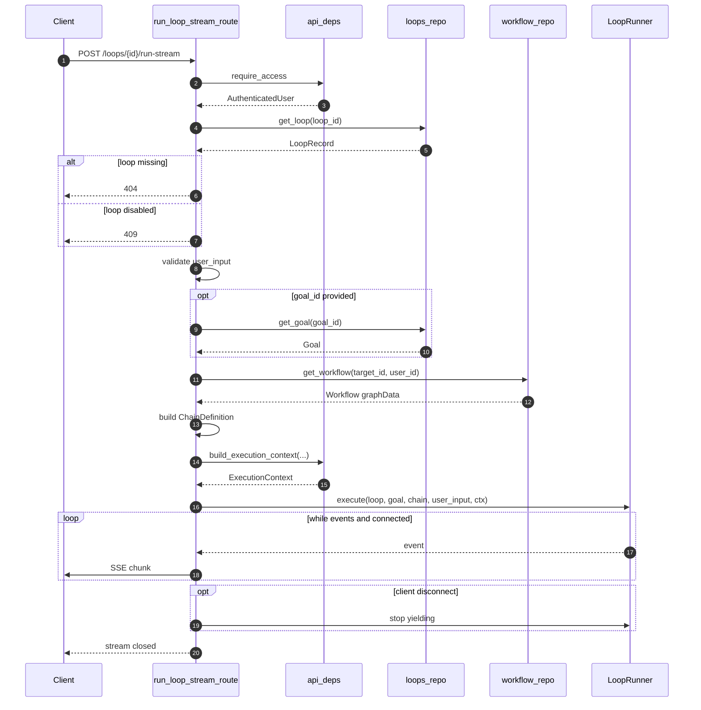
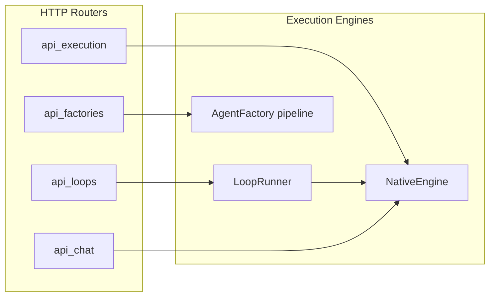

# `api_loops` — Loop Execution REST Surface

## Brief Introduction

The `api_loops` module is a thin FastAPI router that exposes the public HTTP endpoint for running a stored **Loop** end-to-end. A Loop is a higher-level automation primitive that repeatedly executes an underlying chain (currently a workflow) until a proof/goal condition is satisfied or a budget is exhausted. This module is intentionally minimal: it validates the request, resolves the loop's target chain, optionally loads a `Goal`, builds an execution context, and streams events from [`LoopRunner`](../agents/loop_runner.md) back to the client via Server-Sent Events (SSE).

> **Scope note:** This module only ships the `/loops/{loop_id}/run-stream` route. Loop lifecycle management (create, update, enable/disable, list) and goal storage are handled by the [`loop_models`](../agents/loop_models.md) and [`loop_runner`](../agents/loop_runner.md) modules; workflow retrieval is delegated to [`core_workflow_repo`](../workflows/core_workflow_repo.md).

---

## Core Responsibilities

| Responsibility | Description |
| -------------- | ----------- |
| **Request validation** | Ensures the loop exists, is enabled, and carries a non-empty `user_input`. |
| **Chain resolution** | Maps `loop.action.target_id` to a concrete [`ChainDefinition`](../core/app_models.md) by loading the referenced workflow graph. |
| **Engine gating** | Only `action.engine == "workflow"` is supported in the current release; `agent` loops return `422 Unprocessable Entity`. |
| **Goal binding** | Optionally resolves a `Goal` from `goal_id` to add a predicate gate on top of proof-based termination. |
| **Context construction** | Builds an execution context (user, thread, budget, trigger source) via [`app.api.deps`](api_deps.md). |
| **Event streaming** | Runs [`LoopRunner`](../agents/loop_runner.md) asynchronously and yields SSE events until completion, cancellation, or client disconnect. |

---

## Module Architecture

```mermaid
flowchart TB
    subgraph Client
        FE[Frontend / API consumer]
    end

    subgraph api_loops["api_loops (app/api/loops.py)"]
        ROUTE["run_loop_stream_route"]
        RESOLVE["_resolve_loop_chain"]
    end

    subgraph deps["api_deps"]
        CTX["build_execution_context"]
        AUTH["require_access"]
        LOG["bind_log_context / clear_log_context"]
    end

    subgraph loop_layer["Loop subsystem"]
        REPO[(loops_repo)]
        MODELS["LoopRecord / Goal"]
        RUNNER["LoopRunner"]
    end

    subgraph workflow_layer["Workflow subsystem"]
        WF_REPO[(workflow_repo)]
        WF["Workflow graphData"]
    end

    FE -->|POST /loops/{loop_id}/run-stream| ROUTE
    ROUTE --> AUTH
    ROUTE --> REPO
    REPO --> MODELS
    ROUTE --> RESOLVE
    RESOLVE -->|lazy import| WF_REPO
    WF_REPO --> WF
    RESOLVE -->|ChainDefinition / ChainEdge| RUNNER
    ROUTE --> CTX
    CTX --> RUNNER
    RUNNER -->|SSE events| ROUTE
    ROUTE -->|StreamingResponse| FE
    ROUTE -.-> LOG
    RUNNER -.-> LOG
```

---

## Component Reference

### `run_loop_stream_route`

FastAPI route handler registered at `POST /loops/{loop_id}/run-stream`.

**Inputs**

| Parameter | Type | Source | Description |
|-----------|------|--------|-------------|
| `loop_id` | `str` | path | Identifier of the stored loop to execute. |
| `payload` | `Dict[str, Any]` | body | Execution parameters (see below). |
| `http_request` | `Request` | injected | Underlying HTTP request, used to detect disconnects. |
| `current_user` | `AuthenticatedUser` | `Depends(require_access)` | Authenticated caller. |

**Payload shape**

```json
{
  "user_input":   "required free-text prompt",
  "thread_id":    "optional — autoderived from loop+user if omitted",
  "goal_id":      "optional — adds a goal predicate gate",
  "budget":       {"tokens": ..., "wall_clock_s": ..., "max_iterations": ...},
  "trigger_src":  "manual | ...  default 'manual'"
}
```

**Behavior**

1. Loads the [`LoopRecord`](../agents/loop_models.md) from [`loops_repo`](../agents/loop_runner.md). Returns `404` if missing, `409` if disabled.
2. Validates `user_input` is non-empty (`422` otherwise).
3. Calls `_resolve_loop_chain` to build a [`ChainDefinition`](../core/app_models.md).
4. Optionally resolves a [`Goal`](../agents/loop_models.md) from `goal_id` (`404` if missing).
5. Builds an execution context with [`build_execution_context`](api_deps.md).
6. Instantiates [`LoopRunner`](../agents/loop_runner.md) and streams its events through an async generator.
7. Detects client disconnect via `http_request.is_disconnected()` and stops yielding.
8. Returns a `StreamingResponse` with SSE headers (`text/event-stream`, no buffering).

### `_resolve_loop_chain`

Private helper that converts a `LoopRecord` into a [`ChainDefinition`](../core/app_models.md) that [`LoopRunner`](../agents/loop_runner.md) can execute.

**Current limitations**

- Only `loop.action.engine == "workflow"` is implemented.
- `action.engine == "agent"` is spec'd but returns `422` until the agent-registry single-node wrap contract is finalized.
- The target workflow is loaded lazily from [`workflow_repo`](../workflows/core_workflow_repo.md) to keep the router's import graph light.

**Output**

A `ChainDefinition` containing:

- `nodes`: workflow graph nodes.
- `edges`: list of [`ChainEdge`](../core/app_models.md) instances built from `graphData.edges`.
- `knowledge`: optional knowledge attachment from the workflow.

---

## Data Flow



---

## Dependencies

| Dependency | Module doc | Role in this module |
|------------|------------|---------------------|
| `app.api.deps` | [`api_deps.md`](api_deps.md) | Authentication (`require_access`), execution context construction, and request-scoped log context. |
| `app.loop.repo` | [`loop_runner.md`](../agents/loop_runner.md) | Persistence layer for [`LoopRecord`](../agents/loop_models.md) and [`Goal`](../agents/loop_models.md). |
| `app.loop.models` | [`loop_models.md`](../agents/loop_models.md) | Domain models: `LoopRecord`, `Goal`, plus `ActionSpec`, `VerifySpec`, etc. |
| `app.loop.runner` | [`loop_runner.md`](../agents/loop_runner.md) | The engine that actually executes the loop and produces the event stream. |
| `app.engine.interface` | [`engine_native_engine.md`](../agents/engine_native_engine.md) | `ChainDefinition` and `ChainEdge` data structures shared with the execution engine. |
| `app.core.workflow_repo` | [`core_workflow_repo.md`](../workflows/core_workflow_repo.md) | Lazy-loaded workflow retrieval by `target_id`. |
| `app.models` | [`app_models.md`](../core/app_models.md) | `AuthenticatedUser` and shared request/response models. |

---

## Error Handling

| HTTP status | Trigger | Detail payload |
|-------------|---------|----------------|
| `404` | Loop not found | `"loop not found"` |
| `409` | Loop disabled | `{"error": "loop_disabled", ...}` |
| `422` | Missing `user_input` | `{"error": "missing_user_input", ...}` |
| `422` | Unsupported `action.engine` | `{"error": "unsupported_engine", ...}` |
| `422` | Empty `loop.action.target_id` | `{"error": "missing_target", ...}` |
| `404` | Referenced workflow not found | `{"error": "workflow_not_found", ...}` |
| `404` | `goal_id` provided but missing | `{"error": "goal_not_found", ...}` |

---

## How It Fits Into the System

The `api_loops` module sits at the boundary between the HTTP transport layer and the loop execution engine. It is a sibling to other execution-oriented routers:

- [`api_execution`](api_execution.md) — runs workflows directly (one-shot, no iterative proof/goal loop).
- [`api_factories`](api_factories.md) — chat-based factory flows for building agents/skills/workflows.
- [`api_chat`](api_chat.md) / [`api_agent_chat`](api_agent_chat.md) — conversational thread APIs.

While those modules target interactive or one-shot execution, `api_loops` is the entry point for **autonomous iterative execution**: a Loop can repeatedly invoke a workflow, evaluate proof/goal conditions via [`LoopRunner`](../agents/loop_runner.md), and stream progress back to the caller.



---

## Configuration & Runtime Notes

- **Lazy import of `workflow_repo`:** The module imports `app.core.workflow_repo` inside `_resolve_loop_chain` rather than at the top level. This keeps the router's cold-start import graph small even if the workflow repository grows heavy dependencies.
- **SSE headers:** The response sets `X-Accel-Buffering: no` to prevent reverse proxies (e.g., nginx) from buffering the event stream.
- **Client disconnect:** The event generator checks `http_request.is_disconnected()` on every iteration and breaks early, avoiding wasted work after the caller has gone away.
- **Log context:** Request and thread context are bound at both the route and generator entry points so that log lines emitted inside the runner remain traceable.

---

## Related Documentation

- [`loop_models.md`](../agents/loop_models.md) — Loop and Goal domain models.
- [`loop_runner.md`](../agents/loop_runner.md) — `LoopRunner`, proof evaluation, verifier agents, and budget metering.
- [`engine_loop_evaluator.md`](../agents/engine_loop_evaluator.md) — `LoopController` and `LLMEvaluator` used inside the runner.
- [`core_workflow_repo.md`](../workflows/core_workflow_repo.md) — Workflow storage and retrieval.
- [`api_deps.md`](api_deps.md) — Authentication and execution-context helpers.
- [`app_models.md`](../core/app_models.md) — Shared request/response models.
- [`engine_native_engine.md`](../agents/engine_native_engine.md) — Native workflow execution engine that ultimately runs the resolved chain.
