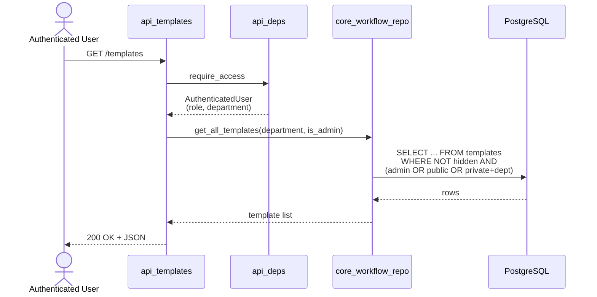
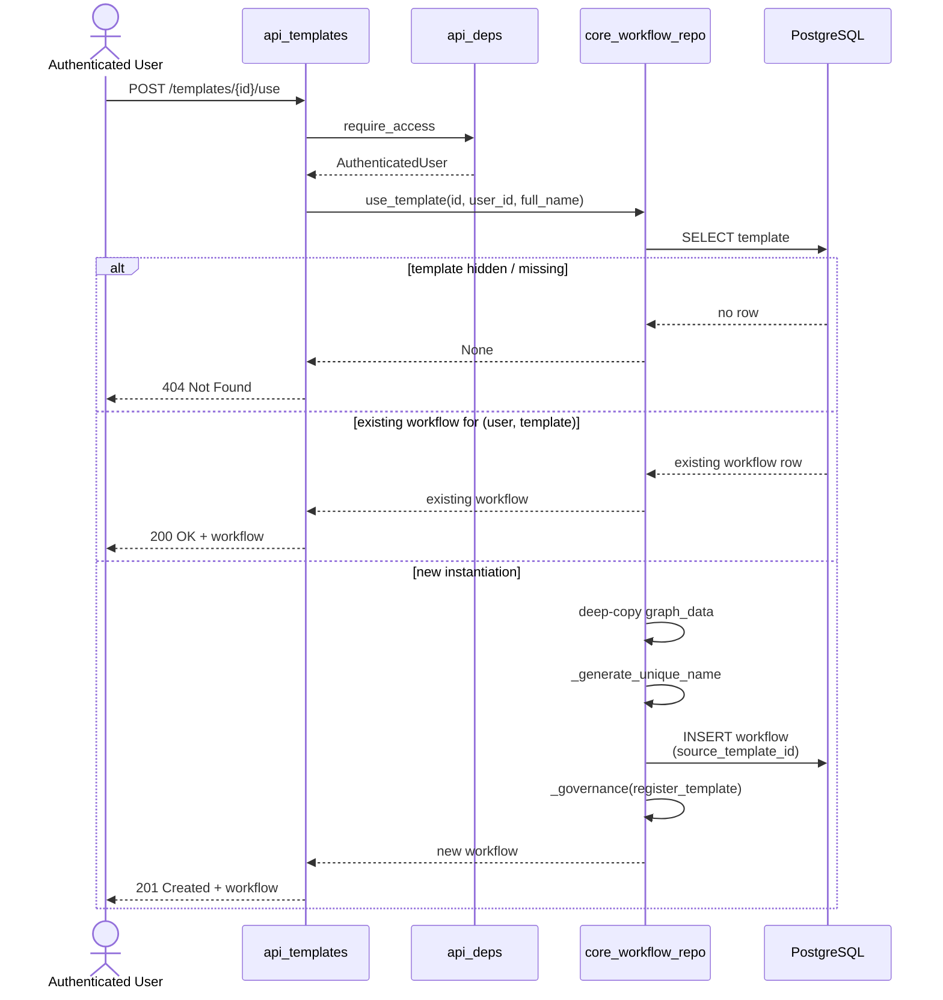
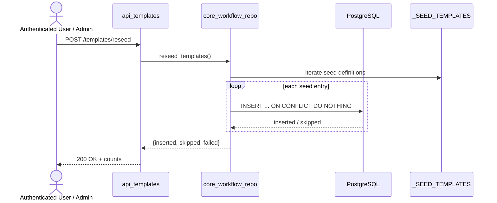

# `api_templates` Module Documentation

## Brief Introduction

The `api_templates` module (`ABStudio/backend/app/api/templates.py`) exposes the public REST endpoints for the **workflow template catalog**. It allows authenticated users to browse reusable workflow blueprints, inspect a specific template, instantiate a template into a personal workflow, and trigger re-seeding of built-in templates. The module is intentionally thin: route handlers delegate all persistence, visibility, and seeding logic to [`core_workflow_repo`](../workflows/core_workflow_repo.md), while authentication and department-scoped access control are provided by [`api_deps`](api_deps.md).

This module is the read/consumer-facing counterpart to [`api_template_admin`](api_template_admin.md), which provides the privileged create/update/delete/seed-management operations for the same catalog.

---

## Core Responsibilities

| Responsibility | Description |
|----------------|-------------|
| **List templates** | Return the catalog of workflow templates visible to the caller, scoped by role and department. |
| **Get a template** | Fetch a single template by ID; hidden templates are treated as non-existent. |
| **Use a template** | Clone a template into the caller’s personal workflow collection (idempotent per user). |
| **Reseed templates** | Idempotently insert any built-in seed templates that are missing from the database. |

---

## Architecture

```mermaid
flowchart TB
    subgraph Client
        FE[templates_feature UI]
    end

    subgraph FastAPI App
        RT[api_templates router<br/>ABStudio/backend/app/api/templates.py]
        AD[api_deps<br/>require_access]
        TA[api_template_admin router]
        WM[api_workflows router]
    end

    subgraph Core
        WR[core_workflow_repo]
        DB[(PostgreSQL<br/>templates / workflows)]
        SEED[_SEED_TEMPLATES<br/>in workflow_repo.py]
    end

    FE -->|GET /templates| RT
    FE -->|POST /templates/{id}/use| RT
    FE -->|POST /templates/reseed| RT
    RT --> AD
    AD -->|AuthenticatedUser| RT
    RT --> WR
    TA --> WR
    WM --> WR
    WR --> DB
    WR -.->|reads / patches| SEED
```

### Component Relationships

- **`api_templates` router** defines four public endpoints and relies on `require_access` from [`api_deps`](api_deps.md) to obtain an [`AuthenticatedUser`](../core/app_models.md).
- **`core_workflow_repo`** is the single source of truth for template and workflow persistence. It implements listing, reading, seeding, and instantiation logic, including department visibility, hidden-template filtering, unique-name generation, and governance registration.
- **`api_template_admin`** is the privileged sibling router. It mutates the catalog (create, update, delete, save-to-seed, reset, export) and is documented separately in [`api_template_admin.md`](api_template_admin.md).
- **`api_workflows`** owns the lifecycle of the resulting workflow records after a template is used; see [`api_workflows.md`](api_workflows.md).

---

## Endpoint Reference

### `GET /templates` — `list_templates`

Returns the list of workflow templates visible to the authenticated user.

- **Auth**: Any authenticated user (`require_access`).
- **Visibility rules** (enforced by `workflow_repo.get_all_templates`):
  - Admins see every template except hidden system templates.
  - Non-admins see public templates plus private templates whose `department` matches the caller’s department.
  - Users with no department see only public templates.
- **Response**: Array of template objects (`id`, `name`, `description`, `category`, `graph_data`, `pattern`, `hitl`, `visibility`, `department`).

### `GET /templates/{template_id}` — `get_template_route`

Fetches a single template by ID.

- **Auth**: Any authenticated user.
- **Behavior**: Returns the template row. Hidden templates (e.g., internal web-search templates) return `404` even if the ID exists, preventing leakage of internal catalog entries.

### `POST /templates/{template_id}/use` — `use_template_route`

Instantiates a template into a workflow owned by the caller.

- **Auth**: Any authenticated user.
- **Idempotency**: If the user already has a workflow cloned from this `source_template_id`, the existing workflow is returned instead of creating a duplicate.
- **Conflict handling**: If the generated workflow name collides with an existing name, `workflow_repo.use_template` raises `NameValidationError` and the endpoint returns HTTP `409` with a structured `name_conflict` detail.
- **Governance**: On successful creation, the new workflow is registered for governance via `workflow_repo._governance` with action `register_template`.
- **Response**: The newly created (or existing) workflow object.

### `POST /templates/reseed` — `reseed_templates_route`

Idempotently inserts any seed templates that are not already present in the database.

- **Auth**: Any authenticated user (the operation itself is safe and idempotent).
- **Behavior**: Existing rows are left untouched. Returns counts of inserted, skipped, and failed entries so callers can verify state without restarting the service.

---

## Data Flows

### Listing Templates



### Using a Template



### Reseeding Templates



---

## Error Handling

| Scenario | HTTP Status | Detail |
|----------|-------------|--------|
| Template not found (or hidden) | `404` | `"Template not found"` |
| Workflow name conflict on use | `409` | `{"error": "name_conflict", "message": "..."}` |
| Unauthenticated request | `401` | Raised by `require_access` |
| Unexpected repository failure | `500` | Logged and returned as generic detail by the repository layer |

---

## Dependencies

### Direct Imports

- `fastapi.APIRouter`, `Depends`, `HTTPException` — routing and exception primitives.
- [`app.models.AuthenticatedUser`](../core/app_models.md) — the authenticated user model.
- [`app.core.workflow_repo`](../workflows/core_workflow_repo.md) — all template/workflow persistence operations.
- [`app.api.deps.require_access`](api_deps.md) — gateway-wrapped authentication dependency.

### Upstream Modules

| Module | Role in this module |
|--------|---------------------|
| [`api_deps`](api_deps.md) | Supplies `AuthenticatedUser` via `require_access`; admin enforcement lives in `require_admin` (used by [`api_template_admin`](api_template_admin.md)). |
| [`core_workflow_repo`](../workflows/core_workflow_repo.md) | Implements `get_all_templates`, `get_template`, `use_template`, `reseed_templates`, plus the seed-management helpers used by the admin router. |
| [`app_models`](../core/app_models.md) | Defines `AuthenticatedUser` with fields used for visibility (`role`, `department`). |
| [`api_template_admin`](api_template_admin.md) | Privileged sibling router for catalog mutations; shares the same `core_workflow_repo` backend. |
| [`api_workflows`](api_workflows.md) | Manages the workflow records produced when a template is used. |

---

## Frontend Integration

The Build Studio frontend consumes these endpoints through the templates dashboard and the workflow editor:

- [`templates_feature`](templates_feature.md) — `TemplateCardMenu`, `TemplateCreateModal`, `TemplateEditModal` provide the catalog UI and admin actions.
- [`app_core`](../core/app_core.md) — `App.jsx` handles `handleOpenTemplate`, `handlePreviewTemplate`, and `handleEditFromTemplatePreview`, wiring template selection into the editor shell.
- `useTemplate` (frontend store) calls `POST /templates/{id}/use` to clone a template into an editable workflow.

---

## How It Fits into the Overall System

The `api_templates` module sits at the boundary between the **workflow catalog** and the **workflow authoring/runtime** subsystems:

1. **Catalog surface**: It exposes the public, read-oriented API for reusable workflow blueprints stored in the `templates` table.
2. **Instantiation gateway**: It is the only public entry point for turning a blueprint into a concrete workflow under a user’s ownership.
3. **Seeding hook**: It lets operators or the frontend trigger re-seeding of built-in templates without a service restart.
4. **Governance integration**: New workflows created from templates are automatically registered for governance tracking via `core_workflow_repo._governance`.
5. **Separation of concerns**: All privileged catalog management (create, update, delete, seed baseline control) is delegated to [`api_template_admin`](api_template_admin.md), keeping this module focused on consumer operations.

In the broader ABStudio architecture, templates enable users to discover pre-built workflow patterns, preview them, and quickly create governed workflow instances that can then be edited, executed, and published back to the catalog through [`api_workflows`](api_workflows.md), [`api_execution`](api_execution.md), and [`api_template_admin`](api_template_admin.md).
