# Broadcast Router

## Overview

The **Broadcast Router** is an allowlist-gated FastAPI router module that provides a complete email broadcast feature for the platform. It enables authorized users to compose, target, preview, and send organization-wide HTML email announcements through an internal SMTP relay. The module spans the full lifecycle of a broadcast — from LLM-assisted template generation and audience resolution, through attachment management and compliance validation, to asynchronous per-recipient delivery with real-time progress tracking and cancellation support.

The router is part of the `shared_api_routers` package and is mounted under the `/broadcast` prefix. It is consumed by the frontend `EmailBroadcast` component in the AI-UI application.

---

## Architecture

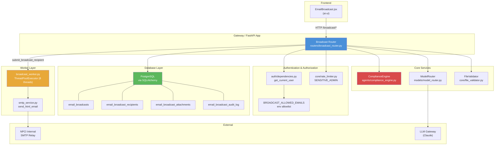

### Module Boundaries

The broadcast feature is intentionally split across three layers:

| Layer | File | Responsibility |
|-------|------|----------------|
| **Router** | `routers/broadcast_router.py` | HTTP endpoints, request validation, authorization, compliance gating, DB orchestration, audit logging |
| **Worker** | `workers/broadcast_worker.py` | Asynchronous per-recipient email delivery via a thread pool, SMTP interaction, race-safe counter updates, broadcast finalization |
| **SMTP Service** | `services/smtp_service.py` | MIME envelope construction, attachment encoding, SMTP relay communication |

---

## Security Model

### Allowlist Authorization

Access to all broadcast endpoints (except `/access`) is gated by the `require_broadcast_user` dependency, which checks the caller's JWT email against the `BROADCAST_ALLOWED_EMAILS` environment variable.

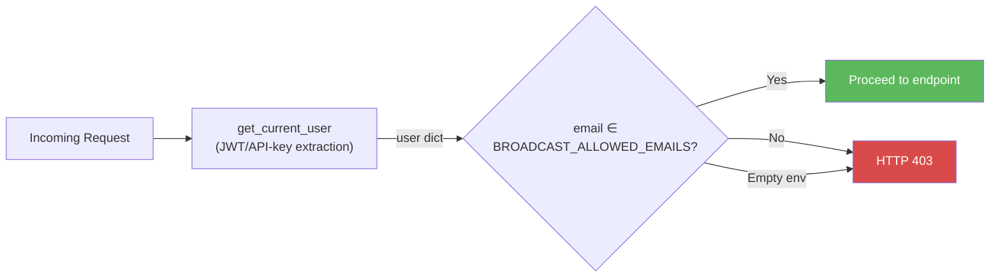

**Key properties:**
- **Fail-closed**: If `BROADCAST_ALLOWED_EMAILS` is empty or unset, access is denied to everyone.
- **Case-insensitive**: Emails are lowercased before comparison.
- **Runtime rotation**: The allowlist is read at call time (not import time), so ops can rotate it via a process restart without code changes.
- **Non-raising probe**: The `GET /broadcast/access` endpoint returns `{"allowed": false}` instead of raising 403, allowing the UI to hide the feature gracefully.

### Rate Limiting

Every endpoint enforces `SENSITIVE_ADMIN` rate limiting (50 requests per minute per IP+user) via `enforce_rate_limit_with_behaviour`, which combines:
1. **Behaviour-based anomaly detection** — IPs/users generating excessive 4xx responses are auto-throttled for 5 minutes.
2. **Sliding-window rate limiting** — Redis-backed sorted-set counter with in-process dict fallback.

See [shared_core](../reference/shared_core.md) for full rate limiter documentation.

### Compliance Validation

All user-supplied text (intent, subject, HTML body) and LLM-generated output pass through the `ComplianceEngine.validate_input()` method before being persisted or returned. The compliance engine performs:

- **Regex-based PII/secret detection** (PAN, Aadhaar, API keys, etc.)
- **ML-based privacy filtering** (via the `privacy_svc` microservice when configured)
- **Configurable actions**: `redact` (mask sensitive data), `block` (reject the request), `off` (skip)

If a block-configured type is detected, the request is rejected with HTTP 400 and a `compliance_blocked` audit row is written.

See [shared_core](../reference/shared_core.md) for full compliance engine documentation.

---

## Data Model

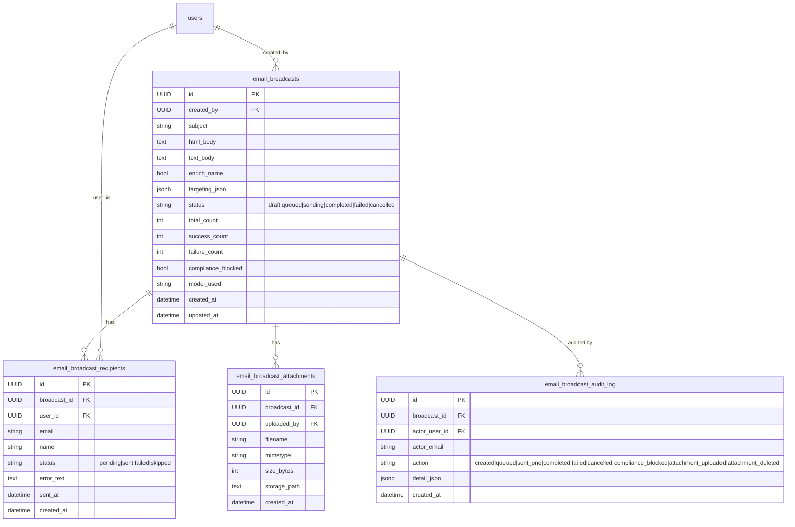

### Status State Machine

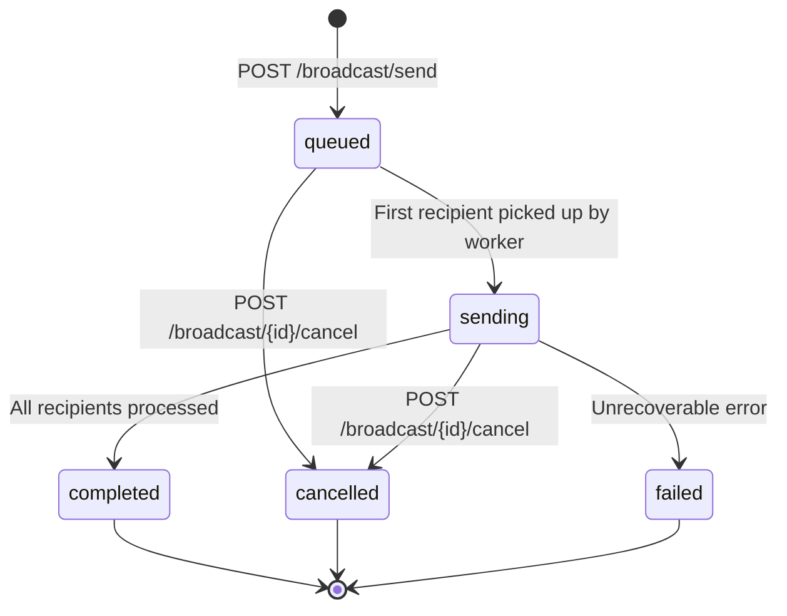

**Recipient statuses:** `pending` → `sent` | `failed` | `skipped` (on cancel)

---

## Endpoints

### Endpoint Map

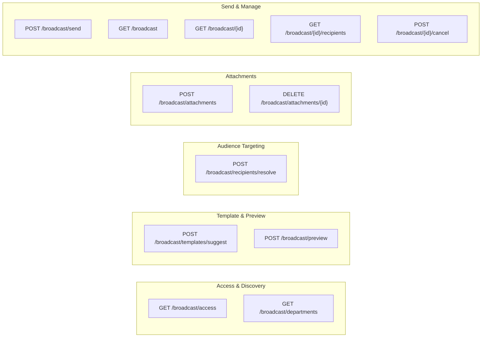

### Endpoint Reference

| Method | Path | Auth | Description |
|--------|------|------|-------------|
| `GET` | `/broadcast/access` | `get_current_user` | Lightweight probe — returns `{"allowed": bool}` for UI gating. Does **not** raise 403. |
| `POST` | `/broadcast/templates/suggest` | `require_broadcast_user` | Generates an HTML email template from a plain-English intent via LLM. Compliance-checked on both input and output. |
| `POST` | `/broadcast/preview` | `require_broadcast_user` | Substitutes `{{name}}` placeholder with a sample name (HTML-escaped). |
| `GET` | `/broadcast/departments` | `require_broadcast_user` | Returns distinct department names from active users. |
| `POST` | `/broadcast/recipients/resolve` | `require_broadcast_user` | Previews the targeted audience — returns total count + first 50 sample rows. |
| `POST` | `/broadcast/attachments` | `require_broadcast_user` | Uploads a single attachment (max 25 MB, allowlisted extensions). |
| `DELETE` | `/broadcast/attachments/{id}` | `require_broadcast_user` | Deletes an unlinked attachment (cannot delete if linked to a sent broadcast). |
| `POST` | `/broadcast/send` | `require_broadcast_user` | Enqueues a broadcast for sending. Creates broadcast + recipient rows, links attachments, submits to thread pool. |
| `GET` | `/broadcast` | `require_broadcast_user` | Lists past broadcasts (most-recent first, paginated). |
| `GET` | `/broadcast/{id}` | `require_broadcast_user` | Broadcast detail — full row + first 20 failed recipients. |
| `GET` | `/broadcast/{id}/recipients` | `require_broadcast_user` | Paginated recipient list with optional status filter. |
| `POST` | `/broadcast/{id}/cancel` | `require_broadcast_user` | Cancels an in-flight broadcast — sets status to `cancelled`, marks pending recipients as `skipped`. |

---

## Request/Response Models

### `_TemplateSuggestReq`
| Field | Type | Constraints | Description |
|-------|------|-------------|-------------|
| `intent` | `str` | min 3, max 4000 chars | Plain-English description of the email content |
| `tone` | `str?` | max 60 chars | Desired tone (default: "professional") |

### `_PreviewReq`
| Field | Type | Constraints | Description |
|-------|------|-------------|-------------|
| `html` | `str` | min 1, max 200,000 chars | HTML template body |
| `sample_name` | `str` | min 1, max 120 chars | Name to substitute into `{{name}}` (default: "Priyadharshan") |
| `enrich_name` | `bool` | — | Whether to perform name substitution (default: `true`) |

### `_ResolveTargetingReq`
| Field | Type | Description |
|-------|------|-------------|
| `all` | `bool` | Target all active users (default: `false`) |
| `departments` | `List[str]` | Filter by department names |
| `max_ad_level` | `int?` | Filter by AD level ≤ value |
| `user_ids` | `List[str]` | Specific user IDs (additive/OR) |
| `emails` | `List[str]` | Specific email addresses (additive/OR, validated by regex) |

**Targeting logic:** Departments + AD-level form a single AND group. User IDs and emails are OR'd on top of that group. If `all=true`, all other filters are ignored.

### `_SendReq`
| Field | Type | Constraints | Description |
|-------|------|-------------|-------------|
| `subject` | `str` | min 1, max 998 chars | Email subject line |
| `html_body` | `str` | min 1, max 500,000 chars | HTML email body |
| `text_body` | `str?` | max 200,000 chars | Plain-text alternative |
| `enrich_name` | `bool` | — | Substitute `{{name}}` per recipient |
| `targeting` | `_ResolveTargetingReq` | — | Audience targeting configuration |
| `attachment_ids` | `List[str]` | — | Previously uploaded attachment IDs to link |

---

## Core Processes

### Send Broadcast Flow

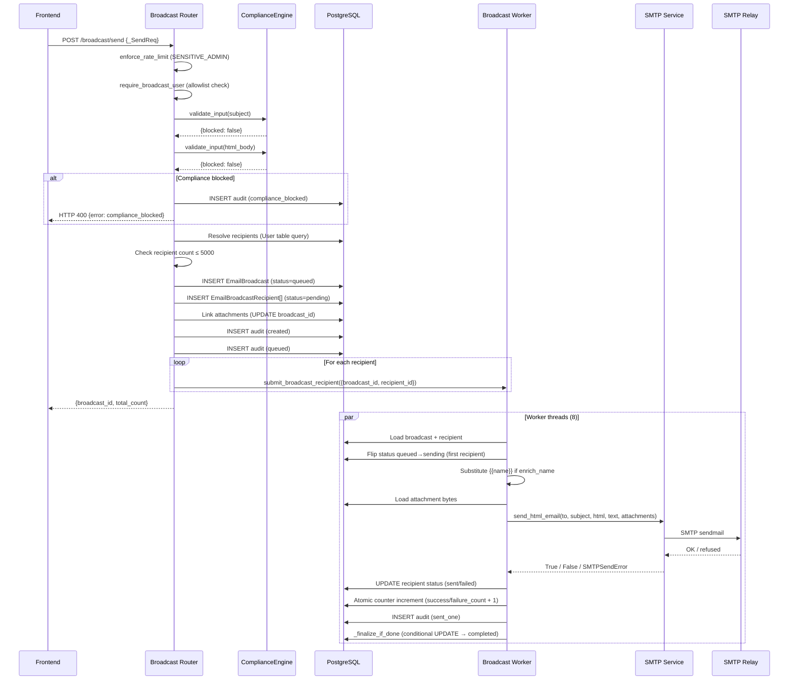

### Template Generation Flow

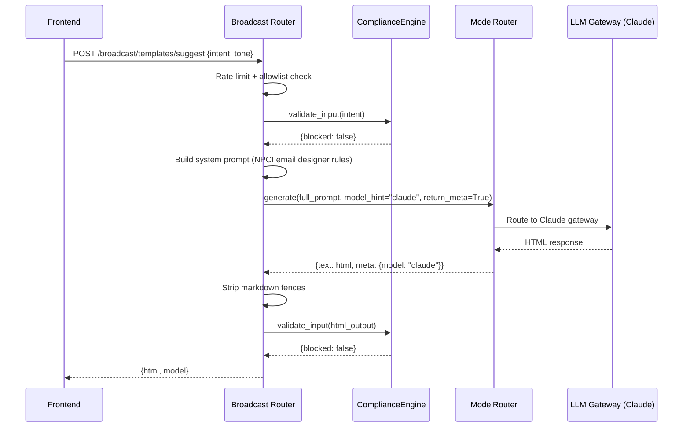

### Attachment Upload Flow

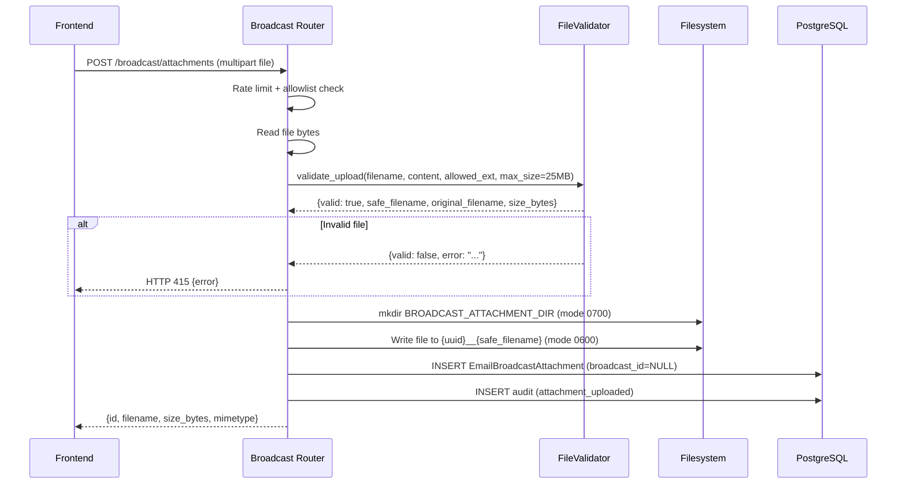

### Cancel Broadcast Flow

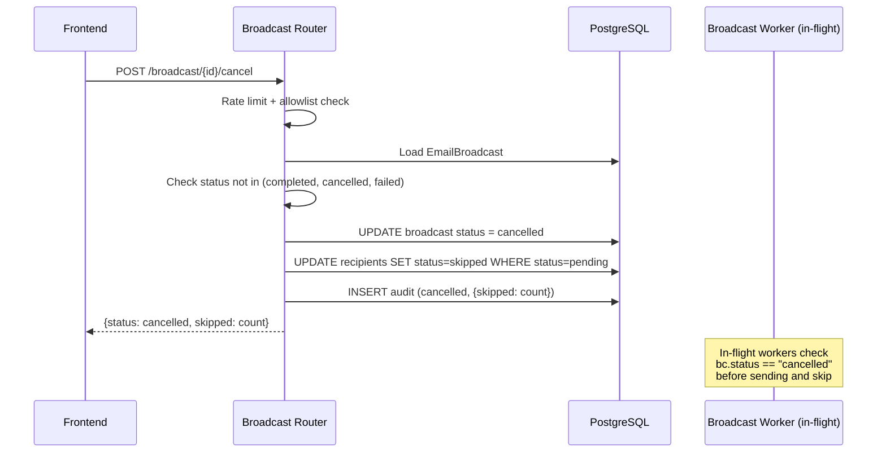

---

## Recipient Resolution

The `_resolve_recipient_list` helper materializes the full deduplicated recipient list from the `users` table. Deduplication is by lowercased email address.

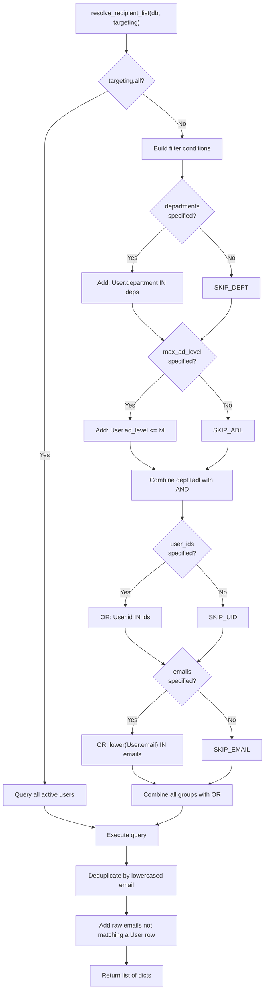

**Raw email handling:** When `targeting.emails` contains addresses that don't match any User row, they are included as recipient entries with `user_id=None`, `name=None`, `department=None`, `ad_level=None`. This allows broadcasting to external addresses.

---

## Worker Architecture

### Thread Pool Execution

The broadcast worker uses an in-process `ThreadPoolExecutor` with 8 worker threads. This design was chosen over a distributed task queue (RQ/Celery) because:

1. **No external dependency** — works without Redis as a job broker.
2. **Low latency** — no serialization/deserialization overhead.
3. **Sufficient throughput** — 8 concurrent SMTP connections handle the 5,000 recipient cap within minutes.

### Thread Safety

Each worker thread:
- Opens its **own `SessionLocal()`** database connection (closed in `finally`).
- Uses **atomic SQL `UPDATE ... SET col = col + 1`** for counter increments — no read-modify-write race.
- Uses a **conditional UPDATE** for broadcast finalization — only the worker whose UPDATE actually flips the status writes the completion audit row.

### Race-Safe Finalization

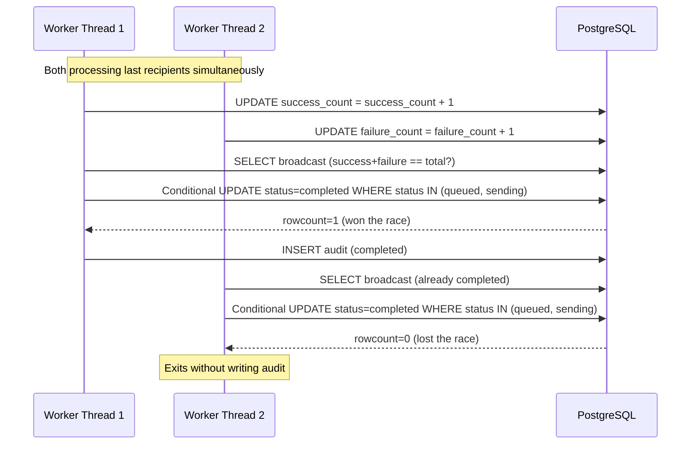

---

## Configuration

### Environment Variables

| Variable | Default | Description |
|----------|---------|-------------|
| `BROADCAST_ALLOWED_EMAILS` | *(empty)* | Comma-separated allowlist of authorized email addresses. **Fail-closed** if empty. |
| `BROADCAST_ATTACHMENT_DIR` | `/var/lib/ainxt/broadcast_attachments` | Filesystem directory for attachment storage. Created with mode 0700. |
| `BROADCAST_MAX_RECIPIENTS_PER_SEND` | `5000` | Maximum recipients per broadcast send. HTTP 413 if exceeded. |

### Attachment Constraints

| Constraint | Value |
|------------|-------|
| Allowed extensions | `pdf`, `docx`, `png`, `jpg`, `jpeg`, `txt`, `csv`, `xlsx` |
| Max file size | 25 MB (25 × 1024 × 1024 bytes) |
| Storage permissions | Directory: 0700, Files: 0600 |
| Validation | Extension allowlist + magic-bytes check via `FileValidator` |

See [shared_core](../reference/shared_core.md) for `FileValidator` documentation.

---

## Audit Trail

Every significant action is recorded in the `email_broadcast_audit_log` table as an append-only trail. Audit writes are best-effort (never raise to the caller).

| Action | Trigger | Detail JSON |
|--------|---------|-------------|
| `attachment_uploaded` | `POST /broadcast/attachments` | `{attachment_id, filename, size_bytes}` |
| `attachment_deleted` | `DELETE /broadcast/attachments/{id}` | `{attachment_id}` |
| `compliance_blocked` | `POST /broadcast/send` (compliance rejection) | `{label, subject_preview}` |
| `created` | `POST /broadcast/send` (success) | `{subject, total_count, enrich_name, attachment_ids}` |
| `queued` | `POST /broadcast/send` (after thread pool submission) | `{enqueued, total_count}` |
| `sent_one` | Worker thread (per recipient) | `{recipient_id, status, error}` |
| `completed` | Worker thread (finalization) | `{total_count, success_count, failure_count}` |
| `cancelled` | `POST /broadcast/{id}/cancel` | `{skipped}` |

---

## Dependencies

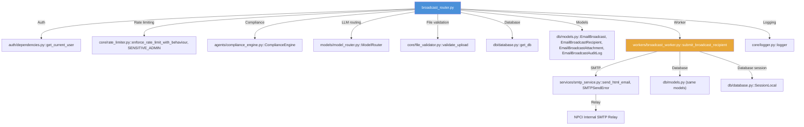

### Cross-Module References

| Dependency | Module | Documentation |
|------------|--------|----------------|
| `get_current_user` | `shared_core` → `authentication` | [shared_core](../reference/shared_core.md) |
| `enforce_rate_limit_with_behaviour`, `SENSITIVE_ADMIN` | `shared_core` → `core_infrastructure` | [shared_core](../reference/shared_core.md) |
| `ComplianceEngine` | `shared_core` → `agent_system` | [shared_core](../reference/shared_core.md) |
| `ModelRouter` | `shared_core` → `model_routing` | [shared_core](../reference/shared_core.md) |
| `validate_upload` | `shared_core` → `core_infrastructure` | [shared_core](../reference/shared_core.md) |
| `EmailBroadcast*` models | `shared_core` → `database` | [shared_core](../reference/shared_core.md) |
| `submit_broadcast_recipient`, `send_broadcast_recipient` | `workers` → `broadcast_coach_workers` | [workers](../workers/workers.md) |
| `send_html_email`, `SMTPSendError` | `shared_core` → `services` | [shared_core](../reference/shared_core.md) |
| `EmailBroadcast.jsx` (frontend) | `ai_ui_frontend` → `email_broadcast` | — |

---

## Frontend Integration

The broadcast feature is consumed by the `EmailBroadcast` component in the AI-UI frontend (`ai-ui/src/components/EmailBroadcast.jsx`). The typical user flow is:

1. **Access check** — The UI calls `GET /broadcast/access` on load. If `allowed=false`, the feature is hidden from the sidebar.
2. **Template generation** — User enters a plain-English intent; the UI calls `POST /broadcast/templates/suggest` to get an LLM-generated HTML template.
3. **Preview** — The UI calls `POST /broadcast/preview` to render the template with a sample name.
4. **Audience targeting** — User selects departments, AD levels, or specific users. The UI calls `POST /broadcast/recipients/resolve` to preview the audience size.
5. **Attachments** — User uploads files via `POST /broadcast/attachments`; the UI displays file chips and allows deletion via `DELETE /broadcast/attachments/{id}`.
6. **Send** — The UI calls `POST /broadcast/send` with the final subject, body, targeting, and attachment IDs.
7. **Monitoring** — The UI polls `GET /broadcast/{id}` to track progress (success/failure counts) and can cancel via `POST /broadcast/{id}/cancel`.
8. **History** — The UI lists past broadcasts via `GET /broadcast` and drills into details via `GET /broadcast/{id}` and `GET /broadcast/{id}/recipients`.

---

## Error Handling

| Scenario | HTTP Status | Behavior |
|----------|-------------|----------|
| Non-allowlisted user | 403 | `require_broadcast_user` raises before endpoint logic |
| Rate limit exceeded | 429 | `enforce_rate_limit_with_behaviour` raises with `Retry-After` header |
| Compliance blocked | 400 | `{error: "compliance_blocked", label, blocked_types}` + audit row |
| Zero recipients matched | 400 | `"Targeting matched zero recipients"` |
| Recipient count exceeds limit | 413 | `"Recipient count N exceeds BROADCAST_MAX_RECIPIENTS_PER_SEND limit (M)"` |
| Invalid attachment | 415 | `FileValidator` error message |
| Attachment linked to sent broadcast | 409 | `"Attachment is linked to an active or sent broadcast"` |
| Attachment linked to different broadcast | 409 | `"Attachment X is already linked to a different broadcast"` |
| Broadcast not found | 404 | `"Broadcast not found"` |
| Template generation failure | 502 | `"Template generation failed"` or `"Template generation returned empty output"` |
| Attachment storage unavailable | 500 | `"Attachment storage is not available"` or `"Could not persist attachment"` |
| Worker submit failure | — | Recipient marked `failed` inline; broadcast `failure_count` incremented |

### Fail-Open vs Fail-Closed

| Component | Failure Mode | Behavior |
|-----------|-------------|----------|
| Allowlist check | Env var empty | **Fail-closed** — access denied to all |
| Compliance engine | Exception during validation | **Fail-open** — logged as warning, request proceeds |
| Audit log write | DB exception | **Fail-open** — logged as warning, request proceeds (rollback attempted) |
| Rate limiter | Redis unavailable | **Fail-open** — falls back to in-process counter (configurable) |
| SMTP send | Transport failure | Returns `False`; recipient marked `failed` |
| SMTP relay refusal | `SMTPSendError` | Recipient marked `failed` with error text |
