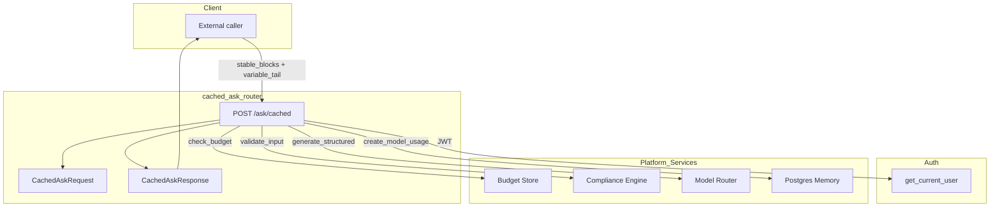
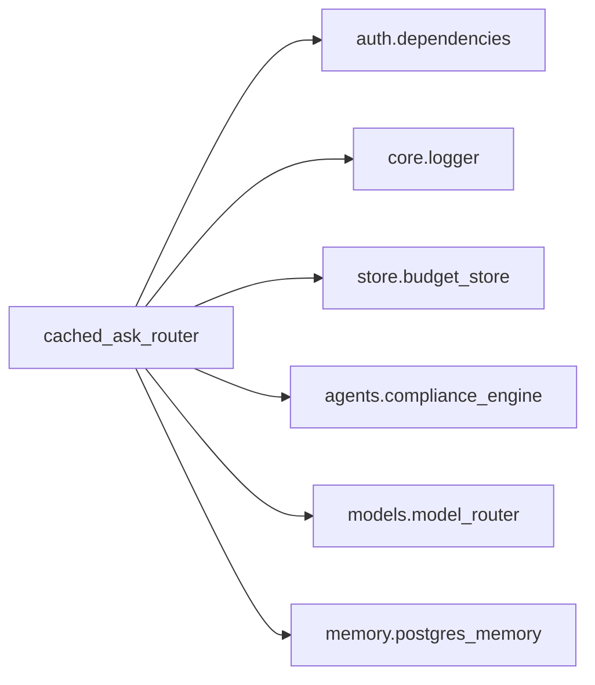
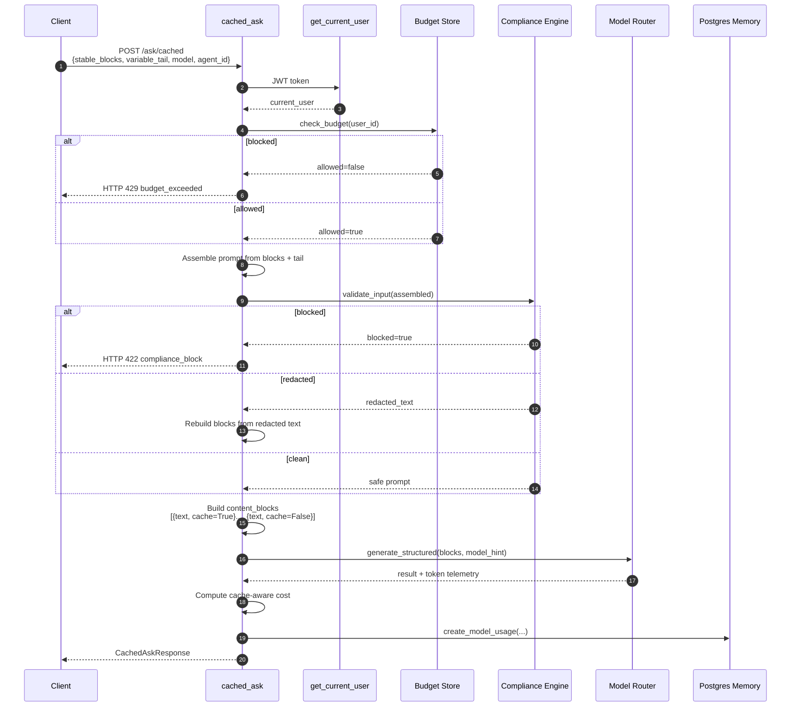

# cached_ask_router

## Brief Introduction

The `cached_ask_router` module exposes a single FastAPI endpoint, `POST /ask/cached`, that makes Anthropic's **block-level prompt caching** available to external callers through a structured JSON API. Callers split each prompt into two parts:

- **`stable_blocks`** — one to three long text blocks that stay identical across many calls. These are marked for caching and billed at a discount on cache reads.
- **`variable_tail`** — per-call content that changes every time and is never cached.

The router handles authentication, budget enforcement, compliance scanning, model routing, token telemetry, cost estimation, and usage persistence. It is designed for workloads where a large system prompt or context is reused repeatedly and only a small query changes between calls.

> **Claude-only:** Block-level prompt caching is an Anthropic-specific feature, so the router only accepts model hints that resolve to Claude models.

---

## Core Components

| Component | Type | Responsibility |
|-----------|------|----------------|
| `CachedAskRequest` | Pydantic model | Validates the incoming request: stable blocks, variable tail, model hint, and optional agent ID. |
| `cached_ask` | FastAPI route handler | Orchestrates the full cached-ask flow: budget gate → compliance → model call → telemetry → response. |
| `CachedAskResponse` | Pydantic model | Returns the model result plus token and cache telemetry. |

---

## Architecture



### Component Responsibilities

- **`CachedAskRequest`** enforces the Anthropic contract:
  - At least one stable block and at most three (Anthropic allows four cache breakpoints; one is reserved for tools).
  - Model hint must be one of `solution`, `complex`, or `haiku`.
- **`cached_ask`** is the orchestrator. It assembles the full prompt, runs guardrails, calls the model, computes cache-aware cost, and persists usage.
- **`CachedAskResponse`** surfaces the generated result along with `input_tokens`, `output_tokens`, `cache_read_tokens`, `cache_write_tokens`, `cost_usd`, `latency_ms`, and a `compliance_redacted` flag.

---

## Dependencies



| Dependency | Module | Purpose |
|------------|--------|---------|
| `get_current_user` | [auth.dependencies](../auth_dependencies.md) | JWT authentication and user identity extraction. |
| `logger` | [core.logger](../core_logger.md) | Structured logging for budget blocks, compliance blocks, model errors, and telemetry. |
| `check_budget` | [store.budget_store](../store_budget_store.md) | Pre-flight budget gate; returns `429` if the user has exhausted their allocation. |
| `compliance_engine.validate_input` | [agents.compliance_engine](../agents_compliance_engine.md) | Scans assembled input for restricted content (PCI/PII); can redact text before it reaches the model. |
| `model_router.generate_structured` | [models.model_router](../models_model_router.md) | Routes the content-blocks payload to a Claude model and returns the generated text. |
| `PostgresMemory.create_model_usage` | [memory.postgres_memory](../memory_postgres_memory.md) | Persists token usage, cost, latency, and cache telemetry for billing and analytics. |

---

## Data Flow



---

## Request / Response Schema

### `CachedAskRequest`

| Field | Type | Default | Description |
|-------|------|---------|-------------|
| `stable_blocks` | `list[str]` | required | 1–3 text blocks reused across calls. Each block should be ≥ 4,096 characters to be cached by Anthropic. |
| `variable_tail` | `str` | required | Per-call content appended after the stable blocks; never cached. |
| `model` | `str` | `"solution"` | Model hint. Must be one of `solution`, `complex`, `haiku`. |
| `agent_id` | `Optional[str]` | `None` | Optional agent identifier stored with usage records. |

### `CachedAskResponse`

| Field | Type | Description |
|-------|------|-------------|
| `result` | `str` | Generated text from the model. |
| `model_hint` | `str` | The model hint that was used. |
| `input_tokens` | `int` | Total input tokens consumed. |
| `output_tokens` | `int` | Total output tokens produced. |
| `cache_read_tokens` | `int` | Input tokens served from Anthropic's cache. |
| `cache_write_tokens` | `int` | Input tokens written to Anthropic's cache. |
| `cost_usd` | `float` | Estimated cost in US dollars, accounting for cache discounts and premiums. |
| `latency_ms` | `float` | Round-trip latency in milliseconds. |
| `compliance_redacted` | `bool` | True if the compliance engine redacted PII/PCI before sending to the model. |

---

## Process Flow

### 1. Authentication

The route depends on `get_current_user`, which validates the JWT and returns the user's identity. The user ID and email are extracted for budget, compliance, and audit logging.

### 2. Budget Gate

`check_budget(user_id)` is invoked. If the user has exceeded their budget, the endpoint returns `HTTP 429` with a `budget_exceeded` error. Budget-check failures are logged but fail open so that a transient store error does not block legitimate traffic.

### 3. Compliance Scan

The stable blocks and variable tail are joined into a single prompt and passed to `compliance_engine.validate_input`. If the input is blocked, the endpoint returns `HTTP 422` with the blocked finding types. If the engine redacts content, the redacted text replaces the original prompt. The response flag `compliance_redacted` tells the caller whether redaction occurred.

### 4. Cache Block Validation

The router warns (but does not reject) when a stable block is shorter than 4,096 characters, because Anthropic will not cache it. Callers are expected to pad or merge blocks to cross this threshold.

### 5. Model Call

The prompt is converted into Anthropic content blocks:

```json
[
  { "text": "<stable block 1>", "cache": true },
  { "text": "<stable block 2>", "cache": true },
  { "text": "<variable tail>",  "cache": false }
]
```

`model_router.generate_structured(blocks=..., model_hint=...)` routes the request to a Claude model.

### 6. Cost Calculation

The router uses a cache-aware cost formula based on Anthropic's Sonnet 4.6 pricing:

- Cache read tokens: 10% of base input cost
- Cache creation (write) tokens: 125% of base input cost
- Normal input tokens: 100% of base input cost
- Output tokens: standard output rate

### 7. Usage Persistence

Token counts, cost, latency, and cache telemetry are written via `PostgresMemory.create_model_usage`. Failures here are non-fatal and logged as warnings.

---

## Error Handling

| Scenario | HTTP Status | Detail |
|----------|-------------|--------|
| Invalid request schema | `422` | Pydantic validation error (e.g., wrong model hint, too many stable blocks). |
| Budget exhausted | `429` | `{"error": "budget_exceeded", "reason": "..."}` |
| Compliance block | `422` | `{"error": "compliance_block", "blocked_types": [...]}` |
| Model call failure | `502` | `{"detail": "Model call failed: ..."}` |

All non-blocking failures (budget check exception, compliance check exception, usage persistence exception) are logged and fail open to preserve availability.

---

## How It Fits into the System

`cached_ask_router` sits alongside the general chat and ask routers in the shared API layer. While [chat_router](chat_router.md) and [messages_compat_router](messages_compat_router.md) handle conversational or OpenAI-compatible traffic, `cached_ask_router` is optimized for a specific cost-saving pattern: reusing large stable contexts with small variable queries. It reuses the same platform guardrails (auth, budget, compliance) and the same model-routing infrastructure as the rest of the system, but adds Anthropic-specific cache semantics and telemetry.

Typical consumers include internal agents, tools, or front-end features that repeatedly ask questions against the same large document or system prompt.

---

## Related Modules

- [auth.dependencies](../auth_dependencies.md) — JWT authentication.
- [store.budget_store](../store_budget_store.md) — Budget enforcement.
- [agents.compliance_engine](../agents_compliance_engine.md) — Input compliance scanning and redaction.
- [models.model_router](../models_model_router.md) — Model selection and generation.
- [memory.postgres_memory](../memory_postgres_memory.md) — Usage persistence.
- [chat_router](chat_router.md) — General conversational ask/submit endpoints.
- [messages_compat_router](messages_compat_router.md) — OpenAI-compatible chat completions.
