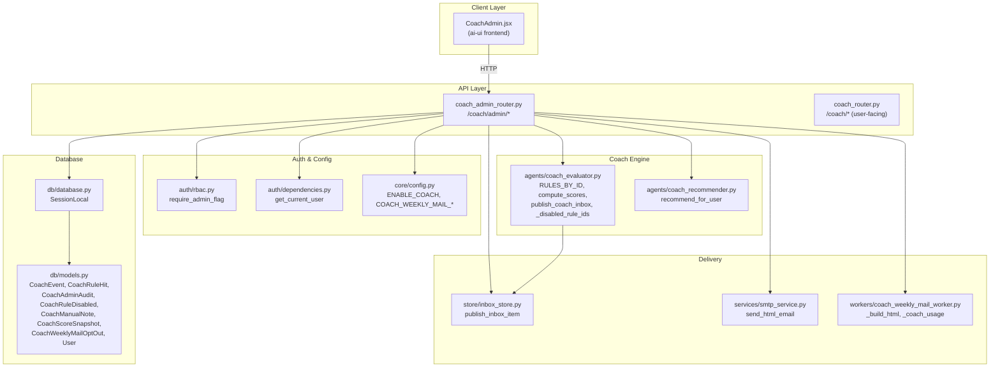
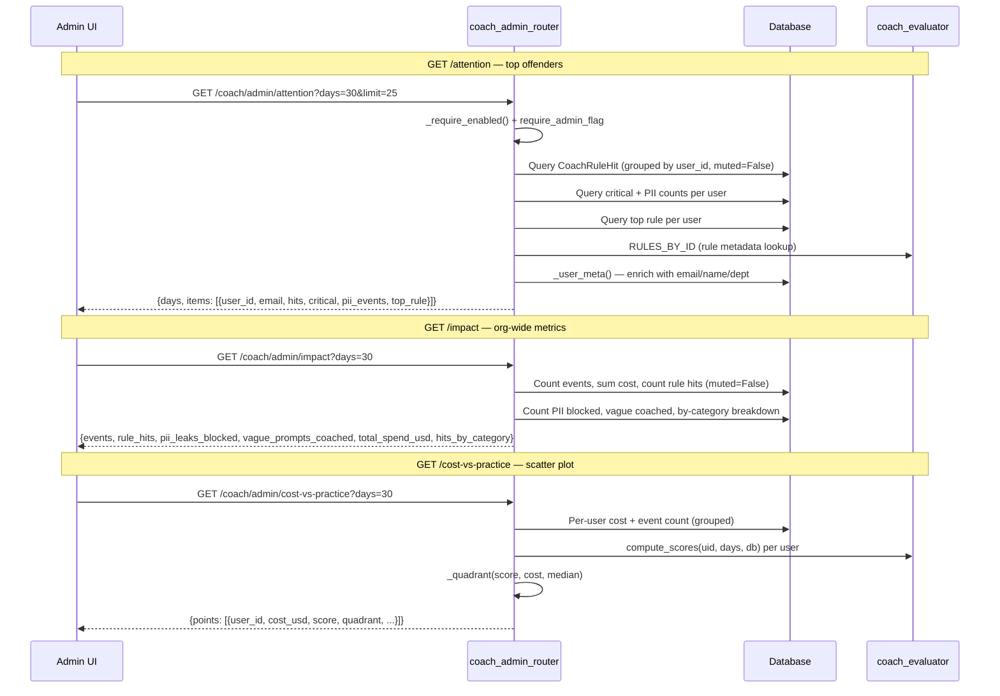
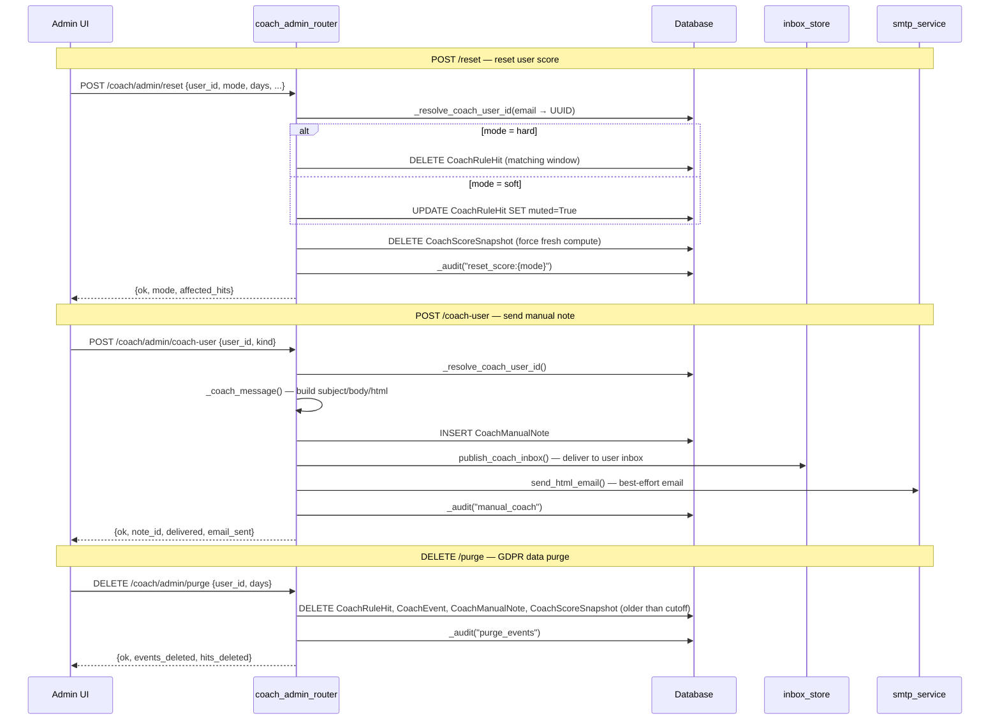
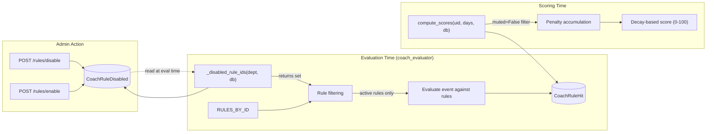
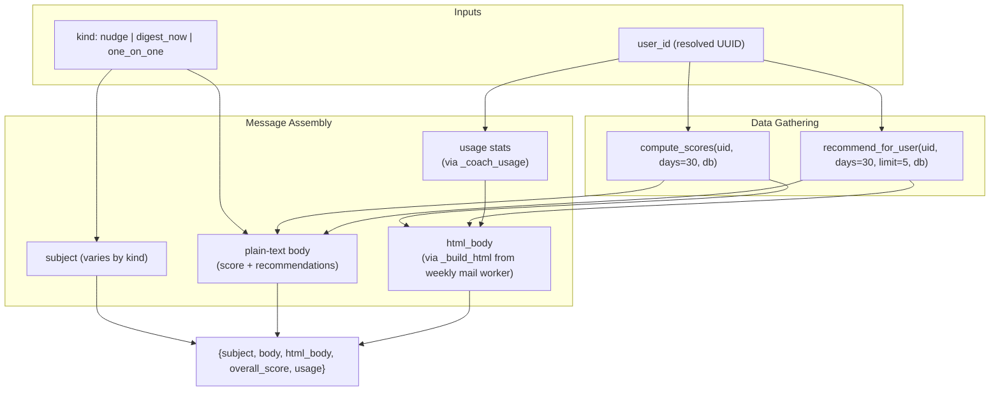
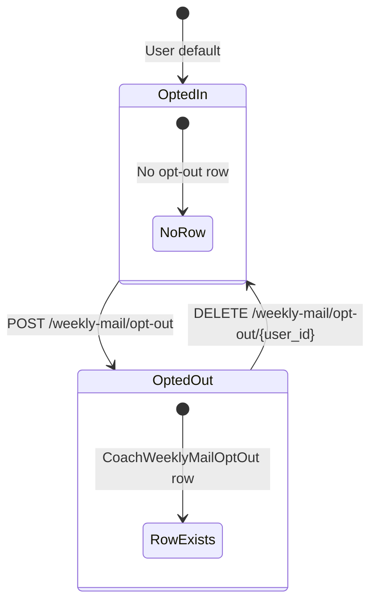
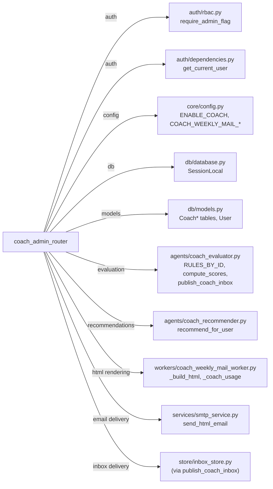

# Coach Admin Router

## Introduction

The `coach_admin_router` module provides the **admin console API** for the AiNxt Coach system. It exposes a set of FastAPI endpoints (prefixed `/coach/admin`) that allow platform administrators to monitor user coaching activity, manage coaching rules, send manual coaching notes, manage weekly digest mail opt-outs, and perform GDPR-compliant data purges — all behind a strict `require_admin_flag` authorization gate and an `ENABLE_COACH` feature flag.

Every mutation endpoint writes a `CoachAdminAudit` row, ensuring a complete, tamper-evident trail of admin actions. No raw user prompts are ever exposed through these endpoints; only aggregated metrics, scores, and rule-hit counts are returned.

This router is the administrative counterpart to the user-facing [coach_router](coach_router.md), which provides individual users with their own coaching dashboard, scores, and event explorer.

---

## Architecture Overview

### Key Design Principles

| Principle | Implementation |
|---|---|
| **Admin-only access** | Every route depends on `require_admin_flag`, which checks the JWT for an admin role claim. |
| **Feature-gated** | `_require_enabled()` raises HTTP 404 if `ENABLE_COACH` is `False`, making the entire router invisible when coaching is disabled. |
| **Full audit trail** | The `_audit()` helper writes a `CoachAdminAudit` row for every mutation (reset, purge, rule toggle, manual note, opt-out changes). |
| **No raw prompt exposure** | Admin endpoints return only aggregated counts, scores, and rule metadata — never decrypted user prompts. |
| **User identity resolution** | `_resolve_coach_user_id()` translates email addresses (commonly sent by the admin UI) to the canonical UUID stored in coach tables. |
| **Defensive error handling** | All DB sessions use `try/finally` for cleanup; audit writes and email delivery are best-effort and never break the main request flow. |

---

## Component Reference

### Request Models (Pydantic)

| Model | Purpose | Key Fields |
|---|---|---|
| `DisableRuleIn` | Disable a coaching rule (org-wide or per-department) | `rule_id`, `department` (None = org-wide), `reason` |
| `EnableRuleIn` | Re-enable a previously disabled rule | `rule_id`, `department` |
| `CoachUserIn` | Send a manual coaching note to a user | `user_id`, `kind` (`nudge` / `digest_now` / `one_on_one`), `subject`, `body` |
| `PreviewMessageIn` | Preview a coaching message before sending | `user_id`, `kind` |
| `ResetIn` | Reset a user's coach score (soft mute or hard delete) | `user_id`, `days`, `category`, `mode` (`soft` / `hard`), `reason` |
| `PurgeIn` | Purge a user's coach data for GDPR compliance | `user_id`, `days`, `reason` |
| `OptOutIn` | Opt a user out of weekly digest mail | `user_id`, `reason` |

### Internal Helpers

| Helper | Responsibility |
|---|---|
| `_require_enabled()` | Feature-flag guard — raises 404 if coaching is disabled. |
| `_uid(user)` | Extracts the actor's identity from the JWT (`sub` → `user_id` → `email`). |
| `_now()` / `_iso(dt)` | UTC timestamp utilities for consistent ISO-8601 formatting. |
| `_user_meta(db, user_ids)` | Batch-resolves user IDs (email or UUID) to `{email, name, department}` for response enrichment. |
| `_resolve_coach_user_id(db, user_id)` | Translates an email to the canonical UUID used in coach tables; passes UUIDs through unchanged. |
| `_audit(db, actor, action, ...)` | Writes a `CoachAdminAudit` row; never raises (failures are logged and rolled back). |
| `_coach_message(db, user_id, kind)` | Builds a coaching message (subject, plain body, HTML body) from the user's real scores and recommendations. Shared by preview and send endpoints. |
| `_quadrant(score, cost, cost_median)` | Classifies a user into a cost-vs-practice quadrant for the scatter plot. |

---

## Endpoint Catalog

### Monitoring & Analytics (Read-Only)

| Method | Path | Description |
|---|---|---|
| `GET` | `/coach/admin/attention` | Users with the most un-muted rule violations in the window, enriched with email/name, critical-hit count, PII-event count, and top rule. |
| `GET` | `/coach/admin/departments` | Distinct department names with coach activity — used to populate the admin UI's department filter dropdown. |
| `GET` | `/coach/admin/audit` | Admin audit trail (all mutations recorded by `_audit()`). |
| `GET` | `/coach/admin/impact` | Org-wide coaching impact: total events, rule hits, PII leaks blocked, vague prompts coached, total spend, and per-category hit breakdown. |
| `GET` | `/coach/admin/cost-vs-practice` | Per-user `(cost, practice-score)` scatter points, each tagged with a quadrant (`high_cost_low_practice`, `high_cost_good_practice`, `low_cost_low_practice`, `healthy`). |
| `GET` | `/coach/admin/rules/disabled` | List of all disabled rules (org-wide and per-department). |
| `GET` | `/coach/admin/notes/{user_id}` | Manual coaching notes previously sent to a user. |
| `GET` | `/coach/admin/weekly-mail/status` | Weekly mail configuration (enabled, weekday, time) and current opt-out count. |
| `GET` | `/coach/admin/weekly-mail/opt-outs` | List of users opted out of weekly digest mail, enriched with email/name. |

### Mutations

| Method | Path | Description |
|---|---|---|
| `POST` | `/coach/admin/reset` | Reset a user's score. **Soft** mode mutes matching rule hits (kept for audit, excluded from scoring). **Hard** mode permanently deletes them. Always purges score snapshots so the next `compute_scores` is fresh. |
| `DELETE` | `/coach/admin/purge` | GDPR right-to-erasure: deletes a user's coach events, rule hits, manual notes, and score snapshots older than `days`. |
| `POST` | `/coach/admin/rules/disable` | Disable a coaching rule org-wide (`department=None`) or for a specific department. Validates the rule exists in `RULES_BY_ID`. |
| `POST` | `/coach/admin/rules/enable` | Re-enable a previously disabled rule. Removes the `CoachRuleDisabled` row. |
| `POST` | `/coach/admin/coach-user` | Send a manual coaching note (`nudge`, `digest_now`, or `one_on_one`). Persists a `CoachManualNote`, delivers via the inbox system, and sends an HTML email best-effort. |
| `POST` | `/coach/admin/preview-message` | Render a draft coaching message (subject, plain body, HTML body) from the user's current scores and top recommendations — without sending anything. |
| `POST` | `/coach/admin/weekly-mail/opt-out` | Opt a user out of the weekly digest mail. Idempotent (returns `already_opted_out` if already opted out). |
| `DELETE` | `/coach/admin/weekly-mail/opt-out/{user_id}` | Opt a user back into the weekly digest mail. |

---

## Data Flow: Rule Lifecycle

The admin router interacts with the coach evaluation pipeline to manage which rules are active. The diagram below shows how disabled rules propagate from admin actions through to evaluation:

### Rule Disable/Enable Flow

1. **Admin disables a rule** → a `CoachRuleDisabled` row is inserted with `rule_id`, `department` (None for org-wide), `reason`, and `disabled_by`.
2. **At evaluation time**, `coach_evaluator._disabled_rule_ids(department, db)` reads all `CoachRuleDisabled` rows and returns the set of rule IDs that are disabled org-wide (`department IS NULL`) or for the given department.
3. **Disabled rules are skipped** during event evaluation — no new `CoachRuleHit` rows are created for them.
4. **Admin re-enables a rule** → the `CoachRuleDisabled` row is deleted, and the rule resumes firing on subsequent events.

### Score Reset Flow

1. **Soft reset** → matching `CoachRuleHit` rows are updated to `muted=True`. They remain in the database for audit but are excluded from `compute_scores` (which filters `muted=False`).
2. **Hard reset** → matching `CoachRuleHit` rows are permanently deleted.
3. **Both modes** delete all `CoachScoreSnapshot` rows for the user, forcing the next `compute_scores` call to recompute from scratch.

---

## Coaching Message Generation

The `_coach_message()` helper is the shared engine behind both the preview and send endpoints. It produces three output formats from a user's real data:

| Kind | Subject | Content |
|---|---|---|
| `nudge` | "A quick AiNxt coaching tip" | Single top recommendation (or "no recurring issues" message). |
| `one_on_one` | "Your AiNxt coaching note" | Overall score + numbered list of up to 5 action items. |
| `digest_now` | "Your AiNxt practice summary" | Overall score, event count, and numbered list of top opportunities. |

The HTML body is generated by `workers.coach_weekly_mail_worker._build_html()`, the same renderer used for the automated weekly digest — ensuring visual consistency between manual and automated coaching communications.

---

## Weekly Mail Management

The admin router provides full lifecycle management for the weekly digest mail opt-out list:

The `GET /weekly-mail/status` endpoint returns the mail schedule configuration from `core/config.py`:

| Config | Source | Description |
|---|---|---|
| `COACH_WEEKLY_MAIL_ENABLED` | `core/config.py` | Master toggle for weekly digest mail. |
| `COACH_WEEKLY_MAIL_WEEKDAY` | `core/config.py` | Day of week (0=Monday). |
| `COACH_WEEKLY_MAIL_HOUR_IST` | `core/config.py` | Hour in IST (0-23). |
| `COACH_WEEKLY_MAIL_MIN_IST` | `core/config.py` | Minute (0-59). |

---

## Database Models

The router interacts with the following models from [db/models.py](../storage/database.md):

| Model | Role in Admin Router |
|---|---|
| `CoachEvent` | Source of usage/cost data for impact metrics and cost-vs-practice scatter. Purged by GDPR endpoint. |
| `CoachRuleHit` | Rule violation records. Queried for attention list, impact counts. Muted/deleted by reset. Purged by GDPR. |
| `CoachAdminAudit` | Written by `_audit()` for every mutation. Read by the audit endpoint. |
| `CoachRuleDisabled` | Records disabled rules (org-wide or per-department). Managed by enable/disable endpoints. |
| `CoachManualNote` | Manual coaching notes sent by admins. Created by coach-user endpoint, read by notes endpoint. Purged by GDPR. |
| `CoachScoreSnapshot` | Cached score snapshots. Deleted by reset (force fresh compute) and purge. |
| `CoachWeeklyMailOptOut` | Weekly digest opt-out records. Managed by opt-out/opt-in endpoints. |
| `User` | Used for email↔UUID resolution and user metadata enrichment. |

---

## Dependencies

### External Module References

| Module | Documentation | Usage |
|---|---|---|
| `auth/rbac.py` | [Authentication](../security/authentication.md) | `require_admin_flag` dependency for all routes. |
| `core/config.py` | [Core Infrastructure](../infrastructure/core_infrastructure.md) | Feature flags and weekly mail schedule config. |
| `db/models.py` | [Database](../storage/database.md) | All Coach-related ORM models. |
| `agents/coach_evaluator.py` | [Coach System](../evaluation/coach_system.md) | Rule registry, score computation, inbox publishing. |
| `agents/coach_recommender.py` | [Coach System](../evaluation/coach_system.md) | Personalized recommendation generation. |
| `routers/coach_router.py` | [Coach Router](coach_router.md) | User-facing counterpart (dashboard, events, rules). |
| `workers/coach_weekly_mail_worker.py` | [Workers](../workers/worker_orchestration.md) | HTML template rendering for coaching messages. |
| `services/smtp_service.py` | [Services](../reference/services.md) | HTML email delivery for manual coaching notes. |
| `store/inbox_store.py` | [Store Layer](../storage/store_layer.md) | Inbox item publishing for coaching note delivery. |

---

## Security Considerations

1. **Authorization**: Every endpoint requires `require_admin_flag`, which validates the JWT contains an admin role. No endpoint is accessible to non-admin users.
2. **Feature gating**: `_require_enabled()` returns HTTP 404 (not 403) when coaching is disabled, preventing information leakage about the feature's existence.
3. **No prompt exposure**: Unlike the user-facing [coach_router](coach_router.md) (which decrypts and truncates prompts for the event explorer), the admin router never accesses `prompt_redacted` — it only queries aggregate counts and scores.
4. **Audit immutability**: `_audit()` writes are committed independently; if the main transaction fails, the audit row may still persist (or be rolled back with the transaction). The helper never raises, ensuring audit failures don't mask the actual operation result.
5. **GDPR compliance**: The purge endpoint deletes all coach-related data for a user older than the specified cutoff, satisfying right-to-erasure requirements. The audit row recording the purge action is retained.
6. **User identity safety**: `_resolve_coach_user_id()` ensures that admin actions target the correct user even when the admin UI sends an email address instead of a UUID, preventing cross-user data manipulation.

---

## Frontend Integration

The response shapes are explicitly aligned with `ai-ui/src/components/CoachAdmin.jsx`. Key mappings:

| Endpoint | Frontend Component | UI Element |
|---|---|---|
| `GET /attention` | `AttentionCard` | Table of top offenders with critical/PII badges |
| `GET /impact` | `ImpactCard` / `StatTile` | Org-wide metric tiles + category breakdown |
| `GET /cost-vs-practice` | `CostVsPracticeCard` | Scatter plot with quadrant coloring |
| `GET /audit` | `AuditCard` | Admin action history table |
| `POST /reset` | `ResetCard` | Soft/hard reset form |
| `DELETE /purge` | `PurgeCard` | GDPR purge form |
| `POST /rules/disable` / `enable` | `RulesCard` | Rule toggle switches |
| `GET /rules/disabled` | `RulesCard` | Disabled rules list |
| `POST /coach-user` | `ManualCoachCard` | Manual note composer |
| `POST /preview-message` | `PlaygroundCard` | Message preview before sending |
| `GET /notes/{user_id}` | `ManualCoachCard` | Sent notes history |
| `GET /weekly-mail/status` | `WeeklyMailCard` | Mail config display |
| `POST/DELETE /weekly-mail/opt-out` | `WeeklyMailCard` | Opt-out management |
| `GET /weekly-mail/opt-outs` | `WeeklyMailCard` | Opt-out list |
