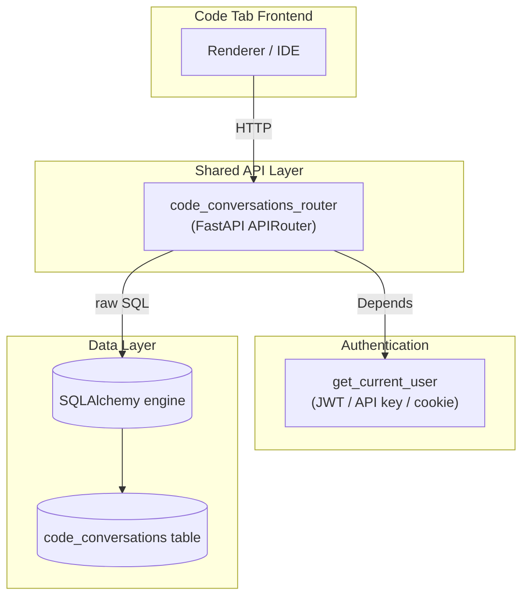
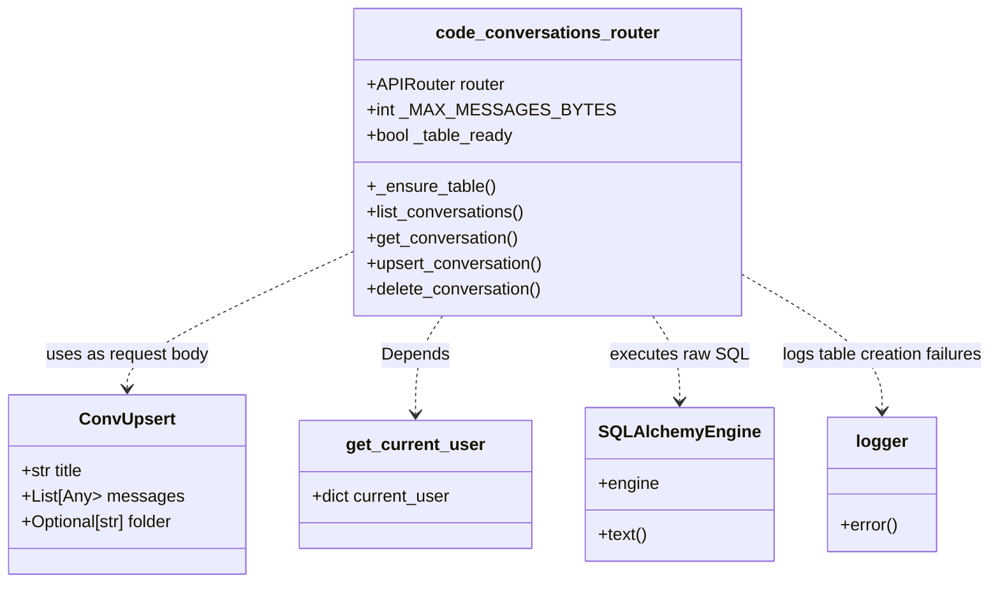
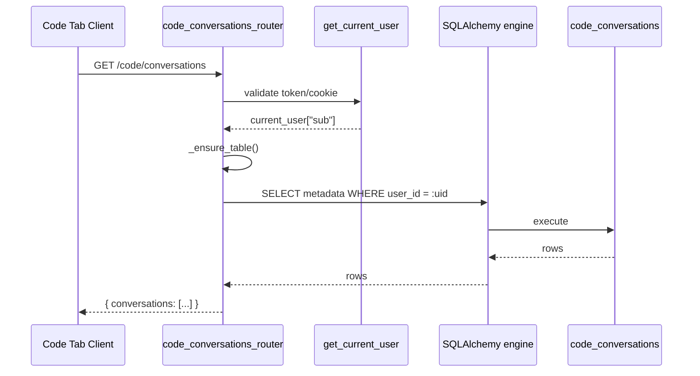
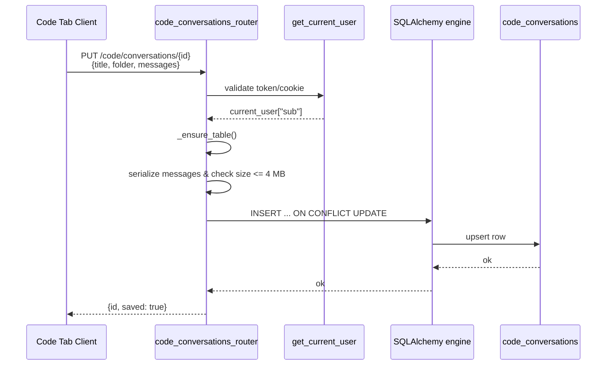
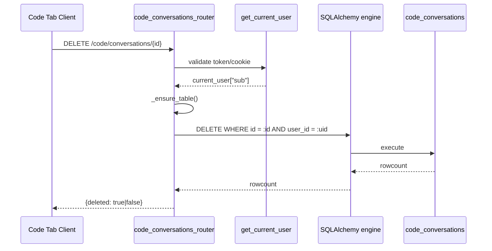
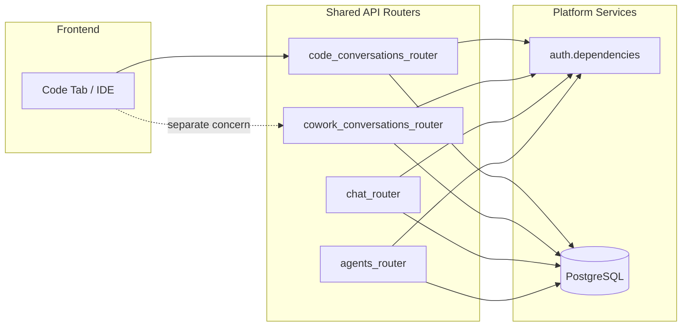

# code_conversations_router

## Brief Introduction

The `code_conversations_router` module provides a small, server-persisted REST API for the **Code tab** task/session history. Previously, Code tab sessions lived in browser `localStorage` and were lost on app restart. This router stores them durably in a dedicated PostgreSQL table (`code_conversations`), scoped to the authenticated user (`JWT sub`) and an optional project folder, enabling multi-device access and recovery across restarts.

The module intentionally keeps Code task sessions **separate** from cowork/buddy chat conversations (managed by [`cowork_conversations_router`](cowork_conversations_router.md)) to avoid mixing code-generation contexts with general chat history.

---

## Core Functionality

| Endpoint | Method | Purpose |
|----------|--------|---------|
| `/code/conversations` | `GET` | List the caller's Code sessions (metadata only), newest first. |
| `/code/conversations/{id}` | `GET` | Fetch a single session including its full message array. |
| `/code/conversations/{id}` | `PUT` | Create or update a session (title, folder, messages). Idempotent by `(id, user_id)`. |
| `/code/conversations/{id}` | `DELETE` | Delete a session owned by the caller. |

Key behaviors:

- **Schema-less messages**: the renderer's message-block array is stored verbatim as `JSONB`.
- **Lightweight metadata list**: listing returns only `id`, `title`, `folder`, and timestamps; messages are fetched on demand.
- **Size guardrail**: a single session's serialized messages are capped at ~4 MB to prevent runaway storage.
- **Self-healing schema**: the table and index are created idempotently on first access, so the Code tab works even if the global migration has not been run.

---

## Architecture



The router is a standard FastAPI `APIRouter` mounted under `/code`. It does not use an ORM model; instead it executes raw SQL through the shared SQLAlchemy `engine` imported from [`db.database`](../db_database.md). Authentication is delegated to [`auth.dependencies.get_current_user`](../auth_dependencies.md), which accepts JWT bearer tokens, API keys, or `auth_token` cookies.

---

## Component Relationships



### Components

- **`ConvUpsert`** — Pydantic request model for `PUT /code/conversations/{id}`. Carries `title`, `messages`, and optional `folder`.
- **`list_conversations`** — Returns metadata rows for the authenticated user, ordered by `created_at DESC`.
- **`get_conversation`** — Returns one session including its `messages` JSONB payload; returns HTTP 404 if not found.
- **`upsert_conversation`** — Inserts or updates a row using Postgres `ON CONFLICT (id, user_id) DO UPDATE`. Enforces the 4 MB message cap.
- **`delete_conversation`** — Deletes the row matching `(conv_id, user_id)` and reports whether anything was removed.
- **`_ensure_table`** — Idempotently creates the `code_conversations` table and a supporting index on first access.

---

## Data Flow

### Listing Sessions



### Saving a Session



### Deleting a Session



---

## Database Schema

```sql
CREATE TABLE IF NOT EXISTS code_conversations (
    id          TEXT NOT NULL,
    user_id     TEXT NOT NULL,
    folder      TEXT,
    title       TEXT,
    messages    JSONB DEFAULT '[]'::jsonb,
    created_at  TIMESTAMPTZ DEFAULT NOW(),
    updated_at  TIMESTAMPTZ DEFAULT NOW(),
    PRIMARY KEY (id, user_id)
);

CREATE INDEX IF NOT EXISTS idx_code_conv_user
    ON code_conversations (user_id, updated_at DESC);
```

- **Primary key** is composite `(id, user_id)`, so a user can only touch their own rows and session IDs need only be unique per user.
- **`folder`** allows the renderer to group sessions by project folder.
- **`messages`** is `JSONB` and stores the renderer's message-block array verbatim.
- **Index** supports fast per-user listing ordered by recency.

---

## How It Fits into the Overall System

The `code_conversations_router` sits in the **shared API routers** layer and is mounted into the main FastAPI application alongside many other domain routers (chat, agents, workflows, cowork, etc.). It is the persistence backend for the **Code tab** experience in the AI UI frontend and IDE integrations.



It is deliberately **not** part of the cowork/chat conversation subsystem. The comment in the source explicitly calls this out: Code task sessions are kept in their own table so they never mix with Buddy chats. If you are looking for buddy/cowork conversation persistence, see [`cowork_conversations_router`](cowork_conversations_router.md).

---

## Dependencies

| Dependency | Module | Role |
|------------|--------|------|
| `get_current_user` | [`auth.dependencies`](../auth_dependencies.md) | Resolves JWT, API key, or cookie into a user dict containing `sub`. |
| `engine` | [`db.database`](../db_database.md) | Shared SQLAlchemy engine used to run raw SQL. |
| `logger` | [`core.logger`](../core_logger.md) | Logs failures during idempotent table creation. |

---

## Error Handling & Guardrails

- **401 Unauthorized**: returned by `get_current_user` for missing/invalid tokens.
- **404 Not Found**: returned by `get_conversation` when no row matches `(conv_id, user_id)`.
- **413 Payload Too Large**: returned by `upsert_conversation` when serialized messages exceed `_MAX_MESSAGES_BYTES` (~4 MB).
- **500 Internal Server Error**: returned if the upsert SQL execution fails; the exception string is surfaced in the detail.
- **Table creation failures** are caught and logged rather than raised, so a transient DDL issue does not crash the request path (subsequent SQL may still fail, but the error is explicit).

---

## Related Modules

- [`cowork_conversations_router`](cowork_conversations_router.md) — similar API shape but for cowork/buddy chat sessions; intentionally separate data and table.
- [`chat_router`](chat_router.md) — general chat history, artifacts, and message management.
- [`auth_dependencies`](../auth_dependencies.md) — authentication/authorization resolution.
- [`db_database`](../db_database.md) — database engine and session management.
- [`core_logger`](../core_logger.md) — structured logging utilities.
