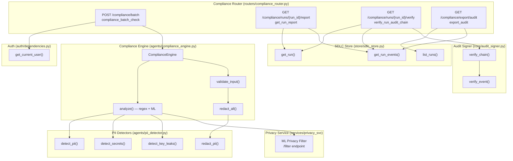
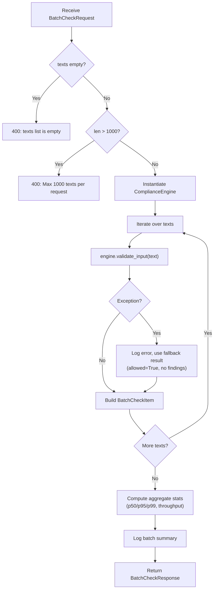
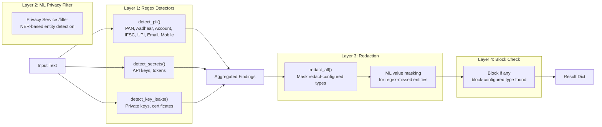
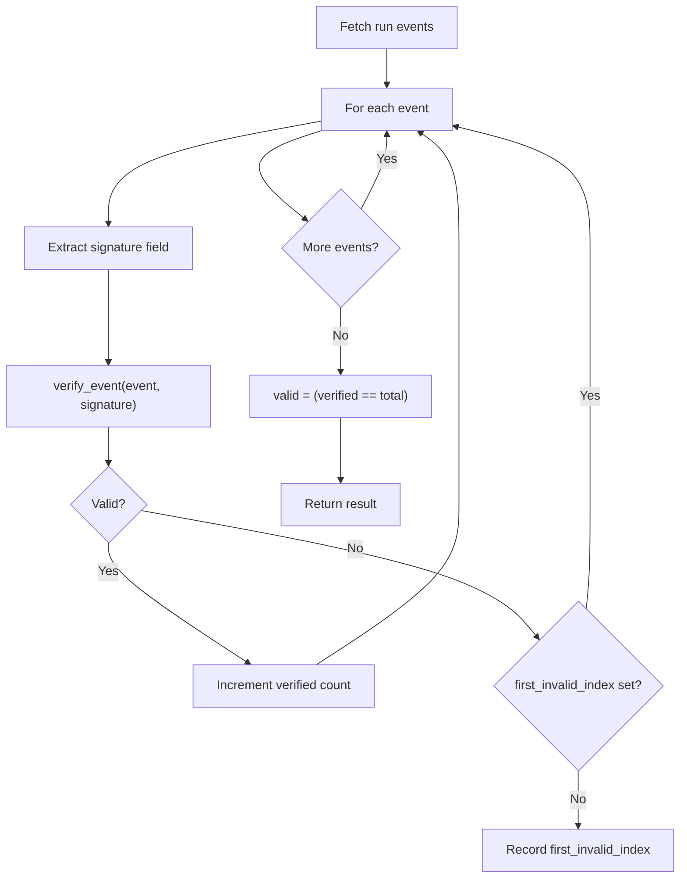
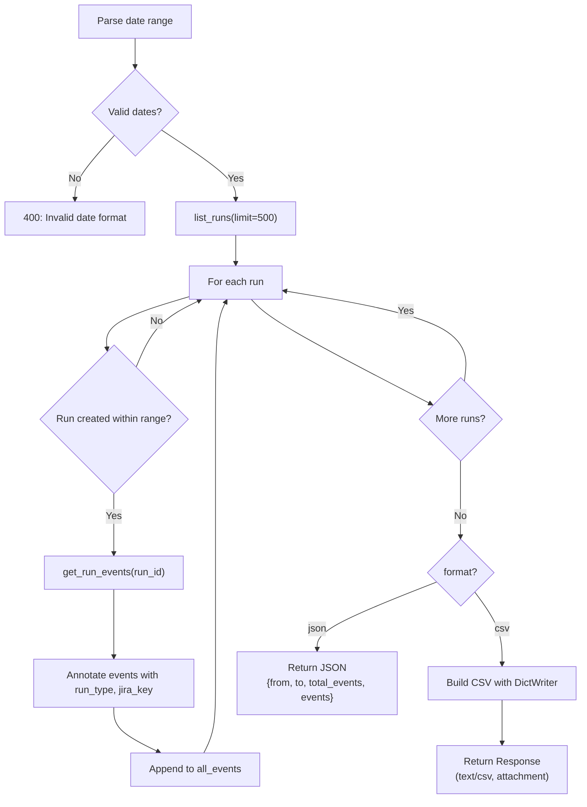
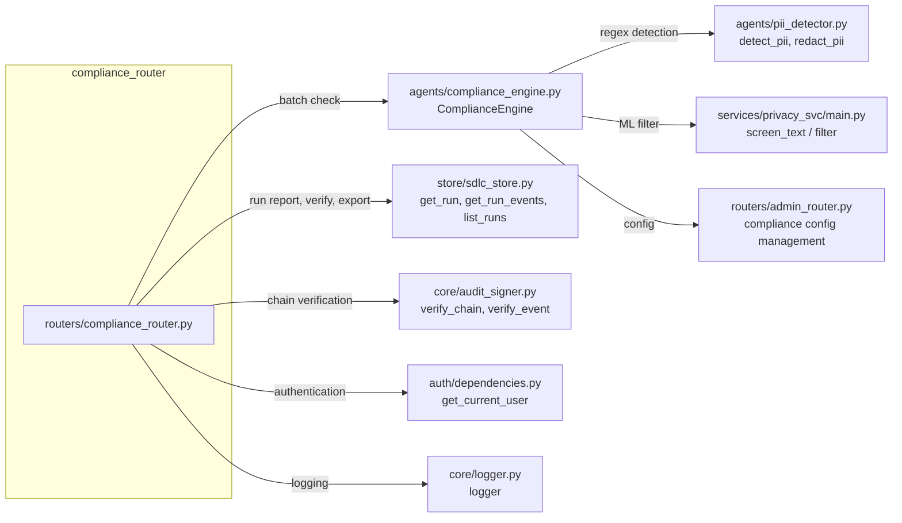
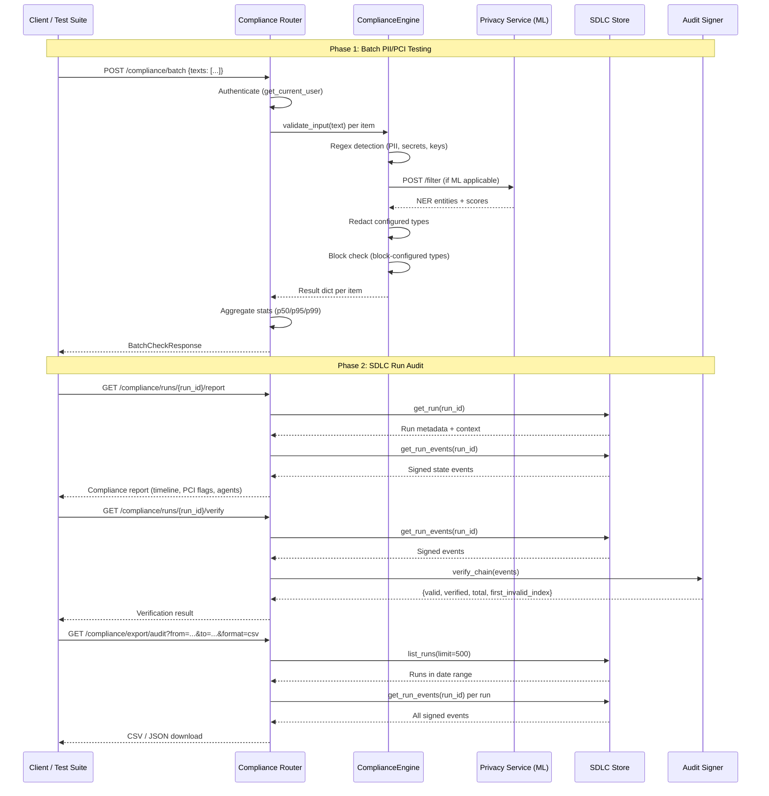

# Compliance Router

## Overview

The **Compliance Router** (`routers/compliance_router.py`) is a FastAPI APIRouter module that exposes endpoints for **PII/PCI batch compliance testing**, **SDLC run audit report generation**, **cryptographic audit-chain verification**, and **signed audit event export**. It serves as the primary HTTP surface for compliance officers, security teams, and automated regression pipelines to validate that sensitive data is properly detected, redacted, or blocked before reaching any LLM, and to verify the integrity of the SDLC pipeline's tamper-evident event log.

The router is mounted under the `/compliance` prefix and requires authentication for batch checks. It bridges two distinct compliance domains:

1. **Input/Output Compliance** — batch PII/PCI detection and redaction testing via the `ComplianceEngine`.
2. **SDLC Audit Integrity** — signed event chain verification and audit export for SDLC pipeline runs.

---

## Architecture



---

## Endpoints

### 1. POST `/compliance/batch` — Batch PII/PCI Compliance Check

**Handler:** `compliance_batch_check(req: BatchCheckRequest, current_user)`

Runs the full compliance pipeline (regex detectors + optional ML privacy filter) on up to **1,000 input texts** and returns per-item findings, redacted output, and aggregate latency statistics — **without calling any LLM**. Designed for bulk PII/PCI regression testing.

#### Request Model

```python
class BatchCheckRequest(BaseModel):
    texts: List[str]   # 1–1000 items
```

#### Authentication

Requires `get_current_user` dependency (JWT bearer token). The caller's email is included in the audit log.

#### Processing Flow



#### Per-Item Result (`BatchCheckItem`)

| Field | Type | Description |
|---|---|---|
| `index` | `int` | Position in the input list |
| `original` | `str` | The raw user input |
| `prompt_to_model` | `str` | What would actually be sent to the LLM (redacted if applicable) |
| `pii_detected` | `bool` | `True` if any PII was found (blocked or redacted) |
| `allowed` | `bool` | `True` = request proceeds; `False` = rejected (403 in production) |
| `blocked` | `bool` | `True` = rejected entirely due to block-configured type |
| `was_redacted` | `bool` | `True` = PII found and masked in `prompt_to_model` |
| `redacted_types` | `List[str]` | Which PII types were masked (e.g. `["PAN", "AADHAAR"]`) |
| `findings` | `List[dict]` | Full detection details (regex + ML) |
| `total_latency_ms` | `float` | Wall-clock time for the full compliance check |
| `privacy_svc_latency_ms` | `float` | HTTP round-trip to privacy service (0 if not called) |
| `ml_called` | `bool` | Whether the ML privacy filter was invoked |

#### Aggregate Response (`BatchCheckResponse`)

| Field | Type | Description |
|---|---|---|
| `total` | `int` | Total texts processed |
| `pii_detected` | `int` | Inputs where PII was found |
| `blocked` | `int` | Inputs rejected entirely |
| `redacted` | `int` | Inputs allowed but with PII masked |
| `clean` | `int` | Inputs with no PII detected |
| `ml_called_count` | `int` | How many inputs triggered the ML privacy filter |
| `avg_latency_ms` | `float` | Average total compliance time per input |
| `p50_latency_ms` | `float` | 50th percentile latency |
| `p95_latency_ms` | `float` | 95th percentile latency |
| `p99_latency_ms` | `float` | 99th percentile latency |
| `max_latency_ms` | `float` | Maximum latency observed |
| `ml_avg_latency_ms` | `float` | Average ML privacy service latency (only when ML was called) |
| `ml_p95_latency_ms` | `float` | 95th percentile ML latency |
| `ml_p99_latency_ms` | `float` | 99th percentile ML latency |
| `throughput_rps` | `float` | Texts per second for this batch |
| `results` | `List[BatchCheckItem]` | Per-item results |

#### ComplianceEngine Pipeline

The `ComplianceEngine.validate_input()` method (see [agent_system](../agents/agent_system.md) for full details) executes a multi-layer pipeline:



> **Note:** The ML privacy filter is skipped when (a) `PRIVACY_SVC_URL` is not set, (b) the text is pure code, or (c) a regex detector already found a block-configured type (the request will be rejected regardless). See [privacy_service](../security/privacy_service.md) for ML filter details.

---

### 2. GET `/compliance/runs/{run_id}/report` — SDLC Run Compliance Report

**Handler:** `get_run_report(run_id: str)`

Returns a comprehensive compliance report for a specific SDLC pipeline run, including the state transition timeline, signed events, PCI flags, and code review outcome.

#### Response Structure

```json
{
  "report_version": "1.0",
  "generated_at": "2024-01-15T10:30:00",
  "run": {
    "id": "...",
    "type": "feature|bug|pr_review|governance",
    "jira_key": "PROJ-123",
    "jira_summary": "...",
    "state": "coding|review|merged",
    "repo": "...",
    "branch": "...",
    "pr_number": 42,
    "pr_url": "...",
    "confluence_url": "...",
    "triggered_by": "...",
    "created_at": "..."
  },
  "agents": ["agent_name_1", "agent_name_2"],
  "state_timeline": [
    {
      "from_state": "...",
      "to_state": "...",
      "stage": "...",
      "actor": "...",
      "timestamp": "...",
      "signed": true
    }
  ],
  "signed_events": [...],
  "pci_flags": [...],
  "code_review": "...",
  "total_events": 15,
  "signed_events_count": 15
}
```

#### Data Sources

| Data | Source | Description |
|---|---|---|
| Run metadata | `store.sdlc_store.get_run(run_id)` | Run type, Jira key, repo, branch, PR links, state |
| State events | `store.sdlc_store.get_run_events(run_id)` | Ordered state transitions with signatures |
| PCI flags | `run.context.pci_flags` | PCI compliance flags from run context |
| Code review | `run.context.code_review_outcome` | Code review result from run context |
| Agents | Derived from event actors | Unique set of actors across all events |

> **404:** Returns `404 Run {run_id} not found` if the run does not exist.

---

### 3. GET `/compliance/runs/{run_id}/verify` — Audit Chain Verification

**Handler:** `verify_run_audit_chain(run_id: str)`

Verifies the **cryptographic signature chain** for all events in an SDLC run. Each state transition event is signed at creation time; this endpoint validates that no event has been tampered with after the fact.

#### Response Structure

```json
{
  "valid": true,
  "total": 15,
  "verified": 15,
  "first_invalid_index": null,
  "run_id": "...",
  "total_events": 15
}
```

#### Verification Logic

The `core.audit_signer.verify_chain()` function iterates over all events and calls `verify_event()` on each:



| Field | Type | Description |
|---|---|---|
| `valid` | `bool` | `True` iff all events verified successfully |
| `total` | `int` | Total number of events |
| `verified` | `int` | Number of events with valid signatures |
| `first_invalid_index` | `int \| null` | Index of the first event that failed verification (0-based) |
| `run_id` | `str` | The run ID being verified |
| `total_events` | `int` | Total events (redundant with `total` for convenience) |

> **404:** Returns `404 Run {run_id} not found` if the run does not exist.

---

### 4. GET `/compliance/export/audit` — Audit Event Export

**Handler:** `export_audit(from_date, to_date, format)`

Exports signed audit events across all SDLC runs filtered by a date range. Supports both **JSON** and **CSV** output formats.

#### Query Parameters

| Parameter | Type | Default | Description |
|---|---|---|---|
| `from_date` | `str` (optional) | 30 days ago | ISO date `YYYY-MM-DD` (inclusive) |
| `to_date` | `str` (optional) | Today | ISO date `YYYY-MM-DD` (inclusive) |
| `format` | `str` | `json` | Output format: `json` or `csv` |

#### Processing Flow



#### CSV Export Fields

When `format=csv`, the following columns are exported:

| Column | Description |
|---|---|
| `id` | Event ID |
| `run_id` | Associated run ID |
| `run_type` | Run type (feature, bug, pr_review, governance) |
| `jira_key` | Jira ticket key |
| `from_state` | Previous state |
| `to_state` | New state |
| `stage` | Pipeline stage |
| `actor` | Agent or user that triggered the transition |
| `output` | Event output/payload |
| `created_at` | Event timestamp |
| `signature` | Cryptographic signature |

The CSV response includes a `Content-Disposition` header for download:
```
attachment; filename="audit_{from_date}_{to_date}.csv"
```

#### JSON Response

```json
{
  "from": "2024-01-01",
  "to": "2024-01-15",
  "total_events": 342,
  "events": [...]
}
```

---

## Dependencies

### Internal Dependencies



| Dependency | Module | Purpose |
|---|---|---|
| `ComplianceEngine` | [agent_system](../agents/agent_system.md) | Multi-layer PII/PCI detection (regex + ML) and redaction/blocking |
| `get_run`, `get_run_events`, `list_runs` | `store/sdlc_store.py` | SDLC run and event persistence (Postgres with in-process fallback) |
| `verify_chain`, `verify_event` | `core/audit_signer.py` | Cryptographic signature verification for tamper-evident audit logs |
| `get_current_user` | [authentication](../security/authentication.md) | JWT-based authentication for batch endpoint |
| `logger` | [core_infrastructure](../infrastructure/core_infrastructure.md) | Structured logging |

### Related Modules

| Module | Relationship |
|---|---|
| [admin_router](admin_router.md) | Manages compliance configuration (`get_compliance_config`, `patch_compliance_config`, `reload_compliance_config`, `reset_compliance_config`) that the `ComplianceEngine` reads at runtime |
| [compliance_scan_router](compliance_scan_router.md) | Separate router for security scanning (`scan`, `scan_image`) — complementary to PII/PCI compliance |
| [sdlc_router](sdlc_router.md) | Creates and manages the SDLC runs whose audit data this router reports on |
| [audit_router](audit_router.md) | General audit log listing and graph audit verification |
| [governance_router](governance_router.md) | Entity-level governance (approval, promotion, deprecation) — distinct from run-level compliance |
| [messages_compat_router](messages_compat_router.md) | Uses `ComplianceEngine` at runtime via `_compliance_check()` for every chat message |
| [privacy_service](../security/privacy_service.md) | The ML-based NER privacy filter service called by `ComplianceEngine` when `PRIVACY_SVC_URL` is set |

---

## Data Flow: End-to-End Compliance Lifecycle



---

## Configuration

The `ComplianceEngine` reads its configuration from (in priority order):

1. **`COMPLIANCE_CONFIG` env var** — JSON string overriding all defaults
2. **Config file** at `_CONFIG_PATH` — persisted JSON with type definitions
3. **Built-in defaults** (`_DEFAULT_CONFIG`)

Each PII type is configured with:
- `enabled`: `bool` — whether the type is actively detected
- `action`: `"redact"` | `"block"` | `"off"` — what to do when detected

| Action | Behavior |
|---|---|
| `redact` | Mask the value in the prompt; allow the request to proceed |
| `block` | Reject the request entirely (403 in production) |
| `off` | Disable detection for this type |

Configuration is managed at runtime via the [admin_router](admin_router.md) endpoints (`patch_compliance_config`, `reload_compliance_config`, `reset_compliance_config`).

### Environment Variables

| Variable | Purpose |
|---|---|
| `PRIVACY_SVC_URL` | URL of the ML privacy filter service (e.g. `http://localhost:8004`). If unset, only regex detection runs. |
| `COMPLIANCE_CONFIG` | JSON string overriding the compliance config file |
| `COMPLIANCE_AUDIT_LOG` | Path to a JSONL file for persisting every compliance check result (for offline validation) |

---

## Error Handling

| Scenario | HTTP Status | Response |
|---|---|---|
| Empty `texts` list in batch request | `400` | `{"detail": "texts list is empty"}` |
| More than 1000 texts in batch request | `400` | `{"detail": "Max 1000 texts per request"}` |
| Invalid date format in export | `400` | `{"detail": "Invalid date format. Use YYYY-MM-DD."}` |
| Run not found (report/verify) | `404` | `{"detail": "Run {run_id} not found"}` |
| Per-item exception in batch | — | Item uses fallback result (`allowed=True`, no findings); error logged |

The batch endpoint is designed to be **resilient**: if `validate_input()` throws for any individual text, the error is logged and a safe fallback result is used, ensuring the batch always completes.

---

## Security Considerations

- **Authentication required**: The batch endpoint requires a valid JWT token via `get_current_user`. The run report, verify, and export endpoints are currently unauthenticated (intended for internal/admin use).
- **No raw PII in audit logs**: The `ComplianceEngine` audit log (when `COMPLIANCE_AUDIT_LOG` is set) persists only the **redacted** text and **masked** finding values (first 2 + last 2 characters).
- **Tamper-evident audit chain**: SDLC run events are cryptographically signed at creation time. The `verify_run_audit_chain` endpoint detects any post-hoc modification by validating each event's signature.
- **No LLM calls**: The batch endpoint explicitly does **not** call any LLM — it only runs the compliance detection pipeline, making it safe for regression testing with real PII data.
