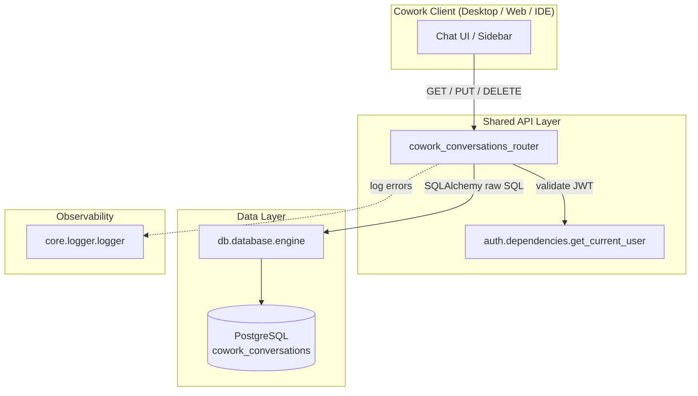
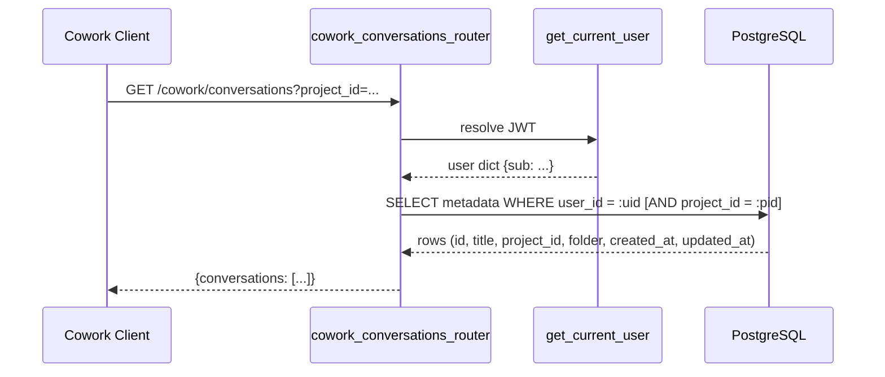
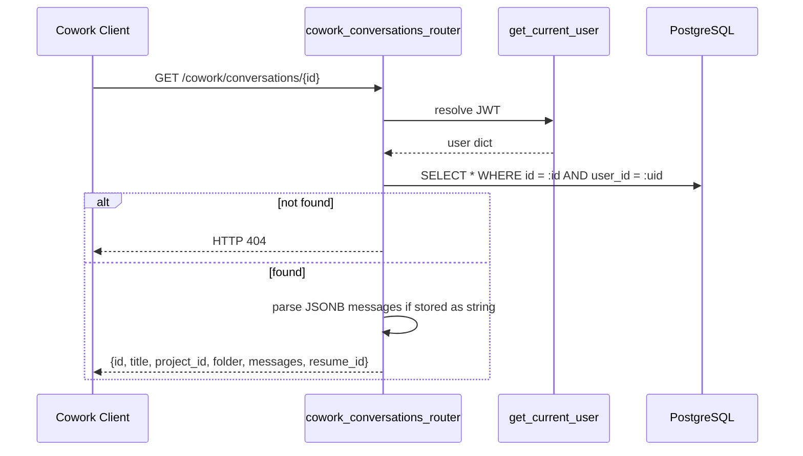
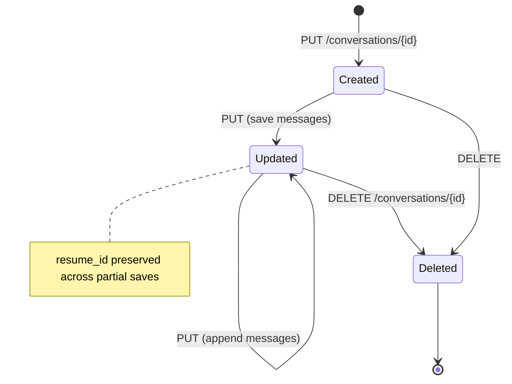
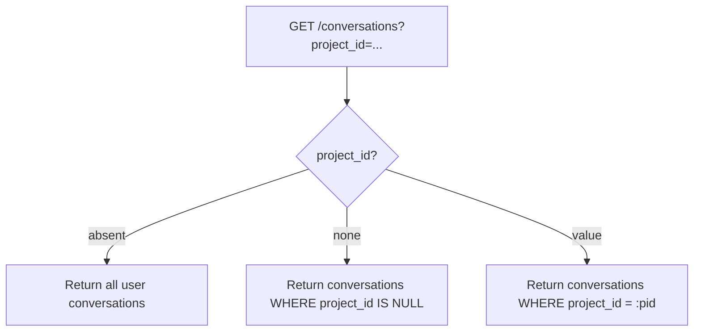

# Cowork Conversations Router

## Brief Introduction

The `cowork_conversations_router` module provides a small, server-persisted REST API for **Cowork chat history**. Previously, this state lived in the renderer's `localStorage`; it has been moved to the `cowork_conversations` PostgreSQL table so that conversation history becomes **durable, multi-device, and optionally project-scoped**. The router is scoped to the authenticated user's JWT `sub` claim and exposes standard CRUD endpoints for listing, fetching, saving, and deleting conversations.

This module is part of the broader **Cowork** subsystem, which includes project management, task dispatch, role administration, usage tracking, and desktop integration. For details on those areas, see the linked module documentation below.

---

## Core Functionality

| Endpoint | Method | Purpose |
|----------|--------|---------|
| `/cowork/conversations` | `GET` | List the caller's conversations (metadata only), newest first. Optional `project_id` filter. |
| `/cowork/conversations/{id}` | `GET` | Fetch a single conversation including its full message array. |
| `/cowork/conversations/{id}` | `PUT` | Create or update a conversation (title, messages, project link, folder, resume token). |
| `/cowork/conversations/{id}` | `DELETE` | Delete a conversation owned by the caller. |

### Key Behaviors

- **User isolation**: every row is keyed by `user_id = current_user["sub"]`.
- **Project scoping**: conversations may optionally reference a project via `project_id`; the list endpoint supports `project_id=none` to retrieve unlinked conversations.
- **Message storage**: the renderer's message-block array is stored verbatim as JSONB.
- **Resume continuity**: an optional `resume_id` preserves an in-progress agent/Buddy session across navigation or app restarts. It is never overwritten by a save that omits it (`COALESCE(EXCLUDED.resume_id, cowork_conversations.resume_id)`).
- **Size guardrail**: conversations whose serialized messages exceed ~4 MB are rejected with HTTP `413`.
- **Idempotent upsert**: `PUT` uses PostgreSQL `ON CONFLICT (id, user_id) DO UPDATE`.

---

## Architecture



### Component Responsibilities

| Component | Responsibility |
|-----------|----------------|
| `APIRouter(prefix="/cowork")` | Groups Cowork-related routes under a common path and OpenAPI tag. |
| `get_current_user` | Dependency from [`auth_router.md`](auth_router.md) that resolves the JWT into a user dictionary. |
| `ConvUpsert` | Pydantic request model for conversation upserts. |
| `_db()` | Lazy import helper that returns the SQLAlchemy engine and `text` constructor to avoid circular imports at module load time. |
| `core.logger.logger` | Structured logger from [`core/logger.md`](../core_logger.md) used for error diagnostics. |
| `cowork_conversations` table | PostgreSQL table storing conversation metadata and JSONB messages. |

---

## Data Model

### `ConvUpsert` (Request Body)

```python
class ConvUpsert(BaseModel):
    title:      str           # Conversation title, truncated to 200 chars on save
    messages:   List[Any]     # Renderer message blocks, stored as JSONB
    project_id: Optional[str] # Optional project linkage
    folder:     Optional[str] # Optional folder/organization label
    resume_id:  Optional[str] # Optional agent session resume token
```

### `cowork_conversations` Table (Logical Schema)

| Column | Type | Notes |
|--------|------|-------|
| `id` | `TEXT` | Conversation identifier supplied by the client. |
| `user_id` | `TEXT` | JWT `sub`; part of the unique key `(id, user_id)`. |
| `project_id` | `TEXT?` | Optional foreign-style reference to a Cowork project. |
| `folder` | `TEXT?` | Optional grouping label. |
| `title` | `TEXT` | Display title. |
| `messages` | `JSONB` | Full message array. |
| `resume_id` | `TEXT?` | Agent session token; preserved across partial saves. |
| `created_at` / `updated_at` | `TIMESTAMP` | Creation and last-modified timestamps. |

---

## Data Flow

### Listing Conversations



### Saving a Conversation

```mermaid
sequenceDiagram
    participant C as Cowork Client
    participant R as cowork_conversations_router
    participant A as get_current_user
    participant DB as PostgreSQL

    C->>R: PUT /cowork/conversations/{id} {title, messages, project_id, resume_id}
    R->>A: resolve JWT
    A-->>R: user dict
    R->>R: serialize messages to JSON; check 4 MB limit
    alt too large
        R-->>C: HTTP 413
    else valid
        R->>DB: INSERT ... ON CONFLICT (id, user_id) DO UPDATE
        DB-->>R: row saved
        R-->>C: {id, saved: true}
    end
```

### Fetching a Conversation



---

## Dependencies

### Direct Dependencies

| Dependency | Module Doc | Role |
|------------|------------|------|
| `get_current_user` | [`auth_router.md`](auth_router.md) | JWT authentication dependency. |
| `logger` | [`core_logger.md`](../core_logger.md) | Structured logging for error paths. |
| `db.database.engine` | [`db/database.md`](../db_database.md) | SQLAlchemy engine for raw PostgreSQL queries. |

### Related Cowork Modules

| Module | Doc | Relationship |
|--------|-----|--------------|
| `cowork_projects_router` | [`cowork_projects_router.md`](cowork_projects_router.md) | Conversations can be scoped to a Cowork project via `project_id`. |
| `cowork_tasks_router` | [`cowork_tasks_router.md`](cowork_tasks_router.md) | Task history and approvals may reference conversation context. |
| `cowork_dispatch_router` | [`cowork_dispatch_router.md`](cowork_dispatch_router.md) | Dispatch results can be linked to or discussed in conversations. |
| `cowork_usage_router` | [`cowork_usage_router.md`](cowork_usage_router.md) | Tracks usage (including computer-use sessions) associated with Cowork activity. |
| `cowork_admin_router` | [`cowork_admin_router.md`](cowork_admin_router.md) | Manages Cowork roles and marketplace settings that may affect chat behavior. |
| `desktop_router` | [`desktop_router.md`](desktop_router.md) | Desktop app registers workspaces and MCP tools; conversations may reference desktop sessions. |

---

## Process Flows

### Conversation Lifecycle



### Project Scoping Filter Logic



---

## Error Handling & Guardrails

| Scenario | HTTP Status | Detail |
|----------|-------------|--------|
| Conversation not found on `GET` | `404` | `"Conversation not found"` |
| Serialized messages exceed 4 MB | `413` | `"Conversation too large to save"` |
| Database failure during upsert | `500` | Exception message string |
| Delete of non-existent conversation | `200` | `{deleted: false}` |

The 4 MB cap (`_MAX_MESSAGES_BYTES`) protects the JSONB column from unbounded growth and keeps read/write latency predictable.

---

## How It Fits Into the System

The `cowork_conversations_router` is one of several routers mounted under the shared API that together implement the **Cowork** experience. It specifically owns the persistence layer for chat history, allowing Cowork clients (desktop app, web UI, IDE plugin) to:

1. Render a fast sidebar list without loading full message bodies.
2. Restore a full chat thread on selection.
3. Keep history durable across devices and sessions.
4. Resume interrupted agent/Buddy sessions via `resume_id`.
5. Organize chats by project and folder.

It intentionally remains thin: authentication is delegated to [`auth_router.md`](auth_router.md), database access to [`db/database.md`](../db_database.md), and project/task semantics to sibling Cowork routers. This keeps the module focused on a single concern: **server-side conversation storage**.
