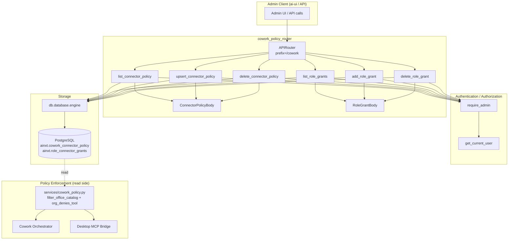
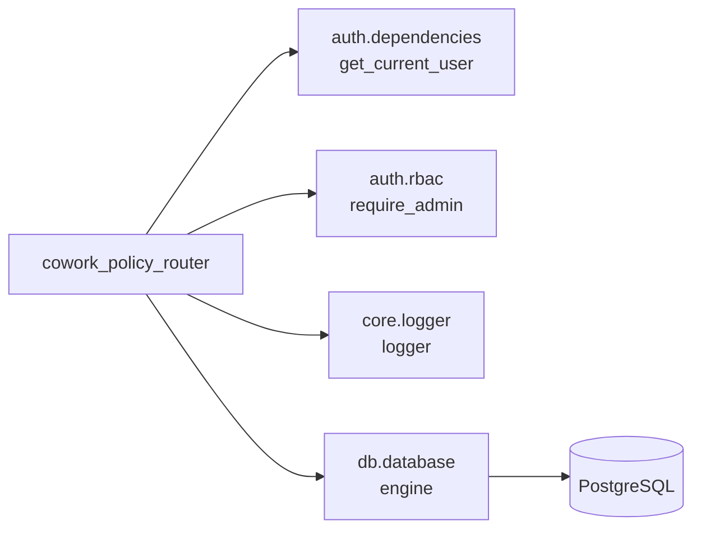
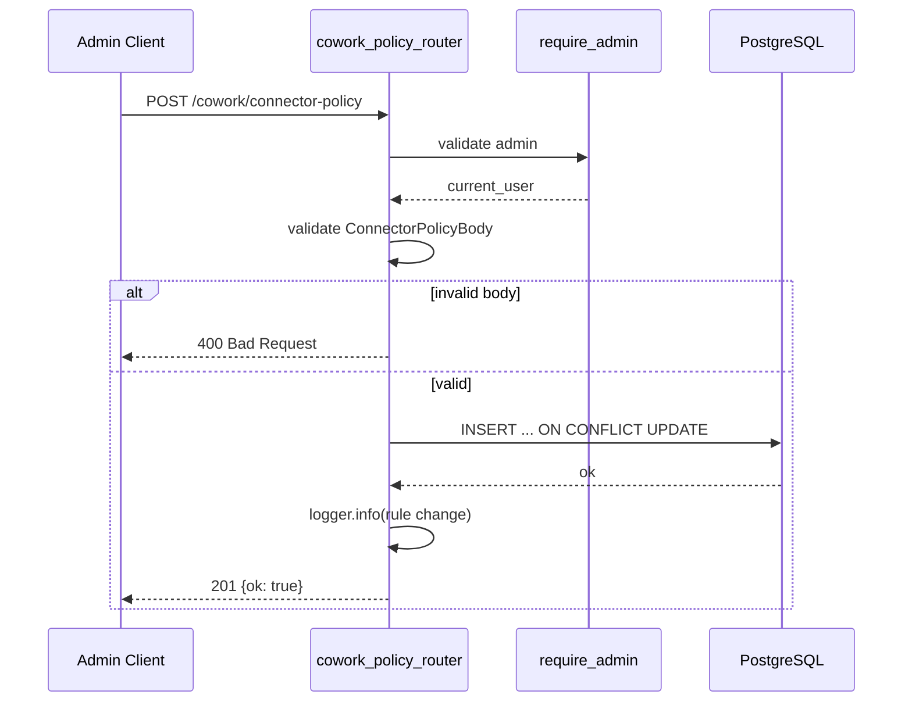
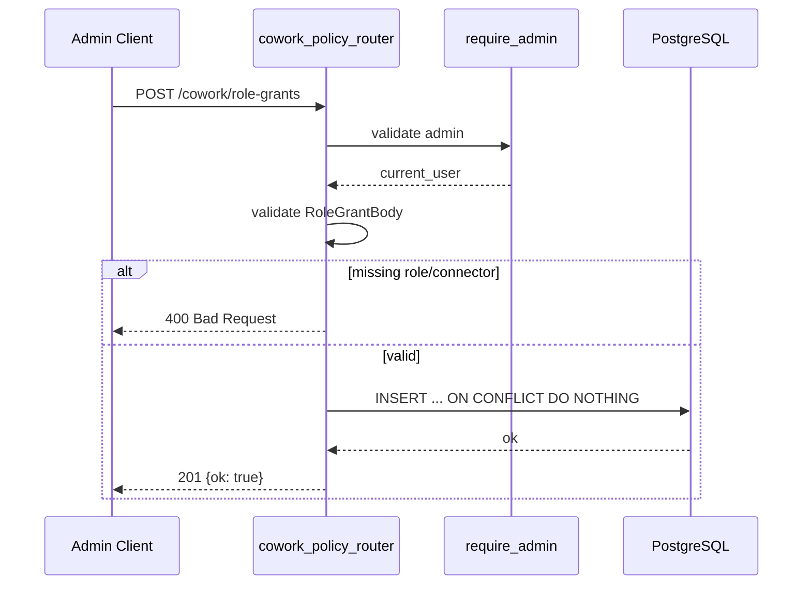
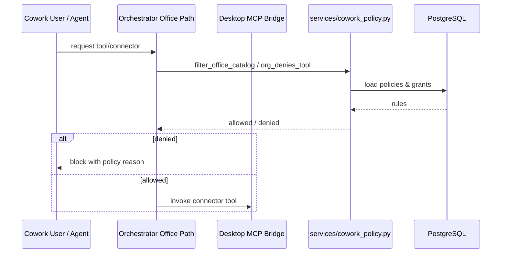
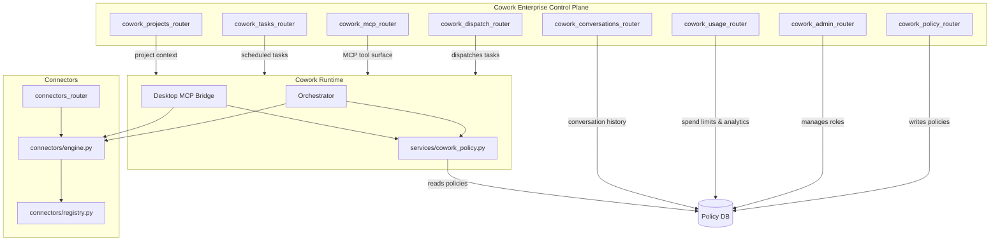

# cowork_policy_router

## Brief Introduction

The `cowork_policy_router` module is the **administrative control surface** for Cowork Enterprise connector governance. It exposes FastAPI endpoints that let administrators manage two complementary policy layers:

1. **Connector policy rules** — org-wide or department-scoped allow/deny decisions for individual connectors or specific tools within a connector.
2. **Role → connector grants** — an allowlist that restricts which connectors a given Cowork role may access.

These rules are **written** through this router and **enforced** elsewhere in the platform (notably the Cowork orchestrator office path and the desktop MCP bridge, which consult `services/cowork_policy.py`). Spend limits and usage analytics are handled separately by [`cowork_usage_router.md`](cowork_usage_router.md).

All endpoints in this router are **admin-only**; every route depends on `require_admin` from [`auth_rbac.md`](../auth_rbac.md).

---

## Core Components

| Component | Type | Responsibility |
|-----------|------|----------------|
| `ConnectorPolicyBody` | Pydantic model | Validates a connector policy rule: `department`, `connector`, `tool`, `allow`. |
| `RoleGrantBody` | Pydantic model | Validates a role grant: `role`, `connector_name`. |
| `list_connector_policy` | GET handler | Returns allow/deny rules, optionally filtered by department. |
| `upsert_connector_policy` | POST handler | Creates or updates a rule keyed by `(department, connector, tool)`. |
| `delete_connector_policy` | DELETE handler | Removes a rule by its primary key. |
| `list_role_grants` | GET handler | Returns all role-to-connector allowlist entries. |
| `add_role_grant` | POST handler | Adds a new role grant, ignoring duplicates. |
| `delete_role_grant` | DELETE handler | Removes a role grant by its primary key. |

---

## Architecture

---

## Data Model

The router persists policy data in two PostgreSQL tables under the `ainxt` schema.

### `ainxt.cowork_connector_policy`

| Column | Meaning |
|--------|---------|
| `id` | Primary key. |
| `department` | Target department; empty string / `NULL` means org-wide. |
| `connector` | Connector identifier (e.g., `microsoft365`, `jira`). |
| `tool` | Tool identifier; `*` means the entire connector. |
| `allow` | `true` = allow, `false` = deny. Deny wins by precedence in the enforcement layer. |
| `created_by` | Admin user who created the rule. |
| `created_at` / `updated_at` | Timestamps. |

Unique constraint: `(department, connector, tool)`.

### `ainxt.role_connector_grants`

| Column | Meaning |
|--------|---------|
| `id` | Primary key. |
| `role` | Cowork role name. |
| `connector_name` | Connector the role is allowed to use. |
| `created_by` | Admin user who created the grant. |
| `created_at` | Timestamp. |

Unique constraint: `(role, connector_name)`. A role with **no** grants is unrestricted.

---

## API Endpoints

| Method | Path | Description | Auth |
|--------|------|-------------|------|
| `GET` | `/cowork/connector-policy` | List connector policy rules. | Admin |
| `POST` | `/cowork/connector-policy` | Upsert a connector policy rule. | Admin |
| `DELETE` | `/cowork/connector-policy/{rule_id}` | Delete a connector policy rule. | Admin |
| `GET` | `/cowork/role-grants` | List role → connector grants. | Admin |
| `POST` | `/cowork/role-grants` | Add a role → connector grant. | Admin |
| `DELETE` | `/cowork/role-grants/{grant_id}` | Delete a role → connector grant. | Admin |

### Connector Policy Semantics

- `department = ""` (or `NULL` on read) represents an **org-wide** rule.
- `tool = "*"` applies to the **whole connector**.
- The enforcement layer resolves conflicts; deny rules generally take precedence over allow rules. See `services/cowork_policy.py` for the exact `_org_decision` logic.
- Upserts use `ON CONFLICT (department, connector, tool)` so the same scope cannot have two rows; the latest write wins.

### Role Grant Semantics

- Each row grants one role access to one connector.
- If a role has **any** grants, it is restricted to only those connectors.
- If a role has **no** grants, it is unrestricted (backward-compatible default).
- Inserts use `ON CONFLICT DO NOTHING` to make the operation idempotent.

---

## Dependencies

- [`auth.dependencies.md`](../auth_dependencies.md) — extracts the current user from the request.
- [`auth.rbac.md`](../auth.rbac.md) — enforces the admin requirement on every route.
- [`core.logger.md`](../core_logger.md) — structured logging for policy changes.
- [`db.database.md`](../db_database.md) — SQLAlchemy engine for raw SQL access.

---

## Data Flow

### Creating a Connector Policy Rule

### Creating a Role Grant

### Policy Enforcement (read side)

---

## How It Fits into the System

The `cowork_policy_router` is one of several routers that together implement the Cowork Enterprise control plane:

- [`cowork_admin_router.md`](cowork_admin_router.md) — manages Cowork roles, notes, preferences, and marketplace publishing. The roles defined there are the same roles referenced by `role_connector_grants`.
- [`cowork_usage_router.md`](cowork_usage_router.md) — records usage, sets spend limits, and provides analytics for Cowork activity.
- [`cowork_mcp_router.md`](cowork_mcp_router.md) — exposes Cowork tools over the Model Context Protocol; enforcement of connector policy happens before tools are invoked.
- [`cowork_dispatch_router.md`](cowork_dispatch_router.md) — dispatches Cowork tasks to available workers.
- [`connectors_router.md`](connectors_router.md) — defines connectors, permissions, and OAuth flows. The `connector` / `connector_name` values used in policy rules must match connector definitions managed there.
- [`auth_rbac.md`](../auth_rbac.md) — provides the `require_admin` dependency used by every endpoint in this router.

---

## Security & Governance Notes

- **Admin-only access**: Every endpoint requires `require_admin`, ensuring only platform administrators can alter connector governance.
- **Audit logging**: `upsert_connector_policy` writes an `INFO`-level log entry recording the connector, tool, allow/deny decision, department scope, and acting admin.
- **Deny precedence**: The write side stores the raw `allow` flag; the read-side enforcement layer (`services/cowork_policy.py`) is responsible for resolving precedence when multiple rules match.
- **Org-wide vs. department**: The router normalizes empty/blank departments to `''` before storage so PostgreSQL unique constraints can deduplicate org-wide rules correctly (Postgres treats `NULL` values as distinct).
- **Backward compatibility**: Roles with no grants remain unrestricted, so existing deployments are not broken when the grants table is empty.

---

## Related Documentation

- [`cowork_admin_router.md`](cowork_admin_router.md)
- [`cowork_usage_router.md`](cowork_usage_router.md)
- [`cowork_mcp_router.md`](cowork_mcp_router.md)
- [`cowork_dispatch_router.md`](cowork_dispatch_router.md)
- [`cowork_tasks_router.md`](cowork_tasks_router.md)
- [`cowork_projects_router.md`](cowork_projects_router.md)
- [`cowork_conversations_router.md`](cowork_conversations_router.md)
- [`connectors_router.md`](connectors_router.md)
- [`auth_rbac.md`](../auth_rbac.md)
- [`auth_dependencies.md`](../auth_dependencies.md)
- [`core_logger.md`](../core_logger.md)
- [`db_database.md`](../db_database.md)
