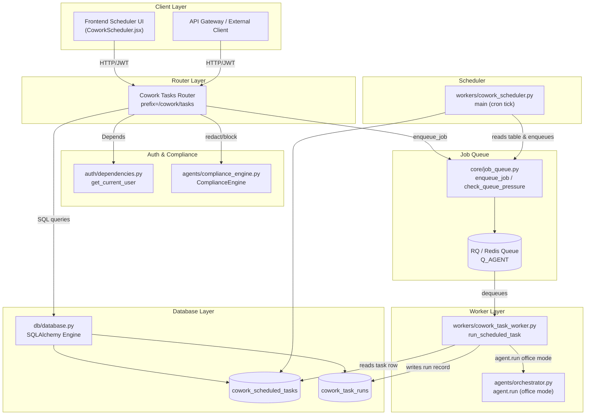
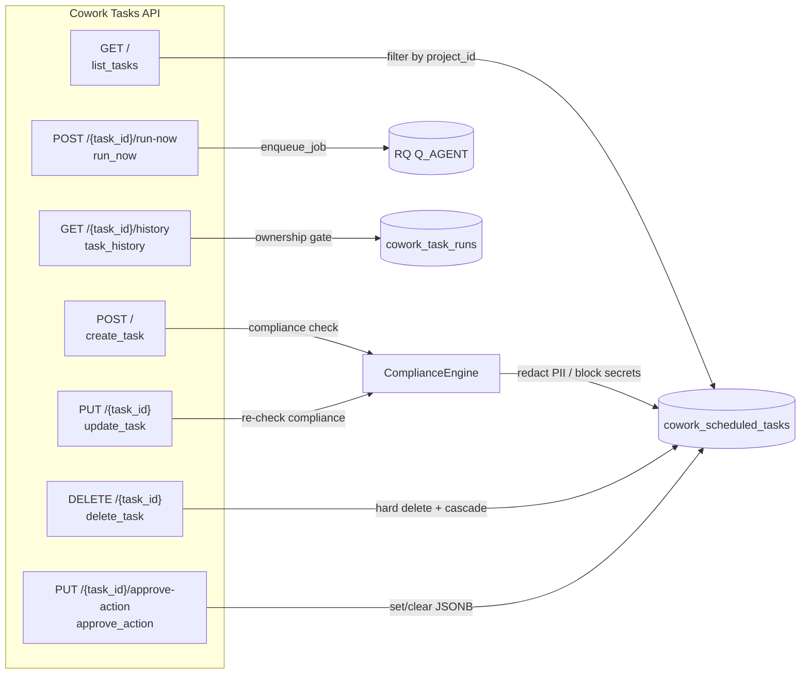
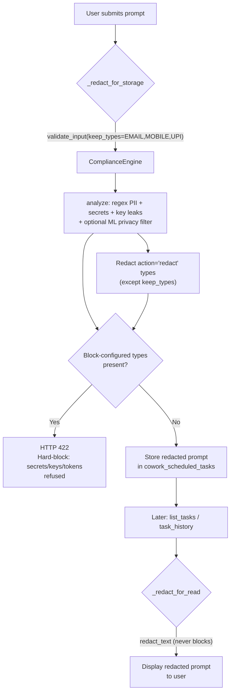
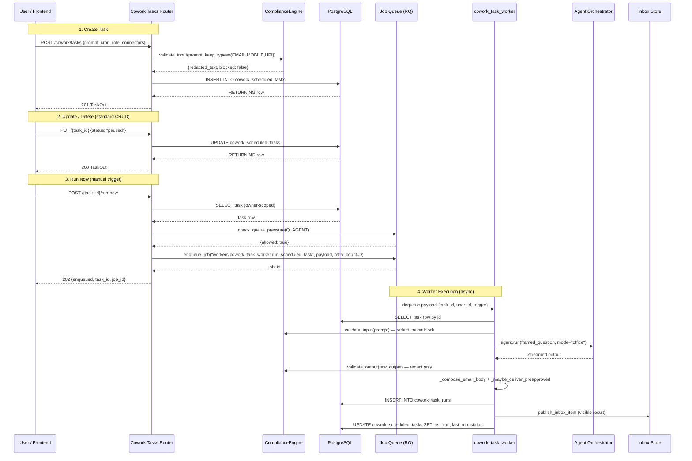
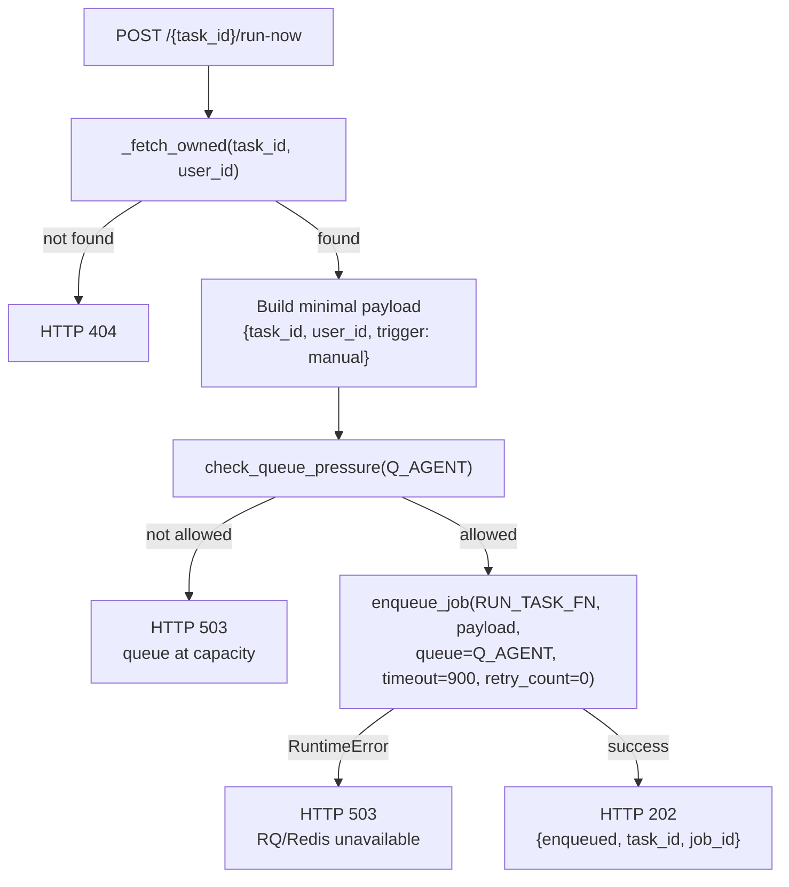
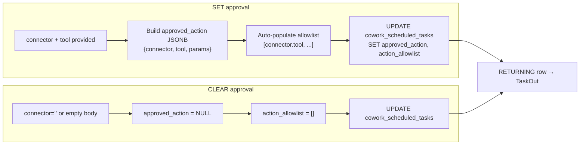
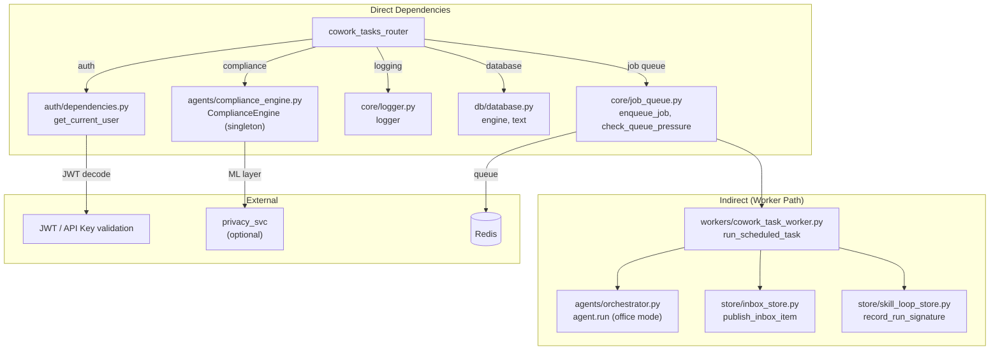

# Cowork Tasks Router

## Introduction

The **Cowork Tasks Router** (`routers/cowork_tasks_router.py`) is a FastAPI APIRouter that provides full CRUD lifecycle management for user-owned, recurring Cowork scheduled tasks. These tasks are persisted in the `cowork_scheduled_tasks` PostgreSQL table and are executed on a cron schedule by a background RQ worker (`workers.cowork_task_worker.run_scheduled_task`). The router itself **never executes tasks** — it manages task configuration, enqueues manual "run-now" requests, retrieves run history, and manages pre-approved connector write actions.

The module is a critical piece of the Cowork scheduling subsystem, sitting between the frontend scheduler UI and the background worker infrastructure. It enforces strict NPCI compliance guardrails: prompts are redacted for incidental PII before storage, secrets/keys/tokens are hard-blocked, and all connector/doc writes route through the existing compliance-gated confirmation path — the router grants no write bypass.

---

## Architecture Overview

### Where This Module Fits

The router is part of the **shared_api_routers** package — a collection of FastAPI routers mounted by the main gateway application. It is one of several Cowork-related routers:

| Router | Responsibility |
|--------|---------------|
| **cowork_tasks_router** (this module) | CRUD + run-now + history + approve-action for scheduled tasks |
| `cowork_admin_router` | Role management, marketplace, user preferences |
| `cowork_conversations_router` | Conversation persistence and retrieval |
| `cowork_dispatch_router` | Dispatch creation, claiming, and result posting |
| `cowork_mcp_router` | MCP SSE streaming and tool listing |
| `cowork_policy_router` | Connector policy and role grant management |
| `cowork_projects_router` | Project CRUD |
| `cowork_usage_router` | Usage tracking, spend limits, analytics |

---

## Endpoints

All endpoints are JWT-gated via `get_current_user` and scoped to `current_user["sub"]` (the user's unique identifier). The router prefix is `/cowork/tasks`.

### Endpoint Reference

| Method | Path | Function | Description |
|--------|------|----------|-------------|
| `GET` | `/` | `list_tasks` | List caller's scheduled tasks (optional `?project_id=` filter) |
| `POST` | `/` | `create_task` | Create a new scheduled task (compliance-checked) |
| `PUT` | `/{task_id}` | `update_task` | Update mutable fields of an owned task |
| `DELETE` | `/{task_id}` | `delete_task` | Hard-delete an owned task (cascades run history) |
| `POST` | `/{task_id}/run-now` | `run_now` | Enqueue immediate execution (no write bypass) |
| `GET` | `/{task_id}/history` | `task_history` | Retrieve recent run history (ownership-gated) |
| `PUT` | `/{task_id}/approve-action` | `approve_action` | Set or clear pre-approved connector write action |

---

## Core Components

### Data Models (Pydantic Schemas)

#### `TaskCreate`

Request body for creating a new scheduled task.

| Field | Type | Constraints | Description |
|-------|------|-------------|-------------|
| `prompt` | `str` | min_length=1, max_length=8000 | The instruction the agent will execute on each tick |
| `cron` | `str` | min_length=1, max_length=120 | Cron expression for scheduling |
| `role` | `Optional[str]` | max_length=120 | Cowork role persona (e.g. "analyst") |
| `connectors` | `List[str]` | default=[] | Connector identifiers (max 32, each ≤120 chars) |
| `project_id` | `Optional[str]` | max_length=64 | Link to a Cowork project |
| `tz` | `Optional[str]` | max_length=64 | IANA timezone (e.g. `Asia/Kolkata`), defaults to `UTC` |

#### `TaskUpdate`

Request body for updating an existing task. All fields are optional — only supplied fields are updated.

| Field | Type | Constraints | Description |
|-------|------|-------------|-------------|
| `prompt` | `Optional[str]` | min_length=1, max_length=8000 | Updated prompt (re-compliance-checked) |
| `cron` | `Optional[str]` | min_length=1, max_length=120 | Updated cron expression |
| `role` | `Optional[str]` | max_length=120 | Updated role persona |
| `connectors` | `Optional[List[str]]` | — | Updated connector list |
| `status` | `Optional[str]` | `"active"` or `"paused"` | Task lifecycle status |

#### `TaskApproveAction`

Request body for pre-approving a connector write action.

| Field | Type | Default | Description |
|-------|------|---------|-------------|
| `connector` | `str` | `""` | Connector name (e.g. `"microsoft_365"`) |
| `tool` | `str` | `""` | Tool name (e.g. `"outlook_send_mail"`) |
| `params` | `dict` | `{}` | Pre-filled parameters (to, subject, etc.) |
| `action_allowlist` | `List[str]` | `[]` | Permitted `connector.tool` keys |

> **Clearing:** Send `connector=""` or an empty body `{}` to clear a previously set approval. The task reverts to the self-email/outbox fallback.

#### `TaskOut` (Response Model)

| Field | Type | Description |
|-------|------|-------------|
| `id` | `str` | UUID task identifier |
| `prompt` | `str` | Compliance-redacted prompt (safe for display) |
| `cron` | `str` | Cron expression |
| `role` | `Optional[str]` | Role persona |
| `connectors` | `List[str]` | Connector identifiers |
| `status` | `str` | `"active"` or `"paused"` |
| `last_run_at` | `Optional[str]` | ISO timestamp of last execution |
| `last_run_status` | `Optional[str]` | Status of last run |
| `created_at` | `Optional[str]` | ISO timestamp of creation |
| `updated_at` | `Optional[str]` | ISO timestamp of last update |
| `next_run_at` | `Optional[str]` | When the task will next fire (from scheduler) |
| `tz` | `Optional[str]` | IANA timezone |
| `approved_action` | `Optional[dict]` | Pre-approved connector write action (JSONB) |
| `action_allowlist` | `List[str]` | Allowlisted `connector.tool` keys |

---

## Compliance & Security Model

The router implements a layered compliance strategy that distinguishes between **storage-time** (write) and **read-time** (display) operations.

### Storage-Time Compliance (`_redact_for_storage`)

Called on `create_task` and `update_task` when a prompt is supplied. Uses `ComplianceEngine.validate_input()` with `keep_types={"EMAIL", "MOBILE", "UPI"}`:

- **Redact-and-proceed:** Incidental PII (PAN, Aadhaar, account numbers, etc.) is redacted before storage. The redacted text is what gets persisted.
- **Hard-block:** Secrets, API keys, tokens, and other block-configured types trigger an HTTP 422 response. The task is **not** saved. This prevents credentials from being persisted into a recurring instruction that replays on every cron tick.
- **Keep-types rationale:** Contact identifiers (EMAIL, MOBILE, UPI) are preserved because the prompt is a tool-driven instruction (e.g. "send an email to user@example.com"). Redacting them to `[EMAIL]` would strip the recipient, causing the worker to fall back to self-email.
- **Fail-closed:** If the compliance engine itself throws an unexpected error, the router returns HTTP 503 and refuses to save the task.

### Read-Time Compliance (`_redact_for_read`)

Called on every read path (`list_tasks`, `task_history`, `_row_to_out`). Uses `ComplianceEngine.redact_text()`:

- **Never blocks** — the user always sees their data.
- Redacts any PII that may have survived storage redaction or appeared in agent output.
- On failure, returns the original text (fail-open for reads).

### Connector Write Safety

The router enforces a strict separation between **scheduling** and **executing writes**:

1. **`run_now`** only enqueues the task — it does not execute any connector action.
2. The enqueued worker (`run_scheduled_task`) runs the agent in office mode, which routes any write/send through the existing confirm + compliance-gated path (`POST /connectors/action`, `workers/doc_worker.py`).
3. **`approve_action`** lets a user pre-authorize **one specific** connector write (e.g. "send the result to X via Outlook"). The worker still hard-blocks on sensitive outbound content before executing.
4. Manual runs use `retry_count=0` to prevent silent double-execution of writes.

---

## Data Flow: Task Lifecycle

---

## Database Schema

The router interacts with two PostgreSQL tables:

### `cowork_scheduled_tasks`

| Column | Type | Description |
|--------|------|-------------|
| `id` | UUID (PK) | Task identifier |
| `user_id` | str | Owner (from JWT `sub`) |
| `prompt` | text | Compliance-redacted instruction |
| `cron` | str | Cron expression |
| `role` | str (nullable) | Cowork role persona |
| `connectors` | JSONB | List of connector identifiers |
| `status` | str | `"active"` or `"paused"` |
| `project_id` | str (nullable) | Linked Cowork project |
| `tz` | str | IANA timezone |
| `last_run` | timestamp (nullable) | Last execution time |
| `last_run_status` | str (nullable) | Last run outcome |
| `next_run` | timestamp (nullable) | Next scheduled fire (from scheduler) |
| `created_at` | timestamp | Creation time |
| `updated_at` | timestamp | Last modification time |
| `approved_action` | JSONB (nullable) | Pre-approved connector write action |
| `action_allowlist` | JSONB | Permitted `connector.tool` keys |

### `cowork_task_runs`

| Column | Type | Description |
|--------|------|-------------|
| `id` | UUID (PK) | Run identifier |
| `task_id` | UUID (FK) | References `cowork_scheduled_tasks.id` (cascade delete) |
| `status` | str | `"done"`, `"error"`, etc. |
| `output` | text | Agent output (compliance-redacted on read) |
| `error` | text (nullable) | Error message if failed |
| `created_at` | timestamp | Run timestamp |

---

## Internal Helpers

### Database Access

- **`_db()`** — Lazily imports the SQLAlchemy `engine` and `text` constructor from `db.database`. This deferred import avoids circular dependencies at module load time.
- **`_fetch_owned(conn, text, task_id, uid)`** — Fetches a single task row scoped to its owner. Used by `run_now` to verify ownership before enqueuing.
- **`_SELECT_COLS`** — Canonical column list for all SELECT queries, ensuring `_row_to_out` always receives a consistent row shape.

### Row Coercion

- **`_row_to_out(row)`** — Converts a raw DB row tuple into a `TaskOut` model. Applies `_redact_for_read` to the prompt, coerces `connectors` and `approved_action` from JSONB, and handles nullable timestamp fields.
- **`_coerce_connectors(raw)`** — Defensively coerces the JSONB `connectors` column to `List[str]`, handling `None`, `list`, `str` (JSON-encoded), and unexpected types.
- **`_coerce_approved_action(raw)`** — Coerces the JSONB `approved_action` column to `dict` or `None`. Guards against un-migrated databases where the column may still be BOOLEAN.

### Validation

- **`_validate_connectors(connectors)`** — Enforces max 32 connectors, strips whitespace, truncates each to 120 chars, and rejects non-string entries.
- **`_VALID_STATUSES`** — `{"active", "paused"}` — the only allowed values for the `status` field on update.

---

## Run-Now & Job Queue Integration

The `run_now` endpoint is the bridge between the router and the async worker infrastructure:

**Key design decisions:**

1. **Minimal payload:** Only `{task_id, user_id, trigger}` is enqueued — the worker reloads the full task row by ID. This prevents prompt/connector data from being duplicated through the queue payload.
2. **`retry_count=0`:** Manual runs must not silently double-execute writes. If a run fails, it stays failed — the user can re-trigger manually.
3. **Queue back-pressure:** Before enqueuing, `check_queue_pressure(Q_AGENT)` is called. If the queue is at capacity, the router returns HTTP 503 instead of accepting a job that would sit unprocessed.
4. **Shared execution path:** Both scheduled (cron-triggered) and manual (`run-now`) runs enqueue the same worker function (`workers.cowork_task_worker.run_scheduled_task`), ensuring identical compliance, delivery, and observability behavior.

---

## Approve-Action Flow

The `approve_action` endpoint allows users to pre-authorize a specific connector write that the worker will execute after each scheduled run.

When the worker runs a task with a set `approved_action`, it uses `_maybe_deliver_preapproved()` to execute the connector write (e.g. sending an email via Outlook) with the agent's output as the body. The worker still applies hard-block compliance on the outbound content before executing.

---

## Dependencies

### Module References

| Dependency | Module | Purpose |
|-----------|--------|---------|
| `get_current_user` | [auth_router](auth_router.md) / `auth/dependencies.py` | JWT/API-key authentication; enriches user context |
| `ComplianceEngine` | `agents/compliance_engine.py` | PII redaction, secret detection, ML privacy filter |
| `enqueue_job`, `check_queue_pressure` | `core/job_queue.py` | RQ job enqueuing with back-pressure |
| `logger` | `core/logger.py` | Structured logging |
| `engine`, `text` | `db/database.py` | SQLAlchemy database engine |
| `run_scheduled_task` | `workers/cowork_task_worker.py` | Worker function for task execution |

---

## Configuration Constants

| Constant | Value | Description |
|----------|-------|-------------|
| `_MAX_PROMPT_LEN` | `8000` | Maximum allowed prompt length |
| `_MAX_CONNECTORS` | `32` | Maximum connectors per task |
| `_VALID_STATUSES` | `{"active", "paused"}` | Allowed task status values |
| `RUN_TASK_FN` | `"workers.cowork_task_worker.run_scheduled_task"` | Worker function path for enqueuing |
| Router prefix | `/cowork/tasks` | URL prefix for all endpoints |
| `run_now` timeout | `900` (15 min) | RQ job timeout for manual runs |
| `run_now` retry_count | `0` | No retries for manual runs (prevents double-writes) |

---

## Error Handling

| Scenario | HTTP Status | Behavior |
|----------|-------------|----------|
| Prompt contains secrets/keys/tokens | 422 | Task not saved; blocked type names returned (values never echoed) |
| Compliance service unavailable | 503 | Task not saved; fail-closed |
| Task not found (non-owner or non-existent) | 404 | Ownership-scoped — never reveals existence to non-owners |
| Queue at capacity | 503 | Run-now refused; user advised to retry |
| RQ/Redis unavailable | 503 | Run-now refused; RuntimeError from `enqueue_job` |
| Invalid status value | 400 | Update rejected with allowed values |
| Too many connectors | 400 | Create/update rejected |
| No updatable fields supplied | 400 | Update rejected |
| Database error | 500 | Raw error string returned (server-side logged) |

---

## Logging & Audit

The router logs all mutations at `INFO` level with task ID, user email, and relevant metadata. **Prompt bodies, connector secrets, and tokens are never logged.** Key log events:

- **Task created:** `cowork_tasks: created task={id} user={email} cron={cron} connectors={count}`
- **Task updated:** `cowork_tasks: updated task={id} user={email}`
- **Task deleted:** `cowork_tasks: deleted task={id} user={email}`
- **Run-now enqueued:** `cowork_tasks: run-now task={id} job={job_id} user={email}`
- **Approve-action set/cleared:** `cowork_tasks: approve-action {set|cleared} task={id} user={email}`
- **Prompt blocked:** `cowork_tasks: prompt BLOCKED types={types}` (WARNING level)
- **Compliance failure:** `cowork_tasks: compliance check failed: {error}` (ERROR level)

The `ComplianceEngine` itself maintains a separate audit log at `_AUDIT_LOG_PATH` that records redacted text and masked finding values (first 2 + last 2 chars only) for compliance investigations.
