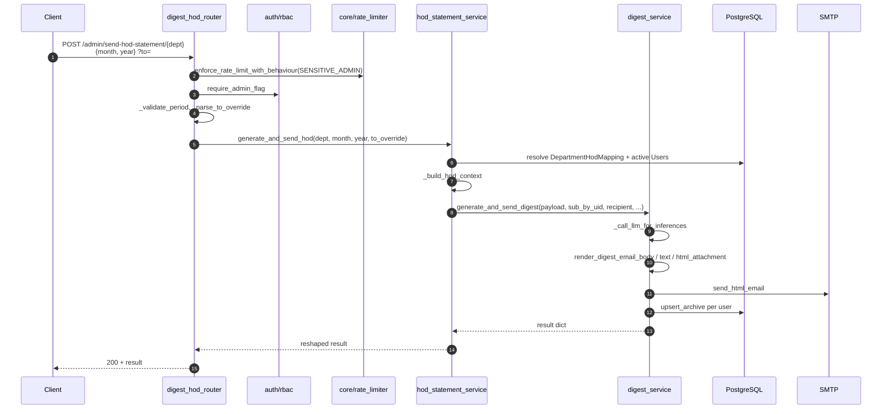
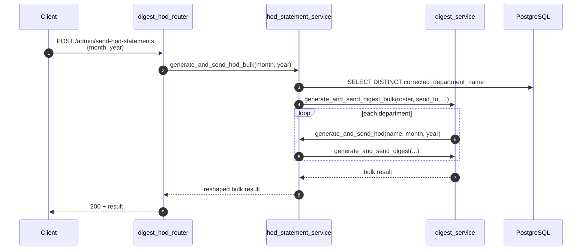

# digest_hod_router

## Brief Introduction

`digest_hod_router` is a small, admin-only FastAPI router that exposes HTTP endpoints for triggering **Head-of-Department (HOD) monthly usage digest emails**. It acts as a thin HTTP adapter over the HOD-specific statement pipeline in [`services/hod_statement_service.py`](../services/hod_statement_service.md), which in turn delegates the shared rendering, LLM inference, SMTP dispatch, and archival logic to [`services/digest_service.py`](../services/digest_service.md).

The router provides two operations:

1. **Single-department trigger** — send one HOD digest for a specific corrected department name, with an optional `?to=` test-recipient override.
2. **Bulk trigger** — fan out HOD digests to every department configured in `department_hod_mapping`.

Both endpoints require an admin role, are rate-limited under the `SENSITIVE_ADMIN` behaviour, and emit structured audit logs distinguishing manual admin triggers from the monthly cron-driven run.

---

## Core Responsibilities

| Responsibility | Where it lives |
|---|---|
| HTTP routing & request validation | `digest_hod_router.py` (this module) |
| Department roster resolution & HOD payload construction | [`services/hod_statement_service.py`](../services/hod_statement_service.md) |
| Shared LLM inference, rendering, SMTP dispatch, archival | [`services/digest_service.py`](../services/digest_service.md) |
| Monthly cron orchestration (HOD + Manager bulk) | [`services/digest_service.py::_job_team_digest`](../services/digest_service.md) |
| Admin authorization | [`auth/rbac.py::require_admin_flag`](../auth/rbac.md) |
| Rate limiting | [`core/rate_limiter.py`](../core/rate_limiter.md) (`SENSITIVE_ADMIN`) |

---

## Architecture

```mermaid
flowchart TB
    subgraph HTTP["HTTP Layer"]
        A[POST /admin/send-hod-statement/{corrected_department_name}]
        B[POST /admin/send-hod-statements]
    end

    subgraph Router["digest_hod_router"]
        V1["_validate_period(month, year)"]
        V2["_parse_to_override(?to=)"]
        RL["enforce_rate_limit_with_behaviour(SENSITIVE_ADMIN)"]
        AUTH["require_admin_flag"]
    end

    subgraph Service["services/hod_statement_service"]
        H1["generate_and_send_hod()"]
        H2["generate_and_send_hod_bulk()"]
        P["_build_hod_context()"]
    end

    subgraph Shared["services/digest_service"]
        D1["generate_and_send_digest()"]
        D2["generate_and_send_digest_bulk()"]
        LLM["_call_llm_for_inferences()"]
        REN["render_digest_*()"]
        SMTP["send_html_email()"]
        ARC["upsert_archive()"]
    end

    A --> RL --> AUTH --> V1 --> V2 --> H1 --> P --> D1
    B --> RL --> AUTH --> V1 --> H2 --> D2
    D1 --> LLM
    D1 --> REN
    D1 --> SMTP
    D1 --> ARC
    D2 --> |"per dept"| H1
```

---

## Component Reference

### `PeriodBody`

A Pydantic request model that intentionally uses `Optional[int]` fields so the router can accept the body and then raise its own `HTTPException(400)` when `month` or `year` is missing. This satisfies the spec requirement of returning `400` (not Pydantic's default `422`) for missing period fields.

| Field | Type | Constraints |
|---|---|---|
| `month` | `Optional[int]` | `1 <= month <= 12` |
| `year` | `Optional[int]` | `2024 <= year <= 2100` |

### `admin_send_hod_one`

**Route:** `POST /admin/send-hod-statement/{corrected_department_name}`

Triggers a single HOD digest for the given corrected department name.

**Parameters:**

| Name | Source | Description |
|---|---|---|
| `corrected_department_name` | path | Normalized department identifier from `department_hod_mapping` |
| `month` / `year` | body (`PeriodBody`) | Billing period to report on |
| `to` | query (`?to=email`) | Optional test-recipient override; digest is rendered and dispatched normally but delivered to this address |
| `admin` | dependency | Injected by `require_admin_flag` |

**Behaviour:**

1. Enforces `SENSITIVE_ADMIN` rate limit.
2. Validates the period.
3. Validates the optional `?to=` email address.
4. Logs an audit marker (`trigger=manual`).
5. Calls `generate_and_send_hod()`.
6. Maps `ValueError` from the service layer to `HTTPException(404)` for unknown departments or departments with zero active users.

**Response shape:**

```json
{
  "ok": true,
  "corrected_department_name": "engineering",
  "department_name": "Engineering",
  "hod_email": "hod@example.com",
  "period": {"month": 1, "year": 2025},
  "users_count": 12,
  "sent": true,
  "skipped_reason": null,
  "llm_used": true,
  "statement_ids": ["..."],
  "recipient_used": "hod@example.com",
  "test_recipient_override": false
}
```

### `admin_send_hod_bulk`

**Route:** `POST /admin/send-hod-statements`

Triggers HOD digests for all distinct `corrected_department_name` values in `department_hod_mapping`.

**Parameters:**

| Name | Source | Description |
|---|---|---|
| `month` / `year` | body (`PeriodBody`) | Billing period to report on |
| `admin` | dependency | Injected by `require_admin_flag` |

**Behaviour:**

1. Enforces `SENSITIVE_ADMIN` rate limit.
2. Validates the period.
3. Explicitly rejects the `?to=` query parameter because a single override cannot represent every department's HOD inbox.
4. Logs an audit marker (`trigger=manual`, `bulk=true`).
5. Calls `generate_and_send_hod_bulk()`.

**Response shape:**

```json
{
  "ok": true,
  "period": {"month": 1, "year": 2025},
  "total_departments": 8,
  "sent": 7,
  "skipped": 0,
  "failed": []
}
```

---

## Data Flow

### Single-Department Send



### Bulk Send



---

## Dependencies

### Direct Imports

| Imported Symbol | Source Module | Purpose |
|---|---|---|
| `APIRouter`, `Body`, `Depends`, `HTTPException`, `Query`, `Request` | `fastapi` | HTTP framework primitives |
| `BaseModel`, `Field` | `pydantic` | Request body model |
| `require_admin_flag` | [`auth/rbac.py`](../auth/rbac.md) | Admin-only access control |
| `logger` | [`core/logger.py`](../core/logger.md) | Structured audit logging |
| `enforce_rate_limit_with_behaviour` | [`core/rate_limiter.py`](../core/rate_limiter.md) | Rate-limit enforcement |
| `SENSITIVE_ADMIN` | [`core/rate_limiter.py`](../core/rate_limiter.md) | Pre-defined sensitive-admin rate-limit config |
| `generate_and_send_hod` | [`services/hod_statement_service.py`](../services/hod_statement_service.md) | Single-department pipeline |
| `generate_and_send_hod_bulk` | [`services/hod_statement_service.py`](../services/hod_statement_service.md) | Bulk fan-out pipeline |

### Related Modules

- [`digest_manager_router`](digest_manager_router.md) — sibling router for manager monthly usage digests; shares the same `PeriodBody` pattern and delegates to the same `digest_service` pipeline.
- [`monthly_statement_router`](monthly_statement_router.md) — user-facing monthly statement router that reuses the same email-regex validation and period-body pattern.
- [`services/digest_service.py`](../services/digest_service.md) — shared digest rendering, LLM inference, SMTP dispatch, and archival logic.
- [`services/hod_statement_service.py`](../services/hod_statement_service.md) — HOD-specific roster resolution and payload building.

---

## Security & Governance

| Control | Implementation |
|---|---|
| **Authentication** | Admin JWT/session required via `require_admin_flag` |
| **Authorization** | `current_user["role"] == "admin"`; returns `403` otherwise |
| **Rate limiting** | `SENSITIVE_ADMIN` tier: 50 requests/minute per IP+user |
| **Behavioural blocking** | `enforce_rate_limit_with_behaviour` checks anomaly blocks before sliding-window limit |
| **Input validation** | Custom `_validate_period` returns `400` for missing/invalid `month`/`year`; `_parse_to_override` validates email format |
| **Audit logging** | Structured logs include admin email, department, period, and whether a test recipient override was used |
| **Test override safety** | `?to=` is supported only on the single-department endpoint; bulk endpoint rejects it explicitly to prevent accidental mass misdirection |

---

## Error Handling

| Scenario | HTTP Status | Source |
|---|---|---|
| Missing or invalid `month`/`year` | `400 Bad Request` | `_validate_period` |
| Malformed `?to=` email | `400 Bad Request` | `_parse_to_override` |
| `?to=` used on bulk endpoint | `400 Bad Request` | `admin_send_hod_bulk` |
| Non-admin caller | `403 Forbidden` | `require_admin_flag` |
| Unknown department or zero active users | `404 Not Found` | `ValueError` from service layer |
| Rate limit exceeded | `429 Too Many Requests` | `enforce_rate_limit_with_behaviour` |

---

## How It Fits into the System

`digest_hod_router` is part of the **shared API routers** layer. It sits alongside [`digest_manager_router`](digest_manager_router.md) and [`monthly_statement_router`](monthly_statement_router.md) as a trigger surface for usage-digest emails. The actual business logic is intentionally kept out of the router:

- The router only handles **HTTP concerns**: path/query/body parsing, auth, rate limiting, and response shaping.
- **HOD-specific orchestration** lives in [`services/hod_statement_service.py`](../services/hod_statement_service.md).
- **Cross-cutting digest logic** (LLM inference, email rendering, SMTP, archive) lives in [`services/digest_service.py`](../services/digest_service.md).
- **Scheduled/cron execution** is handled by [`services/digest_service.py::_job_team_digest`](../services/digest_service.md), which runs both HOD and Manager bulk sends for the current IST billing month.

This separation makes the router easy to test, replace, or extend (for example, adding a new recipient type) without touching the shared pipeline.

---

## Process Flow Diagram

```mermaid
flowchart LR
    A[Admin UI / API Client] -->|POST /admin/send-hod-statement/{dept}| B[admin_send_hod_one]
    A -->|POST /admin/send-hod-statements| C[admin_send_hod_bulk]

    B --> D{Rate limit OK?}
    C --> D
    D -->|No| E[429 Too Many Requests]
    D -->|Yes| F{Admin role?}
    F -->|No| G[403 Forbidden]
    F -->|Yes| H{Period valid?}
    H -->|No| I[400 Bad Request]
    H -->|Yes| J{?to= present?}
    J -->|Invalid| K[400 Bad Request]
    J -->|Valid / absent| L[Call HOD service]
    L --> M{ValueError?}
    M -->|Yes| N[404 Not Found]
    M -->|No| O[200 OK + result]

    C --> P{?to= present?}
    P -->|Yes| Q[400 Bad Request]
    P -->|No| R[Call HOD bulk service]
    R --> O
```
