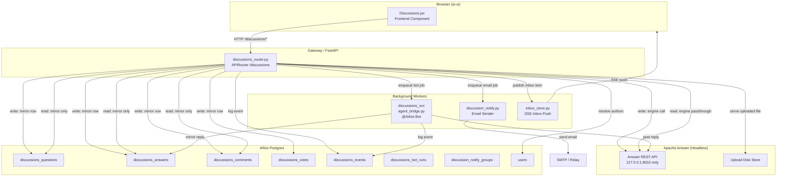
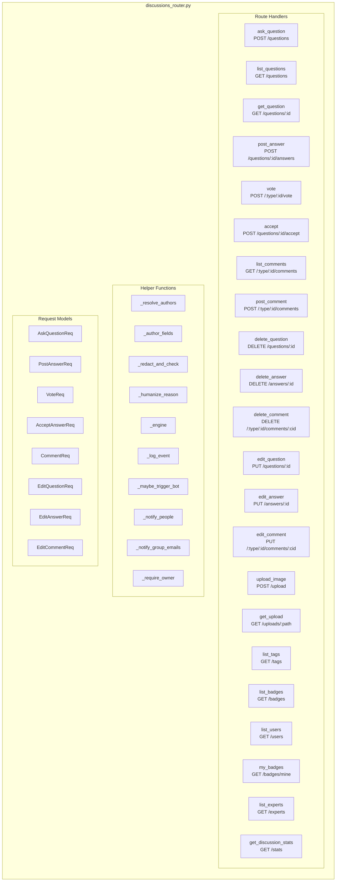
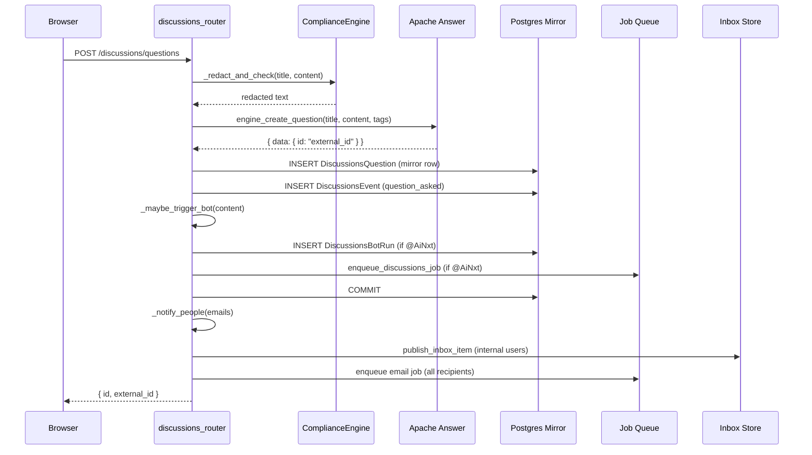
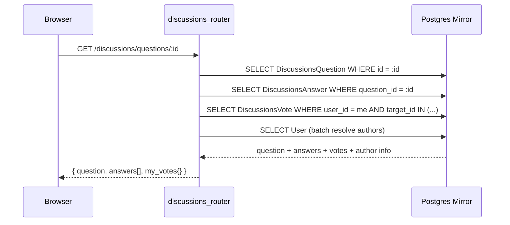
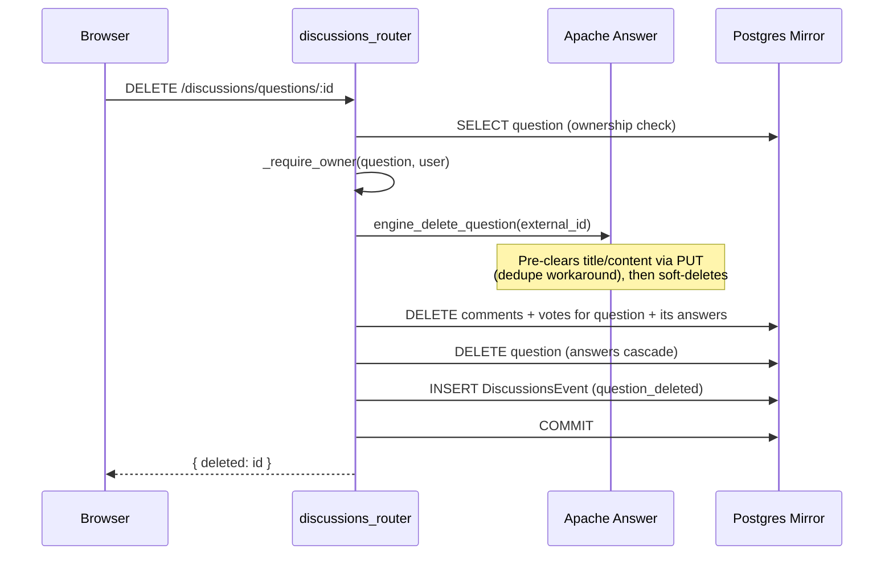
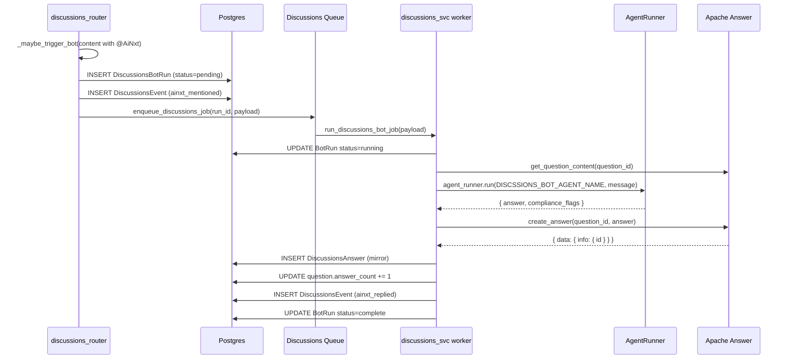
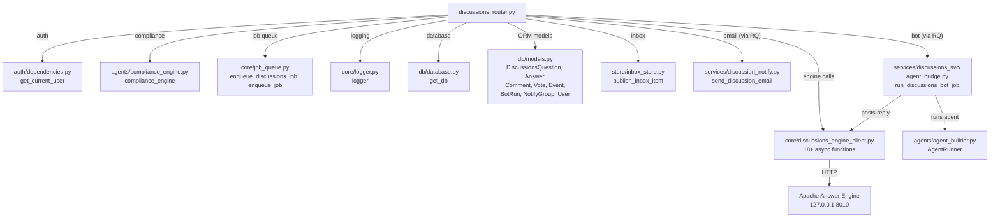
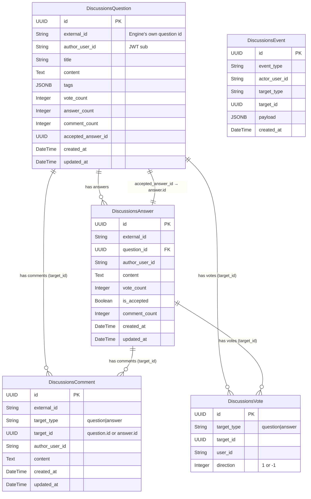

# Discussions Router

## Overview

The **Discussions Router** (`routers/discussions_router.py`) is the single API surface for the platform's internal Q&A / forum system. It exposes a FastAPI router mounted at `/discussions` and implements a **dual-write + mirror-read** architecture:

- **Writes** (ask, answer, vote, comment, accept, edit, delete) are sent to a headless **Apache Answer** engine running on `127.0.0.1` only, and simultaneously mirrored into AiNxt's own Postgres tables in the *same request*.
- **Reads** (list questions, get question detail, list comments, experts, stats) are served directly from the Postgres mirror tables — no engine round trip.
- Every meaningful action is logged to an append-only `discussions_events` table that serves as a **feedback spine** for future self-improvement workers.

The browser never talks to the Apache Answer engine directly. All engine communication is server-to-server via [`core/discussions_engine_client.py`](../reference/shared_core.md), which transparently handles per-user session tokens.

---

## Architecture

### Design Principles

| Principle | Implementation |
|---|---|
| **Single kill switch** | Deleting this file + one `ENABLE_DISCUSSIONS` gate line in `gateway.py` disables the entire module. |
| **Engine is headless** | Apache Answer runs on localhost only; no browser can reach it. All calls go through the router → engine client. |
| **Mirror-first reads** | Reads never touch the engine — they query AiNxt's own Postgres tables for speed and to enrich with user identity (name, department). |
| **Dual-write consistency** | Every write hits the engine first, then the mirror in the same DB transaction. If the engine call fails, the mirror write never happens. |
| **Redact-and-proceed** | Compliance checks never hard-block a post — sensitive content is redacted in place and the post proceeds. |
| **Non-blocking notifications** | Email and inbox notifications are enqueued to RQ; failures never roll back an already-committed post. |

---

## Component Map

---

## Request Models

All request bodies are Pydantic `BaseModel` subclasses validated by FastAPI before the handler runs.

| Model | Used By | Fields |
|---|---|---|
| `AskQuestionReq` | `ask_question` | `title: str`, `content: str`, `tags: list[str]`, `notify_emails: list[str]` |
| `PostAnswerReq` | `post_answer` | `content: str` |
| `VoteReq` | `vote` | `direction: int` (1 or -1) |
| `AcceptAnswerReq` | `accept` | `answer_id: str` |
| `CommentReq` | `post_comment` | `content: str` |
| `EditQuestionReq` | `edit_question` | `title: str`, `content: str`, `tags: list[str]` |
| `EditAnswerReq` | `edit_answer` | `content: str` |
| `EditCommentReq` | `edit_comment` | `content: str` |

---

## Key Helper Functions

### `_redact_and_check(text, stage) → str`

Runs user-submitted text through the [`ComplianceEngine`](../reference/shared_core.md) (`agents/compliance_engine.py`). Per house rule, the discussions module **never hard-blocks** a post — it returns the redacted text and logs any blocking findings as warnings. On any exception, the original text is returned unchanged (fail-open).

### `_engine(coro) → result`

Awaits an engine client coroutine and translates `httpx.HTTPStatusError` (4xx from Apache Answer) into a proper `HTTPException(422)` with a human-readable detail. It inspects the engine's `RespBody` for:
- Per-field form validation errors (in `data` as a list of `FormErrorField`)
- A human-readable `msg` (if it's not a raw i18n key)
- A `reason` code that gets humanized via `_humanize_reason()`

### `_resolve_authors(db, user_ids) → dict`

Batch-resolves `author_user_id` (raw JWT `sub`) to `{name, department}` by joining against the `users` table. This is essential because discussions rows store only the bare UUID — every read needs this join to display a real name instead of a UUID. The system bot (`ainxt-system-bot`) is pre-populated as `{"name": "AiNxt", "department": None}`.

### `_log_event(db, event_type, actor_user_id, ...)`

Writes a single row to `discussions_events` — the append-only feedback spine. Event types include: `question_asked`, `answer_posted`, `vote_cast`, `answer_accepted`, `comment_posted`, `question_edited`, `answer_edited`, `comment_edited`, `question_deleted`, `answer_deleted`, `comment_deleted`, `ainxt_mentioned`, `ainxt_replied`.

### `_maybe_trigger_bot(db, content, mirror_id, ...)`

Scans post content for `@AiNxt` mentions. If found:
1. Creates a `DiscussionsBotRun` row with status `pending`.
2. Logs an `ainxt_mentioned` event.
3. Enqueues an RQ job via `enqueue_discussions_job()` to the dedicated discussions queue.
4. If the queue is unavailable (back-pressure), the row stays `pending` — the user's own post is never failed over a bot trigger.

The bot job is consumed by [`services/discussions_svc/agent_bridge.py`](../chat/discussions_service.md)::`run_discussions_bot_job`, which runs the `AgentRunner` to generate a reply and posts it back to both the engine and the mirror.

### `_notify_people(db, emails, current_user, ...)`

Notifies tagged recipients about a newly-posted discussion:
- **Internal users** (matched by email in `users` table) receive an **in-app inbox item** (SSE-pushed via `publish_inbox_item`) **and** an email.
- **External/unknown emails** receive an **email only**.

Recipients are merged from the poster's `notify_emails` list and the DB-managed `discussion_notify_groups` flat list. Email delivery is fanned out to RQ (retry + DLQ) so it never blocks the poster's request. All failures are swallowed — the post has already been committed.

### `_require_owner(row, current_user)`

Author-only gate for delete and edit operations. Raises `403` if `row.author_user_id != current_user["sub"]`. This is defense-in-depth — the engine enforces its own author check server-side as well.

---

## Data Flow

### Write Path (e.g., `ask_question`)

### Read Path (e.g., `get_question`)

> **Note:** Reads never touch the Apache Answer engine. All data is served from the Postgres mirror, enriched with user identity (name, department) and the current user's vote state.

### Delete Path (e.g., `delete_question`)

### @AiNxt Bot Trigger Flow

---

## API Endpoints

### Questions

| Method | Path | Handler | Auth | Description |
|---|---|---|---|---|
| `POST` | `/discussions/questions` | `ask_question` | User | Create a new question. Redacts content, writes to engine + mirror, triggers bot/notifications. |
| `GET` | `/discussions/questions` | `list_questions` | User | List questions with filtering (tag, unanswered, mine, status, search) and sorting (newest, active, votes). Served from mirror. |
| `GET` | `/discussions/questions/{id}` | `get_question` | User | Get a single question with all answers, comments, and the current user's vote state. Served from mirror. |
| `PUT` | `/discussions/questions/{id}` | `edit_question` | Owner | Edit question title/content/tags. Engine first, then mirror. |
| `DELETE` | `/discussions/questions/{id}` | `delete_question` | Owner | Delete question + cascaded answers/comments/votes. Engine first, then mirror. |

### Answers

| Method | Path | Handler | Auth | Description |
|---|---|---|---|---|
| `POST` | `/discussions/questions/{id}/answers` | `post_answer` | User | Post an answer. Redacts content, writes to engine + mirror, triggers bot. |
| `PUT` | `/discussions/answers/{id}` | `edit_answer` | Owner | Edit answer content. Engine first, then mirror. |
| `DELETE` | `/discussions/answers/{id}` | `delete_answer` | Owner | Delete answer, decrement parent's count, clear accepted pointer if needed. |
| `POST` | `/discussions/questions/{id}/accept` | `accept` | User | Accept an answer. Engine first, then mirror (un-accepts previous if any). |

### Votes

| Method | Path | Handler | Auth | Description |
|---|---|---|---|---|
| `POST` | `/discussions/{type}/{id}/vote` | `vote` | User | Cast or update a vote (±1). Engine first, then mirror (upsert vote row, update count). |

### Comments

| Method | Path | Handler | Auth | Description |
|---|---|---|---|---|
| `GET` | `/discussions/{type}/{id}/comments` | `list_comments` | None | List comments for a question or answer. Served from mirror. |
| `POST` | `/discussions/{type}/{id}/comments` | `post_comment` | User | Post a comment. Redacts content, writes to engine + mirror, triggers bot. |
| `PUT` | `/discussions/{type}/{id}/comments/{cid}` | `edit_comment` | Owner | Edit comment content. Engine first, then mirror. |
| `DELETE` | `/discussions/{type}/{id}/comments/{cid}` | `delete_comment` | Owner | Delete comment, decrement parent's comment count. |

### Metadata & Gamification

| Method | Path | Handler | Auth | Description |
|---|---|---|---|---|
| `GET` | `/discussions/tags` | `list_tags` | None | List tags (engine passthrough). |
| `GET` | `/discussions/badges` | `list_badges` | None | List all badges (engine passthrough). |
| `GET` | `/discussions/badges/mine` | `my_badges` | User | List current user's earned badges (engine passthrough). |
| `GET` | `/discussions/users` | `list_users` | None | User reputation ranking (engine passthrough). |
| `GET` | `/discussions/experts` | `list_experts` | User | Top answerers per tag (computed from mirror — no engine round trip). |
| `GET` | `/discussions/stats` | `get_discussion_stats` | Admin | Total/replied/closed counts per discussion type (question, feedback, issue). |

### File Uploads

| Method | Path | Handler | Auth | Description |
|---|---|---|---|---|
| `POST` | `/discussions/upload` | `upload_image` | User | Upload a file to the engine's disk store. Returns a gateway-relative URL. |
| `GET` | `/discussions/uploads/{path}` | `get_upload` | None | Serve an uploaded file's bytes from disk (path-traversal guarded). No auth — inline images must render for anyone who can see the post. |

---

## Dependencies

### External Module References

| Dependency | Module | Purpose |
|---|---|---|
| `auth.dependencies.get_current_user` | [shared_core](../reference/shared_core.md) (authentication) | JWT-based user authentication; provides `current_user` dict with `sub`, `email`, `name`, `role`. |
| `agents.compliance_engine.compliance_engine` | [shared_core](../reference/shared_core.md) (agent_system) | PII/sensitive content redaction on all user-submitted text. |
| `core.discussions_engine_client.*` | [shared_core](../reference/shared_core.md) (core_infrastructure) | Server-to-server HTTP client for Apache Answer; handles per-user session token minting/caching. |
| `core.job_queue.enqueue_discussions_job` | [shared_core](../reference/shared_core.md) (core_infrastructure) | Enqueue @AiNxt bot reply jobs to a dedicated discussions RQ queue. |
| `core.job_queue.enqueue_job` | [shared_core](../reference/shared_core.md) (core_infrastructure) | Enqueue email notification jobs to the default RQ queue. |
| `db.database.get_db` | [shared_core](../reference/shared_core.md) (database) | SQLAlchemy session factory. |
| `db.models.*` | [shared_core](../reference/shared_core.md) (database) | ORM models for all mirror tables + `User` + `DiscussionNotifyGroup` + `DiscussionsBotRun`. |
| `store.inbox_store.publish_inbox_item` | [shared_core](../reference/shared_core.md) (store_layer) | Publish in-app inbox items with SSE push for real-time delivery. |
| `services.discussion_notify.send_discussion_email` | [shared_core](../reference/shared_core.md) (services) | RQ worker that renders and sends discussion mention emails. |
| `services.discussions_svc.agent_bridge.run_discussions_bot_job` | [discussions_service](../chat/discussions_service.md) | RQ worker that runs the @AiNxt bot agent and posts its reply. |

---

## Database Schema (Mirror Tables)

The router reads from and writes to the following Postgres tables, all defined in [`db/models.py`](../reference/shared_core.md):

> **Note:** Comments and votes are **not** FK-linked to their target — they key on `target_id` which can be either a question or answer UUID. This is why deletes must explicitly sweep comments/votes by `target_id`.

---

## Compliance & Security

### Redact-and-Proceed Policy

All user-submitted text (question titles, content, answers, comments) passes through `_redact_and_check()` before being sent to the engine or stored in the mirror. The [`ComplianceEngine`](../reference/shared_core.md) validates input and returns:
- `redacted_text`: the text with sensitive content redacted
- `findings`: list of detected issues with `blocked` flags

The discussions module **never hard-blocks** — it uses the redacted text and logs warnings for any blocking findings. This is a deliberate house rule: an internal forum should not silently reject posts.

### Ownership Enforcement

Delete and edit operations use `_require_owner()` to verify that `row.author_user_id == current_user["sub"]`. This check is authoritative on the AiNxt side — the client never gates the button. The engine also enforces its own author check server-side as defense-in-depth.

### Upload Path Traversal Guard

`get_upload()` uses `os.path.realpath()` to resolve the requested path and verifies it stays within the configured `DISCUSSIONS_ENGINE_UPLOAD_PATH` base directory. Any escape attempt raises `FileNotFoundError` → HTTP 404.

---

## Engine Error Humanization

Apache Answer returns error responses with a `RespBody` structure containing `reason` (a dotted i18n key like `error.answer.restrict_answer`) and `msg`. Some reason codes have **no translation** in any language bundle, causing `Tr()` to return the raw key verbatim.

The `_engine()` helper and `_humanize_reason()` function handle this:

1. If `data` is a list of form validation errors → join `error_msg` fields.
2. If `msg` is present and doesn't look like a raw key → use it directly.
3. Otherwise → humanize the `reason`/`msg` by stripping the `error.` prefix and replacing `.` and `_` with spaces.

A curated `_FRIENDLY_REASONS` dict provides custom messages for known tricky codes (e.g., `error.answer.restrict_answer` → "You've already posted a reply to this discussion...").

---

## Frontend Integration

The router is consumed by the [`Discussions.jsx`](../ui/ai_ui_frontend.md) component in the ai-ui frontend. Key integration points:

- **List view**: `GET /discussions/questions` with query params (`sort`, `tag[]`, `unanswered`, `mine`, `status`, `q`)
- **Detail view**: `GET /discussions/questions/{id}` returns the question, all answers, and the current user's vote state in a single payload
- **Admin overview**: `GET /discussions/stats` powers a modal with total/replied/closed counts per discussion type, with click-through filtering
- **Status drill-down**: The `status` query param (`replied`, `closed`, or absent for "raised") on `list_questions` matches the `/stats` predicates so card counts equal filtered result counts
- **Tag filtering**: Uses Postgres JSONB `has_any` (`?|`) operator for multi-select tag filters
- **Expert view**: `GET /discussions/experts` returns top answerers per tag, computed entirely from mirror data via a `CROSS JOIN LATERAL jsonb_array_elements_text` query

---

## Related Documentation

| Document | Description |
|---|---|
| [discussions_service.md](../chat/discussions_service.md) | The @AiNxt bot worker service that consumes RQ jobs and posts AI-generated replies. |
| [shared_core.md](../reference/shared_core.md) | Core infrastructure including `discussions_engine_client.py`, `job_queue.py`, `compliance_engine.py`, database models, and inbox store. |
| [ai_ui_frontend.md](../ui/ai_ui_frontend.md) | Frontend `Discussions.jsx` component that consumes this router's API. |
