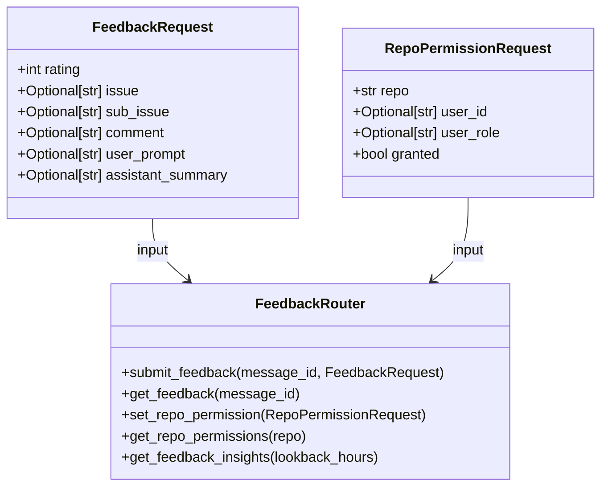
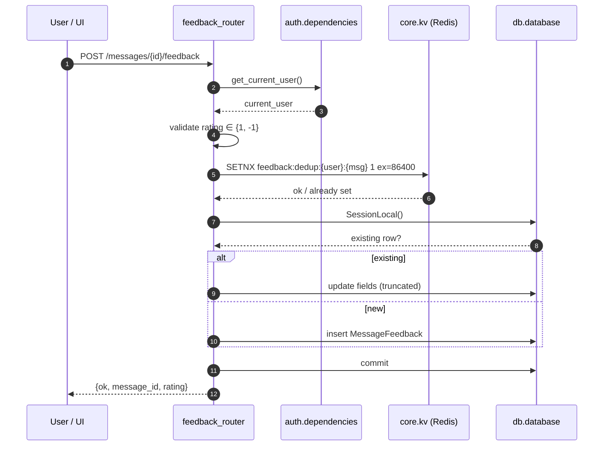
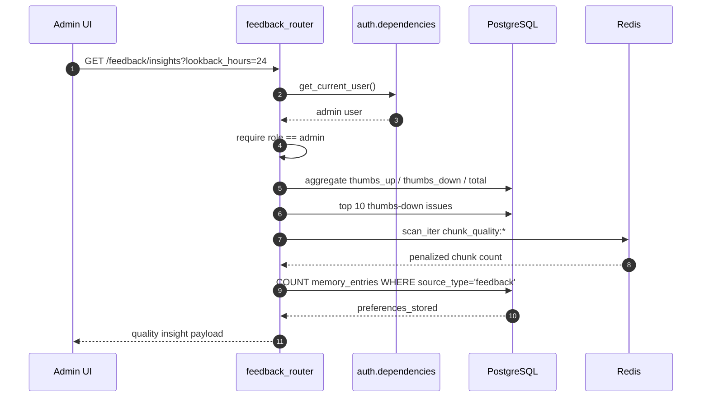
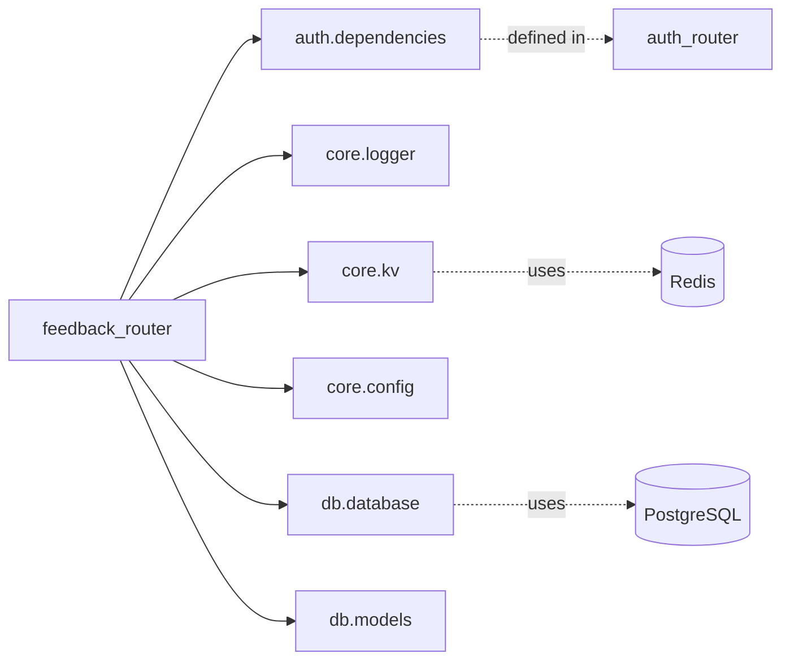

# Feedback Router

The `feedback_router` module exposes a small, focused HTTP API for collecting and managing user feedback on individual AI chat messages, plus lightweight admin utilities for repository access control and feedback-driven quality analytics. It is mounted under the `/chat` prefix and is the canonical backend surface for the thumbs-up / thumbs-down controls shown in chat UIs.

---

## 1. Purpose & Core Functionality

### 1.1 What it does

- **Message-level feedback**: Allows authenticated users to submit a `+1` (thumbs up) or `-1` (thumbs down) rating for any AI response, together with an optional issue category, sub-issue, free-text comment, and a snapshot of the prompt/response.
- **Feedback retrieval**: Lets a user reload their previously submitted feedback for a message so the UI can restore its state.
- **Repository permissions**: Provides admin endpoints to grant or revoke access to indexed code repositories (`RepoPermission`).
- **Quality insights**: Aggregates feedback over a configurable lookback window and surfaces top thumbs-down issues, penalized chunk counts, and stored preference memories for admin dashboards.

### 1.2 Why it matters

Feedback data flows into the `message_feedback` table and is used downstream for:

- Root-cause analysis of bad answers (captured chunk IDs, issue categories).
- Chunk quality penalties (`chunk_quality:*` keys in Redis).
- User preference memory entries (`source_type = 'feedback'`).
- Aggregate quality dashboards and coaching signals.

### 1.3 Design principles

| Principle | Implementation |
|-----------|----------------|
| Idempotency | Upsert semantics: one feedback row per user per message; Redis `SETNX` deduplication prevents flooding. |
| Least privilege | Admin endpoints check `role == "admin"` (or `operator` for read-only permission listing). |
| Graceful degradation | Redis failures are caught and logged; feedback submission is still allowed. |
| Security | Comment/prompt/summary fields are truncated to bounded lengths; Redis `scan_iter` is used instead of `KEYS`. |

---

## 2. Architecture

### 2.1 High-level placement

```mermaid
flowchart TB
    subgraph Clients
        A[ai-ui Chat / KbChat]
        B[abstudio_frontend ChatPanel]
    end

    subgraph API["Shared API Routers"]
        FR["feedback_router (/chat)"]
        CR["chat_router"]
        MR["memory_router"]
        AR["auth_router"]
    end

    subgraph Data
        DB[(PostgreSQL<br/>message_feedback<br/>repo_permission<br/>memory_entries)]
        RC[(Redis<br/>feedback:dedup:*<br/>chunk_quality:*)]
    end

    A -->|POST /messages/{id}/feedback| FR
    B -->|GET /messages/{id}/feedback| FR
    FR -->|read/write| DB
    FR -->|dedup / scan| RC
    FR -.->|auth| AR
    FR -.->|preferences stored| MR
    CR -.->|message context| FR
```

### 2.2 Component diagram



---

## 3. Endpoints

| Method | Path | Auth | Description |
|--------|------|------|-------------|
| `POST` | `/chat/messages/{message_id}/feedback` | Authenticated | Submit or update feedback for a message. |
| `GET`  | `/chat/messages/{message_id}/feedback` | Authenticated | Get the current user's feedback for a message. |
| `POST` | `/chat/admin/repo-permissions` | Admin | Grant or revoke repository access. |
| `GET`  | `/chat/admin/repo-permissions/{repo}` | Operator+ | List permission entries for a repository. |
| `GET`  | `/chat/feedback/insights` | Admin | Aggregated feedback quality metrics. |

### 3.1 Feedback submission flow



### 3.2 Feedback insights flow



---

## 4. Data Models

### 4.1 `FeedbackRequest`

| Field | Type | Description |
|-------|------|-------------|
| `rating` | `int` | `+1` for thumbs up, `-1` for thumbs down. |
| `issue` | `Optional[str]` | High-level issue category (e.g., "incorrect", "hallucination"). |
| `sub_issue` | `Optional[str]` | More granular issue label. |
| `comment` | `Optional[str]` | Free-text user comment; stored truncated to 1000 chars. |
| `user_prompt` | `Optional[str]` | The user message that triggered the response; truncated to 2000 chars. |
| `assistant_summary` | `Optional[str]` | First 1000 chars of the assistant response. |

### 4.2 `RepoPermissionRequest`

| Field | Type | Description |
|-------|------|-------------|
| `repo` | `str` | Repository identifier. |
| `user_id` | `Optional[str]` | Target user (mutually exclusive with `user_role`). |
| `user_role` | `Optional[str]` | Target role (`viewer`/`developer`/`operator`/`security`/`admin`). |
| `granted` | `bool` | `True` to grant, `False` to revoke. |

### 4.3 Persistence

- **`MessageFeedback`** (`db.models`): Stores one row per `(message_id, user_id)` pair.
- **`RepoPermission`** (`db.models`): Stores repository ACL entries.
- **`memory_entries`** (`db.models`): Preference memories derived from feedback (`source_type = 'feedback'`).
- **Redis**:
  - `feedback:dedup:{user_id}:{message_id}` — 24-hour deduplication guard.
  - `chunk_quality:*` — Penalized chunk keys used for downstream RAG quality scoring.

> See [db_models.md](../db_models.md) for the full ORM schema of `MessageFeedback`, `RepoPermission`, and `memory_entries`.

---

## 5. Dependencies

### 5.1 Internal modules

| Dependency | Purpose |
|------------|---------|
| [auth_router.md](auth_router.md) / `auth.dependencies` | JWT-based user authentication (`get_current_user`). |
| [chat_router.md](chat_router.md) | Provides the message context that feedback is attached to. |
| [memory_router.md](memory_router.md) | Consumes preference memory entries written from feedback. |
| `core.kv` | Redis connection helper for deduplication and chunk quality scans. |
| `core.config` | Configuration lookup (`RDB_CACHE`). |
| `core.logger` | Structured logging. |
| `db.database` / `db.models` | SQLAlchemy session and ORM models. |

### 5.2 Dependency graph



---

## 6. Security & Operational Considerations

### 6.1 Security controls

- **SEC-10**: Per-user, per-message feedback deduplication via Redis `SETNX` with a 24-hour TTL. Prevents feedback spam that could distort chunk quality scores.
- **SEC-09**: Chunk quality keys are enumerated with `scan_iter(..., count=100)` instead of the blocking `KEYS` command.
- **Role checks**: Admin-only mutation endpoints; operator-or-above for permission listing.
- **Input bounds**: Free-text fields are truncated before persistence.

### 6.2 Failure modes

| Scenario | Behavior |
|----------|----------|
| Redis unavailable during submission | Dedup is skipped; feedback is still written to PostgreSQL. |
| Redis unavailable during insights | `penalized_chunks` defaults to `0`. |
| Duplicate submission | Existing row is updated (upsert). |
| Non-admin hits admin endpoint | `403 Forbidden`. |
| Invalid rating | `422 Unprocessable Entity`. |

---

## 7. Integration with the broader system

- **Chat UIs**: Both `ai-ui` (`Chat.jsx`, `KbChat.jsx`) and `abstudio_frontend` (`ChatPanel.jsx`) invoke the feedback endpoints through their respective API layers.
- **Quality loops**: Downstream workers and the `feedback_processor` service consume `message_feedback` rows to update chunk penalties and user preference memories.
- **Governance / Coaching**: Aggregated insights feed admin dashboards and coach rule evaluation (e.g., low acceptance rate detection).

> For the full chat lifecycle, see [chat_router.md](chat_router.md). For how feedback drives memory and personalization, see [memory_router.md](memory_router.md).
