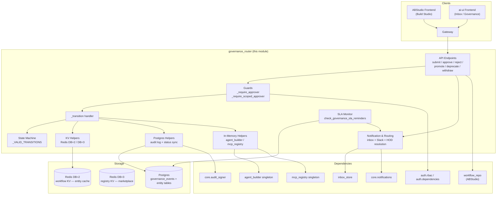
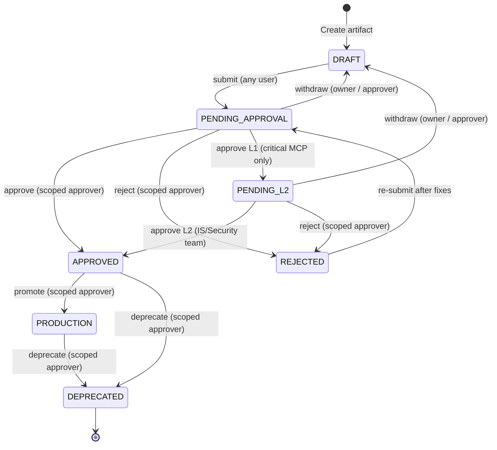
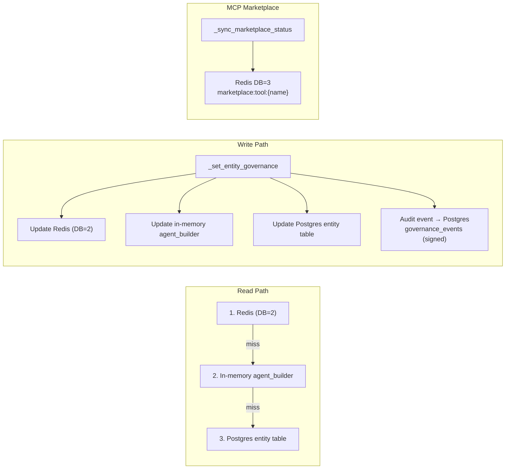
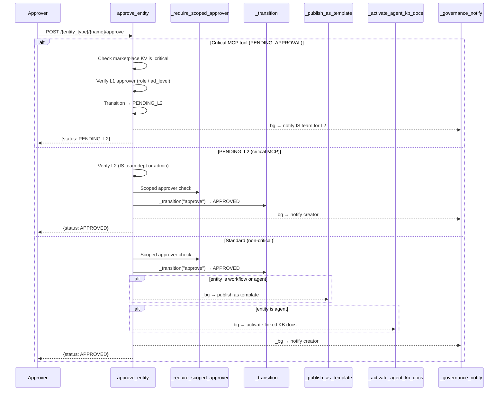
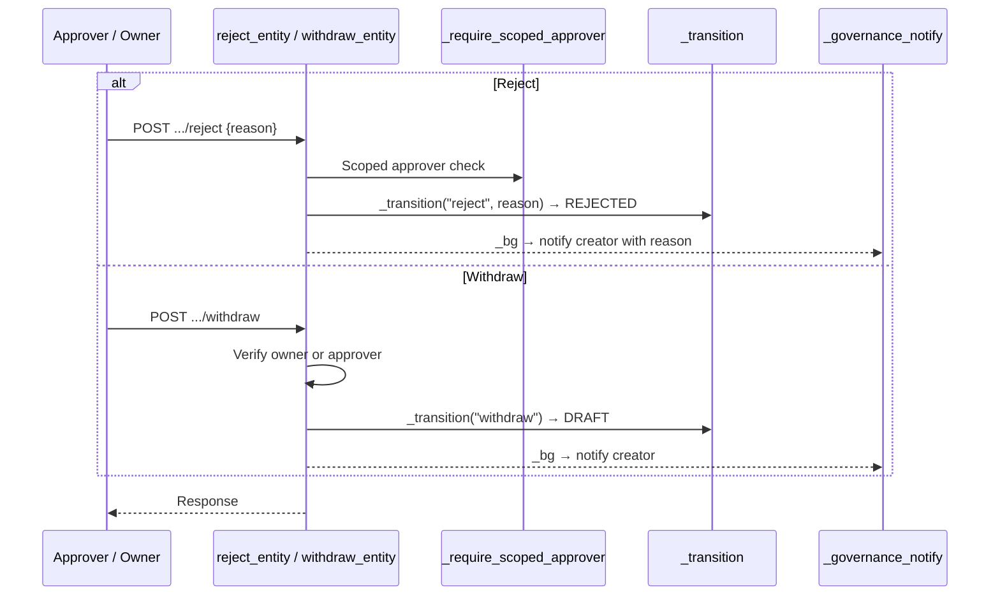
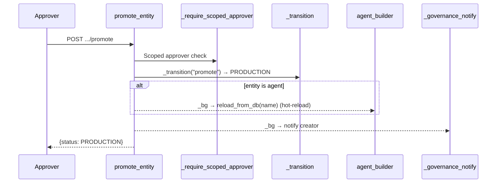
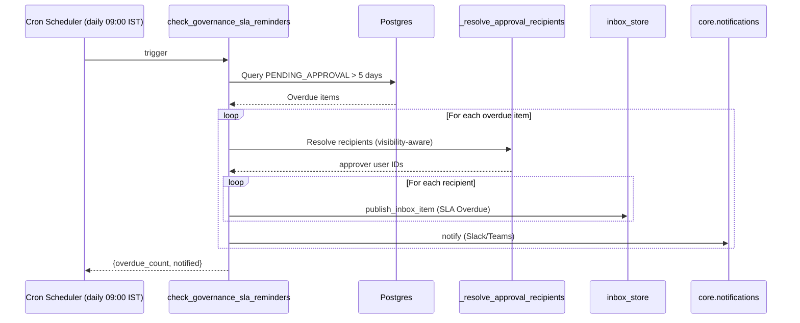
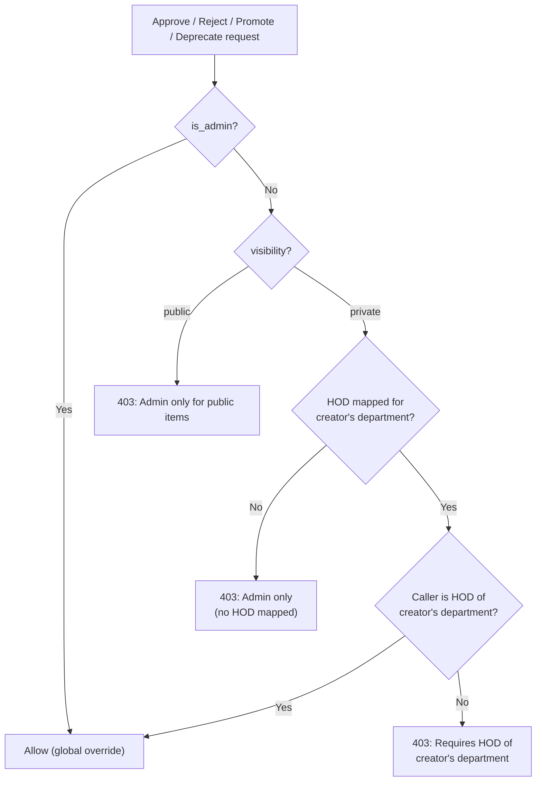

# Governance Router

## Overview

The **Governance Router** (`routers/governance_router.py`) is a FastAPI `APIRouter` (prefix `/governance`) that provides a unified **lifecycle-management and approval-workflow** layer for four categories of platform artifacts:

| Entity Type | Key | Source of Truth |
|---|---|---|
| `agents` | Standalone Agent Builder agents | `AgentRecord` (Postgres) + in-memory `agent_builder` singleton |
| `skills` | Build Studio / marketplace skills | `SkillRecord` (Postgres) + Redis skill store |
| `mcp` | MCP tools (marketplace) | `MCPServer` (Postgres) + Redis tool store + marketplace KV |
| `workflows` | Build Studio workflows | `WorkflowRecord` (Postgres) + Redis workflow store |

Every artifact moves through a governed state machine — **DRAFT → PENDING_APPROVAL → APPROVED → PRODUCTION** — with rejection, withdrawal, deprecation, and (for critical MCP tools) two-level IS/Security approval. All transitions are validated, persisted to a tamper-evident Postgres audit log, mirrored across Redis/in-memory/Postgres, and surfaced to approvers and submitters via the platform inbox and Slack/Teams notifications.

---

## Key Responsibilities

1. **Lifecycle state machine** — enforce valid transitions and reject illegal ones with HTTP 409.
2. **Multi-tier authorization** — role-based (`admin`, `platform_engineer`, `security`), org-hierarchy (`ad_level ≤ 3`), and department-scoped HOD approval.
3. **Dual storage synchronization** — keep Redis (live cache), Postgres (durable authority), and in-memory singletons consistent on every transition.
4. **Immutable audit trail** — every transition is signed (HMAC-SHA256) and written to `governance_events`.
5. **Approval routing & notifications** — route approval requests to the correct approver set (admins for public items; mapped HOD for private/department-scoped items) via inbox + Slack.
6. **Two-level MCP approval** — critical MCP tools require L1 (approver) then L2 (IS/AppSec/InfoSec team) sign-off.
7. **Publish-on-approval** — approved Build Studio workflows/agents are automatically published as shared catalog templates.
8. **SLA monitoring** — daily 5-day SLA reminders for stale `PENDING_APPROVAL` items, with manual trigger endpoints.

---

## Architecture Overview



---

## Entity Lifecycle State Machine



### Transition Table

| Action | Allowed From | To Status | Who |
|---|---|---|---|
| `submit` | `DRAFT`, `REJECTED` | `PENDING_APPROVAL` | Any authenticated user |
| `approve` | `PENDING_APPROVAL`, `PENDING_L2` | `APPROVED` | Scoped approver (L2 for critical MCP) |
| `reject` | `PENDING_APPROVAL`, `PENDING_L2` | `REJECTED` | Scoped approver |
| `withdraw` | `PENDING_APPROVAL`, `PENDING_L2` | `DRAFT` | Owner or approver |
| `promote` | `APPROVED` | `PRODUCTION` | Scoped approver |
| `deprecate` | `PRODUCTION`, `APPROVED` | `DEPRECATED` | Scoped approver |

> **Critical MCP tools** insert an intermediate `PENDING_L2` state between `PENDING_APPROVAL` and `APPROVED`. L1 approval is performed by approver-role users; L2 approval requires IS/AppSec/InfoSec team membership (configurable via `IS_TEAM_DEPARTMENTS` env var, default: `IS,AppSec,InfoSec`) or admin role.

---

## Storage Strategy

The router maintains three layers of storage that are kept in sync on every transition. Redis is the fast live cache; Postgres is the durable authority that survives restarts; in-memory singletons serve runtime execution.



### Redis Layout

| Purpose | DB | Prefix / Index |
|---|---|---|
| Entity governance cache | DB=2 (`RDB_WORKFLOW`) | `agent_builder:agent:`, `skill_store:`, `mcp:tool:`, `workflow_store:` |
| Entity name index | DB=2 | `agent_builder:index`, `skill_store:index`, `mcp:tool:index`, `workflow_store:index` |
| Marketplace tool status sync | DB=3 (`RDB_REGISTRY`) | `marketplace:tool:{name}` |

Redis is **best-effort**: if the KV client is unavailable, the router degrades gracefully to Postgres and in-memory sources. See [core_kv](../core_kv.md) for the KV client abstraction.

### Postgres Tables

| Table | Role |
|---|---|
| `governance_events` | Immutable, signed audit log of every transition |
| `AgentRecord` | Governance status mirror for agents |
| `SkillRecord` | Governance status mirror for skills |
| `MCPServer` | Governance status mirror for MCP tools |
| `WorkflowRecord` | Governance status mirror for workflows |
| `InboxItem` | Approval / status notifications (via `inbox_store`) |
| `User`, `DepartmentHodMapping` | HOD resolution and approver routing |

See [db_models](../db_models.md) for model definitions.

### Audit Signing

Every `_pg_record_event` call computes an HMAC-SHA256 signature over the canonical event dict via `core.audit_signer.sign_event` and stores it in `governance_events.signature`. This makes the audit log tamper-evident — the same scheme used for `sdlc_run_events`. See [core_audit_signer](../core_audit_signer.md).

---

## API Endpoints

| Method | Path | Handler | Auth | Description |
|---|---|---|---|---|
| `GET` | `/{entity_type}` | `list_governance` | Authenticated | List all entities with governance fields, pagination, status filter, visibility/department scoping |
| `GET` | `/{entity_type}/{name}` | `get_entity_status` | Authenticated | Current governance status of a single entity |
| `GET` | `/{entity_type}/{name}/graph` | `get_entity_graph` | Approver | Workflow graph preview for approver (Inbox) |
| `GET` | `/{entity_type}/{name}/config` | `get_entity_config` | Approver | Agent config preview (instructions, tools, skills) |
| `GET` | `/{entity_type}/{name}/source` | `get_entity_source` | Approver | Skill source code preview |
| `GET` | `/{entity_type}/{name}/history` | `get_history` | Authenticated | Durable audit-log history (always returns a list) |
| `POST` | `/{entity_type}/{name}/submit` | `submit_for_approval` | Authenticated | Submit for approval → `PENDING_APPROVAL` |
| `POST` | `/{entity_type}/{name}/approve` | `approve_entity` | Scoped approver | Approve → `APPROVED` (or `PENDING_L2` for critical MCP) |
| `POST` | `/{entity_type}/{name}/reject` | `reject_entity` | Scoped approver | Reject → `REJECTED` (with reason) |
| `POST` | `/{entity_type}/{name}/withdraw` | `withdraw_entity` | Owner / approver | Cancel pending request → `DRAFT` |
| `POST` | `/{entity_type}/{name}/promote` | `promote_entity` | Scoped approver | Promote → `PRODUCTION` |
| `POST` | `/{entity_type}/{name}/deprecate` | `deprecate_entity` | Scoped approver | Deprecate → `DEPRECATED` |
| `GET` | `/sla/overdue` | `get_sla_overdue` | Admin / operator / approver | List items exceeding 5-day SLA |
| `POST` | `/sla/remind` | `trigger_sla_reminders` | Admin | Manually trigger SLA reminder notifications |

All endpoints accept an optional `owner_id` query parameter for **owner-scoped** operations. This is critical because multiple users can create same-named artifacts; the `owner_id` ensures Redis cache entries and Postgres rows are correctly attributed.

---

## Core Components

### Constants & Configuration

| Constant | Description |
|---|---|
| `ENTITY_TYPES` | `{"agents", "skills", "mcp", "workflows"}` — valid entity types |
| `APPROVER_ROLES` | `{"admin", "platform_engineer", "security"}` — roles allowed to approve/reject/promote/deprecate |
| `_VALID_TRANSITIONS` | State-machine map: action → (allowed from-statuses, to-status) |
| `_IS_TEAM_DEPTS` | Departments for L2 MCP approval (env: `IS_TEAM_DEPARTMENTS`, default `IS,AppSec,InfoSec`) |
| `_REDIS_PREFIXES` / `_REDIS_INDICES` | Redis key prefixes and set-index names per entity type |

### KV Helpers

- **`_get_redis()`** — KV client for governance entity cache (DB=2). Returns `None` on KV failure.
- **`_get_marketplace_kv()`** — KV client for marketplace tool registry (DB=3).
- **`_sync_marketplace_status(name, new_status)`** — best-effort update of `marketplace:tool:{name}` status in DB=3.
- **`_load_entity_redis(entity_type, name, owner_id)`** — load entity from Redis; verifies `created_by` matches `owner_id` to prevent cross-user cache collisions.
- **`_save_entity_redis(entity_type, name, data)`** — write entity JSON + add name to index set.
- **`_list_entities_redis(entity_type)`** — enumerate all entities of a type from Redis index.

### Postgres Helpers

- **`_pg_record_event(...)`** — persist a signed `GovernanceEvent` row (fire-and-forget via `_bg`).
- **`_pg_update_status(entity_type, name, updates, owner_id)`** — sync governance fields to the entity's Postgres table (`AgentRecord`, `SkillRecord`, `MCPServer`, `WorkflowRecord`).
- **`_pg_get_history(entity_type, name, owner_id)`** — fetch ordered audit-log entries.

### In-Memory Helpers

- **`_get_entity_status(entity_type, name, owner_id)`** — three-tier status lookup: Redis → in-memory `agent_builder` → Postgres.
- **`_set_entity_governance(entity_type, name, updates, owner_id)`** — apply updates to all three layers (Redis + in-memory + Postgres). If no Redis copy exists, updates Postgres directly.
- **`_get_agent_builder()`** / **`_get_mcp_registry()`** — lazy imports of the `agent_builder` and `mcp_registry` singletons.

### Notification & Approval Routing

These functions form the **single source of truth** for who receives approval requests and who is authorized to act on them:

- **`_resolve_hod_user_ids(department)`** — query `DepartmentHodMapping` → active `User` IDs for the department's HOD(s).
- **`_resolve_admin_user_ids()`** — all active admin user IDs (fallback when no HOD is mapped).
- **`_resolve_approval_recipients(department, visibility)`** — routing logic:
  - `public` → admins only
  - `private` → mapped HOD(s) if present, else admins
- **`_resolve_sent_to_label(visibility, department)`** — human-readable label for inbox message body.
- **`_governance_notify(...)`** — push inbox items to approvers (on submit) or entity creator (on approve/reject/promote/deprecate/withdraw).
- **`_notify_is_team_for_l2(entity_type, name, l1_actor)`** — notify IS/Security team users when a critical MCP tool needs L2 approval.
- **`_notify_approvers(...)`** — fire-and-forget Slack notification via `core.notifications.notify`.
- **`_get_entity_owner_id(...)`** — resolve the creator's user ID from the Postgres entity record.
- **`_get_entity_department(...)`** / **`_get_entity_visibility(...)`** — read department and visibility from the governance mirror record.

### Publish-on-Approval

- **`_publish_as_template(entity_type, artifact_name, owner_id)`** — after approval of a workflow or agent, reads visibility + department from the governance record and publishes the artifact as a shared catalog template via `workflow_repo.publish_workflow_as_template` / `publish_agent_as_template`.
- **`_delete_published_source_agent(artifact_name, owner_id)`** — after an agent is published as a template, removes the source agent row, deregisters triggers, and deletes chat threads so it lives only in the Templates catalog. Mirrors the ABStudio `DELETE /agents/{id}` cleanup.

### Guards & Authorization

- **`_require_approver(current_user)`** — allows `admin`, `platform_engineer`, `security` roles, or `ad_level ≤ 3` (Director+). Used for preview endpoints.
- **`_require_scoped_approver(entity_type, name, current_user)`** — scope-aware guard for approve/reject/promote/deprecate:
  - `admin` → can approve anything (global override)
  - `public` items → admin only
  - `private` items → HOD of the creator's department (if mapped), else admin only
  - Uses `auth.rbac.is_admin`, `is_hod`, `get_hod_departments` for HOD identity (case-insensitive department match)
- **`_actor(current_user)`** — extract actor email or user ID for audit logging.

### Generic Transition Handler

**`_transition(entity_type, name, action, actor, ...)`** is the central function that:

1. Validates the entity type.
2. Looks up the current status (three-tier).
3. Checks the transition against `_VALID_TRANSITIONS` (HTTP 409 on illegal transition).
4. Builds update dict (`status`, `{action}_by`, `{action}_at`, optional `reason`).
5. Calls `_set_entity_governance` to sync all storage layers.
6. Fires `_bg(_pg_record_event, ...)` for the audit log (non-blocking).
7. Returns `(from_status, to_status)` for the endpoint to use in notifications.

### SLA Monitoring

- **`check_governance_sla_reminders()`** — queries `governance_events` for items in `PENDING_APPROVAL` for > 5 days with no subsequent approve/reject. For each stale item, resolves approver recipients (same visibility-aware routing) and pushes inbox + Slack notifications. Called daily by the cron scheduler at 09:00 IST.
- **`_query_overdue_items()`** — raw Postgres query helper shared by the endpoint and cron.
- **`get_sla_overdue`** — `GET /governance/sla/overdue` endpoint for admin/operator/approver.
- **`trigger_sla_reminders`** — `POST /governance/sla/remind` endpoint for manual admin trigger.

---

## Process Flows

### Submit for Approval

```mermaid
sequenceDiagram
  participant U as User (any)
  participant EP as submit_for_approval
  participant TR as _transition
  participant ST as _set_entity_governance
  participant PG as _pg_record_event
  participant N as _governance_notify
  participant IS as inbox_store

  U->>EP: POST /{entity_type}/{name}/submit?owner_id=...
  EP->>TR: _transition("submit", actor)
  TR->>TR: Validate current status ∈ {DRAFT, REJECTED}
  TR->>ST: Update Redis + in-memory + Postgres → PENDING_APPROVAL
  TR-->>EP: (from_status, to_status)
  EP->>EP: Sync marketplace KV (if MCP)
  EP-->>PG: _bg → sign + persist GovernanceEvent
  EP-->>N: _bg → resolve recipients
  N->>N: public → admins; private → HOD or admins
  N->>IS: publish_inbox_item per recipient
  N->>IS: Also notify submitter
  EP-->>U: {status: PENDING_APPROVAL}
```

### Approve (Standard + Two-Level MCP)



### Reject / Withdraw



### Promote to Production



### SLA Reminder Flow



---

## Authorization Model



### Approval Routing vs. Authorization

The routing logic (`_resolve_approval_recipients`) and the authorization guard (`_require_scoped_approver`) share the **same rules** to ensure notifications and enforcement are aligned:

| Visibility | Notification Recipients | Authorized Approvers |
|---|---|---|
| `public` | All admins | Admin only |
| `private` (HOD mapped) | Department HOD(s) | Department HOD(s) |
| `private` (no HOD mapped) | All admins | Admin only |

> Deliberately, broad `ad_level ≤ 3` seniors are **not** used for routing or authorization — only the mapped HOD or an admin. This prevents approval requests from leaking to unrelated departments.

---

## Component Interaction Diagram

```mermaid
graph TB
  subgraph Endpoints
    list_governance
    get_entity_status
    get_entity_graph
    get_entity_config
    get_entity_source
    get_history
    submit_for_approval
    approve_entity
    reject_entity
    withdraw_entity
    promote_entity
    deprecate_entity
    get_sla_overdue
    trigger_sla_reminders
  end

  subgraph Core
    _transition
    _set_entity_governance
    _get_entity_status
    _require_approver
    _require_scoped_approver
    _governance_notify
    _resolve_approval_recipients
    _publish_as_template
    check_governance_sla_reminders
  end

  subgraph Storage
    _load_entity_redis
    _save_entity_redis
    _list_entities_redis
    _pg_record_event
    _pg_update_status
    _pg_get_history
    _sync_marketplace_status
  end

  submit_for_approval --> _transition
  approve_entity --> _transition
  reject_entity --> _transition
  withdraw_entity --> _transition
  promote_entity --> _transition
  deprecate_entity --> _transition

  _transition --> _get_entity_status
  _transition --> _set_entity_governance
  _transition --> _pg_record_event

  _set_entity_governance --> _load_entity_redis
  _set_entity_governance --> _save_entity_redis
  _set_entity_governance --> _pg_update_status

  approve_entity --> _require_scoped_approver
  reject_entity --> _require_scoped_approver
  promote_entity --> _require_scoped_approver
  deprecate_entity --> _require_scoped_approver

  get_entity_graph --> _require_approver
  get_entity_config --> _require_approver
  get_entity_source --> _require_approver

  submit_for_approval --> _governance_notify
  approve_entity --> _governance_notify
  approve_entity --> _publish_as_template
  _governance_notify --> _resolve_approval_recipients

  get_sla_overdue --> _pg_get_history
  trigger_sla_reminders --> check_governance_sla_reminders
  check_governance_sla_reminders --> _resolve_approval_recipients
```



---

## Data Model

### `GovernanceEvent` (Postgres)

| Column | Type | Description |
|---|---|---|
| `id` | UUID | Primary key |
| `entity_type` | String(50) | `agents`, `skills`, `mcp`, or `workflows` |
| `name` | String(255) | Entity name |
| `action` | String(50) | `submit`, `approve`, `approve_l1`, `reject`, `promote`, `deprecate`, `withdraw` |
| `from_status` | String(50) | Previous status (nullable) |
| `to_status` | String(50) | New status |
| `actor` | String(255) | User email or `"system"` |
| `reason` | Text | Rejection reason (nullable) |
| `created_by` | String(255) | Owner user ID for owner-scoped queries |
| `signature` | Text | HMAC-SHA256 signature |
| `created_at` | DateTime | Timestamp |

### Pydantic Models

| Model | Fields | Usage |
|---|---|---|
| `RejectBody` | `reason: str = ""` | Request body for `POST .../reject` |

---

## Dependencies

### Internal Modules

| Module | Usage |
|---|---|
| [auth_dependencies](../auth_dependencies.md) | `get_current_user` — JWT/API-key/cookie authentication for all endpoints |
| [auth_rbac](../auth_rbac.md) | `is_admin`, `is_hod`, `get_hod_departments` — HOD-scoped authorization |
| [core_kv](../core_kv.md) | `get_kv`, `KVError` — Redis KV client for entity cache and marketplace sync |
| [core_logger](../core_logger.md) | `logger` — structured logging |
| [core_config](../infrastructure/core_config.md) | `REDIS_HOST`, `REDIS_PORT`, `RDB_WORKFLOW`, `RDB_REGISTRY` — KV configuration |
| [core_notifications](../core_notifications.md) | `notify` — Slack/Teams/email notifications |
| [core_audit_signer](../core_audit_signer.md) | `sign_event` — HMAC-SHA256 audit event signing |
| [db_models](../db_models.md) | `GovernanceEvent`, `AgentRecord`, `SkillRecord`, `MCPServer`, `WorkflowRecord`, `User`, `DepartmentHodMapping`, `InboxItem` |
| [store_inbox_store](../store_inbox_store.md) | `publish_inbox_item` — inbox notification delivery |
| [agents_agent_builder](../agents_agent_builder.md) | `agent_builder` singleton — in-memory agent cache and hot-reload |
| [mcp_registry](../mcp_registry.md) | `mcp_registry` singleton — in-memory MCP tool/skill registry |
| [app_core_workflow_repo](../app_core_workflow_repo.md) | `publish_workflow_as_template`, `publish_agent_as_template`, `get_workflow_by_name`, `get_agent_by_name`, `get_skill`, `delete_agent`, trigger cleanup |
| [app_services_trigger_scheduler](../app_services_trigger_scheduler.md) | `deregister_trigger` — trigger cleanup on published-agent deletion |
| [app_api_agent_chat](../app_api_agent_chat.md) | Agent chat store — thread cleanup on published-agent deletion |

### External Libraries

| Library | Usage |
|---|---|
| `fastapi` | `APIRouter`, `HTTPException`, `Depends`, `Query` |
| `pydantic` | `BaseModel` for request validation |
| `sqlalchemy` | Raw SQL text queries for SLA checks |
| `threading` | `_bg` fire-and-forget daemon threads |

---

## Integration Points

### ABStudio Build Studio

The governance router is the **approval gateway** for artifacts created in ABStudio's Build Studio. When a user clicks "Deploy" on a workflow or agent, the frontend calls `POST /governance/{entity_type}/{name}/submit`. Upon approval, the artifact is published as a shared template via `workflow_repo`. See [api_governance](api_governance.md) for the ABStudio-side governance API wrappers.

### ai-ui Inbox

The ai-ui frontend's `Inbox` component consumes governance inbox items (`type = "governance_approval"`) to render approval cards with inline actions. The metadata fields (`entity_type`, `entity_name`, `status`, `current_status`, `owner_id`) drive the UI's approve/reject buttons. The preview endpoints (`/graph`, `/config`, `/source`) provide approvers with artifact details without needing owner-scoped access.

### Cron Scheduler

`check_governance_sla_reminders()` is invoked daily at 09:00 IST (03:30 UTC) by the platform's cron scheduler (see [worker_orchestration](../workers/worker_orchestration.md)). It can also be triggered manually via `POST /governance/sla/remind`.

### Agent KB Activation

When an agent is approved, any linked KnowledgeDocuments are activated (embedded into pgvector under `repo='agent_kb:{name}'`) in a background thread. This makes the agent's knowledge base immediately RAG-searchable upon approval.

### Agent Hot-Reload on Promote

When an agent is promoted to `PRODUCTION`, `agent_builder.reload_from_db(name)` is called in a background thread so the new/updated system prompt takes effect immediately without a server restart.

---

## Error Handling & Resilience

| Scenario | Behavior |
|---|---|
| Redis unavailable | `_get_redis()` returns `None`; reads fall through to in-memory/Postgres; writes skip Redis |
| Postgres audit write fails | Logged as warning; API response is not blocked (fire-and-forget via `_bg`) |
| Postgres status sync fails | Logged as warning; Redis/in-memory still updated |
| Marketplace KV sync fails | Logged as warning; no-op |
| Illegal state transition | HTTP 409 with descriptive message |
| Entity not found | HTTP 404 |
| Insufficient privileges | HTTP 403 with detailed reason |
| Notification failure | Logged as warning; never blocks API response |

The `_bg(fn, *args, **kwargs)` helper wraps every non-critical side-effect (audit logging, notifications, template publishing, KB activation, hot-reload) in a daemon thread that logs and swallows exceptions, ensuring the caller is never blocked.
