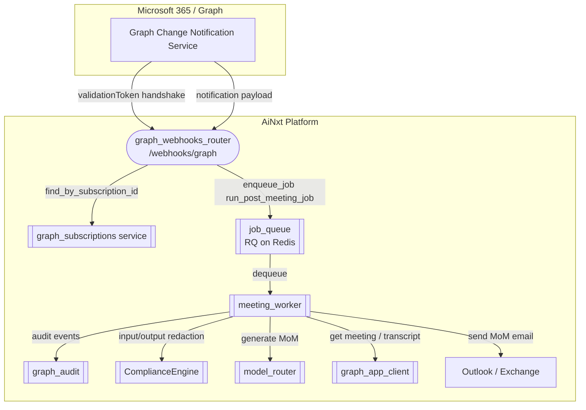
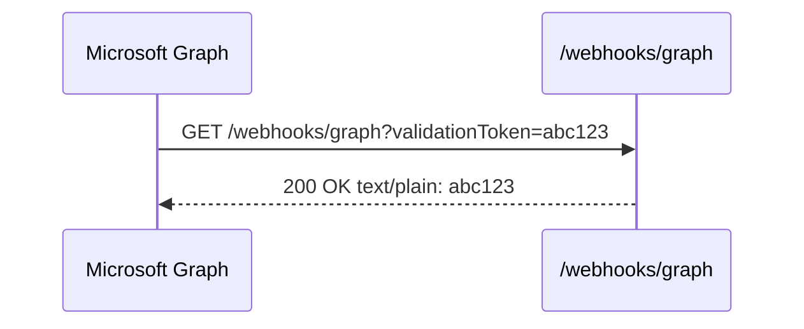
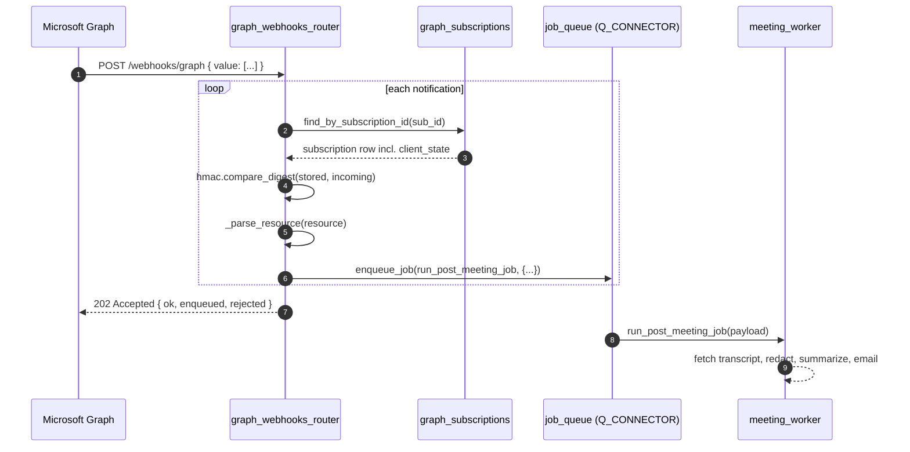

# `graph_webhooks_router` — Microsoft Graph Change-Notification Receiver

## Brief Introduction

`graph_webhooks_router` is a small, latency-sensitive FastAPI router that exposes a single public endpoint:

```
GET|POST /webhooks/graph
```

Its job is to receive [Microsoft Graph change notifications](https://learn.microsoft.com/en-us/graph/webhooks) for meeting transcript events and hand them off to the asynchronous post-meeting pipeline. The router never does heavy work itself: it validates the incoming request, verifies the subscription secret, parses the meeting identifiers, and enqueues a job on the connector queue. The actual transcript fetch, PII redaction, minutes-of-meeting (MoM) generation, and email distribution happen in a background worker.

This router is part of the [`shared_api_routers`](shared_api_routers.md) family and is typically mounted by the main gateway / ABStudio backend application.

---

## What This Module Does

| Concern | Responsibility of this router | Delegated to |
|---|---|---|
| Accept Graph validation handshake | Echo `validationToken` as `text/plain` within the 10-second window | — |
| Accept Graph notification payloads | Parse JSON body and iterate over `value[]` | — |
| Subscription secret verification | Constant-time `clientState` comparison against stored subscription | [`graph_subscriptions`](../graph_subscriptions.md) |
| Resource-path parsing | Extract `organizer_id` and `meeting_id` from Graph resource URLs | `_parse_resource` helper |
| Async work dispatch | Enqueue `workers.meeting_worker.run_post_meeting_job` on `Q_CONNECTOR` | [`job_queue`](../job_queue.md) |
| Fast acknowledgement | Return `202 Accepted` immediately so Graph does not retry | — |

---

## Architecture & Placement



The router sits at the edge of the platform. It is intentionally thin: all business logic (transcript processing, compliance, summarization, distribution) lives in downstream modules.

---

## Core Components

### `graph_notifications(request: Request)`

The only route handler. Registered for both `GET` and `POST` on `/webhooks/graph`.

Behavior:

1. **Validation handshake** — If the query string contains `validationToken`, echo it back as a `text/plain` `200 OK` response. This is required when Graph creates or renews a subscription.
2. **Notification ingestion** — Otherwise, read the JSON body and process each item in `value`.
3. **Per-notification verification** — Look up the subscription by `subscriptionId` and compare the supplied `clientState` with the stored value using `hmac.compare_digest` (constant-time).
4. **Resource parsing** — Use `_parse_resource` to pull `organizer_id` and `meeting_id` from the `resource` path.
5. **Enqueue** — Call `enqueue_job(..., queue_name=Q_CONNECTOR)` to schedule `workers.meeting_worker.run_post_meeting_job`.
6. **Acknowledge** — Return `202 Accepted` with a small JSON summary (`enqueued`, `rejected`).

### `_parse_resource(resource: str)`

A regex helper that understands Graph transcript resource paths such as:

```text
users/7c3.../onlineMeetings/19:.../transcripts/9d8...
users('7c3...')/onlineMeetings('19:...')/transcripts('9d8...')
```

It returns a tuple `(organizer_id, meeting_id)` or `None` for either part if the path is malformed.

---

## Microsoft Graph Webhook Contract

### Validation Handshake

When a subscription is created or renewed, Graph sends a request containing `?validationToken=<token>`. The endpoint must respond with the **exact** token as `text/plain` within 10 seconds.



### Notification Delivery

After validation, Graph delivers change notifications as JSON:

```json
{
  "value": [
    {
      "subscriptionId": "...",
      "clientState": "...",
      "resource": "users/.../onlineMeetings/.../transcripts/...",
      "changeType": "created"
    }
  ]
}
```

The router must respond quickly (target < 3 seconds). Long-running work is deferred to the worker queue.



---

## Data Flow

```mermaid
flowchart LR
    A[Graph notification] --> B{validationToken?}
    B -->|yes| C[Echo token 200 text/plain]
    B -->|no| D[Parse JSON body]
    D --> E[For each notification]
    E --> F{subscription known?<br/>clientState valid?}
    F -->|no| G[rejected++]
    F -->|yes| H[Parse organizer + meeting IDs]
    H --> I{IDs valid?}
    I -->|no| G
    I -->|yes| J[Enqueue post-meeting job]
    J --> K[Return 202 {enqueued, rejected}]
    G --> K
```

---

## Component Interaction

| This module calls | Purpose | Module doc |
|---|---|---|
| `services.graph_subscriptions.find_by_subscription_id` | Load the stored subscription record for `clientState` verification | [`graph_subscriptions`](../graph_subscriptions.md) |
| `core.job_queue.enqueue_job` | Schedule the async worker on `Q_CONNECTOR` | [`job_queue`](../job_queue.md) |
| `workers.meeting_worker.run_post_meeting_job` | The worker function being enqueued | [`meeting_worker`](../meeting_worker.md) |
| `core.logger.logger` | Structured logging for security/ops events | [`core_logger`](../core_logger.md) |

The router does **not** import or call:

- [`ComplianceEngine`](../compliance_engine.md)
- [`model_router`](../model_router.md)
- [`graph_app_client`](../graph_app_client.md)
- [`meeting_transcript`](../meeting_transcript.md)

Those are used later by [`meeting_worker`](../meeting_worker.md).

---

## Security & Reliability

### Subscription Secret Verification

`clientState` is compared with `hmac.compare_digest` to prevent timing attacks. If the subscription is unknown or the secret does not match, the notification is counted as `rejected` and skipped.

### Fast Acknowledgement

Graph will retry notifications that do not receive a 2xx response promptly. The router always returns `202 Accepted` after enqueueing (or `200` for validation handshakes), keeping response times well under Graph's retry thresholds.

### Idempotency

The router itself does not deduplicate notifications. The downstream [`meeting_worker`](../meeting_worker.md) uses a `_claim(meeting_id, organizer_id, ...)` step to ensure the same meeting is not processed twice, even if Graph delivers duplicate notifications.

### Fallback Path

If inbound HTTPS webhooks are blocked (for example, by NPCI network policies), the platform falls back to polling via [`meeting_worker`](../meeting_worker.md). In that mode, the worker periodically calls `poll_recent_meetings` instead of waiting for a push notification.

---

## Error Handling

| Scenario | Behavior |
|---|---|
| `validationToken` present | Return `200 OK` with the raw token as `text/plain`; ignore body. |
| JSON body cannot be parsed | Return `200 OK {ok: true}` — no actionable data. |
| Unknown subscription or `clientState` mismatch | Log warning, increment `rejected`, continue processing other notifications. |
| Resource path does not contain organizer + meeting IDs | Log warning, increment `rejected`. |
| `enqueue_job` fails (Redis/RQ unavailable) | Log error, increment `rejected`. Graph will retry the notification. |
| All notifications processed | Return `202 Accepted` with `enqueued` and `rejected` counts. |

---

## Operational Notes

- **Queue**: Jobs are placed on `Q_CONNECTOR`, the same queue used for connector-related background work.
- **Timeout / Retry**: `enqueue_job` applies its default retry policy (configured in [`job_queue`](../job_queue.md)). The router does not override it.
- **Logging**: Every batch logs `graph webhook: enqueued=X rejected=Y`. Security-relevant events (mismatched `clientState`, parse failures) are logged at `warning` or `error` level.
- **No authentication header parsing**: Graph webhook authentication is based on the `clientState` secret. The router does not inspect JWT or API keys for this endpoint.

---

## API Reference

### `GET|POST /webhooks/graph`

| Aspect | Details |
|---|---|
| Methods | `GET`, `POST` |
| Query parameter | `validationToken` — present only during subscription handshake |
| Request body (POST) | Graph change-notification envelope: `{ "value": [ { "subscriptionId", "clientState", "resource", ... } ] }` |
| Response (handshake) | `200 OK` `text/plain` with the exact token |
| Response (notification) | `202 Accepted` `application/json` `{ "ok": true, "enqueued": int, "rejected": int }` |

---

## See Also

- [`shared_api_routers`](shared_api_routers.md) — the router collection this module belongs to
- [`graph_subscriptions`](../graph_subscriptions.md) — subscription lifecycle and `clientState` storage
- [`job_queue`](../job_queue.md) — RQ-based job enqueueing
- [`meeting_worker`](../meeting_worker.md) — the worker that processes enqueued meeting jobs
- [`compliance_engine`](../compliance_engine.md) — PII / sensitive-data redaction used by the worker
- [`model_router`](../model_router.md) — model-agnostic generation used to produce the MoM
- [`webhooks_router`](webhooks_router.md) — other platform webhooks (GitLab, Jira, generic workflow triggers)
