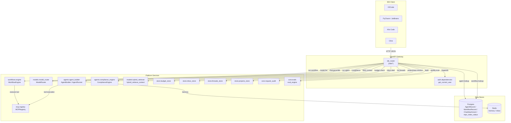
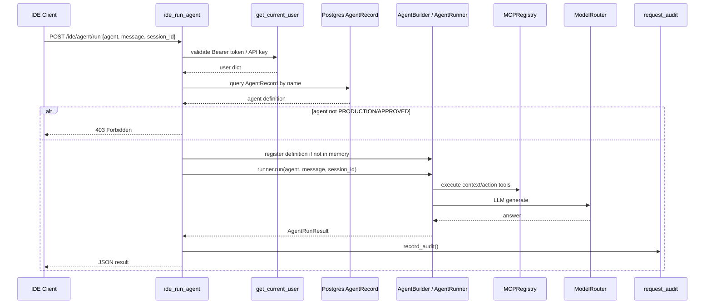
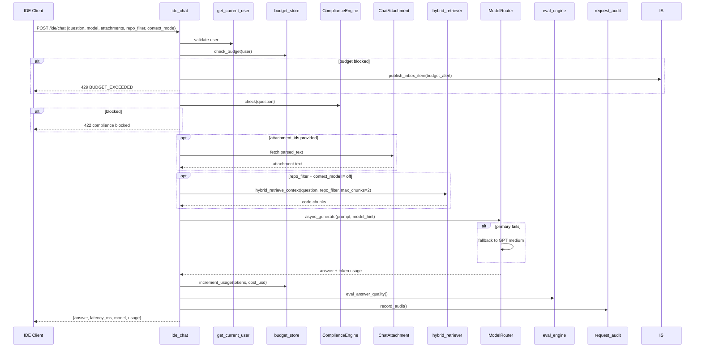
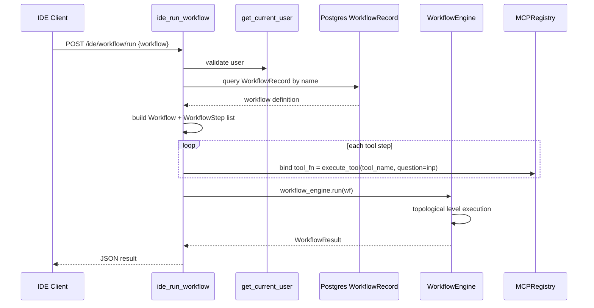
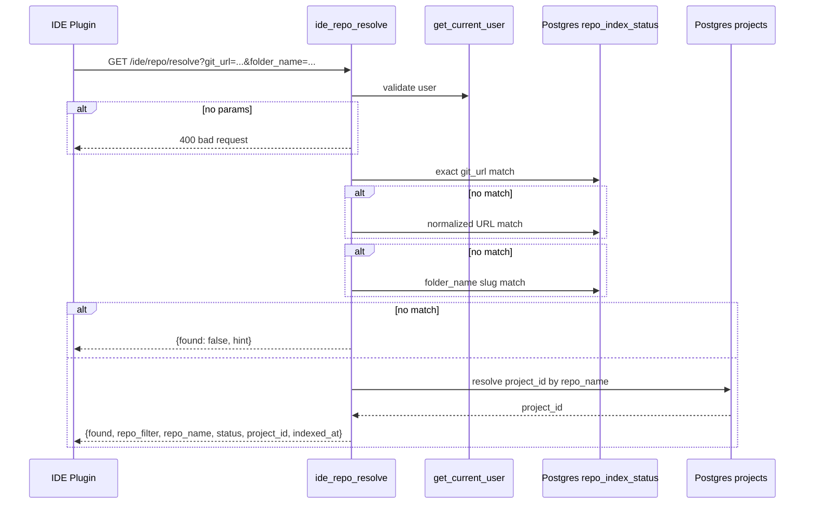

# IDE Router

The `ide_router` module exposes a simplified `/ide/*` HTTP API surface designed for IDE plugins and CLI integrations (VSCode, PyCharm, JetBrains IDEs, Kilo Code, Cline, etc.). It acts as a thin adapter layer that translates flat, JSON-only requests into the platform's existing agent, chat, workflow, and repository-resolution services. All endpoints are synchronous and return JSON, avoiding server-sent events (SSE) so that plugin clients can consume them with simple HTTP clients.

## Core Responsibilities

- Provide IDE-friendly wrappers over platform capabilities:
  - Run named agents (`POST /ide/agent/run`).
  - Non-streaming chat with model selection and RAG (`POST /ide/chat`).
  - Run named workflows (`POST /ide/workflow/run`).
  - List conversation threads (`GET /ide/threads`).
  - List available models (`GET /ide/models`).
  - Resolve a local git workspace to a platform repo filter (`GET /ide/repo/resolve`).
- Enforce authentication, budget gates, PCI compliance, and request auditing for IDE traffic.
- Tag every request with an IDE client source for telemetry and the 10x AiNxt-built gate.

## Architecture

## Component Reference

### Request Models

| Model | Purpose |
|-------|---------|
| `IDEAgentRun` | Body for `POST /ide/agent/run`: `agent`, `message`, optional `session_id`. |
| `IDEChat` | Body for `POST /ide/chat`: `question`, optional `model`, `attachment_ids`, `project_id`, `repo_filter`, and `context_mode`. |
| `IDEWorkflowRun` | Body for `POST /ide/workflow/run`: `workflow` name. |

### Route Handlers

| Handler | Route | Description |
|---------|-------|-------------|
| `ide_run_agent` | `POST /ide/agent/run` | Loads an `AgentRecord` from Postgres, registers it in `AgentBuilder` if missing, and runs it via `AgentRunner`. Returns the `AgentRunResult` as JSON. |
| `ide_chat` | `POST /ide/chat` | Budget gate, PCI compliance, attachment expansion, optional RAG injection, model routing, LLM generation, cost tracking, and answer quality evaluation. |
| `ide_run_workflow` | `POST /ide/workflow/run` | Loads a `WorkflowRecord`, builds a `Workflow` object with tool-bound steps, and executes it via `WorkflowEngine`. |
| `ide_list_threads` | `GET /ide/threads` | Lists conversation threads via `store.threads_store`. |
| `ide_get_models` | `GET /ide/models` | Returns available models grouped by provider, including local/in-house models when available. |
| `ide_repo_resolve` | `GET /ide/repo/resolve` | Maps a git remote URL or folder name to a platform `repo_filter` for RAG. |

### Shared Helpers

| Helper | Purpose |
|--------|---------|
| `_req_id()` | Generates an 8-character correlation ID per request. |
| `_tag_ide_source(request)` | Detects IDE variant from the `x-ainxt-client` header and sets logger context. |
| `_log_divider(req_id, label)` | Emits structured debug log separators when `IDE_DEBUG=true`. |

## Data Flows

### Agent Run Flow

### Chat Flow

### Workflow Run Flow

### Repository Resolution Flow

## Dependencies

The router is intentionally thin; it delegates all heavy lifting to existing platform modules:

| Dependency Module | Usage in ide_router |
|-------------------|---------------------|
| [auth_router](auth_router.md) / [auth.dependencies](../auth_dependencies.md) | `get_current_user` validates JWT or API-key tokens. |
| [agents_router](agents_router.md) / [agents.agent_builder](../agents_agent_builder.md) | `AgentBuilder` and `AgentRunner` execute named agents. |
| [chat_router](chat_router.md) | `ide_chat` mirrors `POST /ask` but returns JSON instead of streaming. |
| [workflows](../workflows.md) / [workflows.engine](../workflows_engine.md) | `WorkflowEngine` executes DAG workflows. |
| [mcp_registry](../mcp_registry.md) | `MCPRegistry.execute_tool()` binds workflow tool steps. |
| [model_router](../model_router.md) | `ModelRouter.async_generate()` routes chat prompts to the correct LLM gateway. |
| [compliance_engine](../compliance_engine.md) | `ComplianceEngine.check()` blocks PCI/PII in IDE chat input. |
| [budget_router](budget_router.md) / `store.budget_store` | Budget gate and usage/cost increment. |
| [threads_router](threads_router.md) / `store.threads_store` | Thread listing. |
| [index_router](index_router.md) | `repo_index_status` table is queried for repo resolution. |
| [projects_router](projects_router.md) / `store.projects_store` | Project-to-repo mapping for RAG context. |
| [evals](../evals.md) / `core.evals` | Fire-and-forget answer quality evaluation. |

## Configuration & Environment Variables

| Variable | Default | Description |
|----------|---------|-------------|
| `IDE_DEBUG` | `false` | Enables per-request DEBUG logging for the router. |
| `IDE_ATTACH_MAX_CHARS` | `8000` | Maximum characters injected per chat attachment. |
| `IDE_MAX_CONTEXT_CHARS` | `24000` | Hard cap on the final prompt size sent to the model. |

## Security & Governance

- **Authentication**: Every route depends on `get_current_user`, which accepts JWT session tokens or API keys (the typical IDE integration path).
- **Budget enforcement**: `ide_chat` performs an explicit budget check using the authenticated user ID, bypassing only local/in-house models that carry no external API cost.
- **PCI/PII compliance**: Chat input is scanned by `ComplianceEngine`; blocked inputs return HTTP 422.
- **Context trimming**: Prompts exceeding `IDE_MAX_CONTEXT_CHARS` are truncated to prevent runaway token spend.
- **Request audit**: Both `/ide/agent/run` and `/ide/chat` call `core.request_audit.record_audit()` to feed client-source telemetry and the 10x AiNxt-built gate.

## Error Handling

| Scenario | HTTP Status | Detail |
|----------|-------------|--------|
| Missing/invalid token | 401 | From `get_current_user`. |
| Agent/workflow not found | 404 | Named entity missing in Postgres. |
| Agent not PRODUCTION/APPROVED | 403 | Only production agents may run via IDE. |
| Budget exhausted | 429 | `BUDGET_EXCEEDED` with reason. |
| Compliance block | 422 | Input blocked by compliance findings. |
| Model failure | 500 | Primary and fallback LLM calls failed. |
| Workflow execution error | 500 | `WorkflowEngine.run()` raised. |

## How It Fits into the System

The `ide_router` sits alongside the main REST and OpenAI-compatible routers in the FastAPI gateway. It is not a separate service; it reuses the same authentication, model routing, compliance, budget, and audit infrastructure. By providing flat JSON endpoints, it lowers the integration cost for IDE plugins that cannot easily consume SSE or complex nested payloads. The router also contributes telemetry data (`client_source=ide-vscode` or `ide-jetbrains`) that powers platform analytics and the 10x AiNxt-built gate.

## See Also

- [auth_router](auth_router.md) — authentication and API-key management.
- [agents_router](agents_router.md) — agent CRUD and run endpoints.
- [chat_router](chat_router.md) — streaming chat endpoints.
- [workflows](../workflows.md) / [workflows_engine](../workflows_engine.md) — workflow execution engine.
- [mcp_registry](../mcp_registry.md) — tool and skill registry.
- [model_router](../model_router.md) — LLM routing and gateway selection.
- [budget_router](budget_router.md) — budget enforcement and usage tracking.
- [threads_router](threads_router.md) — conversation thread management.
- [index_router](index_router.md) — repository indexing status.
