# Index Router Module

## 1. Introduction

The **Index Router** (`routers/index_router.py`) is a FastAPI APIRouter that provides governance-gated codebase indexing for the platform. It enables operators to submit GitLab repository URLs for indexing into the platform's pgvector store, subject to a C1+ / admin approval workflow. Once approved, a background worker clones the repository using the submitter's or approver's GitLab Personal Access Token (PAT), chunks the source files, generates embeddings, and stores them in pgvector for downstream semantic search, RAG, and SDLC workflows.

The module also exposes admin-only endpoints for listing indexed repositories, checking per-repo health and staleness, deleting vectors, re-indexing individual repos, and triggering bulk re-indexing of stale repos.

### Key Responsibilities

| Responsibility | Description |
|---|---|
| **Governance-gated submission** | Any authenticated operator can submit a GitLab repo URL for indexing; requests enter a `pending` state awaiting C1+ / admin approval. |
| **Approval / rejection workflow** | Senior-level users (ad_level ≤ 3) or admins can approve or reject pending requests, with 4-eyes enforcement and department-scoping. |
| **Admin auto-approval** | Admin submissions bypass the approval queue and trigger indexing immediately. |
| **Token-based cloning** | GitLab cloning uses the submitter's or approver's stored PAT — never service-account credentials. |
| **Vector lifecycle management** | Stale vectors are scoped and wiped at submission time; delete and reindex endpoints manage vector lifecycle per (repo, product, branch). |
| **Health & staleness monitoring** | Admin endpoints report per-repo index status, vector counts, and staleness (repos not indexed in >7 days). |
| **Bulk re-indexing** | Admins can trigger re-indexing of all stale repos (or all repos) in a single call. |

---

## 2. Architecture Overview

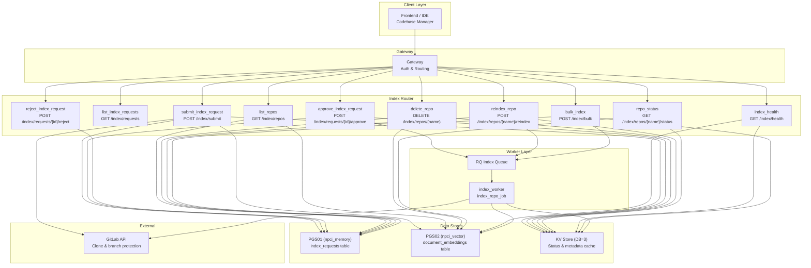

---

## 3. Core Components

### 3.1 Endpoint Summary

| Endpoint | Method | Auth | Description |
|---|---|---|---|
| `/index/submit` | POST | Any authenticated user | Submit a GitLab repo URL for indexing |
| `/index/requests` | GET | Any authenticated user | List index requests (scoped by role/department) |
| `/index/requests/{req_id}/approve` | POST | C1+ (ad_level ≤ 3) or admin | Approve a pending index request |
| `/index/requests/{req_id}/reject` | POST | C1+ (ad_level ≤ 3) or admin | Reject a pending index request |
| `/index/repos` | GET | Any authenticated user | List indexed repos with status & vector counts |
| `/index/repos/{name}` | DELETE | C1+ or admin | Delete vectors for a specific (repo, product, branch) |
| `/index/repos/{name}/reindex` | POST | Admin only | Re-index a repo from scratch |
| `/index/repos/{name}/status` | GET | Admin, submitter, or dept member | Get live status & vector count for a repo |
| `/index/health` | GET | Admin only | Health summary for all indexed repos |
| `/index/bulk` | POST | Admin only | Bulk re-index stale or all repos |

### 3.2 Pydantic Schemas

#### `IndexSubmitRequest`

```python
class IndexSubmitRequest(BaseModel):
    gitlab_url:  str              # e.g. https://gitlab.company.com/team/repo
    branch:      str = "main"
    product_id:  Optional[str] = None
    note:        Optional[str] = None
```

#### `ReviewAction`

```python
class ReviewAction(BaseModel):
    note: Optional[str] = None
```

#### `BulkIndexRequest`

```python
class BulkIndexRequest(BaseModel):
    stale_only:  bool = True    # True = only re-index repos stale > 7 days; False = all
    stale_days:  int  = 7       # staleness threshold
```

### 3.3 Internal Helpers

| Helper | Purpose |
|---|---|
| `_get_redis()` | Returns a cached KV client (DB=3) for index status/metadata caching. |
| `_get_pg()` | Connects to PGS01 (`npci_memory`) for `index_requests`, `products`, and `dept_product_mappings` tables. |
| `_get_vec_pg()` | Connects to PGS02 (`npci_vector`) for `document_embeddings` table. |
| `_validate_gitlab_url(url)` | Validates that the URL starts with `https://` and contains no path traversal or spaces. |
| `_check_protected_branch(url, branch)` | Queries the GitLab API to check if a branch is protected. Fails silently (returns `False`) if API is unreachable. |
| `_extract_repo_name(url)` | Extracts a normalized repo slug from a GitLab URL (strips `.git`, lowercases, replaces `-`/`.` with `_`). |
| `_enqueue_index(payload)` | Enqueues an RQ index job via `core.job_queue.enqueue_index_job`. Returns the job ID or raises HTTP 503 if a per-repo distributed lock is already held. |
| `_notify_approvers_codebase(...)` | Pushes a `codebase_approval` inbox item to all active approvers (ad_level ≤ 3 or admin). |
| `_notify_submitter(...)` | Notifies the original submitter when their request is approved or rejected. |
| `_trigger_index_from_request(...)` | Marks a request as `running`, resolves the GitLab token (submitter → approver fallback), injects it into the clone URL, and enqueues the index job. |

---

## 4. Governance Workflow

The index router implements a multi-stage governance workflow for codebase indexing:

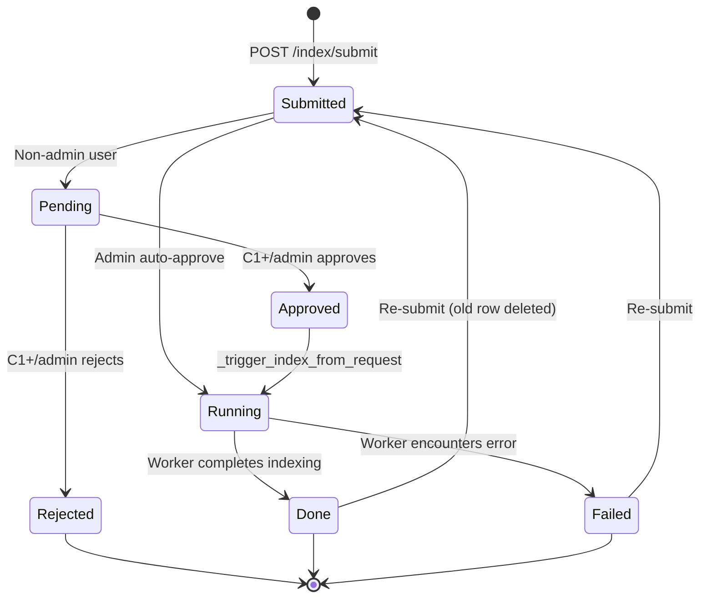

### 4.1 Submission Flow (`submit_index_request`)

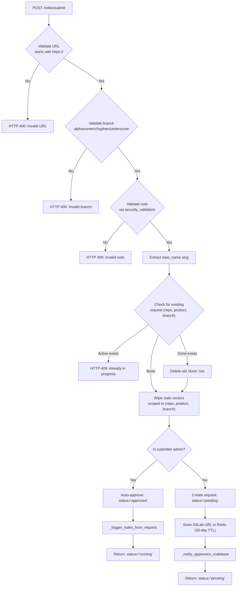

### 4.2 Approval Flow (`approve_index_request`)

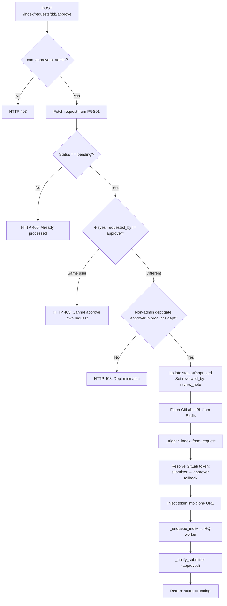

### 4.3 Token Resolution Strategy

A critical security design: **no service-account credentials are ever used for cloning**. The token resolution order is:

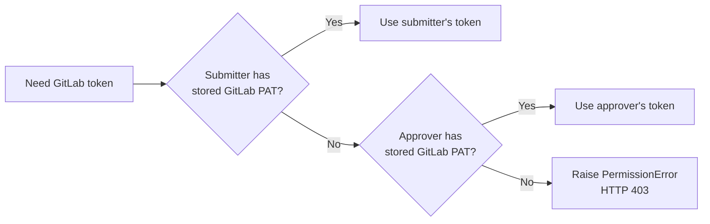

This is handled by `core.platform_credentials.get_gitlab_token()` and `inject_gitlab_token()`. See [shared_core](../reference/shared_core.md) for details on the platform credentials module.

---

## 5. Data Model & Storage

### 5.1 Database Tables

The index router interacts with two PostgreSQL databases:

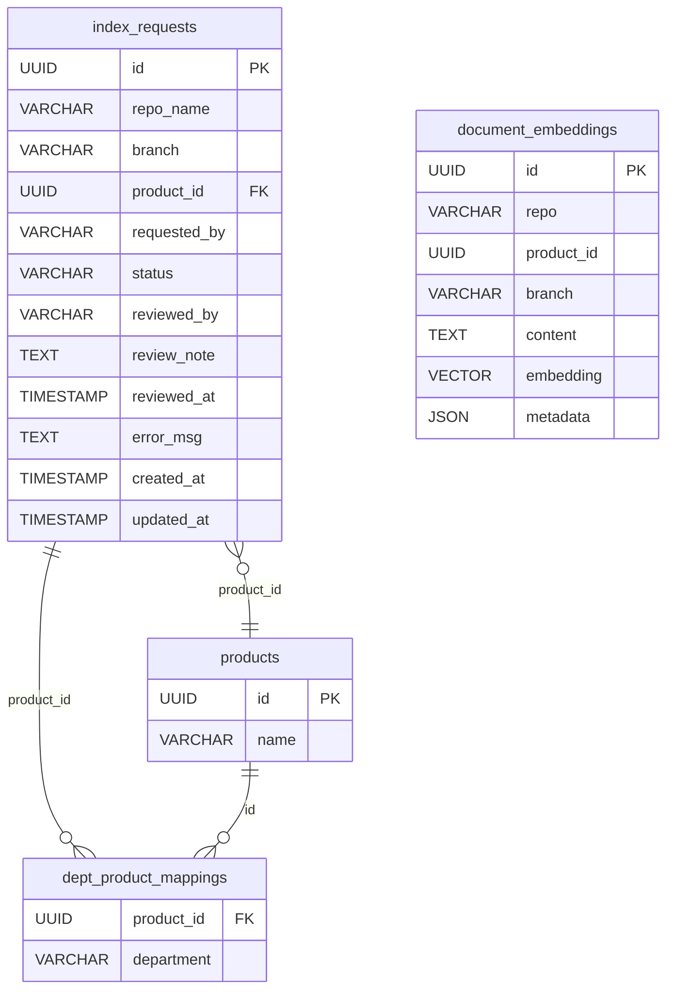

| Database | Table | Purpose |
|---|---|---|
| PGS01 (`npci_memory`) | `index_requests` | Governance records: submission, approval, rejection, status tracking |
| PGS01 (`npci_memory`) | `products` | Product name lookup for repo listing |
| PGS01 (`npci_memory`) | `dept_product_mappings` | Department-to-product mapping for access scoping |
| PGS02 (`npci_vector`) | `document_embeddings` | Vector embeddings keyed by `repo`, `product_id`, `branch` |

### 5.2 Redis / KV Cache (DB=3)

| Key Pattern | Type | TTL | Purpose |
|---|---|---|---|
| `index:repo:{name}:status` | String | — | Current status: `running`, `ready`, `failed`, `unknown` |
| `index:repo:{name}:url` | String | — | GitLab URL for re-index operations |
| `index:repo:{name}:indexed_at` | String | — | Unix timestamp of last successful index |
| `index:repo:{name}:error` | String | — | Error message if indexing failed |
| `index:repo:{name}:vector_count` | String | — | Cached vector count |
| `index:repo:index` | Set | — | Set of all repo names known to the index system |
| `index:request:{req_id}:url` | String | 30 days | GitLab URL stored at submission time for retrieval on approval |

### 5.3 Distributed Lock (RQ Queue DB)

The `enqueue_index_job` function in `core.job_queue` acquires a distributed lock scoped to `(repo_name, product_id, branch)` before enqueuing. This prevents duplicate indexing jobs for the same repo/product/branch combination. See [shared_core](../reference/shared_core.md) for details on the job queue infrastructure.

---

## 6. Access Control & Security

### 6.1 Role-Based Access

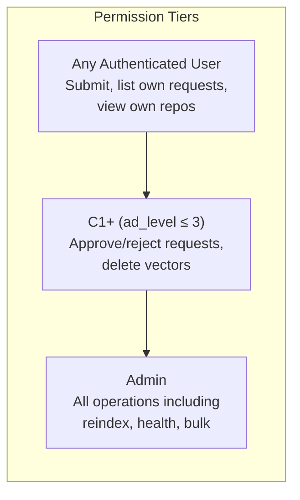

### 6.2 Security Measures

| Measure | Implementation |
|---|---|
| **URL validation** | `_validate_gitlab_url()` ensures HTTPS-only, no path traversal (`..`), no spaces |
| **Branch validation** | Regex `^[a-zA-Z0-9/_\-.]+$` prevents injection via branch names |
| **Note validation** | `core.security_validation.validate_security()` checks for XSS, SQL injection, special characters |
| **Product ID validation** | Regex `^[a-zA-Z0-9_-]+$` |
| **4-eyes principle** | Approvers cannot approve/reject their own submissions |
| **Department scoping** | Non-admin approvers must belong to the product's mapped department |
| **Token isolation** | GitLab PATs are resolved per-user (submitter → approver); no service-account fallback |
| **Credential stripping** | The worker strips embedded credentials from the stored `git_url` so each SDLC run re-injects its own token |

### 6.3 Department-Based Access Scoping

Non-admin users see only:
- Repos whose product is mapped to their department (via `dept_product_mappings`)
- Their own submissions (to track pending/failed status)

Admins see all repos and requests across all departments.

---

## 7. Worker Integration

When an index job is approved (or auto-approved for admins), the router enqueues a job to the RQ index queue. The worker (`workers/index_worker.index_repo_job`) handles the actual cloning, chunking, embedding, and storage.

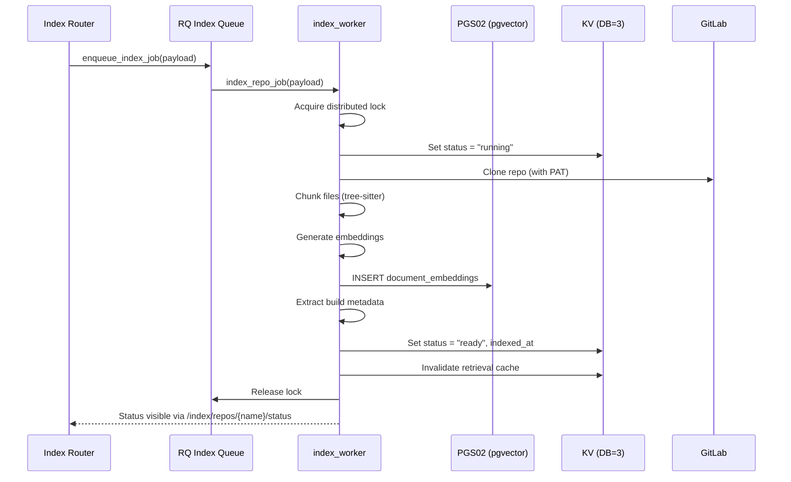

### Worker Responsibilities (delegated to `index_worker`)

1. **Acquire distributed lock** — scoped to `(repo_name, product_id, branch)`, renewed every 30 minutes
2. **Clone repository** — using the PAT-injected URL from the router
3. **Chunk source files** — using tree-sitter for language-aware chunking
4. **Generate embeddings** — via the embedding service
5. **Store in pgvector** — with `repo`, `product_id`, `branch`, `department` metadata
6. **Extract build metadata** — for SDLC sandbox image building
7. **Update status** — in both Redis and the `index_requests` table
8. **Invalidate retrieval cache** — so queries immediately see fresh chunks
9. **Emit Kafka telemetry** — to `TOPIC_EMBEDDINGS` and `TOPIC_METRICS`

> See [shared_core](../reference/shared_core.md) for the worker infrastructure and [embedding_service](../knowledge/embedding_service.md) for the embedding pipeline.

---

## 8. Health & Bulk Operations

### 8.1 Index Health (`index_health`)

Admin-only endpoint that aggregates status from both Redis and pgvector:

- Merges repo names from Redis (`index:repo:index` set) and `document_embeddings` table
- Reports per-repo: status, vector count, last indexed timestamp, days since last index, staleness flag
- **Stale threshold**: repos not indexed in >7 days are flagged as stale
- Returns summary: total repos, stale count, and detailed per-repo data

### 8.2 Bulk Re-index (`bulk_index`)

Admin-only endpoint that triggers re-indexing for multiple repos:

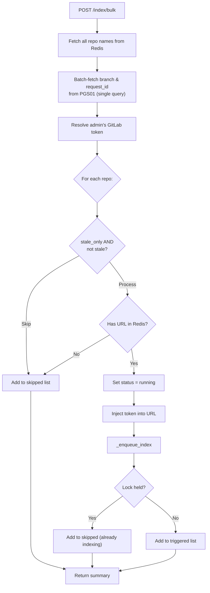

Key design decisions:
- **Single batch query** for branch and request_id metadata (avoids N+1 queries)
- **Per-repo error isolation** — a locked repo is skipped, not fatal
- **Admin's own token** used for all clones in the bulk operation

---

## 9. Dependency Map

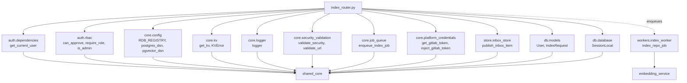

### External Module References

| Module | Reference | Purpose |
|---|---|---|
| Authentication & RBAC | [shared_core](../reference/shared_core.md) → `authentication` | User authentication, role checks, approval permissions |
| Core Infrastructure | [shared_core](../reference/shared_core.md) → `core_infrastructure` | Config, logging, KV store, security validation |
| Job Queue | [shared_core](../reference/shared_core.md) → `core_infrastructure` | RQ-based job enqueuing with distributed locks |
| Platform Credentials | [shared_core](../reference/shared_core.md) → `core_infrastructure` | GitLab PAT resolution and URL injection |
| Inbox Store | [shared_core](../reference/shared_core.md) → `store_layer` | Inbox notifications for approvers and submitters |
| Database Models | [shared_core](../reference/shared_core.md) → `database` | `IndexRequest`, `User`, `InboxItem` ORM models |
| Index Worker | [workers](../workers/workers.md) → `chat_agent_execution_workers` | Background indexing job execution |
| Embedding Service | [embedding_service](../knowledge/embedding_service.md) | Vector embedding generation |
| Gateway | [gateway](../models/gateway.md) → `indexing_and_search` | Gateway-level index endpoints that delegate to this router |

---

## 10. Endpoint Interaction Diagram

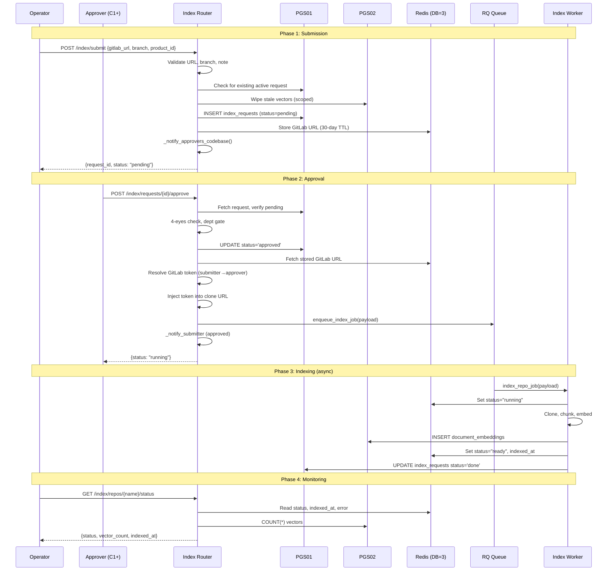

---

## 11. Error Handling

| Scenario | HTTP Status | Behavior |
|---|---|---|
| Invalid GitLab URL (not HTTPS, path traversal) | 400 | Request rejected before DB write |
| Invalid branch name (special characters) | 400 | Request rejected before DB write |
| Invalid note (XSS/SQL injection detected) | 400 | Request rejected before DB write |
| Duplicate active request (same repo/product/branch) | 409 | Prevents concurrent indexing of same scope |
| No GitLab token for submitter or approver | 403 | `PermissionError` raised, indexing not triggered |
| Distributed lock already held | 503 | Job rejected — another worker is actively indexing |
| Non-admin approving own request | 403 | 4-eyes principle enforcement |
| Non-admin in wrong department | 403 | Department scoping enforcement |
| Request not found | 404 | Standard not-found response |
| Request already processed (not pending) | 400 | Prevents double-approval/rejection |
| Redis/KV unavailable | — | Degrades gracefully; status reads return "unknown", writes are skipped |
| pgvector query failure | — | Non-fatal; vector count defaults to 0, warning logged |

---

## 12. Configuration

The index router relies on the following configuration from `core.config`:

| Config | Purpose |
|---|---|
| `RDB_REGISTRY` | Redis DB number for the index governance registry (status cache) |
| `postgres_dsn()` | Connection string for PGS01 (`npci_memory`) |
| `pgvector_dsn()` | Connection string for PGS02 (`npci_vector`) |

### Constants

| Constant | Value | Purpose |
|---|---|---|
| `PROTECTED_BRANCHES` | `{"main", "master", "release", "prod", "production"}` | Branches checked for protection status (informational only — does not block indexing) |

---

## 13. Notification Flow

The router uses the inbox store to notify relevant users at key workflow transitions:

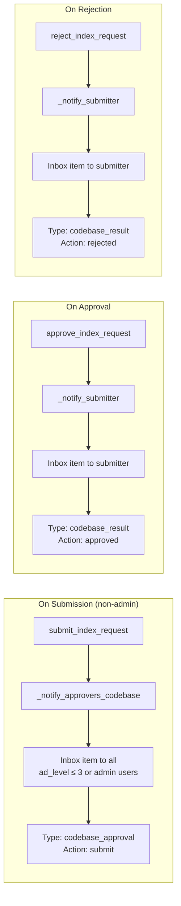

Notifications are fire-and-forget — failures are logged as warnings but do not affect the core workflow. See [shared_core](../reference/shared_core.md) → `store_layer` for the inbox store implementation.

---

## 14. Summary

The Index Router module is the governance gateway for codebase indexing in the platform. It enforces a structured approval workflow with role-based access control, department scoping, and 4-eyes verification. The module delegates the heavy lifting of cloning, chunking, and embedding to the background worker infrastructure, while maintaining real-time status tracking through Redis and PostgreSQL. Its security-first design ensures that no service-account credentials are used for Git operations — all cloning is performed with the requesting user's own GitLab PAT.
