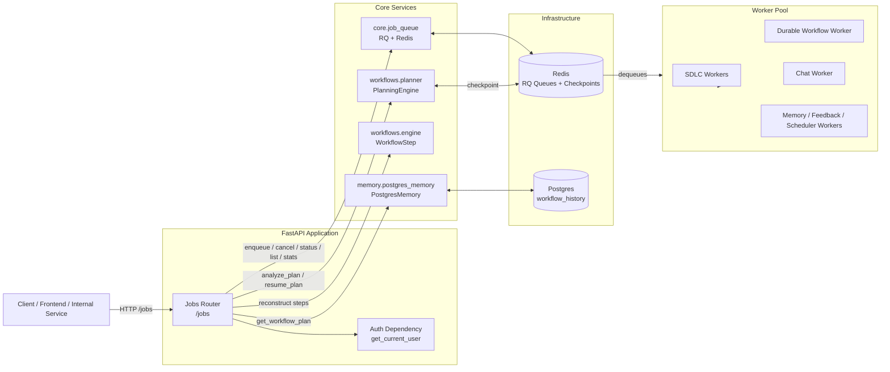
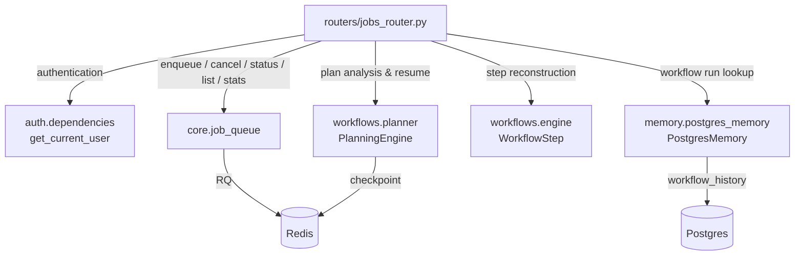
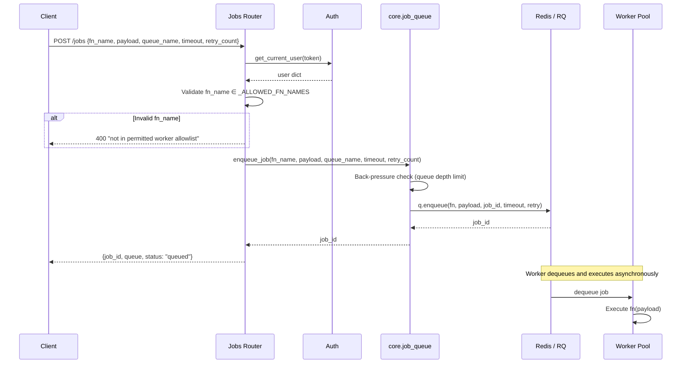
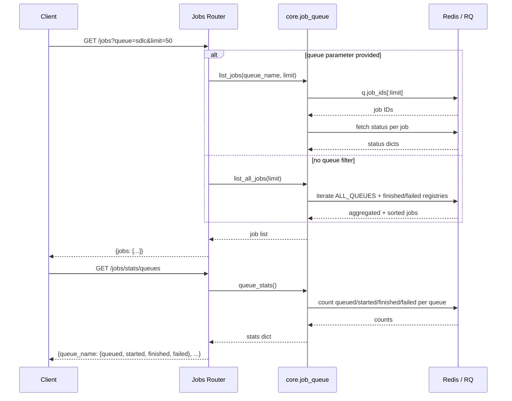
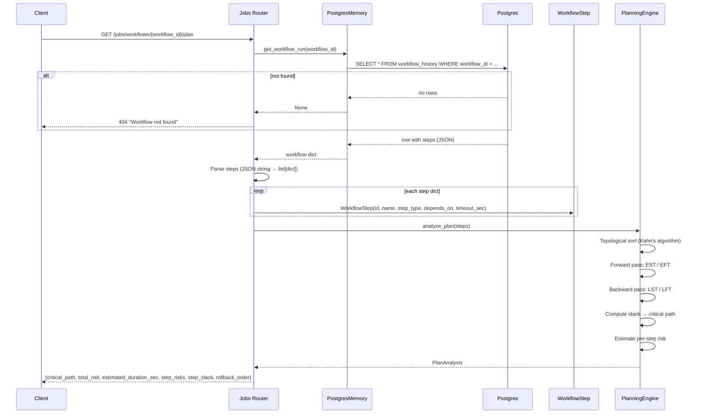
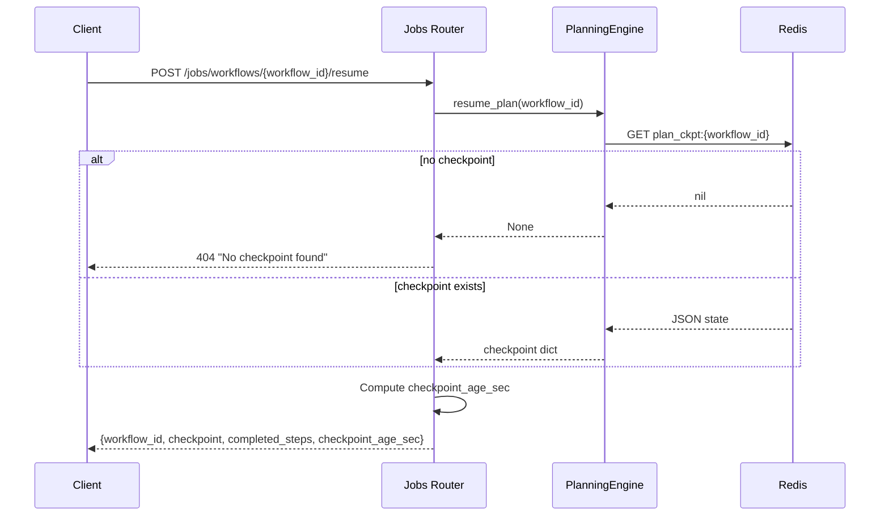
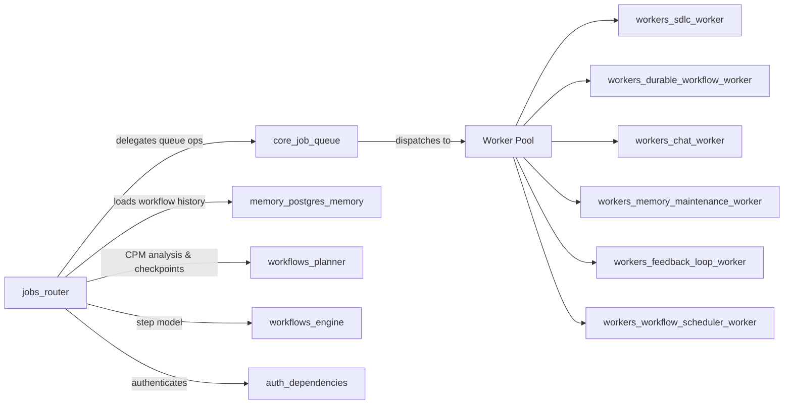

# Jobs Router

## Overview

The **Jobs Router** (`routers/jobs_router.py`) is a FastAPI APIRouter that exposes
a REST interface for managing the platform's asynchronous job queue and workflow
planning lifecycle. It allows authenticated clients to:

- **Submit** background jobs to named queues (SDLC pipelines, durable workflows,
  chat jobs, memory maintenance, feedback loops, scheduled-workflow dispatch, etc.)
- **Inspect** individual job status or list recent jobs across all queues.
- **Cancel** queued or running jobs.
- **Query queue statistics** (queued / started / finished / failed counts).
- **Analyze workflow plans** — critical path, risk scores, estimated duration,
  and rollback order.
- **Resume interrupted workflows** from Redis-backed checkpoints.

All endpoints require authentication via `get_current_user` (see
[auth_dependencies](../auth_dependencies.md)). Job submission is further restricted
by a strict function-name allowlist to prevent arbitrary code execution.

---

## Architecture

The router is intentionally thin: it validates input, enforces security
constraints, and delegates all persistence and execution logic to
[core_job_queue](../core_job_queue.md), [workflows_planner](../workflows_planner.md),
and [memory_postgres_memory](../memory_postgres_memory.md).

---

## Module Dependencies

### External Dependencies

| Dependency | Purpose | Documentation |
|---|---|---|
| `auth.dependencies.get_current_user` | Enforces authentication on every endpoint | [auth_dependencies](../auth_dependencies.md) |
| `core.job_queue` | RQ/Redis-backed enqueue, cancel, status, list, stats | [core_job_queue](../core_job_queue.md) |
| `memory.postgres_memory.PostgresMemory` | Loads workflow run history for plan analysis | [memory_postgres_memory](../memory_postgres_memory.md) |
| `workflows.engine.WorkflowStep` | Lightweight step object reconstructed for analysis | [workflows_engine](../workflows_engine.md) |
| `workflows.planner.PlanningEngine` | CPM analysis, risk scoring, checkpoint/resume | [workflows_planner](../workflows_planner.md) |

---

## API Endpoints

| Method | Path | Function | Description |
|---|---|---|---|
| `POST` | `/jobs` | `submit_job` | Submit a job to the queue; returns `job_id` |
| `DELETE` | `/jobs/{job_id}` | `cancel_job` | Cancel a queued or running job |
| `GET` | `/jobs/{job_id}` | `get_job` | Get status of a specific job |
| `GET` | `/jobs` | `list_jobs` | List recent jobs, optionally filtered by queue |
| `GET` | `/jobs/stats/queues` | `queue_stats` | Return job counts per queue |
| `GET` | `/jobs/workflows/{workflow_id}/plan` | `get_workflow_plan` | Critical-path analysis and risk scores |
| `POST` | `/jobs/workflows/{workflow_id}/resume` | `resume_workflow` | Resume an interrupted workflow from checkpoint |

---

## Core Components

### `JobSubmitRequest`

Pydantic model for job submission:

| Field | Type | Default | Description |
|---|---|---|---|
| `fn_name` | `str` | — | Dotted worker function path; **must** be in `_ALLOWED_FN_NAMES` |
| `payload` | `dict` | — | Arbitrary JSON payload passed to the worker function |
| `queue_name` | `Optional[str]` | `"default"` | Target RQ queue name |
| `timeout` | `Optional[int]` | `900` | Per-job wall-clock timeout in seconds (15 min default) |
| `retry_count` | `Optional[int]` | `2` | Number of automatic retries on failure |

### Security: Worker Function Allowlist

`_ALLOWED_FN_NAMES` is a `frozenset` that acts as a strict allowlist (SEC-02).
Only the following dotted function paths may be submitted via the API:

| `fn_name` | Worker Module |
|---|---|
| `workers.sdlc_worker.run_feature_pipeline_job` | [workers_sdlc_worker](../workers_sdlc_worker.md) |
| `workers.sdlc_worker.run_bug_pipeline_job` | [workers_sdlc_worker](../workers_sdlc_worker.md) |
| `workers.sdlc_worker.run_mr_review_job` | [workers_sdlc_worker](../workers_sdlc_worker.md) |
| `workers.sdlc_worker.run_mr_merge_job` | [workers_sdlc_worker](../workers_sdlc_worker.md) |
| `workers.sdlc_worker.run_reindex_job` | [workers_sdlc_worker](../workers_sdlc_worker.md) |
| `workers.durable_workflow_worker.execute_durable_workflow` | [workers_durable_workflow_worker](../workers_durable_workflow_worker.md) |
| `workers.chat_worker.run_chat_job` | [workers_chat_worker](../workers_chat_worker.md) |
| `workers.graph_worker.run_graph_index_job` | Knowledge graph indexing worker |
| `workers.memory_maintenance_worker.run_memory_maintenance` | [workers_memory_maintenance_worker](../workers_memory_maintenance_worker.md) |
| `workers.feedback_loop_worker.run_feedback_loop` | [workers_feedback_loop_worker](../workers_feedback_loop_worker.md) |
| `workers.workflow_scheduler_worker.dispatch_scheduled_workflows` | [workers_workflow_scheduler_worker](../workers_workflow_scheduler_worker.md) |

Any `fn_name` not in this set is rejected with **HTTP 400** before reaching the
queue, preventing arbitrary code execution through the job API.

---

## Data Flow

### Job Submission

### Job Inspection & Cancellation

```mermaid
sequenceDiagram
    participant C as Client
    participant R as Jobs Router
    participant Q as core.job_queue
    participant Redis as Redis / RQ

    C->>R: GET /jobs/{job_id}
    R->>Q: get_job_status(job_id)
    Q->>Redis: rq.job.Job.fetch(job_id)
    Redis-->>Q: status, result, error, timestamps
    Q-->>R: status dict
    alt status == "unknown"
        R-->>C: 404 "Job not found"
    else
        R-->>C: status dict
    end

    C->>R: DELETE /jobs/{job_id}
    R->>Q: cancel_job(job_id)
    Q->>Redis: job.cancel()
    Redis-->>Q: True / False
    alt not cancelled
        R-->>C: 404 "not found or already finished"
    else
        R-->>C: {job_id, cancelled: true}
    end
```

### Job Listing & Queue Stats

---

## Workflow Plan Analysis

The `get_workflow_plan` endpoint provides critical-path method (CPM) analysis
for a previously executed workflow. It does **not** execute the workflow; it
loads persisted history and runs `PlanningEngine.analyze_plan()`.

### Plan Analysis Response

| Field | Type | Description |
|---|---|---|
| `workflow_id` | `str` | The workflow identifier |
| `critical_path` | `list[str]` | Step IDs where slack ≈ 0 |
| `total_risk` | `float` | Weighted average risk of critical-path steps (0.0–1.0) |
| `estimated_duration_sec` | `float` | Sum of `timeout_sec` on the critical path |
| `step_risks` | `dict[str, float]` | Per-step risk score (0.0–1.0) |
| `step_slack` | `dict[str, float]` | Per-step slack time in seconds |
| `rollback_order` | `list[str]` | Reverse topological order for rollback |

> For details on the CPM algorithm, risk heuristics, and `PlanAnalysis` internals,
> see [workflows_planner](../workflows_planner.md).

---

## Workflow Resume

The `resume_workflow` endpoint retrieves a Redis-backed checkpoint for an
interrupted workflow. The checkpoint contains completed steps and intermediate
results. The **caller** is responsible for re-enqueuing the workflow job with
the checkpoint data — this endpoint only returns the saved state.

### Resume Response

| Field | Type | Description |
|---|---|---|
| `workflow_id` | `str` | The workflow identifier |
| `checkpoint` | `dict` | Full checkpoint state from Redis |
| `completed_steps` | `list[str]` | Step IDs already completed before interruption |
| `checkpoint_age_sec` | `float` | Seconds since the checkpoint was last written |

> Checkpoints are stored with a 24-hour TTL under the key `plan_ckpt:{workflow_id}`.
> See [workflows_planner](../workflows_planner.md) for checkpoint lifecycle details.

---

## Component Interaction Diagram

```mermaid
graph TD
    subgraph "Jobs Router Endpoints"
        Submit["submit_job<br/>POST /jobs"]
        Cancel["cancel_job<br/>DELETE /jobs/{id}"]
        Get["get_job<br/>GET /jobs/{id}"]
        List["list_jobs<br/>GET /jobs"]
        Stats["queue_stats<br/>GET /jobs/stats/queues"]
        Plan["get_workflow_plan<br/>GET /jobs/workflows/{id}/plan"]
        Resume["resume_workflow<br/>POST /jobs/workflows/{id}/resume"]
    end

    Auth["get_current_user<br/>(all endpoints)"]

    subgraph "core.job_queue"
        Enqueue["enqueue_job"]
        CancelFn["cancel_job"]
        StatusFn["get_job_status"]
        ListFn["list_jobs / list_all_jobs"]
        StatsFn["queue_stats"]
    end

    PostgresMem["PostgresMemory<br/>.get_workflow_run()"]
    Planner["PlanningEngine<br/>.analyze_plan() / .resume_plan()"]
    WorkflowStep["WorkflowStep<br/>(step reconstruction)"]

    Submit --> Auth
    Cancel --> Auth
    Get --> Auth
    List --> Auth
    Stats --> Auth
    Plan --> Auth
    Resume --> Auth

    Submit -->|validate allowlist| Submit
    Submit --> Enqueue
    Cancel --> CancelFn
    Get --> StatusFn
    List --> ListFn
    Stats --> StatsFn

    Plan --> PostgresMem
    Plan --> WorkflowStep
    Plan --> Planner

    Resume --> Planner
```

---

## Error Handling

| Scenario | HTTP Status | Detail |
|---|---|---|
| `fn_name` not in allowlist | `400` | `fn_name '...' is not in the permitted worker allowlist` |
| Job not found (cancel) | `404` | `Job {id} not found or already finished` |
| Job not found (get) | `404` | `Job {id} not found` |
| Workflow not found | `404` | `Workflow {id} not found` |
| No checkpoint for resume | `404` | `No checkpoint found for workflow {id}` |
| Plan analysis failure | `500` | `Plan analysis failed: {error}` |
| Resume failure | `500` | `Resume failed: {error}` |
| RQ/Redis unavailable (enqueue) | `500`* | Propagated `RuntimeError` from `core.job_queue` |

> *When `enqueue_job` detects that RQ is unavailable or the queue is at capacity,
> it raises a `RuntimeError`. The router does not catch this, so FastAPI returns
> a default `500` response. See [core_job_queue](../core_job_queue.md) for
> back-pressure and availability details.

---

## Design Decisions

### 1. Lazy Imports

All `core.job_queue` and `workflows.planner` imports are performed **inside**
the endpoint functions rather than at module top-level. This avoids circular
import issues and reduces startup cost for the FastAPI application.

### 2. Strict Allowlist (SEC-02)

The `_ALLOWED_FN_NAMES` frozenset is the sole security gate for job submission.
Adding a new worker function to the API requires updating this set — there is no
dynamic registration path. This prevents arbitrary code execution even if an
authenticated user crafts a malicious `fn_name`.

### 3. Thin Router Pattern

The router contains no business logic beyond input validation and response
shaping. All queue operations, persistence, and analysis are delegated to
[core_job_queue](../core_job_queue.md), [memory_postgres_memory](../memory_postgres_memory.md),
and [workflows_planner](../workflows_planner.md).

### 4. Caller-Driven Resume

The `resume_workflow` endpoint returns checkpoint state but does **not**
automatically re-enqueue the workflow. This gives the caller full control over
how the resumed workflow is dispatched (e.g., with modified payload, different
queue, or additional context).

---

## Relationship to Other Modules

The Jobs Router is one of many routers in the `shared_api_routers` package. It
serves as the primary API surface for programmatic job management, complementing
higher-level routers like [sdlc_router](sdlc_router.md) and
[chat_router](chat_router.md) that enqueue jobs internally through
`core.job_queue` without exposing the raw queue API.
