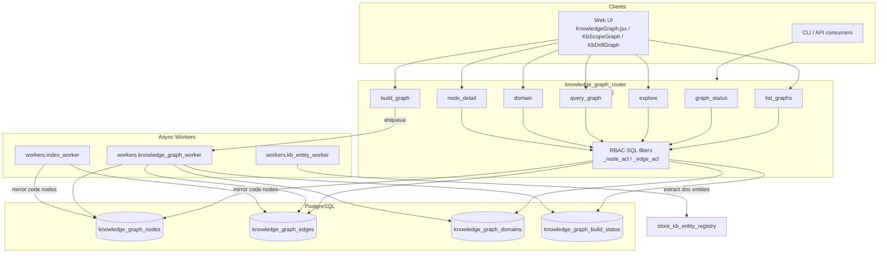
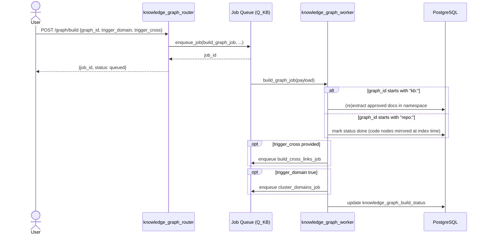
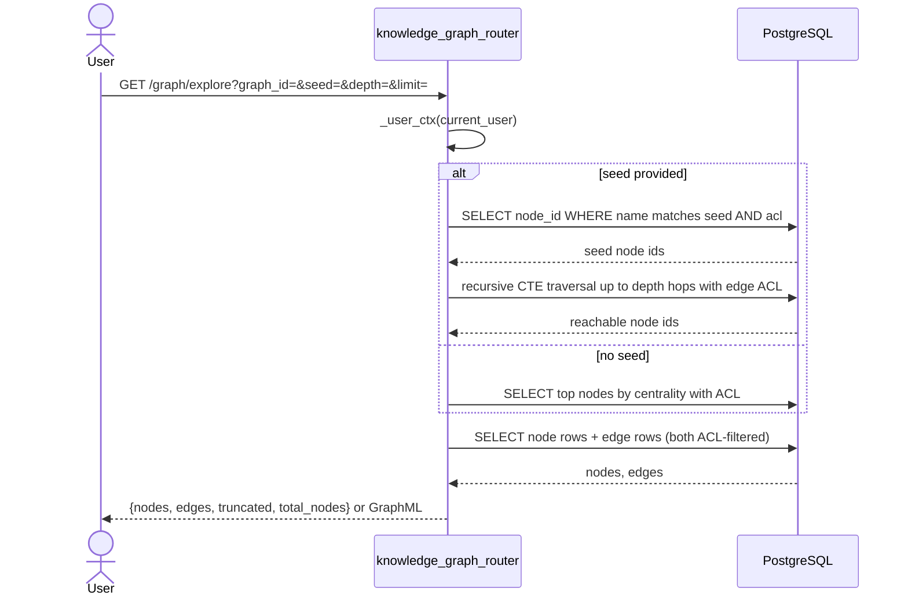
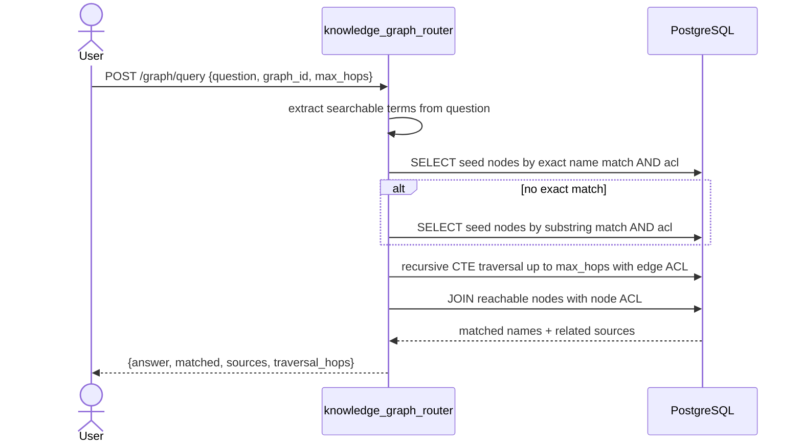

# Knowledge Graph Router

The `knowledge_graph_router` module exposes a unified HTTP API for building, exploring, and querying knowledge graphs that combine code symbols (from repository indexing) with document entities (from the knowledge base). It is mounted at `/ainxt/v1/api/graph` and serves both CLI clients and the web UI.

## Purpose

The router provides a single interface for:

- **Graph lifecycle**: enqueue graph builds, poll build status, and list available graphs.
- **Visual exploration**: retrieve RBAC-filtered subgraphs for interactive graph visualizations.
- **Semantic querying**: answer natural-language questions by traversing nodes over multiple hops.
- **Domain clustering**: surface LLM-clustered business/technical domains extracted from graph nodes.
- **Node inspection**: fetch detailed node metadata and one-hop neighbors.

The underlying graph is stored in PostgreSQL (`knowledge_graph_nodes`, `knowledge_graph_edges`, `knowledge_graph_domains`, and `knowledge_graph_build_status`). All read paths apply access control directly in SQL so that users only see nodes and edges they are authorized to view.

## Core Components

| Component | Type | Responsibility |
|-----------|------|----------------|
| `BuildReq` | Pydantic model | Validates graph build requests (`graph_id`, optional domain/cross-link triggers). |
| `QueryReq` | Pydantic model | Validates natural-language graph queries (`question`, `graph_id`, `max_hops`). |
| `list_graphs` | Route handler | Returns all graphs visible to the caller with node counts and build state. |
| `build_graph` | Route handler | Enqueues an asynchronous graph build job via the KB job queue. |
| `graph_status` | Route handler | Returns build status, node/edge counts, and last build timestamp for a graph. |
| `explore` | Route handler | Returns a filtered subgraph (nodes + edges) for visualization, with optional seed-based traversal. |
| `query_graph` | Route handler | Answers a question by matching terms to nodes and traversing up to three hops. |
| `domain` | Route handler | Returns LLM-clustered domains for a graph. |
| `node_detail` | Route handler | Returns metadata and one-hop neighbors for a single node. |
| `_user_ctx` | Helper | Derives RBAC context (`is_admin`, `user_dept`, `user_clearance`) from the authenticated user. |
| `_node_acl` / `_edge_acl` | Helpers | Generate SQL `WHERE` fragments that enforce node- and edge-level access control. |
| `_to_graphml` | Helper | Serializes an explored subgraph to GraphML format. |

## Architecture

## API Endpoints

| Method | Path | Description |
|--------|------|-------------|
| `GET` | `/graph/list` | List visible graphs with node counts and build state. |
| `POST` | `/graph/build` | Enqueue a graph build for `repo:<name>`, `kb:<namespace>`, or `cross:<a>:<b>`. |
| `GET` | `/graph/status/{graph_id}` | Get build status and aggregate node/edge counts. |
| `GET` | `/graph/explore` | Retrieve a paginated, RBAC-filtered subgraph. Supports seed, depth, node/edge type filters, and `format=graphml`. |
| `POST` | `/graph/query` | Answer a natural-language question by matching terms and traversing up to `max_hops` (capped at 3). |
| `GET` | `/graph/domain` | Return LLM-clustered domains for a graph. |
| `GET` | `/graph/node/{node_id}` | Return node metadata and up to 50 one-hop neighbors. |

## RBAC and Security Model

Access control is enforced in SQL, not in Python post-processing. Every read query includes ACL predicates generated by `_node_acl()` and `_edge_acl()`.

- **Admins** bypass all filters.
- **Non-admins** see a node only when:
  - The node's `department` is empty/null **or** matches the user's department, **and**
  - The node's `min_band_level` is less than or equal to the user's clearance.
- **Clearance** is computed as `max(0, 6 - ad_level)`, where `ad_level` comes from the user's JWT token.
- Edges are visible only if their `min_band_level` is within the user's clearance.

This mirrors the scoping rules used by `document_embeddings` and keeps traversal results consistent with document-level permissions.

## Data Flows

### Build Flow

### Explore Flow

### Query Flow

## Component Interactions

The router is a thin orchestration layer over the graph storage and worker infrastructure.

- **Authentication**: All routes depend on `auth.dependencies.get_current_user` (see [auth_router](auth_router.md) and [auth dependencies](../reference/shared_core.md#authentication)).
- **Job queue**: `build_graph` uses `core.job_queue.enqueue_job` with `Q_KB` to schedule asynchronous work (see [core infrastructure](../reference/shared_core.md#core-infrastructure)).
- **Workers**: The actual graph construction is performed by `workers.knowledge_graph_worker`:
  - `build_graph_job` dispatches per-graph builds.
  - `extract_doc_entities_job` extracts entities and relations from KB documents.
  - `build_cross_links_job` links code nodes to KB concepts.
  - `cluster_domains_job` clusters nodes into business domains and writes centrality scores.
  - `delete_doc_nodes` purges a document's nodes on deletion.
- **Code indexing**: `workers.index_worker._mirror_code_nodes_to_kg` writes code symbols into `knowledge_graph_nodes`/`knowledge_graph_edges` during repository indexing.
- **Document entities**: `workers.kb_entity_worker.extract_doc` resolves canonical entities via `store.kb_entity_registry` and writes co-occurrence/dependency edges.
- **Frontend**: The web UI consumes these endpoints through `KnowledgeGraph.jsx`, `KbScopeGraph.jsx`, and `KbDrillGraph.jsx` (see [ai_ui_frontend knowledge_graph](../ui/ai_ui_frontend.md#knowledge-graph) and [kb_graph](../ui/ai_ui_frontend.md#kb-graph)).

## Process Flows

### Listing Graphs

1. Aggregate nodes by `graph_id` with ACL filter.
2. Count total nodes, code nodes, and doc nodes per graph.
3. Join with `knowledge_graph_build_status` to attach `status` and `last_built_at`.
4. Return a list enriched with a `kind` derived from the `graph_id` prefix (`repo`, `kb`, or `other`).

### Building a Graph

1. Validate `BuildReq`.
2. Enqueue `workers.knowledge_graph_worker.build_graph_job` on `Q_KB` with a one-hour timeout and one retry.
3. Return the job ID and queued status immediately.
4. The worker:
   - For `kb:<namespace>`: re-extracts all approved documents in the namespace.
   - For `repo:<name>`: confirms the graph is already built during indexing.
   - Optionally enqueues cross-linking and/or domain clustering follow-on jobs.

### Exploring a Graph

1. Resolve the optional `seed` to node IDs using case-insensitive exact then fuzzy name matching.
2. If seeds exist, run a recursive CTE up to `depth` hops (max 3) with edge ACL.
3. If no seed exists, return the top nodes by `metadata->>'centrality'`.
4. Fetch edges between returned node IDs with edge ACL and optional edge-type filter.
5. Return JSON or GraphML (`format=graphml`).

### Querying a Graph

1. Extract alphanumeric terms from the question (max 8).
2. Find seed nodes by exact name match; fall back to substring match.
3. Traverse up to `max_hops` (capped at 3) using recursive CTE with edge ACL.
4. Collect reachable node metadata with node ACL.
5. Return a synthesized answer, matched node names, and source metadata.

### Domain Clustering

1. `domain` reads pre-computed clusters from `knowledge_graph_domains`.
2. Clusters are produced asynchronously by `cluster_domains_job`, which prompts an LLM to group up to 500 top entities into 5-15 domains and writes PageRank-style centrality scores.

## Dependencies

- [auth dependencies](../reference/shared_core.md#authentication) - user authentication and JWT context.
- [core logger](../reference/shared_core.md#core-infrastructure) - structured logging.
- [core job queue](../reference/shared_core.md#core-infrastructure) - asynchronous job enqueueing.
- [db database](../reference/shared_core.md#database) - SQLAlchemy session management.
- [workers knowledge_graph_worker](../workers/workers.md#document-knowledge-workers) - graph construction and clustering.
- [workers index_worker](../workers/workers.md#external-integration-workers) - code-node mirroring during repo indexing.
- [workers kb_entity_worker](../workers/workers.md#document-knowledge-workers) - document entity extraction.
- [store kb_entity_registry](../reference/shared_core.md#shared-core-knowledge-base) - canonical entity resolution.
- [ai_ui_frontend KnowledgeGraph](../ui/ai_ui_frontend.md#knowledge-graph) - interactive graph visualization.
- [ai_ui_frontend KbScopeGraph / KbDrillGraph](../ui/ai_ui_frontend.md#kb-graph) - scope picker visualizations.

## Notes for Maintainers

- The router intentionally does **no** graph computation itself; all heavy lifting is delegated to workers.
- All read paths must keep ACL predicates on both node and edge tables. Avoid pulling large result sets into Python for filtering.
- `graph_id` conventions:
  - `repo:<repo_name>` - code graphs populated by the index worker.
  - `kb:<namespace>` - document graphs populated by KB entity extraction.
  - `cross:<a>:<b>` - handled inside worker cross-link jobs.
- The `explore` endpoint truncates at `limit` nodes (default 50, max 200) and caps edges at 500 to keep visualization payloads bounded.
- `query_graph` caps hops at 3 and terms at 8 to prevent runaway traversals.
