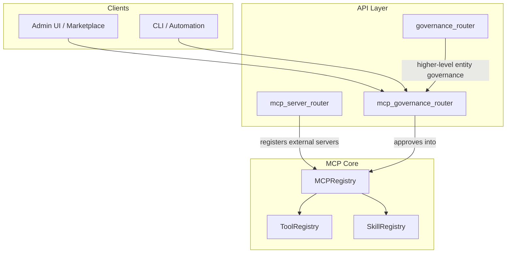
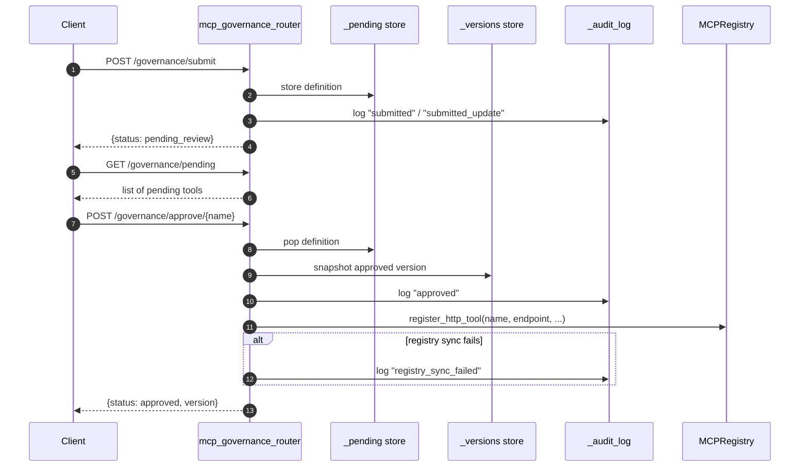
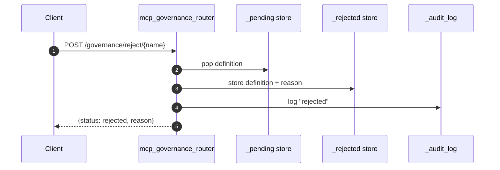
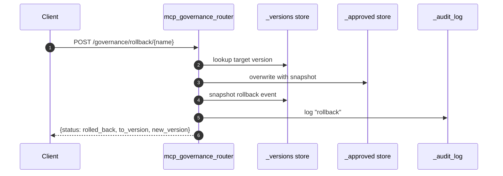
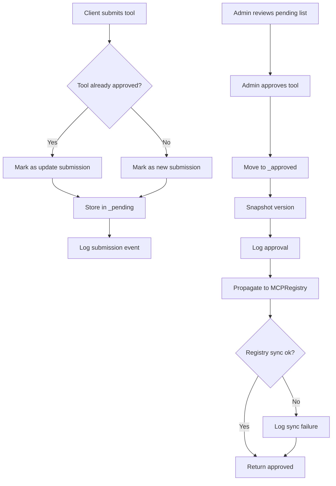
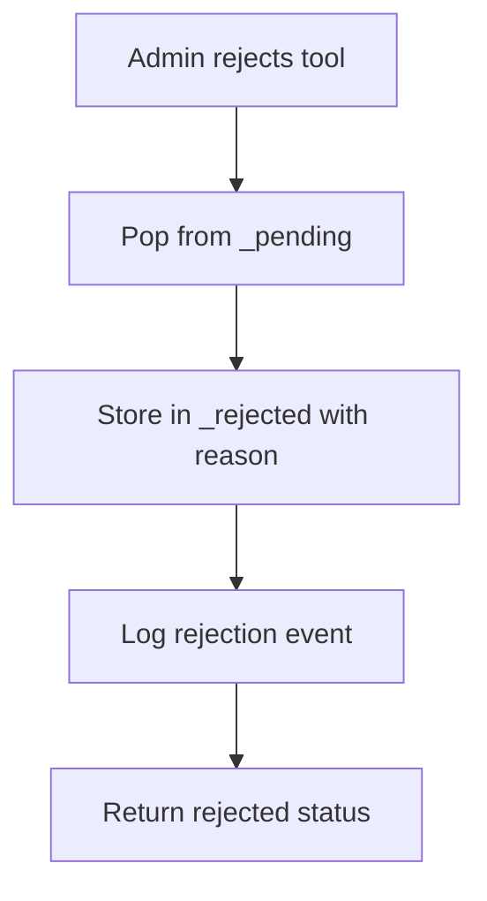
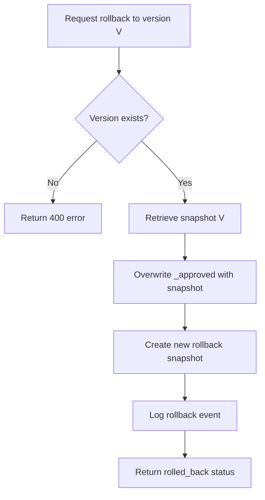

# MCP Governance Router

## Brief Introduction

The `mcp_governance_router` module provides an administrative approval workflow and versioning layer for MCP (Model Context Protocol) tool registrations. It sits between the tool submission surface and the live [MCP Registry](../mcp/mcp_system.md), ensuring that only reviewed and approved tools become available to agents and workflows.

Key responsibilities include:

- Accepting submissions of new MCP tools or updates to existing tools.
- Maintaining a pending queue for admin review.
- Recording approve / reject decisions with actor attribution and notes.
- Propagating approved tools into the live [MCP Registry](../mcp/mcp_system.md).
- Keeping a versioned history of every approved definition.
- Supporting rollback to any prior approved version.
- Exposing a chronological audit log for compliance and debugging.

This router is intentionally lightweight: the current implementation uses in-process dictionaries for state, with a documented expectation that production deployments back these stores with Redis or a database.

---

## Core Functionality

### Governance Lifecycle

Every MCP tool passes through a simple state machine:

```text
submitted → pending_review → approved → production_registry
                    ↘ rejected
```

1. **Submit** — A caller submits a tool definition via `POST /governance/submit`. If the tool name already exists in the approved registry, the submission is treated as a version update and re-enters the pending queue.
2. **Review** — Admins inspect the pending queue via `GET /governance/pending`.
3. **Decide** — Admins call `POST /governance/approve/{name}` or `POST /governance/reject/{name}`. Both actions are logged.
4. **Propagate** — On approval, the router attempts to register the tool with the live [MCP Registry](../mcp/mcp_system.md) through `MCPRegistry.register_http_tool`. Registry sync failures are logged but do not fail the approval.
5. **Version / Rollback** — Each approval creates a versioned snapshot. `POST /governance/rollback/{name}` restores an earlier snapshot and appends a new rollback event to the history.
6. **Audit** — `GET /governance/log` returns recent governance events.

### Endpoint Surface

| Method | Path | Purpose |
|--------|------|---------|
| `POST` | `/governance/submit` | Submit a tool or update for approval |
| `GET`  | `/governance/pending` | List tools awaiting review |
| `POST` | `/governance/approve/{name}` | Approve a pending tool |
| `POST` | `/governance/reject/{name}` | Reject a pending tool |
| `GET`  | `/governance/log` | Retrieve audit log entries |
| `GET`  | `/governance/versions/{name}` | Retrieve version history |
| `POST` | `/governance/rollback/{name}` | Roll back to a prior version |
| `GET`  | `/governance/status` | Summary counts of governance state |

---

## Architecture

### High-Level Placement



The `mcp_governance_router` is a focused FastAPI router under the `/governance` prefix. It is distinct from the broader [governance_router](governance_router.md), which handles entity-level governance (skills, agents, workflows) across the platform. The MCP governance router specifically manages the lifecycle of tools registered through the MCP infrastructure.

### Internal Data Stores

The router maintains four in-process data structures:

| Store | Purpose |
|-------|---------|
| `_pending` | Tool definitions awaiting admin review |
| `_approved` | Currently approved tool definitions |
| `_rejected` | Rejected definitions with reasons |
| `_versions` | Versioned snapshots of approved definitions |
| `_audit_log` | Chronological governance events |

> **Production Note:** The comments in the source indicate these stores are "Redis-backed in production." A production deployment should replace the dictionaries with a persistent store to survive restarts and support horizontal scaling.

---

## Component Relationships

### Request Models

- **`SubmitRequest`** — Captures the tool metadata required for review: `name`, `endpoint`, `description`, `tools`, `auth_config`, and `submitted_by`.
- **`ApproveRequest`** — Captures the approver identity and optional notes.
- **`RejectRequest`** — Captures the rejecter identity and a mandatory reason.
- **`RollbackRequest`** — Captures the target version number and the actor performing the rollback.

### Helper Functions

- **`_log(action, tool_name, actor, detail)`** — Appends a timestamped event to `_audit_log`.
- **`_snapshot_version(name, definition, actor, event)`** — Records an immutable version snapshot in `_versions`.

### Route Handlers

| Handler | Responsibility |
|---------|----------------|
| `submit_for_approval` | Validates existence, queues the tool, logs submission |
| `list_pending` | Returns the pending queue and count |
| `approve_tool` | Moves pending → approved, snapshots version, propagates to `MCPRegistry` |
| `reject_tool` | Moves pending → rejected with reason |
| `get_audit_log` | Returns recent audit entries |
| `get_versions` | Returns version history for a tool |
| `rollback_tool` | Restores a prior snapshot and records rollback |
| `governance_status` | Returns aggregate counts |

---

## Data Flow

### Submit → Approve → Registry Propagation



### Rejection Flow



### Rollback Flow



---

## Process Flows

### Approval Process



### Rejection Process



### Rollback Process



---

## Dependencies

### Direct Imports

- `fastapi.APIRouter`, `fastapi.HTTPException` — Router infrastructure and error responses.
- `pydantic.BaseModel` — Request validation schemas.
- `mcp.registry.MCPRegistry` — Live registry where approved tools are registered at runtime.

### Related Modules

| Module | Relationship |
|--------|--------------|
| [mcp_system](../mcp/mcp_system.md) | Provides `MCPRegistry`, `ToolRegistry`, and `SkillRegistry`; the governance router propagates approvals into this registry. |
| [mcp_server_router](mcp_server_router.md) | Handles external MCP server registration (SSE, stdio); governance router handles the approval gate for the resulting tools. |
| [governance_router](governance_router.md) | Higher-level entity governance for skills, agents, and workflows; may delegate or mirror MCP tool governance through this router. |
| [marketplace_router](marketplace_router.md) | Marketplace listings reflect tool status; approved MCP tools may be exposed here. |

---

## Error Handling

| Scenario | HTTP Status | Detail |
|----------|-------------|--------|
| Approve/reject a tool not in `_pending` | `404` | `No pending submission for '{name}'` |
| Request version history for unknown tool | `404` | `No version history for '{name}'` |
| Rollback to non-existent version | `400` | `Version {v} not found; available: 1–{n}` |
| Registry sync failure on approval | `200` (approval succeeds) | Failure logged as `registry_sync_failed` |

---

## Operational Considerations

- **State durability:** The current in-memory stores are reset on process restart. Production deployments should persist `_pending`, `_approved`, `_rejected`, `_versions`, and `_audit_log` to Redis, Postgres, or another durable store.
- **Concurrency:** The module uses plain dictionaries without locks. Concurrent approve/reject/rollback calls could race. A production store should provide atomic operations.
- **Authorization:** The router itself does not enforce admin roles. The hosting application should mount this router behind appropriate authentication and authorization (for example, via [auth dependencies](../auth_dependencies.md) or [RBAC](../rbac.md)).
- **Registry propagation is best-effort:** Approval succeeds even if `MCPRegistry.register_http_tool` fails. Operators should monitor the audit log for `registry_sync_failed` events.

---

## How It Fits into the Overall System

The MCP governance router is the control gate for the platform's tool ecosystem:

- Downstream, it protects the [MCP Registry](../mcp/mcp_system.md) from unreviewed tool definitions.
- Upstream, it can be invoked by the [mcp_server_router](mcp_server_router.md) when external servers are registered, by the [marketplace_router](marketplace_router.md) when tools are published, or by the broader [governance_router](governance_router.md) as part of entity lifecycle workflows.
- It provides the audit trail required for compliance and post-incident investigation.

By separating governance from registration, the platform can support flexible approval policies while keeping the live tool registry clean and auditable.
