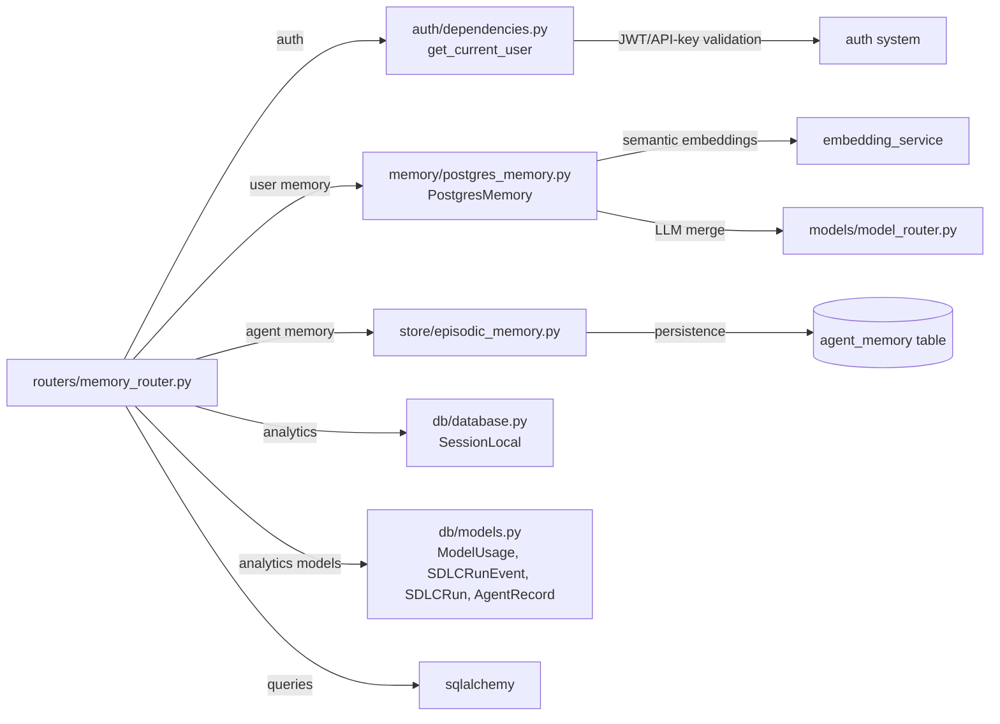
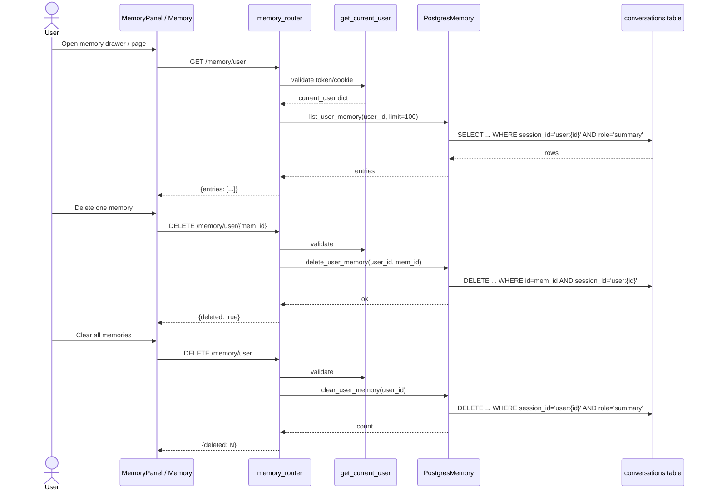
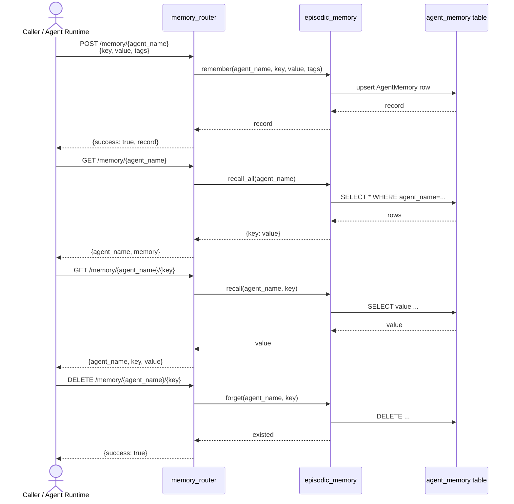
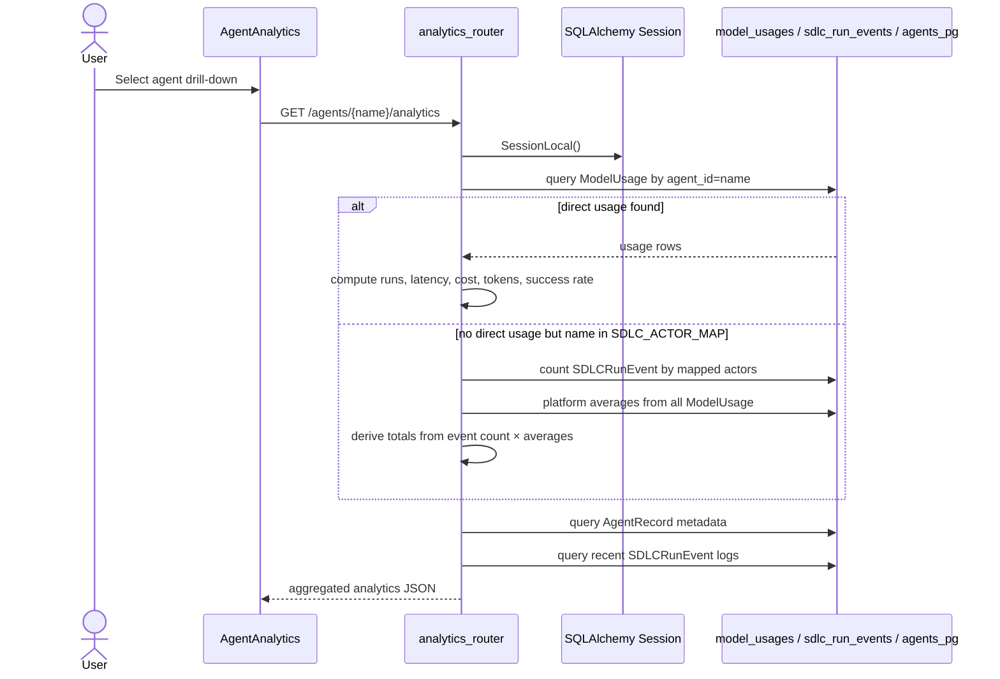
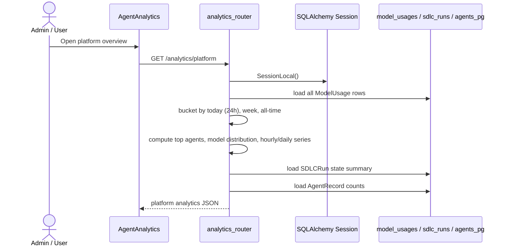
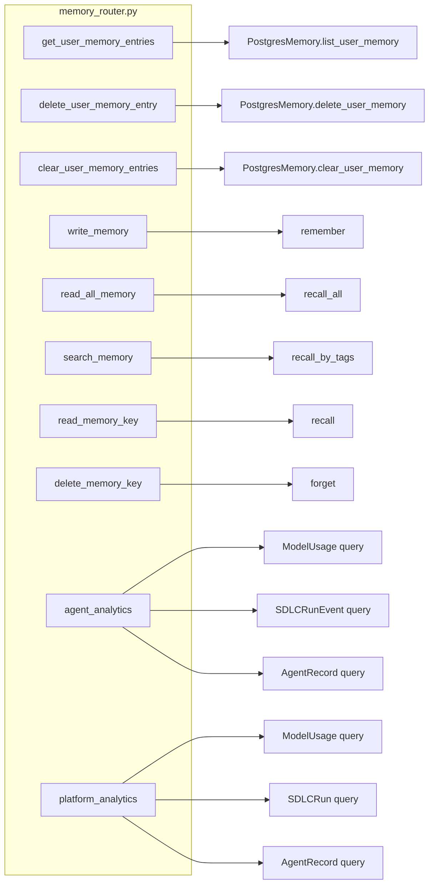

# memory_router

The `memory_router` module exposes the `/memory` REST API surface for two distinct but related concerns: **episodic cross-session memory** and **agent/platform analytics**. It is implemented as a FastAPI router (`routers/memory_router.py`) and is mounted in the main gateway under the `/memory` prefix, with an additional `analytics_router` registered for `/agents/{name}/analytics` and `/analytics/platform`.

Cross-chat user memory gives the platform a ChatGPT/Grok-style "memory drawer": durable facts distilled from conversations are persisted per user and surfaced across new chats. Agent-scoped memory stores key/value pairs tied to a specific agent name and is used by agent runtimes to recall context between invocations. The analytics endpoints aggregate `ModelUsage`, `SDLCRunEvent`, `SDLCRun`, and `AgentRecord` data into per-agent and platform-wide dashboards.

---

## Core Functionality

### 1. Cross-Chat User Memory (`/memory/user`)

These endpoints manage per-user memory summaries that survive individual chat sessions. They are surfaced in the AI UI through the **Memory** page and the **MemoryPanel** slide-out drawer.

| Method | Path | Handler | Purpose |
|--------|------|---------|---------|
| `GET` | `/memory/user` | `get_user_memory_entries` | List the caller's saved memory entries (newest first). |
| `DELETE` | `/memory/user/{mem_id}` | `delete_user_memory_entry` | Delete a single memory entry by id. |
| `DELETE` | `/memory/user` | `clear_user_memory_entries` | Clear all cross-chat memory for the caller. |

User memory is stored in the `conversations` table with `session_id = 'user:{user_id}'` and `role = 'summary'`. The actual persistence, smart merging, semantic de-duplication, and pruning logic lives in [`PostgresMemory`](../reference/memory.md) (see `memory/postgres_memory.py`). The router only performs authentication and delegates to `_user_pm.list_user_memory`, `_user_pm.delete_user_memory`, and `_user_pm.clear_user_memory`.

### 2. Agent-Scoped Memory (`/memory/{agent_name}`)

These endpoints provide simple key/value storage for a named agent. They are used by agent runtimes to remember facts across runs.

| Method | Path | Handler | Purpose |
|--------|------|---------|---------|
| `POST` | `/memory/{agent_name}` | `write_memory` | Upsert a key/value memory entry with optional tags. |
| `GET` | `/memory/{agent_name}` | `read_all_memory` | Return all memory entries for the agent. |
| `GET` | `/memory/{agent_name}/search` | `search_memory` | Return entries whose tags overlap with the provided comma-separated tags. |
| `GET` | `/memory/{agent_name}/{key}` | `read_memory_key` | Return the value for a specific key. |
| `DELETE` | `/memory/{agent_name}/{key}` | `delete_memory_key` | Delete a specific key. |

Agent memory is backed by the `AgentMemory` SQLAlchemy model and an in-process cache. The router delegates to the helper functions in `store/episodic_memory` (`remember`, `recall`, `recall_all`, `recall_by_tags`, `forget`).

### 3. Analytics (`/agents/{name}/analytics` & `/analytics/platform`)

These endpoints power the **Agent Analytics** dashboard in the AI UI.

| Method | Path | Handler | Purpose |
|--------|------|---------|---------|
| `GET` | `/agents/{name}/analytics` | `agent_analytics` | Per-agent run counts, latency, success rate, cost, token usage, model distribution, live logs, and metadata. |
| `GET` | `/analytics/platform` | `platform_analytics` | Platform-wide totals, top agents, model distribution, hourly/daily volume, SDLC summary, and agent counts. |

Both analytics handlers query the same underlying tables:

- `model_usages` — per-request token/cost/latency records (`ModelUsage`).
- `sdlc_run_events` — immutable state-transition audit trail (`SDLCRunEvent`).
- `sdlc_runs` — end-to-end SDLC pipeline executions (`SDLCRun`).
- `agents_pg` — registered agent metadata (`AgentRecord`).

The per-agent handler includes special alias mappings for system-level callers (e.g. `orchestrator`, `ide_direct`) and an `SDLC_ACTOR_MAP` that translates registered agent names (e.g. `sdlc-coding-agent`) into internal SDLC actor names (e.g. `ai-coder`) so that pipeline LLM calls are correctly attributed.

---

## Architecture

```mermaid
flowchart TB
    subgraph Frontend["AI UI Frontend"]
        MP[MemoryPanel.jsx]
        M[Memory.jsx]
        AA[AgentAnalytics.jsx]
    end

    subgraph Gateway["Gateway / FastAPI"]
        MR[memory_router<br/>/memory]
        AR[analytics_router<br/>/agents/{name}/analytics<br/>/analytics/platform]
    end

    subgraph Auth["Authentication"]
        GC[get_current_user]
    end

    subgraph MemoryLayer["Memory Layer"]
        PM[PostgresMemory]
        EM[episodic_memory helpers]
    end

    subgraph Database[(Database)]
        CONV[conversations<br/>role='summary']
        AM[agent_memory]
        MU[model_usages]
        SRE[sdlc_run_events]
        SR[sdlc_runs]
        AR2[agents_pg]
    end

    MP -->|GET /memory/user| MR
    M -->|GET/DELETE /memory/user| MR
    AA -->|GET /agents/{name}/analytics<br/>GET /analytics/platform| AR

    MR -->|/user endpoints| GC
    GC --> PM
    PM --> CONV

    MR -->|/{agent_name} endpoints| EM
    EM --> AM

    AR -->|SQLAlchemy queries| Database
    MU --> AR
    SRE --> AR
    SR --> AR
    AR2 --> AR
```

### Route Ordering

The router declares `/memory/user` routes **before** the `/{agent_name}` catch-all routes. FastAPI uses declaration order, not path specificity, so registering `/memory/user` first prevents a request like `GET /memory/user` from being matched by `/{agent_name}` with `agent_name="user"`. This is explicitly called out in the source code as a critical ordering constraint.

---

## Dependencies



### Related Modules

- **[auth system](../security/auth.md)** — Provides `get_current_user` for JWT/API-key authentication and user enrichment. The user-memory endpoints depend on it for scoping.
- **[memory system](../reference/memory.md)** — Implements `PostgresMemory`, which handles cross-chat user memory persistence, smart merging, semantic de-duplication, and pruning.
- **[episodic memory](../store_episodic_memory.md)** — Implements `remember`, `recall`, `recall_all`, `recall_by_tags`, and `forget` for agent-scoped key/value memory.
- **[db models](../db_models.md)** — Defines `ModelUsage`, `SDLCRunEvent`, `SDLCRun`, `AgentRecord`, and `AgentMemory`.
- **[embedding_service](../knowledge/embedding_service.md)** — Used by `PostgresMemory` for semantic similarity checks when merging memory entries.
- **[model_router](../model_router.md)** — Used by `PostgresMemory` to generate merged memory summaries.
- **[Agent Analytics UI](../agents/agent_analytics.md)** — Frontend component that consumes `/agents/{name}/analytics` and `/analytics/platform`.
- **[Memory UI](../memory_ui.md)** — Frontend components (`MemoryPanel.jsx`, `Memory.jsx`) that consume `/memory/user`.

---

## Data Flows

### Cross-Chat User Memory Read/Delete



### Agent-Scoped Memory CRUD



### Per-Agent Analytics



### Platform Analytics



---

## Component Interaction



---

## Key Design Decisions

1. **Dual memory backends.** Cross-chat user memory uses `PostgresMemory` directly because it requires smart merging, semantic de-duplication, and user scoping. Agent-scoped memory uses the simpler `store/episodic_memory` helpers backed by the `AgentMemory` table.

2. **Route ordering matters.** The `/memory/user` routes are declared before `/{agent_name}` catch-alls to avoid mis-routing.

3. **Analytics degrade gracefully.** If an agent has no direct `ModelUsage` rows, the per-agent handler falls back to `SDLCRunEvent` counts and platform-wide averages. If the database is unreachable, both analytics handlers return a JSON payload with zeros and a `note` field instead of raising an exception.

4. **Model name normalization.** Both analytics endpoints normalize raw model IDs into display labels (e.g. `gpt-5.4`, `Claude Sonnet 4.6`, `Ollama local (llama3.1)`) so dashboards remain consistent even when the database stores mixed identifiers.

5. **Naive UTC comparisons.** Platform analytics strips timezone info before comparing `created_at` values, ensuring compatibility across different DB drivers and legacy data.

---

## How It Fits into the System

The `memory_router` sits at the boundary between the AI UI and the platform's persistence/observability layers:

- **For end users**, it powers the memory drawer and memory management page, letting users see and control what the platform remembers about them across chats.
- **For agents**, it provides a lightweight key/value memory store that agent runtimes can use to recall context across invocations.
- **For operators and admins**, it exposes usage and cost analytics that help monitor agent performance, model adoption, and platform health.

It is mounted alongside other shared API routers in the gateway (see [gateway](../models/gateway.md) and [shared_api_routers](shared_api_routers.md)). The analytics endpoints share the same `model_usages` table that is populated by the LLM proxy and agent execution paths, ensuring a single source of truth for cost and token tracking.
