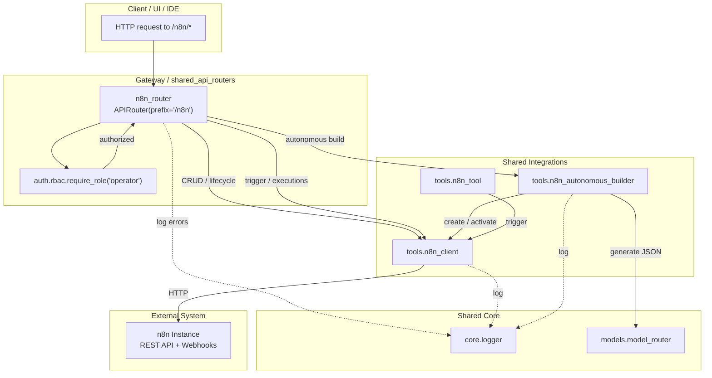
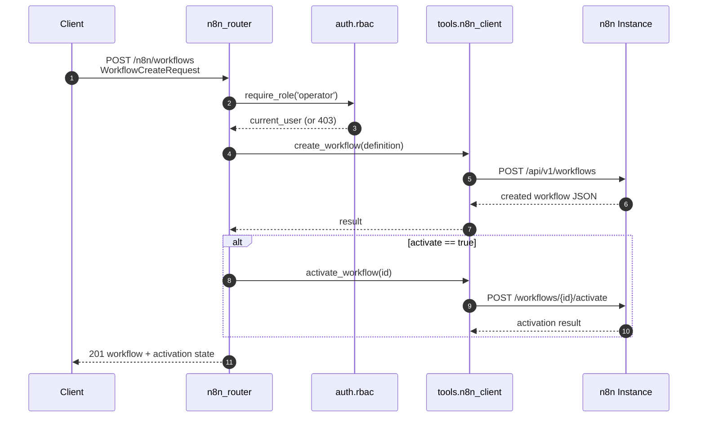
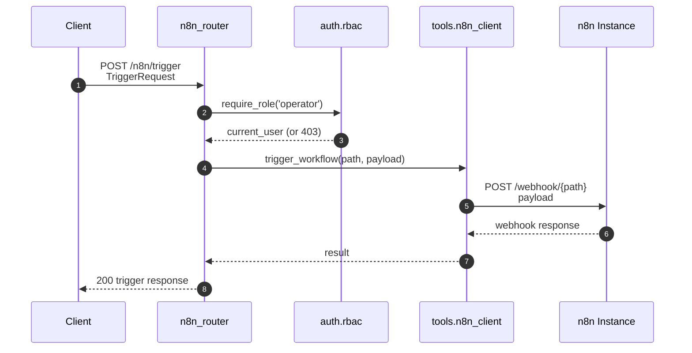
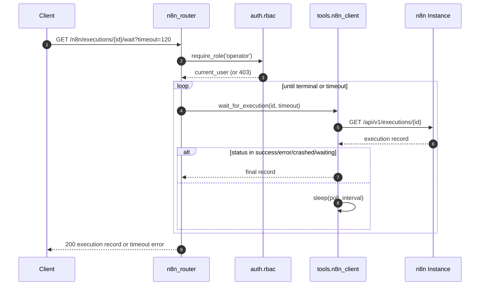
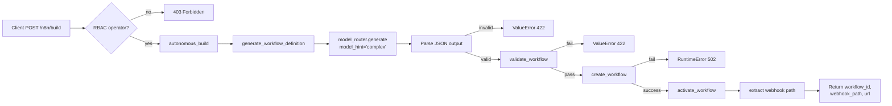

# n8n Router

## Brief Introduction

The `n8n_router` module exposes a FastAPI sub-router at `/n8n` that provides full lifecycle management for external [n8n](https://n8n.io/) workflows. It allows operators to create, read, update, delete, activate, and deactivate n8n workflows, trigger them via webhooks, inspect execution history, and even generate complete workflows autonomously from a plain-English task description using a large language model (LLM).

All endpoints in this router require the `operator` role or higher, enforced through the shared RBAC dependency factory. The router itself is thin: it validates incoming Pydantic request models, delegates all n8n REST API calls to the shared `tools.n8n_client`, and maps client-level errors into appropriate HTTP status codes.

---

## Module Purpose and Core Functionality

The module serves three primary purposes within the platform:

1. **Workflow CRUD & Lifecycle Management** — List, fetch, create, update, delete, activate, and deactivate n8n workflows through a clean REST interface.
2. **Execution Tracking** — Trigger workflows via webhooks and poll/list execution records to observe run status and output.
3. **Autonomous Workflow Generation** — Accept a natural-language task description, generate a valid n8n workflow JSON via the model router, validate it, create it in n8n, activate it, and return the resulting webhook URL.

### Core Components

| Component | Type | Responsibility |
|-----------|------|----------------|
| `WorkflowCreateRequest` | Pydantic model | Payload for creating a workflow, including the raw n8n definition and an `activate` flag. |
| `WorkflowUpdateRequest` | Pydantic model | Payload for updating a workflow, including the definition and an optional `activate` flag. |
| `TriggerRequest` | Pydantic model | Payload for triggering a workflow via its webhook path. |
| `AutoBuildRequest` | Pydantic model | Payload for the autonomous builder endpoint. |
| `list_workflows` / `get_workflow` / `create_workflow` / `update_workflow` / `delete_workflow` | Route handlers | CRUD operations backed by `tools.n8n_client`. |
| `activate_workflow` / `deactivate_workflow` | Route handlers | Lifecycle toggles backed by `tools.n8n_client`. |
| `trigger_workflow` | Route handler | Webhook trigger backed by `tools.n8n_client`. |
| `list_executions` / `get_execution` / `wait_for_execution` | Route handlers | Execution observation backed by `tools.n8n_client`. |
| `autonomous_build` | Route handler | Orchestrates `tools.n8n_autonomous_builder.autonomous_build`. |

---

## Architecture



### Component Relationships

- **`n8n_router`** is a FastAPI `APIRouter` mounted under `/n8n`. It does not contain business logic for talking to n8n directly; instead it acts as a controller layer.
- **`tools.n8n_client`** is the dedicated HTTP client for the n8n REST API. It manages connection pooling, authentication headers, and error normalization. See [shared_integrations.md](../reference/shared_integrations.md) for details.
- **`tools.n8n_autonomous_builder`** generates valid n8n workflow JSON from natural language using the shared model router, validates the structure, and then uses `tools.n8n_client` to create and activate the workflow. See [shared_integrations.md](../reference/shared_integrations.md).
- **`tools.n8n_tool`** is a separate orchestrator-compatible tool that triggers existing workflows; it is not used by the router but shares the same client. See [shared_integrations.md](../reference/shared_integrations.md).
- **`auth.rbac.require_role`** enforces the `operator` minimum role on every route. See [shared_core.md](../reference/shared_core.md) for the authentication and authorization subsystem.
- **`models.model_router`** provides LLM generation for the autonomous builder, routing the prompt to an approved model (e.g., Claude Sonnet). See [shared_core.md](../reference/shared_core.md) under model routing.
- **`core.logger`** provides structured logging across the router and its dependencies. See [shared_core.md](../reference/shared_core.md).

---

## Dependencies

### Direct Imports

| Import | Module | Purpose |
|--------|--------|---------|
| `APIRouter`, `Depends`, `HTTPException` | `fastapi` | Router definition and dependency injection. |
| `BaseModel` | `pydantic` | Request payload validation. |
| `require_role` | `auth.rbac` | RBAC enforcement. |
| `logger` | `core.logger` | Structured logging. |
| `tools.n8n_client` | `shared_integrations` | n8n REST API client. |
| `tools.n8n_autonomous_builder` | `shared_integrations` | Autonomous workflow builder. |

### Runtime Dependencies

- An accessible n8n instance configured via `N8N_URL` and `N8N_API_KEY`.
- The platform gateway or another FastAPI application to mount the router.
- The shared model router and its configured LLM gateways/proxy for autonomous builds.

---

## Data Flow

### Workflow CRUD Flow



### Webhook Trigger Flow



### Execution Polling Flow



---

## Process Flows

### Autonomous Build Process

The `/n8n/build` endpoint is the most complex flow. It converts a plain-English task into a running n8n workflow.



#### Validation Rules

The autonomous builder validates generated workflows before sending them to n8n:

- The workflow must contain at least one node.
- The workflow must contain a Webhook trigger node.
- Every connection must reference a node ID that exists in the workflow.

#### Output Shape

On success, `/n8n/build` returns:

```json
{
  "workflow_id": "123",
  "workflow_name": "ainxt-auto-a1b2c3d4",
  "webhook_path": "my-webhook",
  "url": "http://localhost:5678/webhook/my-webhook"
}
```

---

## API Endpoint Reference

All routes are prefixed with `/n8n` and require the `operator` role or higher.

| Method | Path | Description | Request Body / Query |
|--------|------|-------------|----------------------|
| GET | `/workflows` | List workflows. | `active_only: bool = false` |
| GET | `/workflows/{workflow_id}` | Get a single workflow. | path param |
| POST | `/workflows` | Create a workflow. | `WorkflowCreateRequest` |
| PUT | `/workflows/{workflow_id}` | Update a workflow. | `WorkflowUpdateRequest` |
| DELETE | `/workflows/{workflow_id}` | Delete a workflow. | path param |
| POST | `/workflows/{workflow_id}/activate` | Activate a workflow. | path param |
| POST | `/workflows/{workflow_id}/deactivate` | Deactivate a workflow. | path param |
| POST | `/trigger` | Trigger a workflow via webhook. | `TriggerRequest` |
| GET | `/executions` | List recent executions. | `workflow_id: str?`, `limit: int = 20` |
| GET | `/executions/{execution_id}` | Get execution status/output. | path param |
| GET | `/executions/{execution_id}/wait` | Poll until execution completes. | `timeout: int = 120` |
| POST | `/build` | Autonomously generate and deploy a workflow. | `AutoBuildRequest` |

---

## Error Handling

The router maps errors from the underlying client into standard HTTP responses:

| Source | Condition | HTTP Status | Detail |
|--------|-----------|-------------|--------|
| `auth.rbac` | User role below `operator` | `403 Forbidden` | Role required message |
| `tools.n8n_client` | n8n returns an HTTP error or is unreachable | `502 Bad Gateway` | n8n error text |
| `autonomous_build` | LLM output is not valid JSON | `422 Unprocessable Entity` | Parse error |
| `autonomous_build` | Generated workflow fails structural validation | `422 Unprocessable Entity` | Validation reason |
| `autonomous_build` | n8n create/activate fails | `502 Bad Gateway` | Upstream error |
| `autonomous_build` | Unexpected exception | `500 Internal Server Error` | Error message (logged) |

All n8n client methods return a dictionary with an `"error"` key on failure, which the router inspects and converts to `HTTPException`.

---

## Configuration

The n8n client reads the following environment variables. These are not defined in the router but are required for it to function:

| Variable | Default | Description |
|----------|---------|-------------|
| `N8N_URL` | `http://localhost:5678` | Base URL of the n8n instance. |
| `N8N_API_KEY` | `""` | API key for n8n REST calls. |
| `N8N_WEBHOOK_URL` | — | Legacy direct webhook URL (optional). |

The autonomous builder additionally depends on the shared model router configuration (e.g., `LLM_PROXY_URL`, model registry, and circuit breaker settings). See [shared_core.md](../reference/shared_core.md) for model routing configuration.

---

## Security Considerations

- **Role gating**: Every route uses `Depends(require_role("operator"))`. Only operators, security staff, and admins can manage n8n workflows.
- **No PII in router**: The router does not process or store sensitive data; payloads are forwarded directly to n8n or to the model router for generation.
- **Upstream trust**: The router trusts the n8n client to handle API key authentication and HTTPS verification. Ensure `N8N_URL` uses HTTPS in production.
- **Autonomous build safety**: Generated workflows are structurally validated before creation, but operational correctness (e.g., credentials, node parameters) is the responsibility of the n8n instance and the reviewing operator.

---

## How It Fits into the Overall System

The `n8n_router` is part of the `shared_api_routers` layer. It is typically mounted by the platform gateway (see [gateway.md](../models/gateway.md)) alongside other domain routers such as `workflows_router`, `agents_router`, and `triggers_router`.

While the platform's internal workflow engine (see [abstudio_backend.md](../ui/abstudio_backend.md)) manages native agentic workflows, the n8n router provides a bridge to the external n8n automation ecosystem. This enables operators to:

- Reuse n8n's extensive integration node library.
- Trigger n8n workflows from the platform.
- Build automations quickly via natural language without manually authoring JSON.
- Monitor n8n execution status from a single API surface.

The autonomous builder is also exposed as an orchestrator-compatible tool via `n8n_autonomous_tool` in `tools.n8n_autonomous_builder`, allowing agent loops to create n8n workflows dynamically. The simpler `n8n_tool` allows agents to trigger existing workflows.

---

## Related Documentation

- [shared_api_routers.md](shared_api_routers.md) — Overview of all shared API routers.
- [gateway.md](../models/gateway.md) — How routers are mounted and served.
- [shared_integrations.md](../reference/shared_integrations.md) — Details on `tools.n8n_client`, `tools.n8n_autonomous_builder`, and `tools.n8n_tool`.
- [shared_core.md](../reference/shared_core.md) — RBAC (`auth.rbac`), logging (`core.logger`), and model routing (`models.model_router`).
- [abstudio_backend.md](../ui/abstudio_backend.md) — Native workflow and agent management (complementary to n8n integration).
