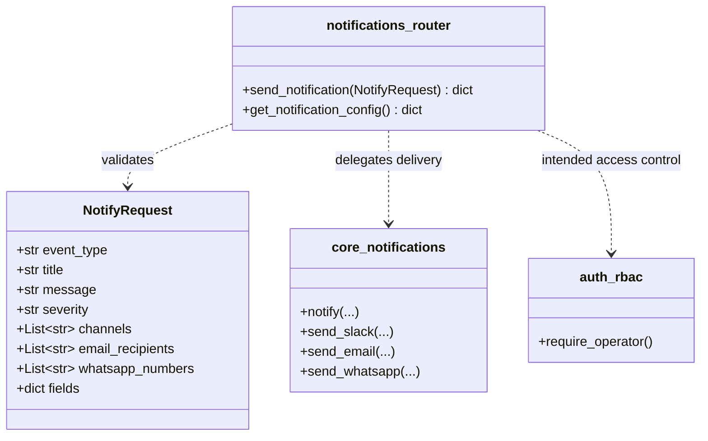
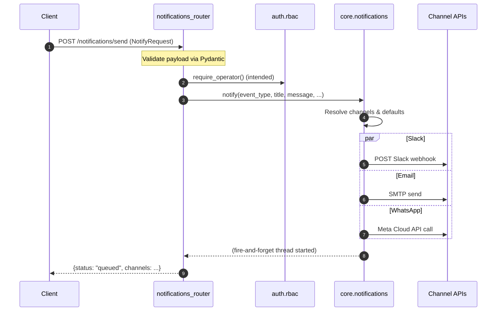

# notifications_router

The `notifications_router` module exposes a small, operator-facing HTTP API for
triggering system notifications and inspecting the runtime configuration of the
notification channels. It is part of the platform's **observability** surface and
acts as a thin adapter between the REST layer and the shared
[`core.notifications`](../core_notifications.md) dispatch engine.

---

## What this module does

1. **Send notifications** – `POST /notifications/send` accepts a structured
   request and delegates delivery to Slack, Email, and/or WhatsApp.
2. **Report channel health** – `GET /notifications/config` returns a boolean
   map indicating which channels have the required environment variables set.

The router intentionally keeps transport logic out of the endpoint code; all
channel-specific work (webhook formatting, SMTP handling, Meta API calls) lives
in [`core.notifications`](../core_notifications.md).

---

## Endpoints

| Method | Path | Description | Tags |
|--------|------|-------------|------|
| `POST` | `/notifications/send` | Queue a notification to one or more channels | `observability` |
| `GET`  | `/notifications/config` | Return which channels are configured | `observability` |

---

## Request model

### `NotifyRequest`

```python
class NotifyRequest(BaseModel):
    event_type:         str
    title:              str
    message:            str
    severity:           str = "info"
    channels:           Optional[List[str]] = None
    email_recipients:   Optional[List[str]] = None
    whatsapp_numbers:   Optional[List[str]] = None
    fields:             Optional[dict] = None
```

| Field | Type | Required | Purpose |
|-------|------|----------|---------|
| `event_type` | `str` | yes | Logical event key (e.g. `incident_detected`, `security_alert`) |
| `title` | `str` | yes | Short notification headline |
| `message` | `str` | yes | Human-readable body |
| `severity` | `str` | no | `info` / `high` / `critical` (drives color/prefix) |
| `channels` | `List[str]` | no | Explicit channel list: `slack`, `email`, `whatsapp` |
| `email_recipients` | `List[str]` | no | Override recipients for email |
| `whatsapp_numbers` | `List[str]` | no | E.164 phone numbers for WhatsApp |
| `fields` | `dict` | no | Key/value pairs rendered as Slack attachment fields / email body |

When `channels` is omitted, [`core.notifications`](../core_notifications.md) falls
back to a default channel map keyed by `event_type`.

---

## Architecture

```mermaid
flowchart LR
    subgraph Client
        UI["Admin / Monitoring UI"]
        Script["Automation Script"]
    end

    subgraph API
        NR["notifications_router<br/>(/notifications)"]
    end

    subgraph Core
        CN["core.notifications"]
    end

    subgraph Channels
        SL["Slack Webhook"]
        EM["SMTP / Email"]
        WA["WhatsApp (Meta Cloud)"]
    end

    UI -->|POST /send| NR
    Script -->|GET /config| NR
    NR -->|notify(...)| CN
    CN --> SL
    CN --> EM
    CN --> WA
```

The router is a **controller** in the classic sense: it validates input,
applies access policy, and hands off to the shared notification service. It
never talks to Slack, SMTP, or WhatsApp directly.

---

## Component relationships



---

## Data flow: sending a notification



The call to `notify()` starts a daemon thread, so the HTTP response returns
immediately with `status: "queued"`. Actual delivery happens asynchronously.

---

## Process flow: reading channel configuration

```mermaid
flowchart TD
    A[Client GET /notifications/config] --> B{Read environment}
    B --> C[SLACK_WEBHOOK_URL set?]
    B --> D[SMTP_USER & SMTP_PASSWORD set?]
    B --> E[WHATSAPP_API_URL & WHATSAPP_ACCESS_TOKEN set?]
    C --> F[Return {slack, email, whatsapp} booleans]
    D --> F
    E --> F
```

The config endpoint is read-only and safe to expose to authenticated clients
that need to know whether alerting is operational.

---

## Dependencies

| Dependency | Module | Role |
|------------|--------|------|
| `notify` | [`core.notifications`](../core_notifications.md) | Dispatches notifications to configured channels |
| `require_operator` | [`auth.rbac`](../auth_rbac.md) | Intended RBAC guard (see note below) |
| Environment variables | `os.environ` | Channel credentials and API endpoints |

### Environment variables

| Variable | Used by | Purpose |
|----------|---------|---------|
| `SLACK_WEBHOOK_URL` | Slack channel | Incoming webhook URL |
| `SMTP_USER` / `SMTP_PASSWORD` | Email channel | SMTP authentication |
| `SMTP_HOST` / `SMTP_PORT` | Email channel | SMTP relay (defaults in `core.notifications`) |
| `SMTP_FROM` | Email channel | From address |
| `WHATSAPP_API_URL` | WhatsApp channel | Meta Business Cloud messages endpoint |
| `WHATSAPP_ACCESS_TOKEN` | WhatsApp channel | Bearer token for Meta API |

See [`core.notifications`](../core_notifications.md) for the exact default values
and fallback behavior.

---

## Access control

The route docstring states that `POST /notifications/send` *"Requires operator
role or higher"*. The module imports `require_operator` from
[`auth.rbac`](../auth_rbac.md), but the dependency is **not currently wired** via
`Depends()` in the endpoint signature.

> **Maintenance note:** If you want to enforce the documented access level, add
> `Depends(require_operator)` (or the equivalent RBAC dependency) to
> `send_notification`. Until then, the endpoint relies on upstream middleware
> or gateway-level authorization for protection.

---

## Error handling and observability

* **Validation errors** are handled automatically by FastAPI/Pydantic and
  returned as `422 Unprocessable Entity`.
* **Channel delivery failures** are logged by [`core.notifications`](../core_notifications.md);
  the HTTP caller only sees `status: "queued"` because delivery is asynchronous.
* **Missing credentials** cause the corresponding channel to be skipped with a
  warning log; the config endpoint surfaces this state as `false` for that
  channel.

---

## How it fits into the system

`notifications_router` is one of several observability and messaging surfaces:

* [`inbox_router.md`](inbox_router.md) – user-facing approvals and unread counts.
* [`broadcast_router.md`](broadcast_router.md) – targeted email/Teams broadcasts.
* [`teams_router.md`](teams_router.md) – Teams-specific notifications and meeting processing.
* [`core.notifications`](../core_notifications.md) – shared dispatch engine used by
  this router, the SDLC pipeline, agent runners, budget alerts, etc.

Internal callers (workers, agents, governance jobs) typically call
`core.notifications.notify_*` helpers directly rather than using this HTTP API.
This router is primarily intended for **administrative or external automation**
use cases that need to trigger alerts over HTTP.

---

## Related modules

* [`core_notifications.md`](../core_notifications.md) – notification dispatch implementation
* [`auth_rbac.md`](../auth_rbac.md) – role-based access control
* [`inbox_router.md`](inbox_router.md) – in-app notification/approval inbox
* [`broadcast_router.md`](broadcast_router.md) – broadcast messaging
* [`teams_router.md`](teams_router.md) – Microsoft Teams integration
