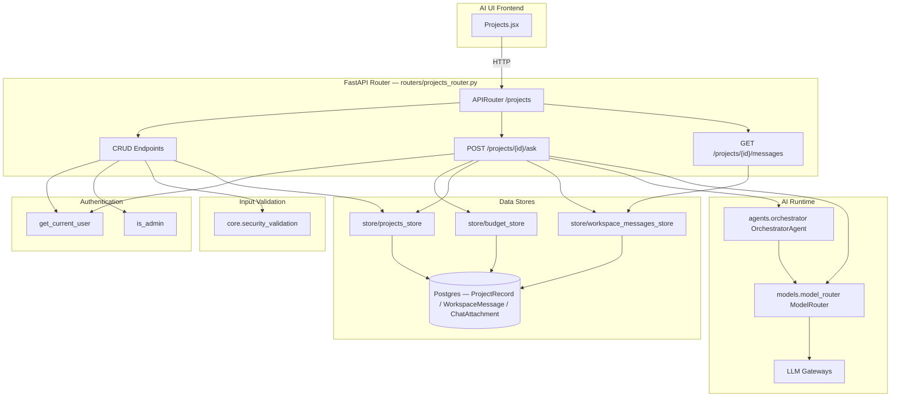
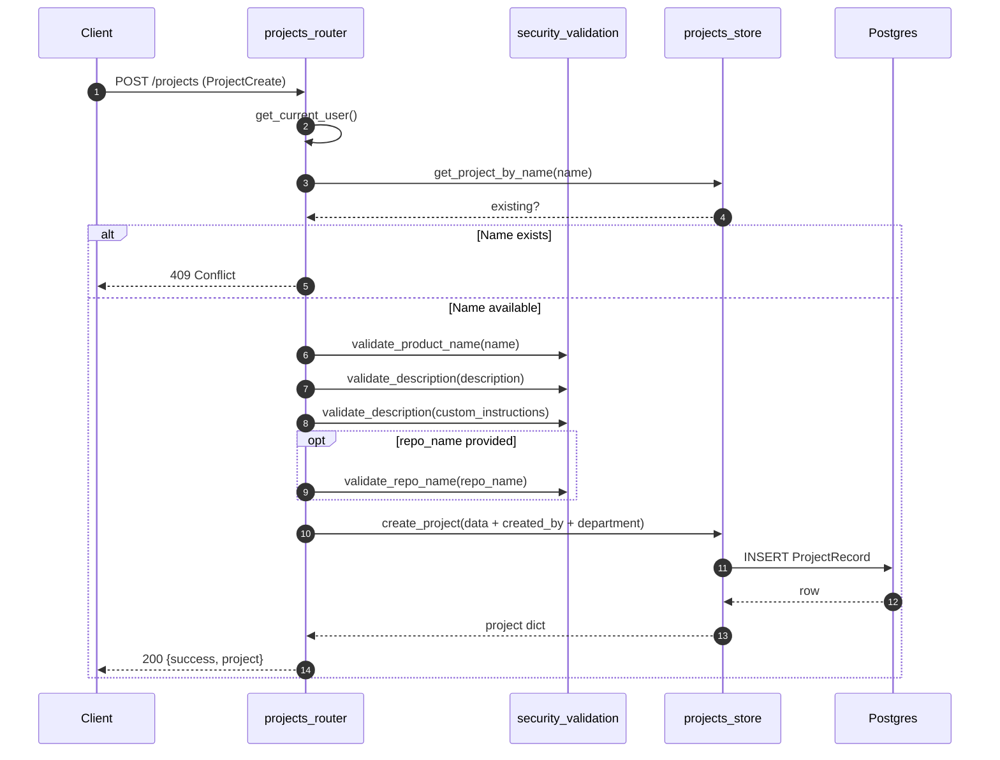
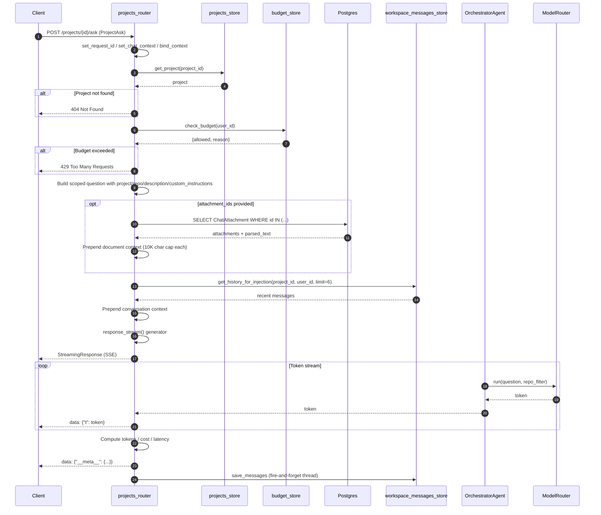
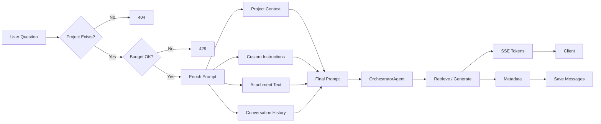

# Projects Router

## Brief Introduction

The `projects_router` module exposes the `/projects` REST API surface for project-scoped AI assistance. It lets authenticated users create, list, update, and delete projects, and—most importantly—ask questions within a project context. Each project binds a name, description, optional codebase repository, team, custom instructions, and tags. When a user asks a question, the router enriches the prompt with that project context, enforces budget limits, streams the answer via Server-Sent Events (SSE), and persists the conversation history in a per-user, per-project workspace message store.

This router is part of the shared API layer and is consumed by the AI UI frontend's [Projects](../ui/ai_ui_frontend.md#projects) feature.

---

## Core Responsibilities

1. **Project CRUD**: Create, read, update, and delete project records with input validation and ownership checks.
2. **Project-Scoped Q&A**: Stream AI-generated answers that are grounded in the project's repository, description, custom instructions, and uploaded attachments.
3. **Conversation History**: Replace browser `localStorage` with a server-side, per-user, per-project message store.
4. **Budget Enforcement**: Gate every question against the user's spend budget before invoking the orchestrator.
5. **Observability**: Bind request, chat, and user IDs to thread-local logging context for tracing.

---

## Architecture



---

## Component Reference

### Data Models

#### `ProjectCreate`

Pydantic model used for creating and updating projects.

| Field | Type | Default | Description |
|-------|------|---------|-------------|
| `name` | `str` | required | Project display name. |
| `description` | `str` | `""` | Free-form project description. |
| `repo_name` | `str` | `""` | Optional repository to scope RAG/code retrieval. |
| `team` | `List[str]` | `[]` | List of team members/identifiers. |
| `custom_instructions` | `str` | `""` | System-like instructions prepended to every question. |
| `tags` | `List[str]` | `[]` | Searchable tags. |

#### `ProjectAsk`

Pydantic model for the question endpoint.

| Field | Type | Default | Description |
|-------|------|---------|-------------|
| `question` | `str` | required | The user's question. |
| `session_id` | `Optional[str]` | `None` | Stable conversation identifier; used as `request_id` for tracing. |
| `attachment_ids` | `Optional[List[str]]` | `None` | IDs of previously uploaded `ChatAttachment` records whose parsed text is injected into the prompt. |

---

### Endpoints

| Method | Path | Handler | Purpose |
|--------|------|---------|---------|
| `GET` | `/projects` | `list_projects` | List projects visible to the current user. |
| `POST` | `/projects` | `create_project` | Create a new project after validating inputs and checking name uniqueness. |
| `GET` | `/projects/{project_id}` | `get_project` | Fetch a single project by ID. |
| `PUT` | `/projects/{project_id}` | `update_project` | Update a project; restricted to creator or admin. |
| `DELETE` | `/projects/{project_id}` | `delete_project` | Delete a project and cascade-delete its workspace messages. |
| `GET` | `/projects/{project_id}/messages` | `get_project_messages` | Return server-side chat history for the project/user pair. |
| `POST` | `/projects/{project_id}/ask` | `ask_project` | Stream an AI answer for a project-scoped question. |

---

## Detailed Flows

### Project Creation Flow



### Ask Project Flow



---

## Key Design Decisions

### 1. Server-Side Conversation History

The router intentionally replaces `localStorage` as the source of truth. Messages are stored in `WorkspaceMessage` rows keyed by `(project_id, user_id)`. This gives three benefits:

- History survives page reloads and device switches.
- Teammates on the same project cannot see each other's messages (user isolation).
- The orchestrator can inject recent turns into the prompt for multi-turn coherence.

See [workspace_messages_store](../storage/store_layer.md) for persistence details.

### 2. Prompt Enrichment

Every question is rewritten to include project metadata so the orchestrator never classifies a project-scoped question as "general":

```text
[Project: {name}] [Codebase: {repo_name}] [Description: {description}]

{custom_instructions}

{attachment_context}

[Conversation context]
User: ...
Assistant: ...

[Current question]
{question}
```

### 3. Budget Gate

`check_budget(user_id)` is invoked before any LLM call. It enforces only the total cost budget and is fail-open if both Redis and Postgres are unavailable. Local/Ollama models are treated as free upstream, so this gate is only reached for paid model paths.

See [budget_store](../storage/store_layer.md) and [budget_router](budget_router.md) for broader budget management.

### 4. Streaming & Thread-Local Context

Because FastAPI iterates the SSE generator on a different thread, the router re-seeds the logging context (`request_id`, `chat_id`, `user_id`) at the top of `response_stream()`. This ensures every log line and the final metadata event carry the correct trace IDs.

### 5. Cost & Token Estimation

After streaming completes, the router computes:

- `in_tok` / `out_tok` from `model_router.last_input_tokens` / `last_output_tokens` when available.
- A heuristic estimate (`word_count * 1.3`) when token counts are unavailable.
- `cost` from `MODEL_COST_PER_1M`, with local/Ollama/Llama models forced to `$0`.

### 6. Fallback Path

If `OrchestratorAgent.run()` raises an exception, the router falls back to a direct `model_router.stream(..., model_hint="medium")` call so the user still receives a response.

### 7. Cascade Delete on Project Deletion

Deleting a project spawns a daemon thread that calls `delete_project_messages(project_id)` so workspace history is cleaned up without blocking the HTTP response.

---

## Dependencies

| Dependency | Module | Role |
|------------|--------|------|
| `get_current_user` | [auth.dependencies](../security/authentication.md) | JWT-based user extraction. |
| `is_admin` | [auth.rbac](../security/authentication.md) | Admin check for listing all projects. |
| `validate_product_name`, `validate_description`, `validate_repo_name` | [core.security_validation](../infrastructure/core_infrastructure.md) | XSS/SQL-injection input sanitization. |
| `logger`, `set_request_id`, `set_chat_context`, `bind_context`, `set_span_id` | [core.logger](../infrastructure/core_infrastructure.md) | Structured, context-aware logging. |
| `OPENAI_CODING_MODEL`, `MODEL_COST_PER_1M` | [core.model_registry](../infrastructure/core_infrastructure.md) | Default model label and cost rates. |
| `list_projects`, `create_project`, `get_project`, `update_project`, `delete_project` | [store/projects_store](../storage/store_layer.md) | Project persistence. |
| `get_messages`, `get_history_for_injection`, `save_messages`, `delete_project_messages` | [store/workspace_messages_store](../storage/store_layer.md) | Conversation history persistence. |
| `check_budget` | [store/budget_store](../storage/store_layer.md) | Spend gate. |
| `OrchestratorAgent` | [agents.orchestrator](../agents/agent_system.md) | Multi-step planning, retrieval, and generation. |
| `model_router` | [models.model_router](../models/model_routing.md) | LLM routing, streaming, and fallback. |
| `SessionLocal`, `ChatAttachment` | [db.database / db.models](../storage/database.md) | Attachment text lookup. |

---

## Data Flow Diagram



---

## Error Handling

| Scenario | HTTP Status | Detail |
|----------|-------------|--------|
| Duplicate project name | `409` | `Project '{name}' already exists` |
| Invalid `name` / `description` / `custom_instructions` / `repo_name` | `400` | Validation message from `security_validation` |
| Project not found | `404` | `Project not found` |
| Non-owner/non-admin update or delete | `403` | Ownership restriction message |
| Budget exceeded | `429` | `{error: "Budget exceeded", reason: ...}` |
| Orchestrator failure during stream | — | Falls back to direct `model_router.stream`; final SSE still emitted |

---

## Security & Compliance

- All user-provided project fields are validated through `core.security_validation` before persistence.
- The raw user question (`raw_question`) is preserved for compliance scanning and history storage, separate from the enriched prompt sent to the model.
- Budget checks prevent runaway spend on paid models.
- Per-user message isolation prevents cross-user history leakage within shared projects.

---

## Related Modules

- [ai_ui_frontend.md](../ui/ai_ui_frontend.md) — Frontend Projects feature that consumes this router.
- [agent_system.md](../agents/agent_system.md) — `OrchestratorAgent` planning and execution.
- [model_routing.md](../models/model_routing.md) — `ModelRouter` tier selection and streaming.
- [store_layer.md](../storage/store_layer.md) — `projects_store`, `workspace_messages_store`, and `budget_store`.
- [authentication.md](../security/authentication.md) — JWT and RBAC dependencies.
- [core_infrastructure.md](../infrastructure/core_infrastructure.md) — Logging, validation, and model registry utilities.
- [database.md](../storage/database.md) — SQLAlchemy models and session management.
