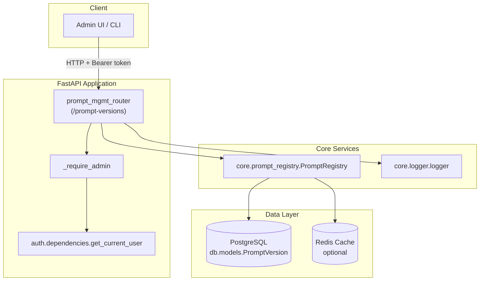
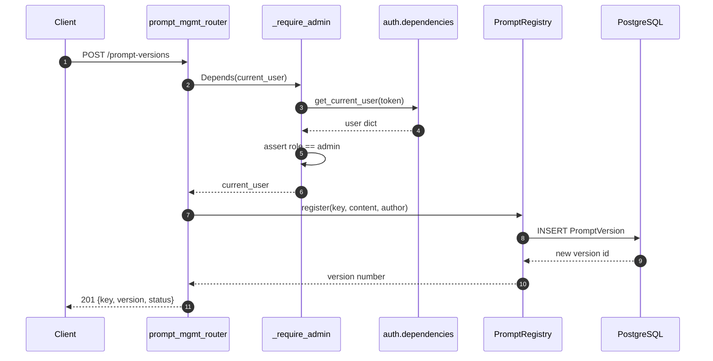
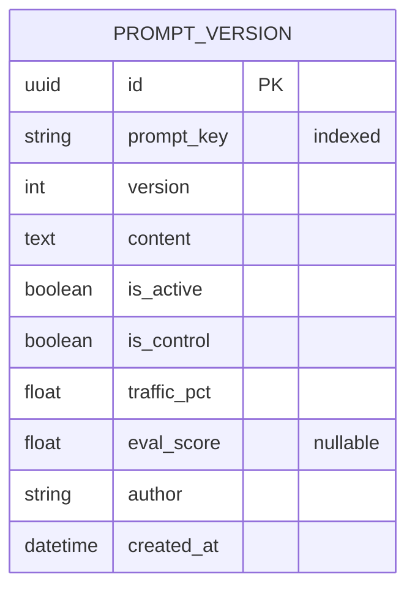

# Prompt Management Router

The **Prompt Management Router** exposes a secure, admin-only REST API for managing versioned LLM prompts. It sits in front of the [`core.prompt_registry`](../core_prompt_registry.md) and provides operators with explicit control over prompt registration, activation, rollback, A/B testing, and evaluation-score inspection.

---

## 1. Purpose & Core Functionality

Prompts are a critical production asset: a small wording change can alter model behavior, compliance posture, or output quality. This router treats prompts as versioned, auditable artifacts rather than static strings:

- **Versioning**: every change is registered as a new immutable version with an auto-incremented integer.
- **Controlled rollout**: new versions are registered but not activated automatically; an admin must explicitly activate them.
- **Safety**: one-click rollback to the previously active version if a regression is observed.
- **Experimentation**: A/B tests can split traffic between a control and a variant version deterministically by `session_id`.
- **Observability**: eval scores are stored per version and exposed for comparison.

All endpoints require the caller to have the `admin` role. Authentication is delegated to [`auth.dependencies.get_current_user`](../auth_dependencies.md).

---

## 2. Module Location

```text
routers/prompt_mgmt_router.py
```

Mounted under the FastAPI application with prefix:

```text
/prompt-versions
```

---

## 3. Public API Surface

| Method | Path | Handler | Purpose |
|--------|------|---------|---------|
| `POST` | `/prompt-versions` | `register_prompt` | Register a new prompt version (inactive by default). |
| `GET`  | `/prompt-versions/{key}` | `list_prompt_versions` | List all versions for a prompt key. |
| `POST` | `/prompt-versions/{key}/activate/{version}` | `activate_prompt_version` | Activate a specific version. |
| `POST` | `/prompt-versions/{key}/rollback` | `rollback_prompt` | Roll back to the previous active version. |
| `POST` | `/prompt-versions/{key}/ab-test` | `start_ab_test` | Start an A/B test between two versions. |
| `GET`  | `/prompt-versions/{key}/eval-scores` | `get_eval_scores` | Get eval scores per version. |

---

## 4. Architecture

### 4.1 High-level placement



### 4.2 Component interaction



---

## 5. Core Components

### 5.1 `_require_admin`

A FastAPI dependency that wraps [`get_current_user`](../auth_dependencies.md) and enforces role-based access control.

```python
def _require_admin(current_user: dict = Depends(_require_auth)) -> dict:
    if current_user.get("role") != "admin":
        raise HTTPException(status_code=403, detail="Admin role required")
    return current_user
```

Every route in this module depends on it, ensuring only administrators can mutate or inspect the prompt registry.

### 5.2 Request models

#### `RegisterPromptRequest`

| Field | Type | Default | Description |
|-------|------|---------|-------------|
| `key` | `str` | required | Logical prompt name, e.g. `react_system_prompt`. |
| `content` | `str` | required | Full prompt text. |
| `author` | `Optional[str]` | `"system"` | Author attribution; falls back to `current_user.user_id`. |

#### `ABTestRequest`

| Field | Type | Default | Description |
|-------|------|---------|-------------|
| `control_version` | `int` | required | Baseline version. |
| `variant_version` | `int` | required | Challenger version. |
| `variant_pct` | `float` | `10.0` | Percentage of traffic routed to the variant. |

### 5.3 Route handlers

#### `register_prompt`

- Registers a new version without activating it.
- Delegates to `prompt_registry.register()`.
- Returns the newly assigned version number.

#### `list_prompt_versions`

- Queries `PromptVersion` directly from the database.
- Returns metadata for every version of a key, including active flag, control flag, traffic split, eval score, author, and a 100-character content preview.

#### `activate_prompt_version`

- Delegates to `prompt_registry.activate(key, version)`.
- The registry deactivates all other versions for the key and marks the selected version as active control.
- Redis cache is invalidated.

#### `rollback_prompt`

- Delegates to `prompt_registry.rollback(key)`.
- Finds the currently active version, then activates the highest preceding version.
- Returns `404` if there is no active version or no previous version.

#### `start_ab_test`

- Guarded by the `PROMPT_AB_TEST_ENABLED` environment variable.
- Delegates to `prompt_registry.start_ab_test(...)`.
- Marks both control and variant as active with complementary traffic percentages.

#### `get_eval_scores`

- Queries `PromptVersion` directly.
- Returns a compact list of `{version, eval_score, is_active, is_control}` for a given key.

---

## 6. Data Model

The router relies on the [`PromptVersion`](../db_models.md) table:



Unique constraint: `(prompt_key, version)`.

For the full model definition and surrounding tables, see [`db/models.md`](../db_models.md).

---

## 7. Data Flows

### 7.1 Registering a new prompt version

```mermaid
flowchart LR
    A[Client POST /prompt-versions] --> B[Validate RegisterPromptRequest]
    B --> C[_require_admin]
    C --> D[prompt_registry.register]
    D --> E{Max version for key?}
    E -->|max + 1| F[INSERT PromptVersion<br/>is_active=False]
    F --> G[Return {key, version, status}]
```

### 7.2 Activating a version

```mermaid
flowchart LR
    A[Client POST /activate/{version}] --> B[_require_admin]
    B --> C[prompt_registry.activate]
    C --> D[UPDATE all versions<br/>is_active=False]
    D --> E[UPDATE target version<br/>is_active=True<br/>is_control=True]
    E --> F[COMMIT]
    F --> G[Invalidate Redis cache]
    G --> H[Return activation status]
```

### 7.3 A/B test traffic routing

A/B routing is implemented inside [`PromptRegistry.get()`](../core_prompt_registry.md), not in the router itself. The router only configures the experiment. At runtime:

```mermaid
flowchart LR
    A[Runtime request with session_id] --> B[Load active versions]
    B --> C{PROMPT_AB_TEST_ENABLED?}
    C -->|No| D[Return control content]
    C -->|Yes| E[hash(session_id:key) % 100]
    E --> F{< variant_pct?}
    F -->|Yes| G[Return variant content]
    F -->|No| D
```

---

## 8. Dependencies

| Dependency | Role | Linked docs |
|------------|------|-------------|
| `fastapi.APIRouter`, `HTTPException`, `Depends` | Web framework primitives | — |
| `pydantic.BaseModel` | Request validation | — |
| `auth.dependencies.get_current_user` | Authentication | [`auth_dependencies.md`](../auth_dependencies.md) |
| `core.logger.logger` | Structured logging | [`core_logger.md`](../core_logger.md) |
| `core.prompt_registry.PromptRegistry` | Business logic & caching | [`core_prompt_registry.md`](../core_prompt_registry.md) |
| `db.database.SessionLocal` | Database sessions | [`db_database.md`](../db_database.md) |
| `db.models.PromptVersion` | ORM model | [`db_models.md`](../db_models.md) |

---

## 9. Configuration & Environment Variables

| Variable | Effect |
|----------|--------|
| `PROMPT_AB_TEST_ENABLED` | Must be `"true"`, `"1"`, or `"yes"` for `start_ab_test` to succeed and for runtime A/B routing to serve variants. |

The router reads this variable at request time for the A/B test endpoint. The underlying registry also consults it during prompt retrieval.

---

## 10. Error Handling

| Scenario | HTTP Status | Detail |
|----------|-------------|--------|
| Missing/invalid token | `401` | Handled by `get_current_user`. |
| Non-admin user | `403` | `"Admin role required"` |
| A/B testing disabled | `400` | `"A/B testing is disabled..."` |
| Rollback with no active version | `404` | `"No active version for key=..."` |
| Rollback with no previous version | `404` | `"No previous version to rollback to..."` |
| Registry/database failure | `500` | Wrapped with context, e.g. `"Failed to register prompt: ..."` |

---

## 11. Security Considerations

- **Admin-only access**: every route depends on `_require_admin`.
- **No PII in responses**: `list_prompt_versions` returns only a 100-character content preview; full prompt content is not exposed by this router.
- **Audit trail**: `author` and `created_at` are persisted per version.
- **Safe experimentation**: A/B tests are opt-in via environment variable; the registry can auto-rollback a variant if its eval score drops more than 20% below the control.

---

## 12. How It Fits Into the System

The Prompt Management Router is part of the [`shared_api_routers`](shared_api_routers.md) layer. It is consumed by:

- **Admin UIs** that need to edit, review, and roll back system prompts.
- **CI/CD or platform automation** that registers prompt updates from code.
- **Evaluation/feedback loops** that call `record_eval_score` on the registry (not directly through this router) and that read scores via `GET /eval-scores`.

At runtime, other modules retrieve the active prompt through [`PromptRegistry.get()`](../core_prompt_registry.md), which transparently handles caching and A/B routing. See also:

- [`core_prompt_registry.md`](../core_prompt_registry.md) for the full registry implementation.
- [`db_models.md`](../db_models.md) for the `PromptVersion` schema.
- [`auth_dependencies.md`](../auth_dependencies.md) for authentication details.
