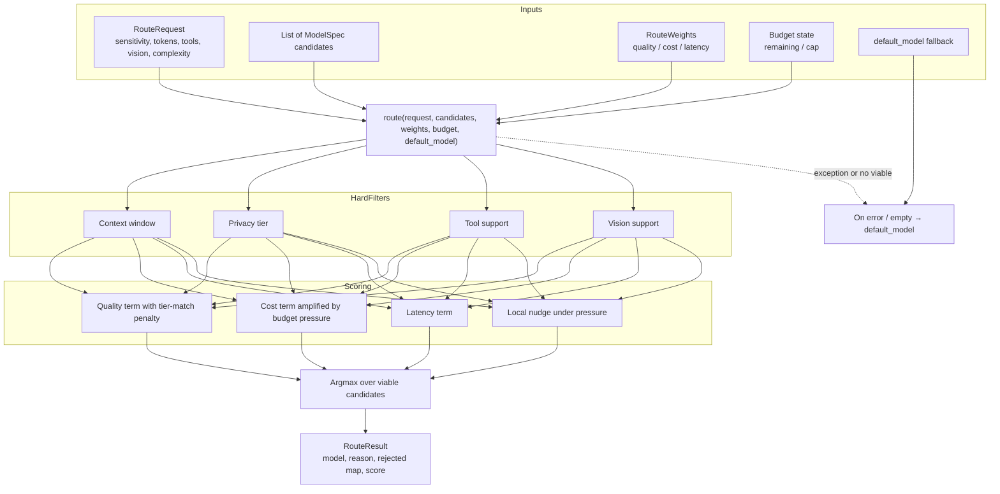
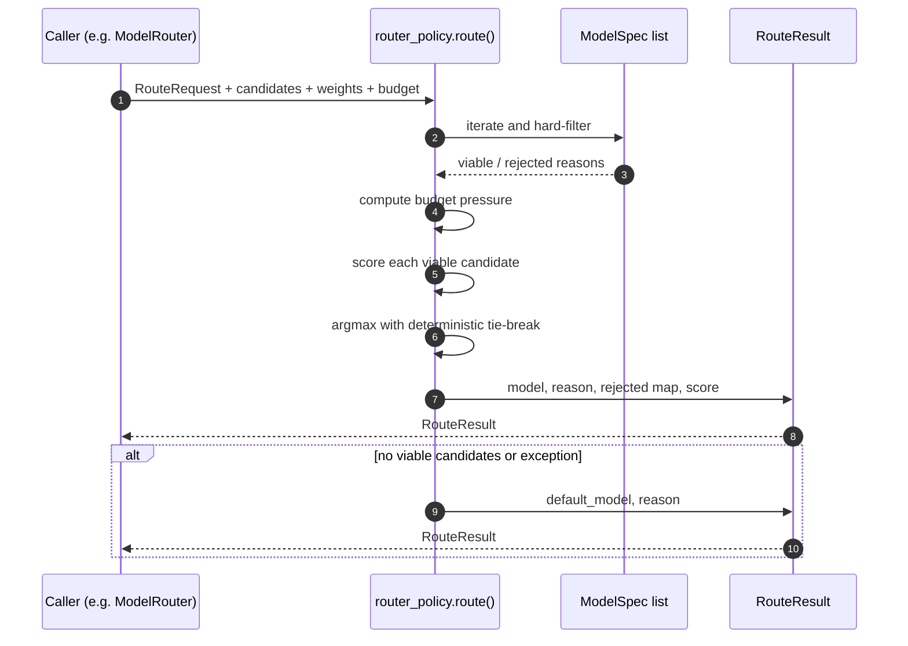
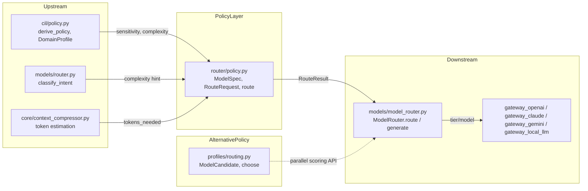
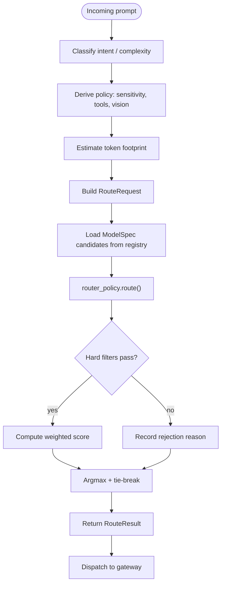

# router_policy

The `router_policy` module implements a **pure, fail-safe model-selection policy** for the platform's LLM router. It transforms model choice from a fixed complexity-tier lookup into a **constraint-satisfaction + weighted-score optimization**: pick the cheapest sufficient model that can handle the request's privacy, context, capability, and budget constraints.

This module is intentionally lightweight (stdlib-only) and decoupled from gateway I/O. It provides the scoring primitives that higher-level routers such as [`models/model_router.py`](../model_router.md) and policy layers such as [`profiles/routing.py`](../reference/profiles_routing.md) can adopt behind feature flags. If anything goes wrong, or if no candidate qualifies, the policy returns the caller's existing default so routing never breaks a live turn.

---

## What this module does

1. **Defines model capability metadata** via `ModelSpec` — context window, privacy tier, cost, latency, quality, tool/vision support, and locality.
2. **Captures routing intent** via `RouteRequest` — sensitivity, token estimate, required capabilities, and task complexity.
3. **Scores candidates** via `route()`:
   - Hard-filters models that fail privacy, context-size, tool, or vision constraints.
   - Computes a weighted score over quality, cost, and latency.
   - Applies budget pressure to bias toward cheaper/local models as spend nears a cap.
   - Returns a deterministic best choice plus a rejection audit map.

---

## Architecture



### Component relationships

| Component | Responsibility |
|-----------|----------------|
| `ModelSpec` | Registry metadata for one LLM: capabilities, cost, latency, quality, privacy tier, locality. |
| `RouteRequest` | Normalized routing inputs assembled from CIL intent, context sizing, and domain profile. |
| `RouteWeights` | Domain-profile weights for the scoring function (quality-first by default). |
| `RouteResult` | Output of `route()`: chosen model name, reason, rejection audit, and score. |
| `route()` | Core policy: filter → score → select, with fail-safe fallback. |

---

## Data flow



---

## Core components

### `ModelSpec`

```python
@dataclass
class ModelSpec:
    name: str
    tier: str = "medium"              # simple|medium|complex|deep|solution|vision
    context_window: int = 8000
    privacy_tier: str = "public"      # public|internal|confidential|restricted
    cost_per_1k: float = 0.0          # USD per 1k tokens
    latency_ms: int = 500
    quality: float = 0.5              # 0..1 relative quality
    supports_tools: bool = False
    supports_vision: bool = False
    is_local: bool = False
```

`ModelSpec` is the routing-relevant metadata the model registry should carry. The key method is `can_handle_privacy(sensitivity)`:

- `restricted` content requires a **local** model (`is_local=True`).
- Otherwise the model's `privacy_tier` must be at least as restrictive as the content sensitivity.

### `RouteRequest`

```python
@dataclass
class RouteRequest:
    sensitivity: str = "internal"
    tokens_needed: int = 0
    needs_tools: bool = False
    needs_vision: bool = False
    complexity: str = "medium"
```

This dataclass is assembled upstream from:

- CIL/policy-derived sensitivity (see [`cil/policy.py`](../reference/cil_policy.md)).
- Estimated token footprint from context compression (see [`core/context_compressor.py`](../core_context_compressor.md)).
- Capability flags (vision, tools) detected from the prompt.
- Complexity classification (see [`models/router.py`](../models_router.md) and [`models/model_router.py`](../model_router.md)).

### `route()`

```python
def route(
    request: RouteRequest,
    candidates: List[ModelSpec],
    *,
    weights: Optional[RouteWeights] = None,
    budget_remaining: Optional[float] = None,
    budget_cap: Optional[float] = None,
    default_model: str = "",
) -> RouteResult
```

The policy executes in three phases:

1. **Budget-pressure calculation** — if a cap is supplied, compute the fraction consumed (`1 - remaining/cap`).
2. **Hard filtering** — reject candidates that fail:
   - `context_window < tokens_needed`
   - privacy tier mismatch
   - missing tool support
   - missing vision support
3. **Scoring & selection** — maximize:
   ```
   score = quality_weight * effective_quality
         - (cost_weight + pressure) * estimated_cost
         - latency_weight * latency_seconds
         + pressure * 0.5   # if local and under pressure
   ```
   Ties are broken by lower cost, then model name, for determinism.

The function is wrapped in a broad `try/except`; any error returns `default_model` with reason `"error→default"`.

---

## Privacy and budget rules

### RT3 — Privacy is a hard constraint

The module enforces a four-level privacy order:

```python
_PRIVACY_ORDER = ["public", "internal", "confidential", "restricted"]
```

A model may handle content only at or below its own privacy tier. `restricted` is special: it requires `is_local=True`, ensuring that the most sensitive data never leaves on-prem infrastructure. This aligns with the **Privacy Floor** logic in [`models/model_router.py`](../model_router.md), which pins CONFIDENTIAL+ traffic to local models before any other routing signal is evaluated.

### RT4 — Budget pressure biases toward cheaper/local models

When `budget_cap` and `budget_remaining` are provided, the policy computes:

```python
pressure = max(0.0, min(1.0, 1.0 - (budget_remaining / budget_cap)))
```

- The effective cost weight becomes `w.cost + pressure`.
- Local models receive an additional `pressure * 0.5` score bonus.
- When pressure exceeds `0.5` and a local model wins, the reason is recorded as `"budget-downshift→local"`.

This lets regulated or cost-conscious profiles automatically downshift as spend approaches a cap, without hard-rejecting viable cloud candidates.

---

## How this module fits into the system

`router_policy` sits at the intersection of **intent/policy derivation**, **model registry metadata**, and **gateway dispatch**:



### Relationship to `models/model_router.py`

[`models/model_router.py`](../model_router.md) is the production router used by chat, agents, and workflows. It currently routes by:

1. Privacy floor (hard pin to local for CONFIDENTIAL+).
2. Explicit `model_hint`.
3. Vision detection.
4. Complexity classification.
5. Context-size promotion.

`router_policy` is designed as a **future drop-in scoring backend** for step 4 (and potentially the entire auto-routing path). Its `default_model` parameter maps directly to the existing tier-label default, so adoption can be flag-gated without breaking existing behavior.

### Relationship to `profiles/routing.py`

[`profiles/routing.py`](../reference/profiles_routing.md) provides a parallel, profile-aware routing API (`ModelCandidate`, `choose`, `RouteChoice`) that consumes [`profiles/schema.py`](../storage/profiles_schema.md) `RoutingPolicy` weights. It implements the same constraint-filter + weighted-score pattern but is wired to the newer domain-profile system. `router_policy` is the lower-level, stdlib-only primitive; `profiles/routing.py` is the higher-level integration layer.

### Relationship to `cil/policy.py`

[`cil/policy.py`](../reference/cil_policy.md) derives per-turn policy decisions such as `sensitivity`, `risk_level`, and `tools_allowed`. These map naturally into `RouteRequest` fields, making `router_policy` the execution arm of CIL-derived policy.

---

## Process flow: selecting a model for a turn



---

## Fail-safe behavior

The module is designed to **never break a turn**:

- If the candidate list is empty, returns `default_model` with reason `"no viable candidate"`.
- If every candidate is filtered out, returns `default_model` with the full `rejected` audit map.
- If any exception occurs during filtering or scoring, returns `default_model` with reason `"error→default"`.

This makes `router_policy` safe to adopt incrementally behind a feature flag or A/B test.

---

## References

- [`models/model_router.py`](../model_router.md) — production router that dispatches to LLM gateways.
- [`profiles/routing.py`](../reference/profiles_routing.md) — profile-aware routing API built on similar scoring principles.
- [`profiles/schema.py`](../storage/profiles_schema.md) — `DomainProfile` and `RoutingPolicy` definitions.
- [`cil/policy.py`](../reference/cil_policy.md) — derives sensitivity, risk, and capability policy per turn.
- [`models/router.py`](../models_router.md) — intent classification used to seed complexity.
- [`core/context_compressor.py`](../core_context_compressor.md) — token-footprint estimation.
- [`core/model_registry.py`](../core_model_registry.md) — authoritative model cost metadata.
