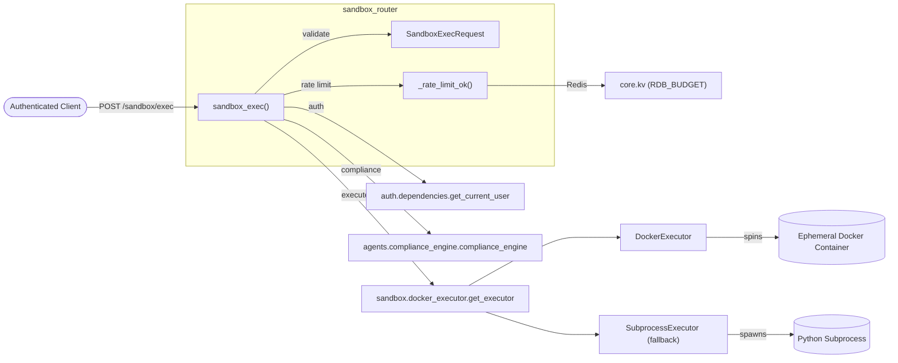
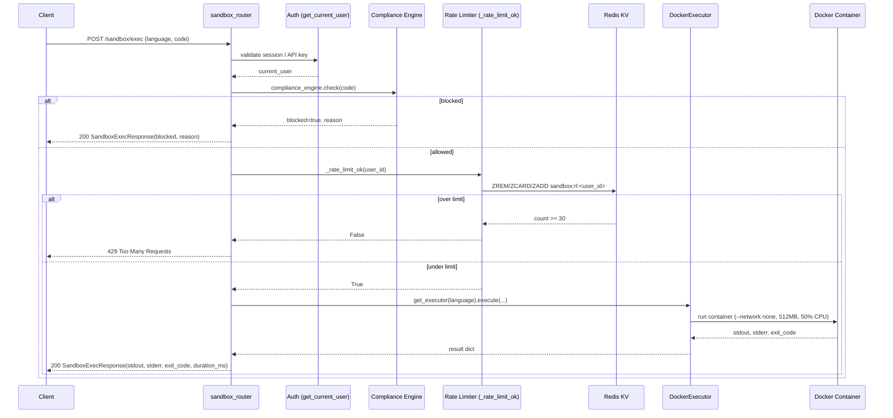

# `sandbox_router` — Isolated Code Execution API

## Brief Introduction

`sandbox_router` is a small, security-focused FastAPI router mounted under `/sandbox`. It exposes a single endpoint, `POST /sandbox/exec`, that lets authenticated users run short code snippets in an isolated execution environment. The router is intentionally thin: it validates the request, enforces a per-user rate limit, runs a compliance pre-check on the submitted code, and then delegates the actual execution to the platform's sandbox engine.

The primary consumer of this router is the CLI's `/sandbox` command, although any authenticated client (IDE plugins, internal tools, etc.) can use it. The router never executes code directly on the gateway host; all untrusted code runs inside a fresh, network-disabled container with strict CPU and memory limits.

---

## Core Responsibilities

| Responsibility | Description |
|----------------|-------------|
| **Request validation** | Enforces `SandboxExecRequest` schema: `language` must be `python`, `bash`, or `node`, and `code` is capped at 64 KB. |
| **Authentication** | Requires a valid JWT session, API key, or `auth_token` cookie via `get_current_user`. |
| **Compliance pre-check** | Scans submitted code for PCI/PII/secrets/dangerous patterns using `compliance_engine.check()` before execution. |
| **Rate limiting** | Applies a 30-executions-per-hour sliding window per user using Redis (fail-open on KV errors). |
| **Sandbox execution** | Hands the snippet to `DockerExecutor` (preferred) or `SubprocessExecutor` (Python-only fallback). |
| **Result mapping** | Returns `stdout`, `stderr`, `exit_code`, `duration_ms`, and any compliance block reason. |

---

## Architecture

### Component Interaction

---

## Core Components

### `SandboxExecRequest`

Pydantic request model that constrains the incoming payload:

- `language`: `Literal["python", "bash", "node"]`
- `code`: `str` with `min_length=1` and `max_length=64_000`

### `SandboxExecResponse`

Pydantic response model returned to the caller:

- `stdout`, `stderr`: captured output (truncated to 200 KB each)
- `exit_code`: process exit code
- `duration_ms`: execution duration in milliseconds
- `blocked`: `True` when the compliance engine rejected the code
- `blocked_reason`: human-readable reason when blocked

### `sandbox_exec(req, current_user)`

The main endpoint handler. It performs the following steps in order:

1. **Extract identity** — pulls `user_id` and `email` from `current_user`.
2. **Compliance check** — calls `compliance_engine.check(req.code)`. If blocked, returns a `SandboxExecResponse` with `blocked=True` and the reason.
3. **Rate limit** — calls `_rate_limit_ok(user_id)`. If over limit, raises `HTTPException(429)`.
4. **Execute** — resolves the executor via `get_executor(req.language)` and runs the code.
5. **Return** — maps the executor result into a `SandboxExecResponse`.

If the compliance engine cannot be imported, the router logs a warning and skips the check. If the engine raises an exception, the request is rejected with `503` rather than running unscanned code.

### `_rate_limit_ok(user_id)`

Implements a sliding-window rate limit of 30 executions per hour per user using a Redis sorted set keyed by `sandbox:rl:<user_id>` on the `RDB_BUDGET` KV database. The implementation is fail-open: if Redis is unreachable or any KV error occurs, the request is allowed so that infrastructure issues never block legitimate users.

---

## Data Flow

1. The client sends a `POST /sandbox/exec` request with a language and code snippet.
2. FastAPI validates the payload against `SandboxExecRequest`.
3. `Depends(get_current_user)` resolves the caller identity from a Bearer token, API key, or cookie.
4. The compliance engine scans the code for sensitive data and dangerous patterns.
5. If the code passes compliance, the per-user rate limit is checked against Redis.
6. The router selects the best available executor:
   - `DockerExecutor` when Docker is available (supports `python`, `bash`, `node`, and more).
   - `SubprocessExecutor` as a Python-only fallback when Docker is unavailable.
7. The executor runs the code under resource constraints and returns stdout, stderr, exit code, and timing.
8. The router truncates large outputs and returns a `SandboxExecResponse`.

---

## Security & Compliance

Security is layered at multiple stages:

| Layer | Mechanism |
|-------|-----------|
| **Authentication** | Only authenticated users can invoke `/sandbox/exec`. See [auth/dependencies](../auth_dependencies.md). |
| **Input validation** | Pydantic schema limits language choices and code size. |
| **Compliance pre-check** | `compliance_engine.check()` blocks PCI/PII/secrets before execution. See [agents/compliance_engine](../compliance_engine.md). |
| **Rate limiting** | 30 executions/hour/user via Redis sliding window. |
| **Container isolation** | `DockerExecutor` uses `--network none`, 512 MB memory, 50% CPU quota, `no-new-privileges`, and auto-removes the container. See [sandbox/docker_executor](../docker_executor.md). |
| **Fallback isolation** | `SubprocessExecutor` applies OS-level `RLIMIT` constraints for Python-only execution. |
| **Output redaction** | The executor redacts sensitive values from stdout/stderr before returning. |

> **Important:** The router itself does not perform output blocking. The compliance engine's `validate_output` path only redacts; blocking happens at input validation time inside the router and again inside the executor.

---

## Error Handling

| Scenario | HTTP Status | Detail |
|----------|-------------|--------|
| Invalid request body | `422` | Pydantic validation error |
| Missing/invalid auth | `401` | From `get_current_user` |
| Compliance engine unavailable | `503` | "Compliance engine unavailable; sandbox rejecting request" |
| Rate limit exceeded | `429` | "Sandbox rate limit: 30 executions/hour. Retry later." |
| Docker daemon down | `503` | "Sandbox executor not available" or "Docker daemon not running" |
| Execution failure | `500` | "Sandbox execution failed: <error>" |
| Compliance block | `200` | `SandboxExecResponse(blocked=True, blocked_reason=...)` |

---

## Operational Notes

- **Docker images:** The executor expects images such as `python:3.11-slim`, `node:20-alpine`, and `bash:5-alpine` to be cached locally. Missing images are skipped in production (no registry pull), so operators should pre-pull images.
- **Redis database:** Rate limiting uses `core.config.RDB_BUDGET` (DB 4 in the current configuration). If Redis is down, rate limiting is disabled (fail-open).
- **Output truncation:** `stdout` and `stderr` are each truncated to 200 KB in the router response, and the executor itself truncates runaway subprocess output at 2 MB.
- **Language support:** The router schema only accepts `python`, `bash`, and `node`, but the underlying `DockerExecutor` supports additional languages when configured.

---

## How It Fits Into the System

`sandbox_router` sits at the edge of the platform's code-execution surface. It is a narrow gateway that:

- Receives code-run requests from authenticated clients (primarily the CLI).
- Applies platform-wide guardrails (auth, compliance, rate limits).
- Delegates to the shared sandbox execution layer (`sandbox/docker_executor.py`).

It is related to, but distinct from:

- **[sandbox/docker_executor](../docker_executor.md)** — the actual containerized/subprocess execution engine.
- **[agents/compliance_engine](../compliance_engine.md)** — the PCI/PII/secret scanning service used by the router and the executor.
- **[auth/dependencies](../auth_dependencies.md)** — the shared authentication dependency used across all protected routers.
- **[core/kv](../storage/kv_store.md)** — the Redis KV abstraction used for the sliding-window rate limiter.
- **[routers/admin_router](admin_router.md)** — can reload compliance configuration that affects sandbox blocking behavior.

---

## References

- [auth/dependencies](../auth_dependencies.md)
- [agents/compliance_engine](../compliance_engine.md)
- [sandbox/docker_executor](../docker_executor.md)
- [core/kv](../storage/kv_store.md)
- [routers/admin_router](admin_router.md)
