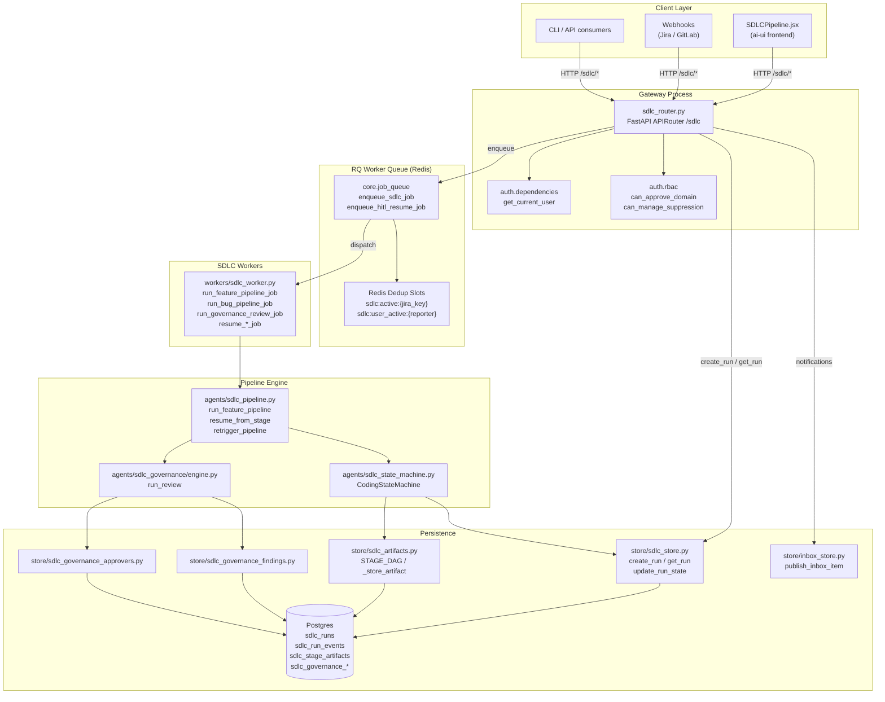
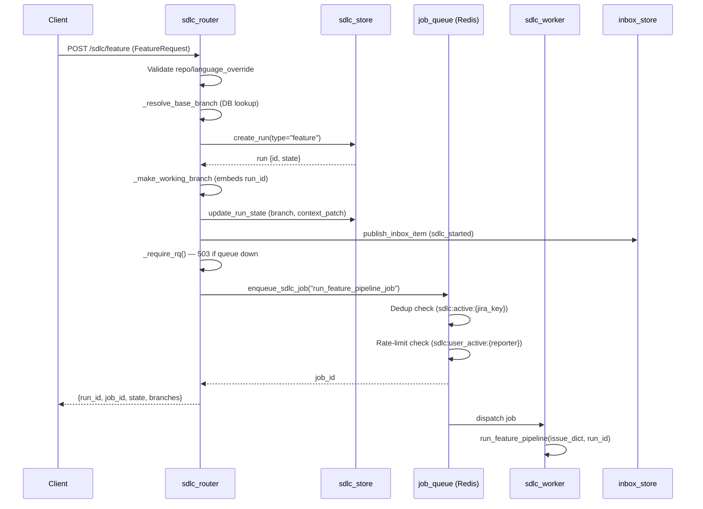
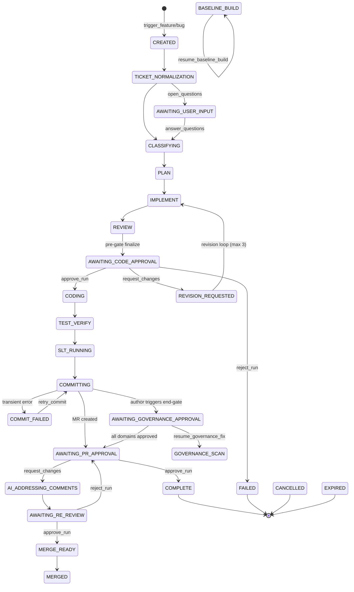
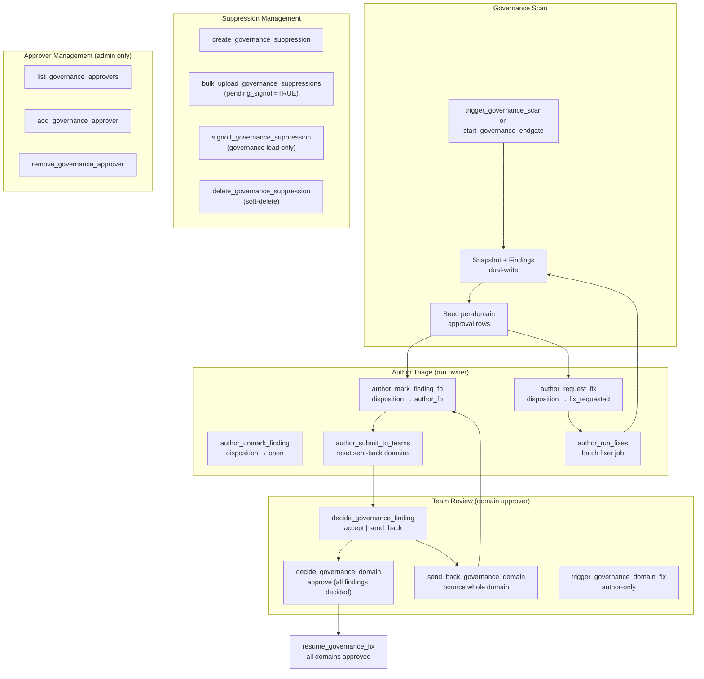
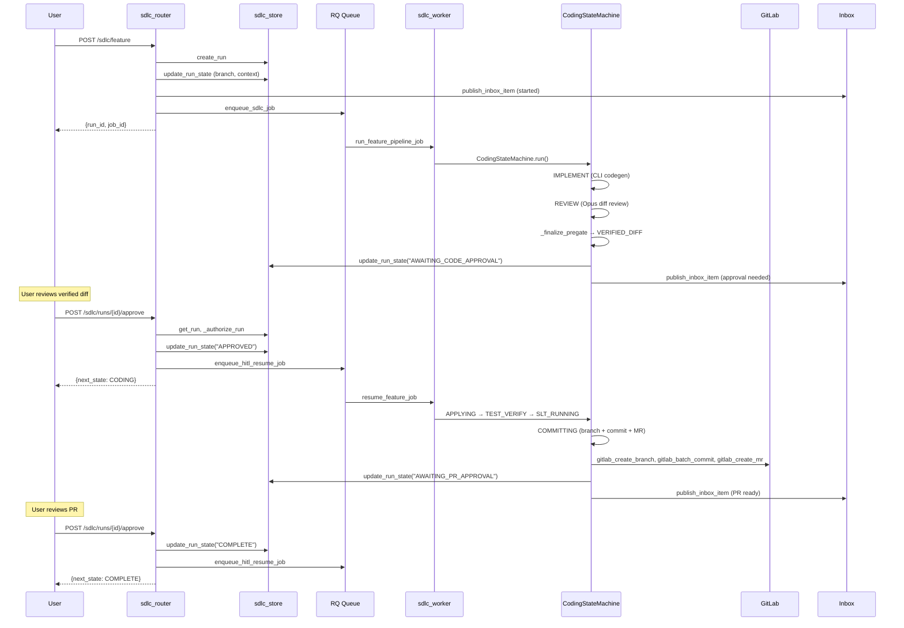
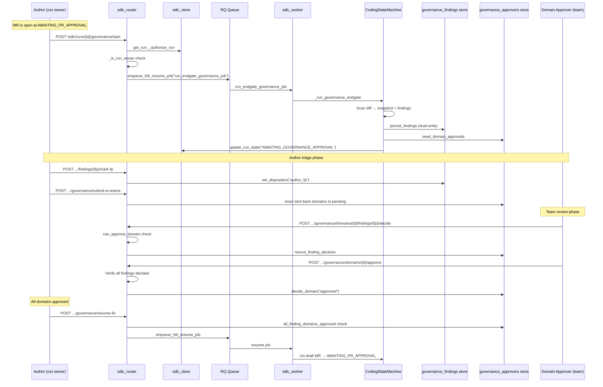
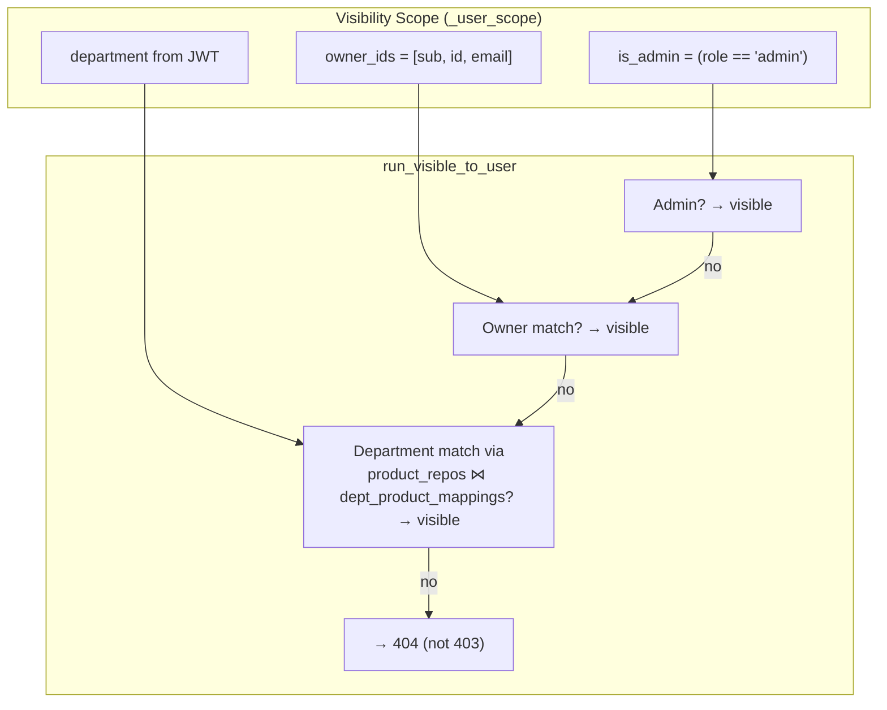

# SDLC Router Module

## Introduction

The `sdlc_router` module (`routers/sdlc_router.py`) is the FastAPI APIRouter that exposes the **Software Development Life Cycle (SDLC) pipeline** as a set of HTTP endpoints under the `/sdlc` prefix. It is the sole HTTP entry point for triggering AI-driven feature/bug pipelines, managing human-in-the-loop (HITL) approval gates, orchestrating governance reviews, and inspecting run artifacts.

The router is intentionally thin: it validates input, enforces authorization, creates run records, and enqueues work to RQ workers. **No pipeline logic executes inside the gateway process** — a critical architectural constraint that prevents state-split race conditions when multiple gateway instances share the same Postgres/Kafka backend.

---

## Architecture Overview

### Key Architectural Principles

1. **Never run pipeline code in-process** — `_require_rq()` raises HTTP 503 if the RQ worker queue is unavailable. Two gateway instances sharing the same DB cannot safely run pipeline code in FastAPI `BackgroundTasks` without state split.

2. **IDOR protection** — `_authorize_run()` returns HTTP 404 (not 403) on a visibility miss so the existence of another department's run is never leaked. Run visibility is scoped by department + owner; admins see all.

3. **Segregation of duties** — Governance domain approval (`can_approve_domain`) is distinct from author triage (`_is_run_owner`). A domain approver cannot trigger fixes; a run owner cannot approve another team's findings.

4. **HITL TTL expiration** — Runs waiting at approval gates carry a `hitl_deadline` in context. The `approve_run` and `answer_questions` endpoints check this deadline and return HTTP 410 (Gone) if expired.

5. **Idempotent enqueue** — `enqueue_sdlc_job` implements Jira-ticket deduplication (Redis `sdlc:active:{jira_key}`) and per-reporter rate limiting (`sdlc:user_active:{reporter}`).

---

## Module Structure

```mermaid
graph LR
    subgraph "Request Models"
        FR["FeatureRequest"]
        BR["BugRequest"]
        PRR["PRReviewRequest"]
        AR["ApprovalRequest"]
        RR["RejectRequest"]
        CR["CancelRequest"]
        REV["RevisionRequest"]
        AQR["AnswerQuestionsRequest"]
        RES["ResumeRequest"]
        BRR["BaselineResumeRequest"]
        GRR["GovernanceReviewRequest"]
        GTR["GovernanceTriggerRequest"]
        GDA["GovernanceDomainApprovalRequest"]
        GFD["GovernanceFindingDecisionRequest"]
        GSB["GovernanceDomainSendBackRequest"]
        GDF["GovernanceDomainFixRequest"]
        GFF["GovernanceFindingFPRequest"]
        GFM["GovernanceFindingMarkFpRequest"]
        GRF["GovernanceRunFixesRequest"]
        GAA["GovernanceApproverAddRequest"]
        GSR["GovernanceSuppressionRequest"]
        GBS["GovernanceBulkSuppressionRequest"]
        GBI["GovernanceBulkSuppressionItem"]
        BAR["BRDApprovalRequest"]
    end

    subgraph "Trigger Endpoints"
        TF["trigger_feature"]
        TB["trigger_bug"]
        TPR["trigger_pr_review"]
        TGS["trigger_governance_scan"]
        TGR["trigger_governance_review"]
    end

    subgraph "HITL Gate Endpoints"
        APP["approve_run"]
        REJ["reject_run"]
        CAN["cancel_run"]
        RC["request_changes"]
        AQ["answer_questions"]
        RTC["retry_commit"]
        RES2["resume_run"]
        RBB["resume_baseline_build"]
        RGF["resume_governance_fix"]
        SGE["start_governance_endgate"]
    end

    subgraph "Read Endpoints"
        LSP["list_sdlc_products"]
        LPR["list_product_repos"]
        GRD["get_repo_dependencies"]
        GJT["get_jira_ticket"]
        LRS["list_run_stages"]
        GSA["get_stage_artifact"]
        GVD["get_verified_diff"]
        GRR2["get_run_replay"]
        GRC["get_run_confidence"]
        GPM["get_pipeline_manifest"]
        GST["get_stats"]
        GRG["get_run_governance_report"]
        GGF["get_governance_findings"]
        GGFC["get_governance_finding_comments"]
        LGS["list_governance_suppressions"]
        LGA["list_governance_approvers"]
        BFS["brd_fsd_status"]
    end

    subgraph "Governance Action Endpoints"
        DGD["decide_governance_domain"]
        DGF["decide_governance_finding"]
        SBD["send_back_governance_domain"]
        TDF["trigger_governance_domain_fix"]
        MFP["mark_governance_findings_false_positive"]
        AMF["author_mark_finding_fp"]
        ARF["author_request_fix"]
        AUF["author_unmark_finding"]
        ARUN["author_run_fixes"]
        AST["author_submit_to_teams"]
        CGS["create_governance_suppression"]
        BGS["bulk_upload_governance_suppressions"]
        SGS["signoff_governance_suppression"]
        DGS["delete_governance_suppression"]
        AGA["add_governance_approver"]
        RGA["remove_governance_approver"]
        ABE["approve_brd_fsd_endpoint"]
    end
```

---

## Core Functional Areas

### 1. Pipeline Triggers

The router exposes four trigger endpoints that create a run record and enqueue an RQ job. Each returns the `run_id` and `job_id` immediately.

| Endpoint | Run Type | Worker Job |
|---|---|---|
| `trigger_feature` | `feature` | `run_feature_pipeline_job` |
| `trigger_bug` | `bug` | `run_bug_pipeline_job` |
| `trigger_pr_review` | `pr_review` | `run_pr_review_pipeline_job` |
| `trigger_governance_scan` | `governance` | `run_governance_pipeline_job` |
| `trigger_governance_review` | (standalone) | `run_governance_review_job` |

**Key request fields** (`FeatureRequest` / `BugRequest`):
- `jira_key`, `summary`, `repo`, `product_id`, `branch` — identify the issue and target repo
- `language_override` — bypass auto-detection (e.g. `"java"`, `"go"`, `"python"`)
- `dependencies` — multi-repo SDLC: list of `{repo, ref, kind}` entries
- `skip_tests` / `skip_slt` — bypass TESTING+SLT or SLT creation only (PCI/DSS default: SLT ON)
- `run_governance_review` / `governance_skills` — opt-in EA/IS/DPDP governance gate

### 2. HITL Approval Gates

The SDLC pipeline suspends at multiple human-in-the-loop gates. The router provides endpoints to approve, reject, cancel, request changes, or answer questions at these gates.

#### `approve_run`

Handles four approval states:

| Current State | Action | Next State | Worker Job |
|---|---|---|---|
| `AWAITING_CODE_APPROVAL` | Resume feature coding | `CODING` | `resume_feature_job` |
| `AWAITING_SOLUTION_APPROVAL` | Resume bug coding | `CODING` | `resume_bug_job` |
| `AWAITING_PR_APPROVAL` | Mark complete | `COMPLETE` | `resume_pr_approval_job` |
| `AWAITING_RE_REVIEW` | Merge PR | `MERGE_READY` | `enqueue_merge_pr_job` |

Supports `skip_tests_override` (None = keep stored; True/False = override at resume time) and optional `feedback` for the coding agent.

#### `request_changes`

Two gate families:
- **Pre-apply code/solution gate** → design revision loop (max 3 cycles, HTTP 409 after). Enqueues `resume_feature_revision_job` or `resume_bug_revision_job`.
- **PR-approval gate** → same-run PR-comment remediation (uncapped). Enqueues `enqueue_pr_comments_job`.

Supports structured per-file feedback via `file_comments: [{file, line?, comment}]` — additive to whole-run `feedback`.

#### `answer_questions`

Resolves a pipeline paused at `AWAITING_USER_INPUT`. Distinguishes between:
- `gate_kind="normalization"` → `resume_after_normalization_confirmed` (GATE 1)
- Default → `resume_after_user_answers` (analyst-stage GATE 2)

Supports optional `work_item` edits submitted alongside normalization approval.

#### `cancel_run`

Cancels at any non-terminal state. Releases the Redis dedup slot (compare-and-delete by run_id), cleans up abandoned governance draft MRs, and publishes an inbox notification.

### 3. Run Inspection

| Endpoint | Purpose |
|---|---|
| `list_run_stages` | All stage artifacts ordered by DAG position |
| `get_stage_artifact` | Latest artifact payload for (run, stage) |
| `get_verified_diff` | VERIFIED_DIFF artifact + compile waiver banners |
| `get_run_replay` | LLM replay log from Redis (prompt hashes + previews) |
| `get_run_confidence` | Aggregated confidence score for a completed run |
| `get_pipeline_manifest` | Ordered stage manifest for a run type (UI timeline source) |
| `get_stats` | Aggregate counts by state and type (SQL GROUP BY) |
| `get_run_governance_report` | Latest GOVERNANCE_REPORT artifact |

### 4. Governance Review System

The governance subsystem is a multi-role approval workflow with segregation of duties between **authors** (run owners) and **domain approvers** (team reviewers).

#### Authorization Matrix

| Action | Run Owner | Domain Approver | Admin | Other |
|---|---|---|---|---|
| Mark finding FP | ✅ | ✅ (own domain) | ✅ | ❌ |
| Request fix | ✅ | ❌ | ✅ | ❌ |
| Run batch fixes | ✅ | ❌ | ✅ | ❌ |
| Submit to teams | ✅ | ❌ | ✅ | ❌ |
| Decide finding | ❌ | ✅ (own domain) | ✅ | ❌ |
| Approve domain | ❌ | ✅ (own domain) | ✅ | ❌ |
| Send back domain | ❌ | ✅ (own domain) | ✅ | ❌ |
| Create suppression | ✅ (own repo) | ✅ (own repo) | ✅ | ❌ |
| Sign off suppression | ❌ | ✅ (gov lead) | ✅ | ❌ |
| Manage approvers | ❌ | ❌ | ✅ | ❌ |

#### Finding Dispositions

| Disposition | Meaning | Visible to approvers? |
|---|---|---|
| `open` | New, untriaged | ✅ |
| `author_fp` | Author marked false positive | ✅ (still needs team decision) |
| `fix_requested` | Author marked for fixing | ❌ |
| `fix_confirmed` | Fixer resolved it | ❌ |
| `false_positive` | Team confirmed FP | ❌ |
| `suppressed` | Cross-run suppression matched | ❌ |
| `fixed` | Marked fixed after batch fix | ❌ |

#### Suppression Lifecycle

Bulk-uploaded suppressions land with `pending_signoff=TRUE` — they are **inert** until a governance lead signs them off. This is the segregation-of-duties control: the person who uploads false positives cannot be the one who activates them.

### 5. BRD→FSD Pipeline

A separate pipeline for Business Requirements Document → Functional Specification Document generation with its own HITL gate:

- `approve_brd_fsd_endpoint` — Approves the FSD, triggering Confluence page creation and Jira story creation in the background
- `brd_fsd_status` — Returns the current HITL state for an epic

### 6. Resume Operations

| Endpoint | Purpose | Worker Job |
|---|---|---|
| `resume_run` | Resume from any stage (retry/go_back/override/waive) | `resume_from_stage_job` |
| `resume_baseline_build` | Resume from BASELINE_BUILD (agent_fix/skip_compile/skip_tests) | `retrigger_pipeline` |
| `resume_governance_fix` | Resume after all governance domains approved | `resume_governance_fix_job` or `resume_in_pipeline_governance_job` |
| `retry_commit` | Retry only the COMMITTING phase from COMMIT_FAILED | `retry_commit_job` |

---

## Dependency Map

```mermaid
graph LR
    subgraph "sdlc_router.py"
        R["APIRouter /sdlc"]
    end

    subgraph "Authentication & Authorization"
        AD["auth.dependencies<br/>get_current_user"]
        RBAC["auth.rbac<br/>can_approve_domain<br/>can_manage_suppression<br/>is_admin"]
    end

    subgraph "Core Infrastructure"
        CFG["core.config<br/>CODE_APPROVAL_STATES<br/>SDLC_HITL_TTL_HOURS<br/>SDLC_GOVERNANCE_HITL_TTL_HOURS"]
        LOG["core.logger<br/>logger, bind_context"]
        JQ["core.job_queue<br/>enqueue_sdlc_job<br/>enqueue_hitl_resume_job<br/>enqueue_pr_comments_job<br/>enqueue_merge_pr_job<br/>release_sdlc_slot"]
    end

    subgraph "Store Layer"
        SS["store.sdlc_store<br/>create_run, get_run<br/>update_run_state, add_run_event<br/>run_visible_to_user"]
        SA["store.sdlc_artifacts<br/>STAGE_DAG<br/>_load_latest_artifact"]
        SSM["store.sdlc_stage_manifest<br/>pipeline_manifest"]
        SGF["store.sdlc_governance_findings<br/>current_findings, persist_findings<br/>set_disposition, set_status<br/>domain_open_counts, latest_snapshot"]
        SGA["store.sdlc_governance_approvers<br/>decide_domain, seed_domain_approvals<br/>all_finding_domains_approved<br/>record_finding_decision<br/>list_approvers, add_approver"]
        IS["store.inbox_store<br/>publish_inbox_item"]
    end

    subgraph "Pipeline Engine (called via workers)"
        SP["agents.sdlc_pipeline<br/>run_feature_pipeline<br/>resume_from_stage<br/>retrigger_pipeline"]
        BFP["agents.brd_fsd_pipeline<br/>approve_brd_fsd"]
        SG["agents.sdlc_governance.engine<br/>run_review"]
        DR["agents.dep_resolver<br/>resolve_dependencies"]
    end

    subgraph "External Tools"
        JT["tools.jira_tools<br/>jira_get_issue_dict<br/>jira_add_comment"]
        GT["tools.gitlab_tools<br/>set_token, gitlab_read_file"]
    end

    subgraph "Database"
        DB["db.database<br/>SessionLocal"]
        DM["db.models<br/>SDLCRun, SDLCRunEvent"]
    end

    R --> AD
    R --> RBAC
    R --> CFG
    R --> LOG
    R --> JQ
    R --> SS
    R --> SA
    R --> SSM
    R --> SGF
    R --> SGA
    R --> IS
    R --> SP
    R --> BFP
    R --> DR
    R --> JT
    R --> GT
    R --> DB
    R --> DM
```

---

## Data Flow: Feature Pipeline End-to-End

---

## Data Flow: Governance End-Gate

---

## Security Model

### Run Visibility Scoping

### HITL TTL Expiration

| Gate Type | TTL Config | Default |
|---|---|---|
| Code/Solution/PR approval | `SDLC_HITL_TTL_HOURS` | 48 hours |
| Governance approval | `SDLC_GOVERNANCE_HITL_TTL_HOURS` | 168 hours (7 days) |

Expired runs transition to `EXPIRED` state and return HTTP 410 on approval attempts.

### RQ Worker Requirement

`_require_rq()` is called before every enqueue. If the Redis-backed RQ queue is unavailable, the router returns HTTP 503 with a message directing operators to check Redis and the `sdlc_queue` workers. This prevents the pipeline from ever running in-process.

---

## Frontend Integration

The router is consumed by the [`SDLCPipeline`](../sdlc/sdlc_pipeline.md) component in the `ai-ui` frontend, which provides:

- **Run list** with filtering by type (feature/bug/pr_review/governance) and state
- **Run detail panel** with stage timeline, artifacts, and approval actions
- **Trigger modal** for new pipeline runs
- **Governance review panel** ([`GovernanceReviewPanel`](../sdlc/sdlc_governance_review.md)) with author triage board and team approval board
- **Planning artifact view** ([`PlanningArtifactView`](../sdlc/sdlc_planning_artifact.md)) showing the PLAN stage output
- **Pipeline stepper** ([`PipelineStepper`](../sdlc/sdlc_pipeline_stepper.md)) rendering the stage manifest

The frontend polls `GET /sdlc/runs` and `GET /sdlc/stats` every 5 seconds for live updates.

---

## Related Module Documentation

- [sdlc_pipeline_workers](../workers/sdlc_pipeline_workers.md) — RQ worker jobs that execute the pipeline
- [shared_core_sdlc_pipeline](../sdlc/shared_core_sdlc_pipeline.md) — Pipeline engine, state machine, and governance engine
- [sdlc_pipeline](../sdlc/sdlc_pipeline.md) — Frontend SDLCPipeline component
- [sdlc_governance_review](../sdlc/sdlc_governance_review.md) — Frontend governance review panel
- [sdlc_planning_artifact](../sdlc/sdlc_planning_artifact.md) — Frontend planning artifact view
- [sdlc_pipeline_stepper](../sdlc/sdlc_pipeline_stepper.md) — Frontend pipeline stage stepper
- [sdlc_gate_signal](../sdlc/sdlc_gate_signal.md) — Frontend gate signal indicators
- [sdlc_status_model](../sdlc/sdlc_status_model.md) — Frontend status label/badge model
- [authentication](../security/authentication.md) — Auth dependencies and RBAC
- [core_infrastructure](../infrastructure/core_infrastructure.md) — Job queue, config, logger
- [store_layer](../storage/store_layer.md) — sdlc_store, sdlc_artifacts, governance stores
