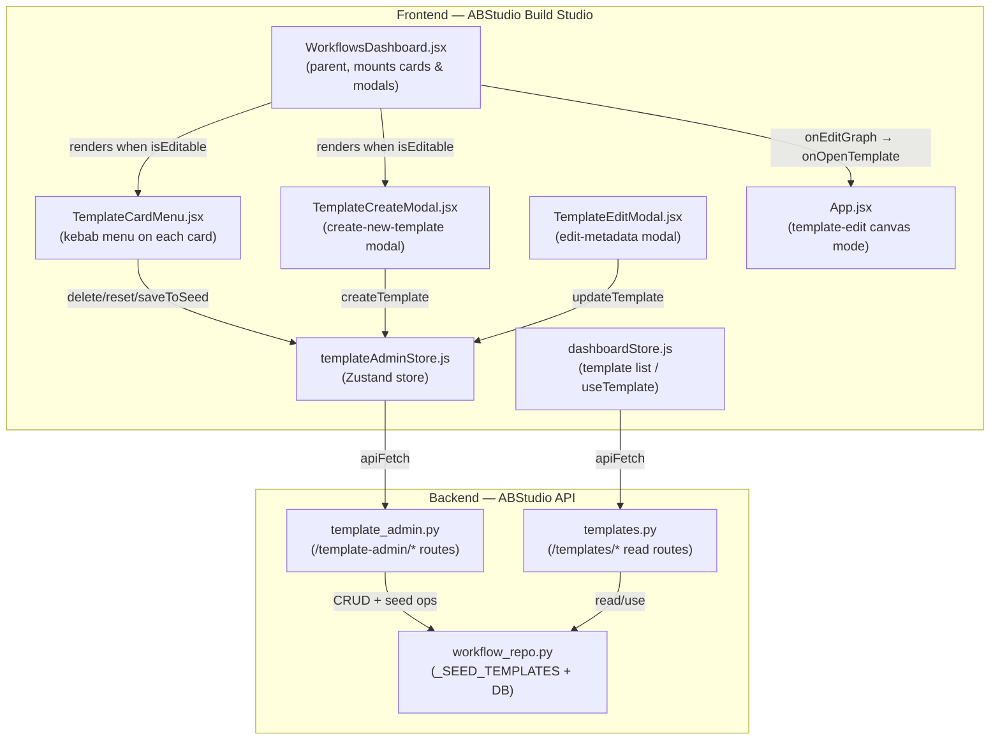
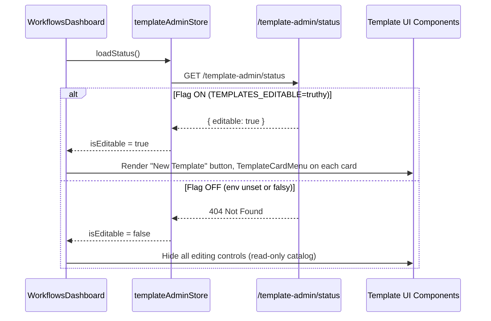
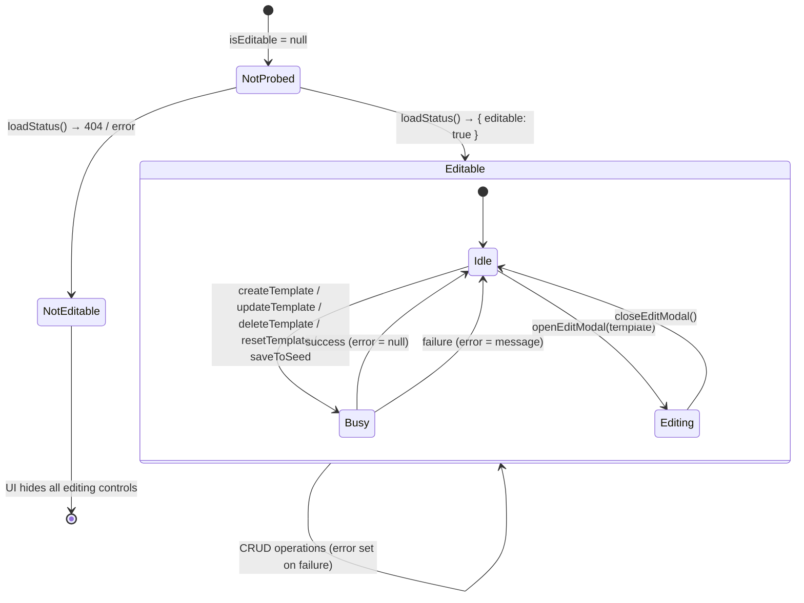
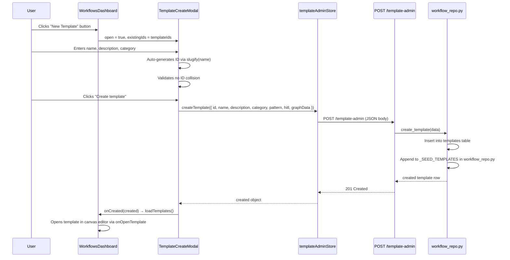
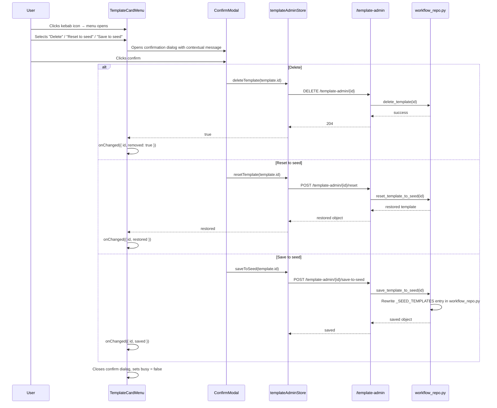
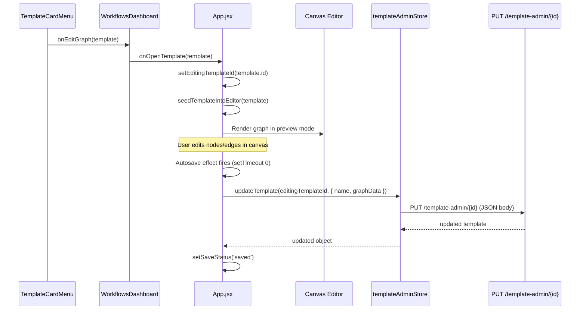

# Templates Feature

## 1. Introduction & Purpose

The **Templates Feature** is an optional, feature-flagged frontend module within ABStudio's Build Studio that provides administrators with full CRUD capabilities over the workflow template catalog. While all users can browse and use templates to kick-start new workflows, this module adds the ability to **create**, **edit**, **delete**, **reset**, and **persist-to-seed** template definitions directly from the UI — without touching backend code or database scripts.

The module is intentionally self-contained and removable: when the backend environment variable `TEMPLATES_EDITABLE` is not set, the frontend probes the `/template-admin/status` endpoint, receives a 404, and hides every editing control. The read path (browsing, previewing, and using templates) has zero dependencies on this module.

### Key Capabilities

| Capability | Component | Backend Endpoint |
|---|---|---|
| Create new template with starter graph | `TemplateCreateModal` | `POST /template-admin` |
| Edit template metadata (name, description, category, pattern, HITL) | `TemplateEditModal` | `PUT /template-admin/{id}` |
| Edit template graph (nodes/edges) | Canvas editor (via `App.jsx` template-edit mode) | `PUT /template-admin/{id}` |
| Delete template row | `TemplateCardMenu` | `DELETE /template-admin/{id}` |
| Reset template to seed baseline | `TemplateCardMenu` | `POST /template-admin/{id}/reset` |
| Persist current state to seed overrides | `TemplateCardMenu` | `POST /template-admin/{id}/save-to-seed` |
| Probe whether editor is enabled | `useTemplateAdminStore.loadStatus()` | `GET /template-admin/status` |

---

## 2. Architecture Overview

### 2.1 Module Boundaries

The templates feature sits between the **Workflows Dashboard** (which renders the template catalog grid) and the **Backend Template Admin API** (which persists changes to both the database and the code-level seed file). A shared Zustand store (`templateAdminStore`) acts as the single state-and-API bridge.



### 2.2 Feature Flag Lifecycle

The entire editing UI is gated behind a runtime feature flag. The flag is checked once on dashboard mount and never re-probed during the session.



---

## 3. Core Components

### 3.1 TemplateCardMenu

**File:** `ABStudio/frontend/src/features/templates/TemplateCardMenu.jsx`

A kebab-style dropdown menu overlaid on each template card in the dashboard grid. It is only rendered when `useTemplateAdminStore.isEditable` is `true`. The menu absorbs its own click events so the underlying "use template" card click still works for any non-menu region.

**Props:**

| Prop | Type | Description |
|---|---|---|
| `template` | `object` | The template row (must have `id`, `name`) |
| `onEditGraph` | `function` | Callback to open the template in the canvas graph editor |
| `onChanged` | `function` | Callback invoked after delete/reset/save to refresh the dashboard list |

**Menu Actions:**

| Action | Handler | Store Method | Confirm Modal |
|---|---|---|---|
| Edit graph | `onEditGraph(template)` | — | No |
| Save to seed | `handleSaveToSeed` | `saveToSeed(template.id)` | Yes — warns about overwriting seed baseline |
| Reset to seed | `handleReset` | `resetTemplate(template.id)` | Yes — warns about discarding UI edits |
| Delete | `handleDelete` | `deleteTemplate(template.id)` | Yes — clarifies seed is unchanged and can be restored |

**Key Implementation Details:**

- **Z-index management:** While the dropdown is open, the parent `.template-card-wrap` element's `zIndex` is bumped to `50` so the dropdown paints above neighbouring grid cards. This is necessary because each card wrapper is `position: relative` without an explicit z-index, causing document-order paint overlap.
- **Click-outside dismissal:** A `mousedown` listener on `window` closes the menu when a click lands outside the menu wrapper.
- **Busy state:** All async actions (delete, reset, save) set a `busy` flag that disables the confirm modal's cancel button until the operation completes.
- **`MenuItem` sub-component:** A reusable button with hover styling. The `danger` variant renders red text and a red hover background for destructive actions.

### 3.2 TemplateCreateModal

**File:** `ABStudio/frontend/src/features/templates/TemplateCreateModal.jsx`

A portal-rendered modal for creating brand-new template entries. It seeds the template with a minimal starter graph (Start → Agent → End) so the user can immediately open it in the canvas editor for customisation.

**Props:**

| Prop | Type | Description |
|---|---|---|
| `open` | `boolean` | Controls modal visibility |
| `existingIds` | `string[]` | List of existing template IDs for collision detection |
| `onCreated` | `function` | Callback with the created template object |
| `onClose` | `function` | Callback to close the modal |

**Form Fields:**

| Field | Source | Default | Notes |
|---|---|---|---|
| Name | User input | `''` | Required; drives auto-generated ID |
| Template ID | Auto-derived from name via `slugify()` | `template-<slug>` | User can override; collision-checked against `existingIds` |
| Description | User input | `''` | Optional |
| Category | `CATEGORY_OPTIONS` dropdown | `DEFAULT_CATEGORY` (`'Operations'`) | Fixed taxonomy from `templateCategories.js` |

**Created Template Payload:**

```javascript
{
    id: trimmedId,
    name: trimmedName,
    description: description.trim(),
    category: category || DEFAULT_CATEGORY,
    pattern: 'sequential',   // derived from graph; not surfaced at create-time
    hitl: false,             // derived from graph; not surfaced at create-time
    graphData: DEFAULT_GRAPH // Start → Agent → End skeleton
}
```

**Key Implementation Details:**

- **Portal rendering:** Uses `useTriggerPortalContainer()` from `../triggers/triggerPortal` to render outside the dashboard's `animate-fade-in` transform ancestor. This ensures `position: fixed` resolves against the actual viewport rather than the transformed parent. The portal container carries `data-ac` so build-time PostCSS CSS scoping (`[data-ac]` prefix) matches and the modal receives standard light-theme styles.
- **ID slugification:** The `slugify()` function converts a freeform name into a stable `template-…` ID by lower-casing, replacing non-alphanumeric runs with dashes, and trimming leading/trailing dashes. When `manualId` is `null` (initial state), the ID auto-syncs from the name. Once the user edits the ID field, `manualId` becomes a string and auto-syncing stops.
- **Collision detection:** An `O(1)` `Set` lookup against `existingIds` (memoised from the parent's `useMemo`) flags duplicate IDs in real-time with an `aria-invalid` attribute and an error hint.
- **Save guard:** The save button is disabled unless `canSave` is true: not saving, name is non-empty, ID is non-empty, and no ID collision.

### 3.3 TemplateEditModal

**File:** `ABStudio/frontend/src/features/templates/TemplateEditModal.jsx`

A modal for editing an existing template's metadata. Unlike the create modal, it does not use a portal — it renders inline with `confirm-modal-overlay` classes. Graph editing (nodes/edges) is handled separately by the canvas editor in `App.jsx` when `editingTemplateId` is set.

**Props:**

| Prop | Type | Description |
|---|---|---|
| `open` | `boolean` | Controls modal visibility |
| `template` | `object` | The template being edited (must have `id`) |
| `onSaved` | `function` | Callback with the updated template object |
| `onClose` | `function` | Callback to close the modal |

**Editable Fields:**

| Field | Options | Notes |
|---|---|---|
| Name | Free text | Required; save disabled if empty |
| Description | Free text (textarea) | Optional |
| Category | `CATEGORY_OPTIONS` dropdown | Falls back to `DEFAULT_CATEGORY` if stored value predates the fixed taxonomy |
| Pattern | `sequential`, `parallel`, `conditional`, `loop`, `loop_conditional`, `parallel_conditional` | Describes the workflow graph topology |
| HITL | Checkbox | Human-in-the-loop badge only; actual gates are set per-agent in the graph editor |

**Key Implementation Details:**

- **Form reset on open:** A `useEffect` keyed on `[open, template]` resets all form fields whenever the modal opens for a different template, including falling back stale free-text categories to the default.
- **Error surfacing:** Errors from `templateAdminStore.error` are displayed inline in a red alert box. The error is cleared on modal open via `clearError()`.
- **Save guard:** The save button is disabled while saving or if the name field is empty after trimming.

---

## 4. State Management

### 4.1 templateAdminStore (Zustand)

**File:** `ABStudio/frontend/src/store/templateAdminStore.js`

A lightweight Zustand store that serves as the sole API bridge between the template UI components and the backend `/template-admin/*` endpoints. It holds minimal state — just the feature-flag probe result, the currently-editing template, and an error string.



**Store API:**

| Method | Type | Description |
|---|---|---|
| `isEditable` | `null \| boolean` | Feature-flag probe result |
| `editingTemplate` | `object \| null` | Template currently open in the edit-metadata modal |
| `error` | `string \| null` | Last error message from any admin operation |
| `loadStatus()` | `async` | Probes `GET /template-admin/status`; sets `isEditable` |
| `openEditModal(t)` | `sync` | Sets `editingTemplate` and clears error |
| `closeEditModal()` | `sync` | Clears `editingTemplate` and error |
| `createTemplate(payload)` | `async` | `POST /template-admin` — creates template + seed entry |
| `updateTemplate(id, patch)` | `async` | `PUT /template-admin/{id}` — updates metadata or graph |
| `deleteTemplate(id)` | `async` | `DELETE /template-admin/{id}` — removes DB row only |
| `resetTemplate(id)` | `async` | `POST /template-admin/{id}/reset` — restores from seed |
| `saveToSeed(id)` | `async` | `POST /template-admin/{id}/save-to-seed` — persists to code |
| `clearError()` | `sync` | Clears the error string |

---

## 5. Data Flow

### 5.1 Create Template Flow



### 5.2 Template Card Menu Actions Flow



### 5.3 Template Graph Editing Flow

When a user selects "Edit graph" from the card menu, the template opens in the canvas editor in a special template-save mode. This flow is handled by `App.jsx`, not by the templates feature module directly, but it relies on `templateAdminStore.updateTemplate` for persistence.



---

## 6. Dependencies

### 6.1 Internal Dependencies

| Dependency | File | Role |
|---|---|---|
| `useTemplateAdminStore` | `store/templateAdminStore.js` | Zustand store; sole API bridge to `/template-admin/*` |
| `ConfirmModal` | `components/common/ConfirmModal.jsx` | Shared confirmation dialog with open/close animation |
| `useTriggerPortalContainer` | `features/triggers/triggerPortal.js` | Portal helper; creates a `data-ac`-tagged div under `<body>` for CSS-scoped fixed-position overlays |
| `CATEGORY_OPTIONS` / `DEFAULT_CATEGORY` | `features/workflows/templateCategories.js` | Fixed domain-category taxonomy shared by dashboard filters and create/edit modals |
| `WorkflowsDashboard` | `features/workflows/WorkflowsDashboard.jsx` | Parent component; mounts `TemplateCardMenu` on each card and `TemplateCreateModal` when `isEditable` |
| `App.jsx` | `src/App.jsx` | Handles template-edit canvas mode (`editingTemplateId`) and template-preview flow (`previewingTemplate`) |

### 6.2 Backend Dependencies

| Dependency | Module | Role |
|---|---|---|
| Template Admin API | `api_template_admin` (`app/api/template_admin.py`) | Feature-flagged CRUD + seed-persistence endpoints under `/template-admin/*` |
| Template Read API | `api_templates` (`app/api/templates.py`) | Read-only endpoints: `GET /templates`, `GET /templates/{id}`, `POST /templates/{id}/use`, `POST /templates/reseed` |
| Workflow Repository | `core_workflow_repo` (`app/core/workflow_repo.py`) | Database + seed-file persistence layer; holds `_SEED_TEMPLATES` baseline definitions |

### 6.3 External Dependencies

| Package | Usage |
|---|---|
| `react` (`useEffect`, `useRef`, `useState`, `useMemo`) | Component state and lifecycle |
| `react-dom` (`createPortal`) | Portal rendering for `TemplateCreateModal` |
| `zustand` | State management via `templateAdminStore` |

---

## 7. Feature Removal Guide

The module is designed for clean, mechanical removal. The store file documents the exact deletion recipe:

1. **Delete frontend files:**
   - `src/features/templates/TemplateCardMenu.jsx`
   - `src/features/templates/TemplateCreateModal.jsx`
   - `src/features/templates/TemplateEditModal.jsx`
   - `src/store/templateAdminStore.js`

2. **Remove imports and rendering blocks:**
   - In `WorkflowsDashboard.jsx`: remove `useTemplateAdminStore` import, `TemplateCardMenu`/`TemplateCreateModal` imports, the `templatesEditable`/`loadAdminStatus` wiring, and the `{templatesEditable && ...}` render blocks.
   - In `App.jsx`: remove the `editingTemplateId` state and the template-edit branch in `saveCurrentWorkflow`.

3. **Remove backend (optional):**
   - Delete `app/api/template_admin.py`.
   - In `app/main.py`, remove the `template_admin` import and its `include_router` entry.
   - Unset `TEMPLATES_EDITABLE` in the environment.

4. **Verify:** The read path (`GET /templates`, `POST /templates/{id}/use`) and the seed path have zero dependencies on this module, so template browsing and usage continue to work unchanged.

---

## 8. Category Taxonomy

Templates are classified using a fixed domain-category taxonomy defined in `templateCategories.js`. This list is shared across the dashboard filter chips and both admin modals to prevent the "free-text mess" of legacy categories.

| Category | Description |
|---|---|
| Security | Security-focused workflows (vulnerability scanning, incident response) |
| Finance | Financial reporting, reconciliation, audit workflows |
| HR | Human resources onboarding, offboarding, review workflows |
| Sales & Marketing | Lead generation, campaign analysis, CRM workflows |
| Operations | **Default** — general operational workflows |
| Compliance | Regulatory compliance, policy enforcement workflows |
| Engineering | Code review, CI/CD, development workflows |
| Research & Exec | Research analysis, executive reporting workflows |

The default category is explicitly named `'Operations'` (not `CATEGORY_OPTIONS[0]`) so reordering the array doesn't silently change the default.

---

## 9. Pattern Types

The `TemplateEditModal` exposes a fixed set of workflow pattern types that describe the graph topology. These are metadata-only labels used for catalog filtering and display; the actual graph structure is defined by the nodes and edges in the canvas editor.

| Pattern | Description |
|---|---|
| `sequential` | Linear chain: Start → Agent → ... → End (default) |
| `parallel` | Multiple agents execute concurrently |
| `conditional` | Branching based on condition nodes |
| `loop` | Iterative execution with a loop node |
| `loop_conditional` | Loop with conditional branching inside |
| `parallel_conditional` | Parallel execution with conditional routing |
