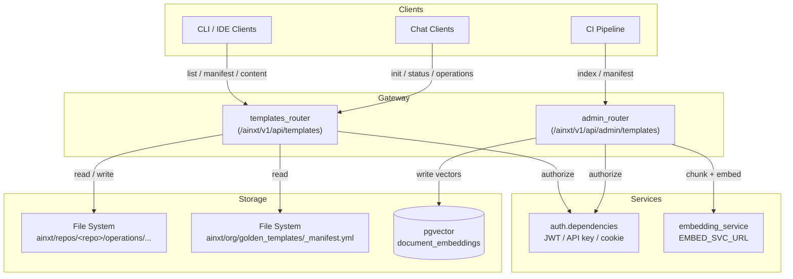
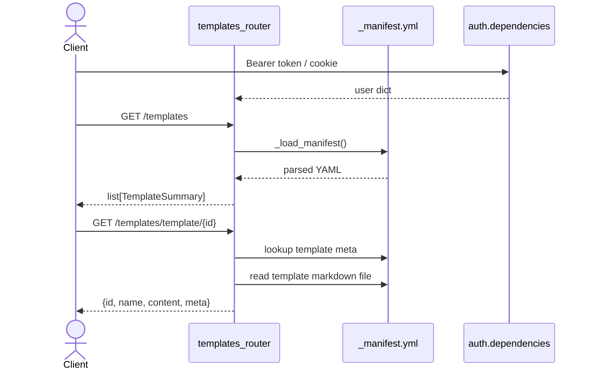
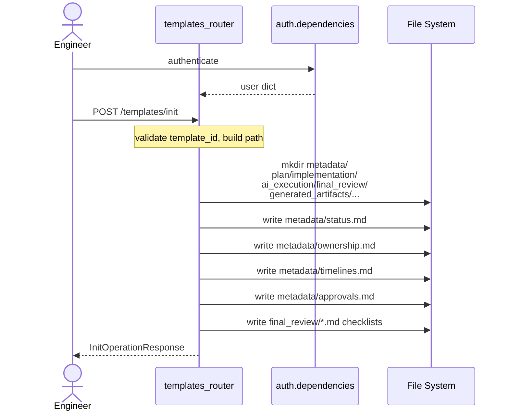
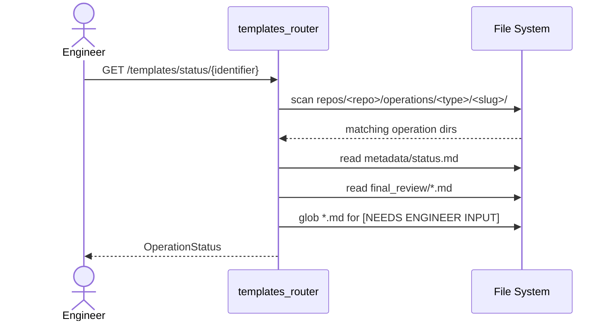
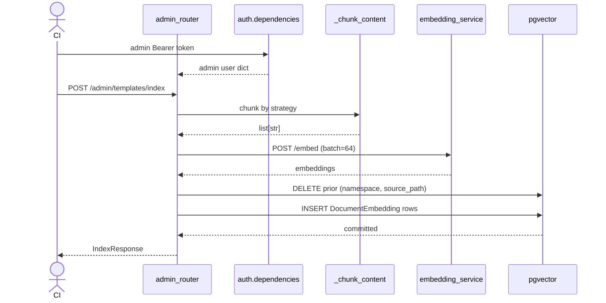
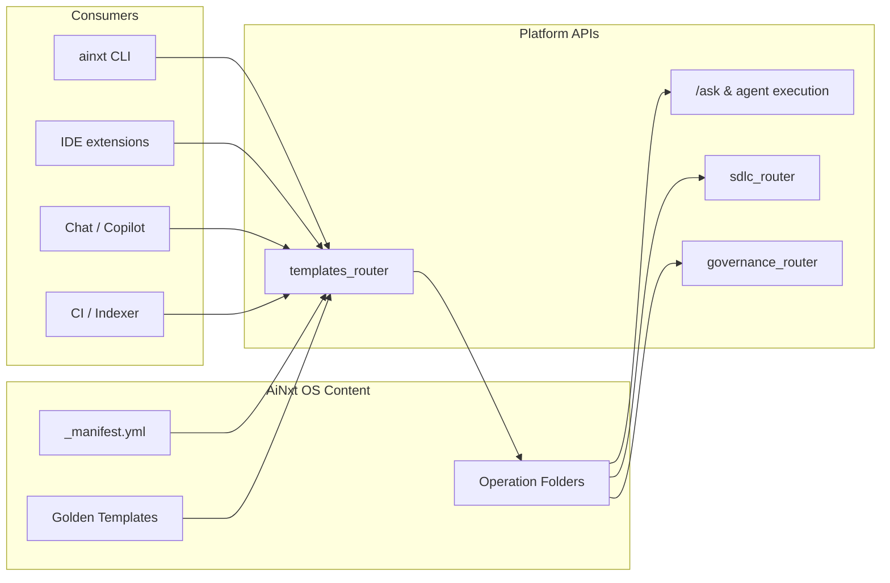

# templates_router

The **Templates Router** is the backend integration layer for the **AiNxt OS Engineering Governance Operating System**. It exposes REST endpoints that serve golden templates, bootstrap engineering operations, track operation lifecycle status, and ingest CI-pushed content into the platform's vector store. It is mounted under `/ainxt/v1/api` by the main [gateway](../models/gateway.md) and is consumed by CLI, IDE, and chat clients.

This router is intentionally a **governance and catalog layer**, not an execution engine. The actual LLM-driven execution of a template (code generation, review, etc.) is handled by the platform's existing `/ask` and agent execution paths. The Templates Router only prepares the operation workspace, records metadata, and makes templates discoverable.

---

## Core Responsibilities

1. **Template Catalog Discovery**  
   Serve the organization-wide golden template manifest and individual template content from the `ainxt/org/golden_templates/` directory.

2. **Operation Bootstrapping**  
   Create a standardized folder structure for a new engineering operation (migration, feature, bugfix, RCA, security audit, performance) tied to a Jira key and repository.

3. **Operation Status Tracking**  
   Read `metadata/status.md` and `final_review/` approval files to report the current phase, approvals, and outstanding engineer-input markers.

4. **CI Content Indexing**  
   Accept file content from CI pipelines, chunk and embed it via the [embedding service](../knowledge/embedding_service.md), and persist vectors to `pgvector` for RAG retrieval.

5. **Manifest Upload Acknowledgement**  
   Receive manifest uploads from CI; currently reads the manifest from disk on demand, with a planned Redis cache layer.

---

## Module Architecture



The router is split into two `APIRouter` instances:

- **`router`** — public engineer-facing endpoints under `/templates`.
- **`admin_router`** — privileged CI/indexer endpoints under `/admin/templates`.

Both routers rely on [auth.dependencies](../security/auth.md) for authentication and authorization. Admin endpoints additionally require the `admin` role.

---

## Core Components

### Request / Response Models

| Model | Purpose |
|-------|---------|
| `InitOperationRequest` | Payload to bootstrap a new operation: `template_id`, `repo_name`, `jira_key`, optional `operation_slug`, and `inputs`. |
| `InitOperationResponse` | Returns the generated `run_id`, relative `operation_path`, list of `created_files`, and a `next_step` hint. |
| `TemplateSummary` | Lightweight template metadata returned by `list_templates`. |
| `OperationStatus` | Parsed view of an operation's `status.md` plus approval states and outstanding `[NEEDS ENGINEER INPUT]` markers. |
| `IndexEntry` | Payload for CI indexing: `source_path`, `namespace`, `upload_as`, `chunk_strategy`, `content`, and `metadata`. |
| `IndexResponse` | Result of an indexing call: success flag, number of chunks written, namespace, and message. |

### Public Endpoints

| Endpoint | Method | Description |
|----------|--------|-------------|
| `/templates` | `GET` | List all golden templates from the manifest. |
| `/templates/manifest` | `GET` | Return the full manifest for CLI discovery. |
| `/templates/template/{template_id}` | `GET` | Return raw markdown content of a specific template. |
| `/templates/init` | `POST` | Bootstrap a new operation folder structure. |
| `/templates/status/{identifier}` | `GET` | Read operation status by `run_id`, `jira_key`, or `operation_slug`. |
| `/templates/operations` | `GET` | Browse all operations, optionally filtered by repo or template type. |

### Admin Endpoints

| Endpoint | Method | Description |
|----------|--------|-------------|
| `/admin/templates/index` | `POST` | Index a single file's content into pgvector or structured-data store. |
| `/admin/templates/manifest` | `POST` | Acknowledge a manifest upload from CI. |

### Internal Helpers

| Helper | Responsibility |
|--------|----------------|
| `_resolve_ainxt_root()` | Locate the `ainxt/` content root using env var, cwd, or repo-relative fallback. |
| `_load_manifest()` | Read and parse `org/golden_templates/_manifest.yml`. |
| `_template_to_operation_type()` | Map template IDs to operation folder names (e.g., `bugfix` → `bugs`). |
| `_operation_dir_name()` | Build `<jira>_<slug>` directory names. |
| `_chunk_content()` | Split content by `full_file`, `per_section` (markdown H2), or `per_paragraph`. |
| `_embed_chunks()` | Call the embedding service to generate vectors in batches of 64. |
| `_write_pgvector()` | Delete prior chunks for `(namespace, source_path)` and insert new `DocumentEmbedding` rows. |

---

## Data Flows

### 1. Listing and Retrieving Templates



The manifest is the single source of truth. It defines template IDs, display names, slash commands, descriptions, runtime estimates, and the file path for each template's markdown content.

### 2. Initializing an Operation



The operation folder follows a fixed convention:

```
ainxt/repos/<repo>/operations/<type>/<jira>_<slug>/
├── metadata/
│   ├── status.md
│   ├── ownership.md
│   ├── timelines.md
│   └── approvals.md
├── <template_id>_plan/
├── implementation/
├── ai_execution/
├── final_review/
│   ├── architecture_review.md
│   ├── security_review.md
│   ├── performance_review.md
│   └── deployment_signoff.md
└── generated_artifacts/
    ├── prompts/
    ├── generated_code/
    ├── generated_tests/
    └── generated_sql/
```

If the operation directory already exists, the router returns HTTP `409 Conflict` to prevent accidental overwrites.

### 3. Reading Operation Status



The `identifier` can be a `run_id`, `jira_key`, or `operation_slug`. If multiple operations match, the endpoint returns HTTP `409 Conflict` and suggests adding `?repo_name=` to disambiguate.

### 4. CI Content Indexing



Indexing is idempotent: re-indexing the same `(namespace, source_path)` overwrites previous chunks. Structured data (e.g., manifest files) is accepted but not yet persisted to a dedicated table.

---

## Dependencies

| Dependency | Role in this Module | Linked Documentation |
|------------|---------------------|----------------------|
| `auth.dependencies.get_current_user` | Authenticates all public endpoints via JWT, API key, or cookie. | [auth.md](../security/auth.md) |
| `auth.dependencies.require_admin` | Enforces admin role on `/admin/templates/*` endpoints. | [auth.md](../security/auth.md) |
| `core.config.EMBED_SVC_URL` | URL of the embedding microservice used by `_embed_chunks`. | [core_config.md](../infrastructure/core_config.md) |
| `core.logger.logger` | Structured logging for operation initialization and indexing events. | [core_logger.md](../core_logger.md) |
| `db.database.VectorSessionLocal` | SQLAlchemy session factory for the pgvector database. | [database.md](../storage/database.md) |
| `db.models.DocumentEmbedding` | ORM model for vector chunks written by `_write_pgvector`. | [db_models.md](../db_models.md) |
| `embedding_service` | External microservice that produces text embeddings. | [embedding_service.md](../knowledge/embedding_service.md) |

---

## How It Fits into the Overall System

The Templates Router sits at the boundary between **engineering governance content** (stored as markdown and YAML in `ainxt/`) and the **rest of the AiNxt platform**.



- **CLI / IDE / Chat clients** use this router to discover templates, initialize operations, and check status.
- **The `/ask` endpoint and agent runners** read the operation folder to execute the actual template steps.
- **The [sdlc_router](sdlc_router.md)** and [governance_router](governance_router.md)** consume operation metadata and approval states for lifecycle governance.
- **The CI indexer** keeps the vector store in sync with the latest `ainxt/` content so RAG retrieval always sees current templates and standards.

---

## Configuration

The router discovers its content root using the following resolution order:

1. `AINXT_OS_ROOT` environment variable.
2. `<cwd>/ainxt/`
3. Repo-root-relative `ainxt/` (derived from the router file location).

If none of these exist, the router raises a `RuntimeError` at first use.

The embedding service URL is read from `EMBED_SVC_URL` in [core/config.py](../infrastructure/core_config.md) (default: `http://localhost:8001`).

---

## Error Handling and Edge Cases

| Scenario | Behavior |
|----------|----------|
| Manifest file missing | HTTP `500` with the missing path. |
| Unknown `template_id` in `/init` | HTTP `400`. |
| Operation folder already exists | HTTP `409` with a resume hint. |
| No operation matches `identifier` | HTTP `404`. |
| Multiple operations match `identifier` | HTTP `409`; disambiguate with `?repo_name=`. |
| `upload_as=embedding` without `namespace` | HTTP `400`. |
| Embedding service failure | HTTP `502`. |
| pgvector write failure | Transaction rolled back; exception raised and logged. |

---

## Future Enhancements

- **Redis-cached manifest**: `upload_manifest` currently reads from disk; the commented plan is to cache the manifest in Redis DB 0 with TTL.
- **Structured-data persistence**: `upload_as=structured_data` is acknowledged but not yet written to a dedicated table.
- **Operation resume endpoint**: The `409` response from `/init` mentions `/resume/{op_dir_name}`, which is not yet implemented in this router.
- **Lifecycle state machine**: `current_phase` is currently free text parsed from `status.md`; a stricter state machine could be enforced.

---

## See Also

- [gateway.md](../models/gateway.md) — mounts this router under `/ainxt/v1/api`.
- [auth.md](../security/auth.md) — authentication and authorization dependencies.
- [embedding_service.md](../knowledge/embedding_service.md) — microservice used for vector generation.
- [database.md](../storage/database.md) and [db_models.md](../db_models.md) — pgvector session and `DocumentEmbedding` schema.
- [sdlc_router.md](sdlc_router.md) — consumes operation metadata for SDLC governance.
- [governance_router.md](governance_router.md) — entity approval and governance workflows.
