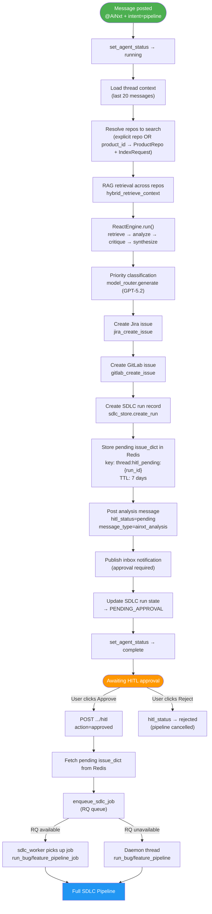
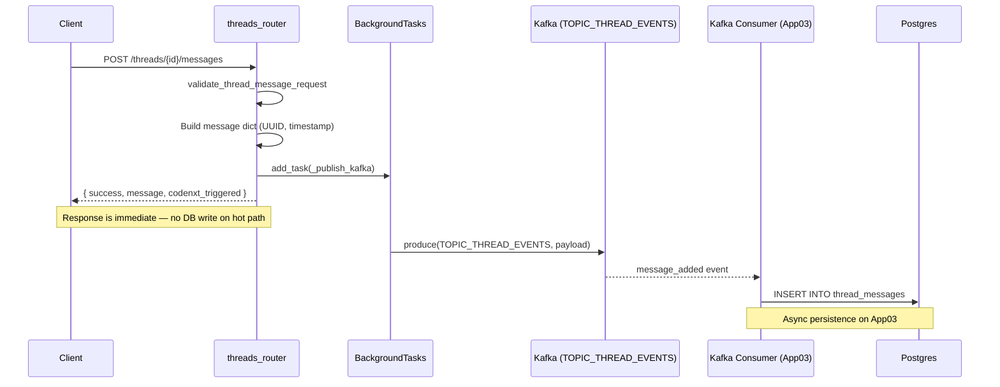
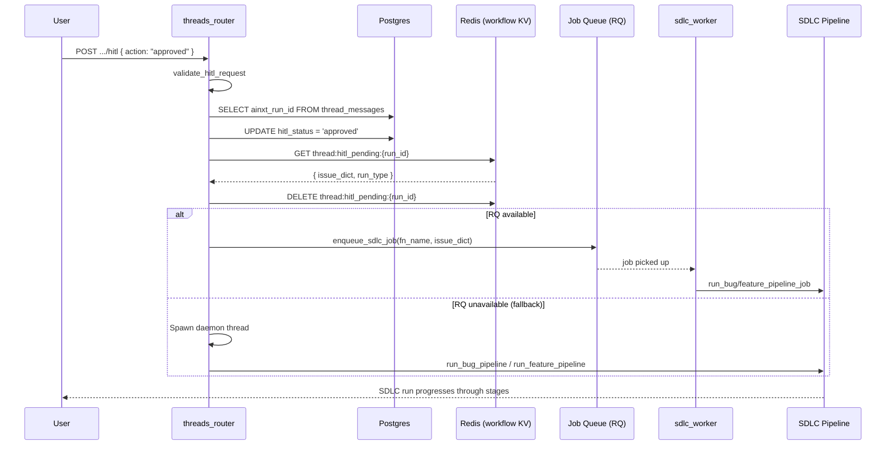

# Threads Router

## Introduction

The **Threads Router** (`routers/threads_router.py`) is a FastAPI APIRouter that powers the platform's collaborative discussion threads — a Slack-style conversation surface where engineering teams report issues, discuss solutions, and trigger autonomous AI-driven bug-fix pipelines. It is mounted under the `/threads` prefix and tagged `["threads"]`.

The router's standout capability is the **@AiNxt autonomous flow**: when a user mentions `@AiNxt` in a thread message with `ainxt_intent = "pipeline"`, a background task orchestrates a multi-step pipeline that retrieves relevant code via RAG, runs a ReACT reasoning engine to produce a fix analysis, classifies priority, creates Jira and GitLab tracking issues, creates an SDLC run record, and posts a human-in-the-loop (HITL) approval card back to the thread. Upon approval, the full SDLC pipeline (bug or feature) is launched asynchronously.

---

## Architecture Overview

```mermaid
graph TB
    subgraph "Client / Frontend"
        FE["Threads UI<br/>(ai-ui Threads.jsx)"]
    end

    subgraph "Threads Router (this module)"
        EP_LIST["GET /threads"]
        EP_CREATE["POST /threads"]
        EP_GET["GET /threads/{id}"]
        EP_MSG["POST /threads/{id}/messages"]
        EP_DEL["DELETE /threads/{id}"]
        EP_STATUS["GET /threads/{id}/agent/status"]
        EP_HITL["POST /threads/{id}/messages/{msg_id}/hitl"]
        EP_REACT["POST /threads/{id}/messages/{msg_id}/react"]
        CODEFLOW["_codenxt_flow<br/>(background task)"]
    end

    subgraph "Store Layer"
        TS["threads_store<br/>create_thread, get_thread,<br/>list_threads, get_messages,<br/>set_agent_status, get_reply_counts"]
        IS["inbox_store<br/>publish_inbox_item"]
        SS["sdlc_store<br/>create_run, update_run_state"]
    end

    subgraph "Core Infrastructure"
        AUTH["auth.dependencies<br/>get_current_user"]
        RBAC["auth.rbac<br/>is_admin"]
        SECVAL["core.security_validation<br/>validate_*_request"]
        KV["core.kv<br/>get_kv (Redis)"]
        KAFKA["core.kafka_producer<br/>produce"]
        JQ["core.job_queue<br/>enqueue_sdlc_job"]
        CFG["core.config"]
        LOG["core.logger"]
    end

    subgraph "AI / SDLC Pipeline"
        RE["agents.react_engine<br/>ReactEngine"]
        MR["models.model_router<br/>model_router.generate"]
        HR["models.hybrid_retriever<br/>hybrid_retrieve_context"]
        SP["agents.sdlc_pipeline<br/>run_bug_pipeline /<br/>run_feature_pipeline"]
    end

    subgraph "External Integrations"
        JT["tools.jira_tools<br/>jira_create_issue"]
        GT["tools.gitlab_tools<br/>gitlab_create_issue"]
    end

    FE --> EP_LIST & EP_CREATE & EP_GET & EP_MSG & EP_DEL & EP_STATUS & EP_HITL & EP_REACT

    EP_LIST --> TS
    EP_LIST --> RBAC
    EP_CREATE --> TS
    EP_CREATE --> SECVAL
    EP_CREATE --> AUTH
    EP_GET --> TS
    EP_GET --> RBAC
    EP_MSG --> TS
    EP_MSG --> SECVAL
    EP_MSG --> KAFKA
    EP_MSG --> CODEFLOW
    EP_HITL --> SECVAL
    EP_HITL --> KV
    EP_HITL --> JQ
    EP_HITL --> SP
    EP_REACT --> SECVAL

    CODEFLOW --> TS
    CODEFLOW --> IS
    CODEFLOW --> SS
    CODEFLOW --> RE
    CODEFLOW --> MR
    CODEFLOW --> HR
    CODEFLOW --> JT
    CODEFLOW --> GT
    CODEFLOW --> KV
    CODEFLOW --> CFG

    JQ --> SP
```



---

## Data Models (Pydantic)

### ThreadCreate

| Field | Type | Default | Description |
|-------|------|---------|-------------|
| `title` | `str` | — | Thread title (required, validated/sanitized) |
| `product_id` | `str` | — | Product this thread belongs to (required) |
| `description` | `str` | `""` | Optional description |
| `project_id` | `str` | `""` | Jira project key hint |
| `repo` | `str` | `""` | Specific repository for the thread |
| `created_by` | `str` | `"user"` | Author identifier |
| `labels` | `List[str]` | `[]` | Tag labels for filtering |
| `priority` | `str` | `"Medium"` | High / Medium / Low |

### ThreadMessage

| Field | Type | Default | Description |
|-------|------|---------|-------------|
| `content` | `str` | — | Message body (required, sanitized) |
| `author` | `str` | `"user"` | Author ID |
| `author_name` | `Optional[str]` | `None` | Display name |
| `author_band` | `Optional[str]` | `None` | Author's AD level/band |
| `message_type` | `str` | `"text"` | Message type (validated against allow-list) |
| `parent_message_id` | `Optional[str]` | `None` | For threaded replies |
| `mentions` | `List[str]` | `[]` | Mentioned user IDs |
| `model_used` | `Optional[str]` | `None` | LLM model used (for AI messages) |
| `tokens_in` / `tokens_out` | `Optional[int]` | `None` | Token usage |
| `cost_usd` | `Optional[float]` | `None` | Estimated cost |
| `latency_ms` | `Optional[float]` | `None` | Response latency |
| `ainxt_intent` | `str` | `"chat"` | `"chat"` = conversational Q&A; `"pipeline"` = full SDLC flow |

### HitlAction

| Field | Type | Default | Description |
|-------|------|---------|-------------|
| `action` | `str` | — | `approved` / `modified` / `rejected` |
| `note` | `Optional[str]` | `""` | Optional reviewer note |

### ReactionBody

| Field | Type | Default | Description |
|-------|------|---------|-------------|
| `emoji` | `str` | — | Emoji string (required) |
| `user_id` | `str` | — | User toggling the reaction (required) |

---

## Endpoints

### `GET /threads` — List Threads

Lists threads with department-scoped visibility:

- **Admins** see all threads.
- **Non-admins** see threads for products their department has access to (resolved via `DeptProductMapping`), plus unscoped threads in their own department.

**Query Parameters:** `project_id`, `product_id`, `status`, `label`

**Dependencies:** `auth.dependencies.get_current_user`, `auth.rbac.is_admin`, `store.threads_store.list_threads`

### `POST /threads` — Create Thread

Creates a new thread after field-level validation and sanitization via `core.security_validation.validate_create_thread_request`. The caller's department is injected from the authenticated user context.

**Dependencies:** `auth.dependencies.get_current_user`, `core.security_validation`, `store.threads_store.create_thread`

### `GET /threads/{thread_id}` — Get Thread Detail

Returns the thread and all its messages (annotated with reply counts). Enforces a department gate: non-admins cannot read threads belonging to a different department.

**Dependencies:** `auth.dependencies.get_current_user`, `auth.rbac.is_admin`, `store.threads_store.get_thread`, `store.threads_store.get_messages`, `store.threads_store.get_reply_counts`

### `POST /threads/{thread_id}/messages` — Add Message

Adds a message to a thread. This is the primary entry point for the @AiNxt autonomous flow.

**Key behaviours:**

1. **Validation** — message content is validated and sanitized via `validate_thread_message_request`.
2. **Async persistence** — the message is NOT written to the database on the hot path. Instead, a `BackgroundTask` publishes the full payload to Kafka (`TOPIC_THREAD_EVENTS`), and a consumer on App03 writes it to Postgres asynchronously. The message dict is returned immediately to the client.
3. **@AiNxt trigger** — if `@AiNxt` appears in the content or mentions AND `ainxt_intent == "pipeline"`, the `_codenxt_flow` background task is launched.

**Response:** `{ success, message, codenxt_triggered }`

### `DELETE /threads/{thread_id}` — Delete Thread

Deletes a thread by ID. Returns 404 if not found.

**Dependencies:** `store.threads_store.delete_thread`

### `GET /threads/{thread_id}/agent/status` — Get Agent Status

Returns the current @AiNxt agent status for a thread (`idle` / `running` / `complete` / `error`). Status is tracked in an in-process dict in `threads_store`.

**Dependencies:** `store.threads_store.get_agent_status`

### `POST /threads/{thread_id}/messages/{message_id}/hitl` — HITL Action

Records a human-in-the-loop decision on an `ainxt_analysis` message.

**Flow:**

1. Validates the action via `validate_hitl_request`.
2. Updates `hitl_status` on the message in Postgres (direct `psycopg2` connection).
3. **On `approved`:** retrieves the pending SDLC issue dict from Redis (workflow KV, DB=2, key `thread:hitl_pending:{run_id}`), then enqueues the SDLC pipeline job via `core.job_queue.enqueue_sdlc_job`. If RQ is unavailable, falls back to a daemon thread that calls `run_bug_pipeline` or `run_feature_pipeline` directly.

**Dependencies:** `core.security_validation`, `core.kv`, `core.job_queue`, `store.sdlc_store`, `agents.sdlc_pipeline`

### `POST /threads/{thread_id}/messages/{message_id}/react` — Toggle Reaction

Toggles an emoji reaction on a message (adds if absent, removes if present). Reactions are stored as a JSONB column on `thread_messages`. Uses a direct `psycopg2` connection for the read-modify-write.

**Dependencies:** `core.security_validation.validate_reaction_request`, `core.config.postgres_dsn`

---

## @AiNxt Autonomous Flow (`_codenxt_flow`)

This is the core intelligence of the threads router. It is a fire-and-forget background task triggered when a user sends a pipeline-intent message mentioning `@AiNxt`.



### Step-by-step breakdown

| Step | Action | Component |
|------|--------|-----------|
| 1 | Set agent status to `running` | `threads_store.set_agent_status` |
| 2 | Load thread context (last 20 messages) | `threads_store.get_messages` |
| 3 | Resolve repos: explicit `repo` arg, or all repos linked to `product_id` via `ProductRepo` + `IndexRequest` tables | `db.database`, `db.models` |
| 4 | RAG retrieval across all resolved repos | `models.hybrid_retriever.hybrid_retrieve_context` |
| 5 | ReACT reasoning loop (retrieve → analyze → critique → synthesize) | `agents.react_engine.ReactEngine` |
| 6 | Priority classification (High/Medium/Low) | `models.model_router.model_router.generate` |
| 7 | Create Jira issue (Bug type) | `tools.jira_tools.jira_create_issue` |
| 8 | Create GitLab issue (tracking only — no code committed) | `tools.gitlab_tools.gitlab_create_issue` |
| 9 | Create SDLC run record | `store.sdlc_store.create_run` |
| 10 | Store pending issue dict in Redis (workflow KV, 7-day TTL) | `core.kv.get_kv` |
| 11 | Post analysis message with `hitl_status=pending` | `threads_store.add_message` |
| 12 | Publish inbox notification (approval required) | `store.inbox_store.publish_inbox_item` |
| 13 | Update SDLC run state to `PENDING_APPROVAL` | `store.sdlc_store.update_run_state` |
| 14 | Set agent status to `complete` | `threads_store.set_agent_status` |

### ReACT Engine Integration

The `ReactEngine` is configured with:

- **`synthesis_hint="solution"`** — uses Opus (if `ENABLE_OPUS=true`) for the final synthesis answer; falls back to Sonnet.
- **`iteration_hint="complex"`** — uses Sonnet for mid-loop reasoning iterations (cost control).
- **`retrieve_fn`** — a closure that calls `hybrid_retrieve_context` across all resolved repos, collecting up to 8 chunks.
- **`max_iterations`** — default 3 (from `MAX_REACT_ITERATIONS`).
- **`confidence_threshold`** — early-stop when confidence is reached.

The engine returns a `ReactResult` with `answer`, `iterations`, `confidence`, and `model_used`.

### Cost Estimation

Token counts are estimated from word counts (`words × 1.3`), and cost is computed using `MODEL_COST_PER_1M` rates from `core.model_registry`. These stats are stored on the analysis message for audit and budget tracking.

---

## Message Persistence Flow



> **Note:** The `add_message` function in `threads_store` is called directly only by `_codenxt_flow` (for AI analysis messages). User messages go through the Kafka async path. This split design keeps the API response latency low while ensuring durable persistence.

---

## HITL Approval & SDLC Pipeline Launch



### SDLC Pipeline Entry Points

When approved, the pipeline function is selected based on `run_type`:

| `run_type` | Worker function | Direct function |
|------------|----------------|-----------------|
| `bug` (default) | `workers.sdlc_worker.run_bug_pipeline_job` | `agents.sdlc_pipeline.run_bug_pipeline` |
| `feature` | `workers.sdlc_worker.run_feature_pipeline_job` | `agents.sdlc_pipeline.run_feature_pipeline` |

The SDLC pipeline is documented in detail in [shared_core_sdlc_pipeline](../sdlc/shared_core_sdlc_pipeline.md).

---

## Security & Validation

All mutating endpoints pass their request body through `core.security_validation` validators before any business logic executes. Each validator returns a tuple of `(is_valid, field_errors, sanitized_values)`.

| Endpoint | Validator | Key checks |
|----------|-----------|------------|
| `POST /threads` | `validate_create_thread_request` | Title length, description XSS, priority enum, labels format, `product_id` required |
| `POST /threads/{id}/messages` | `validate_thread_message_request` | Content sanitization, `message_type` allow-list, `ainxt_intent` allow-list, `parent_message_id` XSS |
| `POST .../hitl` | `validate_hitl_request` | Action enum (`approved`/`modified`/`rejected`), note free-text sanitization |
| `POST .../react` | `validate_reaction_request` | Emoji required, `user_id` required + XSS check |

Authentication is enforced via `auth.dependencies.get_current_user` (JWT-based) on all endpoints except `DELETE /threads/{id}` and `GET .../agent/status`. Department-level RBAC is applied on `GET /threads` and `GET /threads/{id}` via `auth.rbac.is_admin`.

---

## Dependency Map

```mermaid
graph LR
    subgraph "This Module"
        TR["threads_router"]
    end

    subgraph "Store Layer"
        TS["threads_store"]
        IS["inbox_store"]
        SS["sdlc_store"]
    end

    subgraph "Core"
        SEC["security_validation"]
        KV["core.kv"]
        KAFKA["kafka_producer"]
        JQ["job_queue"]
        CFG["core.config"]
        MR["model_registry"]
        LOG["core.logger"]
    end

    subgraph "Auth"
        AUTH["auth.dependencies"]
        RBAC["auth.rbac"]
    end

    subgraph "AI / Retrieval"
        RE["react_engine"]
        MR2["model_router"]
        HR["hybrid_retriever"]
        SP["sdlc_pipeline"]
    end

    subgraph "Tools"
        JT["jira_tools"]
        GT["gitlab_tools"]
    end

    subgraph "DB"
        DB["db.database"]
        DBM["db.models"]
    end

    TR --> TS & IS & SS
    TR --> SEC & KV & KAFKA & JQ & CFG & MR & LOG
    TR --> AUTH & RBAC
    TR --> RE & MR2 & HR & SP
    TR --> JT & GT
    TR --> DB & DBM
```

### External Module References

| Dependency | Module | Documentation |
|------------|--------|----------------|
| `store.threads_store` | shared_core → store_layer | [store_layer](../storage/store_layer.md) |
| `store.inbox_store` | shared_core → store_layer | [store_layer](../storage/store_layer.md) |
| `store.sdlc_store` | shared_core → store_layer | [store_layer](../storage/store_layer.md) |
| `agents.react_engine` | shared_core → agent_system → reaction_engines | [agent_system](../agents/agent_system.md) |
| `agents.sdlc_pipeline` | shared_core → shared_core_sdlc_pipeline | [shared_core_sdlc_pipeline](../sdlc/shared_core_sdlc_pipeline.md) |
| `models.model_router` | shared_core → model_routing | [model_routing](../models/model_routing.md) |
| `models.hybrid_retriever` | shared_core → model_routing | [model_routing](../models/model_routing.md) |
| `core.security_validation` | shared_core → core_infrastructure | [core_infrastructure](../infrastructure/core_infrastructure.md) |
| `core.kafka_producer` | shared_core → core_infrastructure | [core_infrastructure](../infrastructure/core_infrastructure.md) |
| `core.job_queue` | shared_core → core_infrastructure | [core_infrastructure](../infrastructure/core_infrastructure.md) |
| `core.kv` | shared_core → kv_store | [kv_store](../storage/kv_store.md) |
| `auth.dependencies` / `auth.rbac` | shared_core → authentication | [authentication](../security/authentication.md) |
| `tools.jira_tools` | shared_integrations | [shared_integrations](../reference/shared_integrations.md) |
| `tools.gitlab_tools` | shared_integrations | [shared_integrations](../reference/shared_integrations.md) |
| `db.database` / `db.models` | shared_core → database | [database](../storage/database.md) |
| Kafka consumer (`_handle_thread_events`) | workers → kafka_event_consumer | [kafka_event_consumer](../reference/kafka_event_consumer.md) |
| SDLC workers | workers → sdlc_pipeline_workers | [sdlc_pipeline_workers](../workers/sdlc_pipeline_workers.md) |
| Frontend Threads UI | ai_ui_frontend → threads | — |

---

## Error Handling

| Scenario | Behaviour |
|----------|-----------|
| Thread not found | `HTTPException(404)` |
| Department access denied | `HTTPException(403)` |
| Validation failure | `HTTPException(400)` with field-level error messages |
| `_codenxt_flow` exception | Logged via `logger.error`, agent status set to `error` |
| Kafka publish failure | Logged at `debug` level (fire-and-forget) |
| Jira/GitLab creation failure | Logged at `warning` level, flow continues |
| SDLC run creation failure | Logged at `warning` level, flow continues without run ID |
| RQ enqueue failure | Falls back to daemon thread execution |
| Redis pending fetch failure | Logged at `warning`, HITL returns success without pipeline launch |

---

## Key Design Decisions

1. **Async message persistence via Kafka** — User messages are not written to Postgres on the API hot path. This keeps response latency minimal. The Kafka consumer on App03 handles durable persistence. AI analysis messages (from `_codenxt_flow`) bypass Kafka and write directly via `threads_store.add_message` since they are already in a background task.

2. **HITL gating with Redis** — The pending SDLC issue dict is stored in Redis (workflow KV, 7-day TTL) rather than in Postgres. This provides fast retrieval on approval and automatic expiry if the user never acts. The `ainxt_run_id` on the message row links the message to the pending Redis entry.

3. **Dual-path SDLC launch** — On HITL approval, the router first attempts to enqueue via RQ (`enqueue_sdlc_job`). If RQ is unavailable, it falls back to a daemon thread calling the pipeline function directly. This ensures the pipeline can start even in degraded infrastructure conditions.

4. **Multi-repo RAG** — When no explicit `repo` is provided but a `product_id` is set, the flow resolves all repos linked to that product (via `ProductRepo` and `IndexRequest` tables) and searches across all of them. This enables cross-repository bug analysis.

5. **Cost-aware model routing** — The ReACT engine uses Sonnet for iterative reasoning (cost control) and reserves Opus for the final synthesis. Priority classification uses a medium-tier model. Token counts and costs are estimated and stored for audit.

6. **Department-scoped visibility** — Thread visibility follows a Slack-style collaboration model: admins see everything, non-admins see threads for their department's accessible products plus unscoped departmental threads. This is enforced at both the list and detail endpoints.
