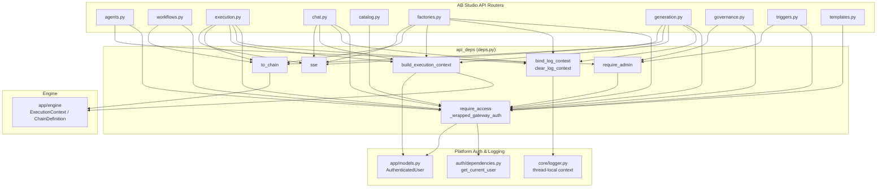
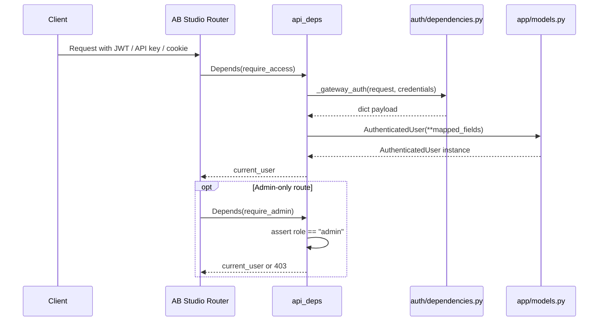
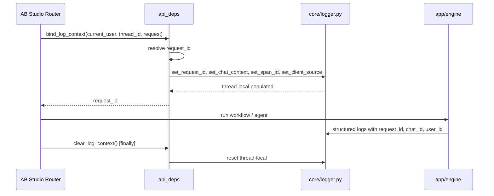
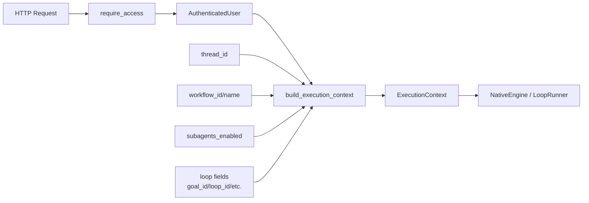

# api_deps — Shared FastAPI Dependencies for AB Studio

`api_deps` (`ABStudio/backend/app/api/deps.py`) is the central dependency injection layer for all AB Studio (Build Studio) backend API routers. It provides reusable [FastAPI `Depends`](https://fastapi.tiangolo.com/tutorial/dependencies/) callables for authentication, authorization, request-scoped logging context, execution context construction, and small transport helpers such as Server-Sent Events (SSE).

By keeping these cross-cutting concerns in one module, every router in `ABStudio/backend/app/api/` can share a single, consistent view of the current user, the same structured-logging identifiers, and the same `ExecutionContext` shape passed down to the workflow/agent engine.

---

## Core Responsibilities

| Concern | Functions / Objects | Purpose |
|---|---|---|
| **Authentication** | `_wrapped_gateway_auth`, `require_access` | Resolve the current user from the platform gateway's JWT/API-key auth and expose it as an [`AuthenticatedUser`](app_models.md) model. |
| **Authorization** | `require_admin` | Reuse `require_access` and additionally enforce `role == "admin"`. |
| **Logging context** | `bind_log_context`, `clear_log_context` | Stamp each request with `request_id`, `chat_id` (thread id), `user_id`, `span_id`, and `client_source` using the shared [`core/logger`](core_logger.md) thread-local setters. |
| **Execution context** | `build_execution_context` | Build an [`ExecutionContext`](engine.md) from the authenticated user and request metadata so workflow/agent runs inherit department, admin flags, hierarchy fields, and loop-engineering parameters. |
| **Model conversion** | `to_chain` | Convert a Pydantic [`Workflow`](app_models.md) model into the engine-agnostic `ChainDefinition` used by the execution engine. |
| **SSE helper** | `sse` | Serialize a dict into an SSE `data:` frame. |

---

## Architecture



---

## Component Reference

### `_wrapped_gateway_auth`

A FastAPI dependency that bridges the platform-wide [`auth/dependencies.py::get_current_user`](auth_dependencies.md) with AB Studio's [`AuthenticatedUser`](app_models.md) model.

- **When the gateway is present** (`auth.dependencies` can be imported), it calls the gateway's `get_current_user`, receives a `dict`, and maps fields such as `userId`/`id`/`sub`, `email`, `name`, `role`, `department`, `ad_level`, `is_hod`, and `is_security_team` into an `AuthenticatedUser` instance.
- **When running standalone** (e.g., local development without the gateway), the import fails and `require_access` falls back to [`require_framework_access("agent-chain")`](app_models.md), which returns a dev-stub admin user.

This wrapper lets every AB Studio router use dot-access (`current_user.id`, `current_user.department`) without changing code between gateway and standalone modes.

### `require_admin`

Built on top of `require_access`. It returns the authenticated user but raises `HTTPException(403)` when `current_user.role.lower() != "admin"`. This keeps the distinction clear:

- `401` — missing or invalid authentication (from `require_access`).
- `403` — valid authentication, but insufficient role (from `require_admin`).

### `bind_log_context` / `clear_log_context`

Populates the shared [`core/logger`](core_logger.md) thread-local context so every structured log line written during a request carries the same identifiers:

| Field | Source |
|---|---|
| `request_id` | Explicit argument, `X-Request-ID` header, or fresh `uuid4().hex`. |
| `chat_id` | AB Studio `thread_id` (conversation/session id). |
| `user_id` | `current_user.id`. |
| `span_id` | Defaults to `"abstudio"`. |
| `client_source` | Constant `ABSTUDIO_CLIENT_SOURCE = "abstudio"`. |

Because uvicorn worker threads are reused across requests, callers must invoke `clear_log_context()` in a `finally` block to prevent stale identifiers from leaking into the next request.

### `build_execution_context`

Constructs an `ExecutionContext` for the workflow/agent engine from the authenticated user and optional request metadata. It carries:

- Identity: `user_id`, `email`.
- ACL fields: `department`, `is_admin`, `ad_level`, `is_hod`, `is_security_team`.
- Run metadata: `thread_id`, `workflow_id`, `workflow_name`, `subagents_enabled`.
- Loop-engineering fields (P2): `goal_id`, `loop_id`, `loop_run_id`, `budget`, `trigger_src`, `run_workspace_dir`, `allowed_connections`, `attachments`.

These fields allow the engine to apply the same `PUBLIC` + user-department `PRIVATE` pgvector ACL used by the chat Knowledge toggle, and to pass loop-control parameters to [`LoopRunner`](loop_runner.md).

### `to_chain`

Converts a [`Workflow`](app_models.md) Pydantic model into the engine's `ChainDefinition`:

- Maps `workflow.nodes` directly.
- Transforms each `workflow.edges` entry into a `ChainEdge` with `source`, `target`, and `source_handle`.
- Forwards `workflow.knowledge` when present (older clients may omit it).

### `sse`

Serializes a Python dict to an SSE payload string:

```python
def sse(payload: dict) -> str:
    return f"data: {json.dumps(payload)}\n\n"
```

Used by streaming endpoints in `execution.py`, `factories.py`, `generation.py`, and `chat.py`.

---

## Authentication Data Flow



---

## Request Logging Context Flow



---

## Execution Context Construction Flow



---

## Integration with the Rest of the System

`api_deps` sits at the boundary between the AB Studio HTTP API and the rest of the platform:

- **Authentication** is delegated to the shared [`auth/dependencies.py`](auth_dependencies.md) so AB Studio reuses the same JWT/API-key/cookie logic as the main gateway, IDE integrations, and CLI.
- **Logging** is aligned with [`core/logger.py`](core_logger.md), ensuring `agent.log` entries from AB Studio use the same `request_id`, `chat_id`, `user_id`, `span_id`, and `client_source` fields as the platform, CLI, and IDE surfaces.
- **User model** is imported from [`app/models.py`](app_models.md), which defines `AuthenticatedUser` and the fallback `require_framework_access` stub.
- **Engine integration** passes `ExecutionContext` and `ChainDefinition` into the AB Studio execution engine (see [engine_native_engine.md](engine_native_engine.md) and [loop_runner.md](loop_runner.md)).
- **Router consumers** include:
  - [api_agents.md](api_agents.md)
  - [api_workflows.md](api_workflows.md)
  - [api_execution.md](api_execution.md)
  - [api_chat.md](api_chat.md)
  - [api_catalog.md](api_catalog.md)
  - [api_factories.md](api_factories.md)
  - [api_generation.md](api_generation.md)
  - [api_governance.md](api_governance.md)
  - [api_triggers.md](api_triggers.md)
  - [api_templates.md](api_templates.md)
  - [api_template_admin.md](api_template_admin.md)
  - [api_agent_chat.md](api_agent_chat.md)
  - [api_agent_templates.md](api_agent_templates.md)
  - [api_documents.md](api_documents.md)
  - [api_kb.md](api_kb.md)
  - [api_loops.md](api_loops.md)
  - [api_mcp.md](api_mcp.md)

---

## Usage Example

```python
from fastapi import APIRouter, Depends
from app.api.deps import require_access, require_admin, build_execution_context

router = APIRouter()

@router.post("/workflows/{workflow_id}/run")
async def run_workflow(
    workflow_id: str,
    current_user: AuthenticatedUser = Depends(require_access),
):
    ctx = build_execution_context(
        current_user,
        workflow_id=workflow_id,
        workflow_name="my-workflow",
    )
    # ... pass ctx to the engine

@router.delete("/workflows/{workflow_id}")
async def delete_workflow(
    workflow_id: str,
    current_user: AuthenticatedUser = Depends(require_admin),
):
    # Only admins reach this point.
    ...
```

---

## Notes for Maintainers

- **Thread safety**: `bind_log_context` relies on [`core/logger.py`](core_logger.md) thread-local variables. Under uvicorn's worker threads and within a single async handler (including its SSE generator), both run on the same event-loop thread, so the context is safe. Always call `clear_log_context()` in `finally`.
- **Gateway vs. standalone**: The `try/except ImportError` around `_wrapped_gateway_auth` is intentional. It allows AB Studio to run inside the AiNxt gateway in production while remaining runnable locally without the gateway package.
- **Backward compatibility**: `build_execution_context` accepts all loop-engineering fields as optional kwargs so older callers that predate the loop subsystem continue to work unchanged.
- **ACL consistency**: `department`, `is_admin`, `ad_level`, `is_hod`, and `is_security_team` are propagated from the JWT-enriched payload through `AuthenticatedUser` into `ExecutionContext`, ensuring workflow/agent KB retrieval applies the same ACL rules as chat.
