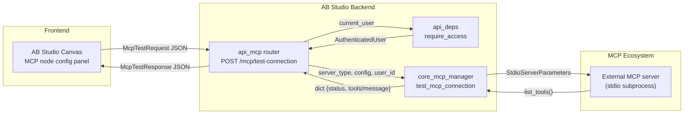
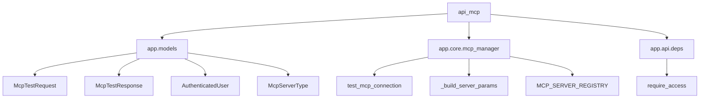
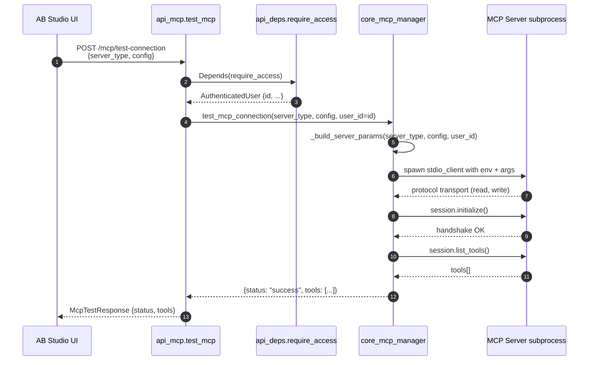

# api_mcp — MCP Connection Test API

## Brief Introduction

The `api_mcp` module is a minimal FastAPI router inside **AB Studio** (`ABStudio/backend/app/api/mcp.py`). It exposes a single public endpoint that lets authenticated users **probe an MCP (Model Context Protocol) server configuration** before attaching it to an agent or workflow node.

When a user configures an MCP node in the AB Studio canvas (for example, a GitHub, GitLab, PostgreSQL, REST API, Weaviate, or Microsoft Teams server), the frontend calls this endpoint to verify that:

1. The server can be started with the supplied credentials.
2. The MCP protocol handshake succeeds.
3. The list of available tools can be discovered.

The endpoint returns either a success payload containing the discovered tools or a structured error message that the UI can surface to the user.

> This module intentionally contains **only the HTTP route**. The actual MCP lifecycle management — server parameter construction, session caching, tool normalization, and execution — lives in [`core_mcp_manager`](core_mcp_manager.md). Authentication/authorization plumbing is reused from [`api_deps`](api_deps.md), and request/response schemas are defined in [`app_models`](app_models.md).

---

## Core Functionality

### `POST /mcp/test-connection`

Tests a candidate MCP server connection and returns the tools it exposes.

| Aspect | Description |
|--------|-------------|
| **Route file** | `ABStudio/backend/app/api/mcp.py` |
| **Handler** | `test_mcp` |
| **Request model** | [`McpTestRequest`](app_models.md) — `server_type` + `config` dict |
| **Response model** | [`McpTestResponse`](app_models.md) — `status`, optional `tools`, optional `message` |
| **Auth dependency** | [`require_access`](api_deps.md) (gateway-wrapped JWT or framework access) |
| **RBAC** | Any authenticated AB Studio user may call it; the probe runs with their `user_id` so vault-backed credential references can be decrypted under the caller's identity. |

#### Request body example

```json
{
  "server_type": "github",
  "config": {
    "token": "ghp_...",
    "api_url": "https://api.github.com"
  }
}
```

#### Success response example

```json
{
  "status": "success",
  "tools": [
    {"name": "github_list_issues", "description": "List issues in a repository."},
    {"name": "github_create_issue", "description": "Create a new issue."}
  ]
}
```

#### Error response example

```json
{
  "status": "error",
  "message": "Authentication failed: Bad credentials"
}
```

The handler catches all exceptions and converts them into an `McpTestResponse(status="error", message=...)`, so the UI always receives a predictable payload.

---

## Architecture



### Component responsibilities

| Component | Responsibility |
|-----------|----------------|
| `api_mcp.test_mcp` | HTTP adapter: validates request, injects current user, calls the manager, and maps the result to `McpTestResponse`. |
| `api_deps.require_access` | Resolves the bearer token / JWT into an `AuthenticatedUser`. Falls back to framework access when running outside the gateway. |
| `app_models.McpTestRequest` / `McpTestResponse` | Pydantic contracts for the API surface. |
| `core_mcp_manager.test_mcp_connection` | Builds `StdioServerParameters`, spawns the MCP server subprocess, runs the MCP handshake, calls `list_tools()`, and tears the session down. |
| `core_mcp_manager.MCP_SERVER_REGISTRY` | Static registry mapping each `McpServerType` to its command, args, environment mapping, and defaults. |

---

## Dependencies

### Direct imports



### Module references

- **[`app_models`](app_models.md)** — Defines `McpTestRequest`, `McpTestResponse`, `McpServerType`, and `AuthenticatedUser`. The enum values (`github`, `gitlab`, `rest_api`, `postgres`, `weaviate`, `teams`) must stay in sync with `core_mcp_manager.MCP_SERVER_REGISTRY`.
- **[`core_mcp_manager`](core_mcp_manager.md)** — Implements the actual MCP client logic. `test_mcp_connection` is a thin, stateless wrapper around `_build_server_params` + `stdio_client` + `ClientSession.list_tools()`.
- **[`api_deps`](api_deps.md)** — Provides `require_access`, which wraps the platform gateway's JWT validation or falls back to framework-level access control.

---

## Data Flow



### Error path

If any step fails (unknown server type, subprocess crash, handshake failure, auth rejection, etc.), `test_mcp_connection` catches the exception and returns `{status: "error", message: str(e)}`. The route handler then forwards this dict into `McpTestResponse`, so the UI receives a 200 OK with `status: error` rather than a raw 500.

---

## Security & RBAC

- **Authentication**: The route depends on `require_access`, so unauthenticated requests are rejected with 401 (or the gateway equivalent).
- **User scoping**: The caller's `current_user.id` is forwarded into `test_mcp_connection`. This allows the manager to resolve per-user credential references (for example, `*_credential_id` entries that must be decrypted via the vault) under the caller's RBAC context and audit trail.
- **No persistent state**: The test endpoint starts a subprocess, performs the probe, and immediately closes it. No long-lived session or credential is retained by `api_mcp`.
- **Environment isolation**: `_build_server_params` seeds the subprocess environment from the current OS environment, applies registry defaults, and then overlays only the keys present in the user's `config` dict. This prevents arbitrary environment injection while still supporting required credentials.

---

## How It Fits into the Overall System

`api_mcp` is one of many small, focused routers under `ABStudio/backend/app/api/`. It serves the **Build Studio** frontend during the agent/workflow authoring phase:

1. A user drags an **MCP node** onto the workflow canvas.
2. The node config panel collects `server_type` and connection parameters.
3. The frontend calls `POST /mcp/test-connection` to validate the configuration.
4. On success, the discovered tool names/descriptions are shown to the user.
5. When the workflow is later executed, [`core_mcp_manager`](core_mcp_manager.md) and the [`engine_native_engine`](engine_native_engine.md) reuse the same registry and session machinery to actually invoke those tools at runtime.

In other words, `api_mcp` is the **author-time validation surface** for MCP integrations, while [`core_mcp_manager`](core_mcp_manager.md) is the **runtime engine** that keeps sessions alive and routes tool calls during workflow/agent execution.

---

## Related Modules

- [`core_mcp_manager`](core_mcp_manager.md) — Full MCP lifecycle: session management, tool normalization, schema fixing, and tool execution.
- [`app_models`](app_models.md) — Pydantic models including `McpTestRequest`, `McpTestResponse`, `McpServerType`, `McpNode`, and `AuthenticatedUser`.
- [`api_deps`](api_deps.md) — Shared FastAPI dependencies, especially `require_access` and `require_admin`.
- [`engine_native_engine`](engine_native_engine.md) — Runtime engine that consumes MCP tools through `McpSessionManager` during workflow execution.
