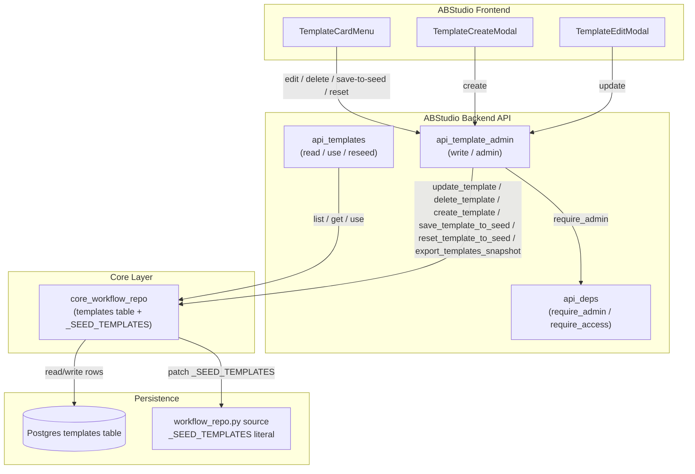
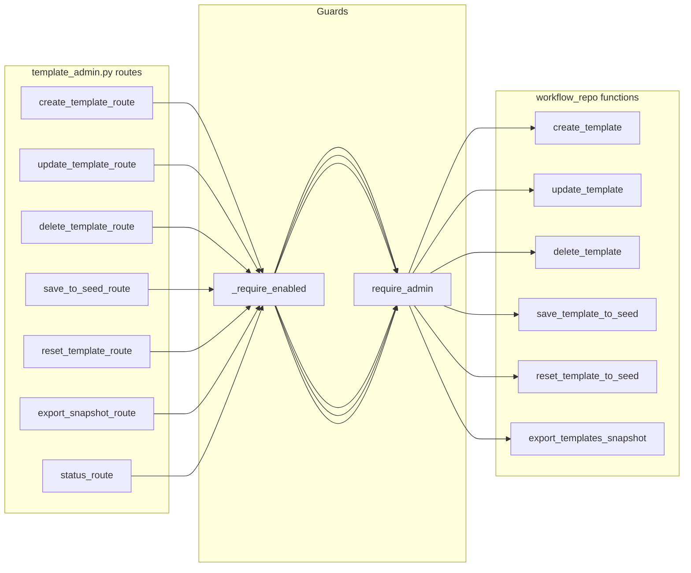
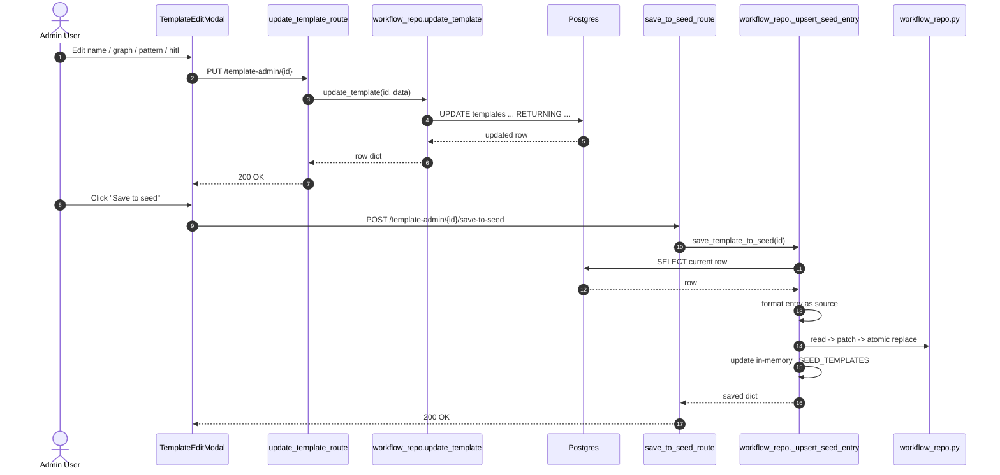
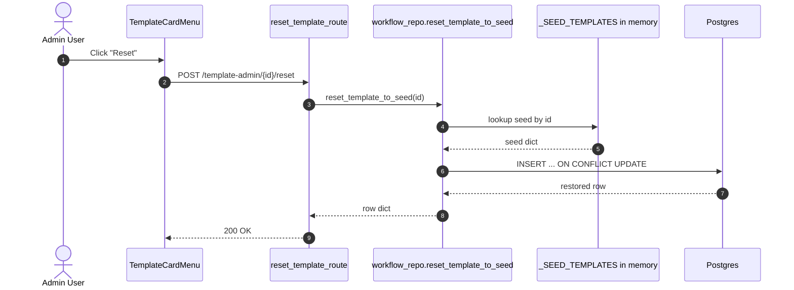
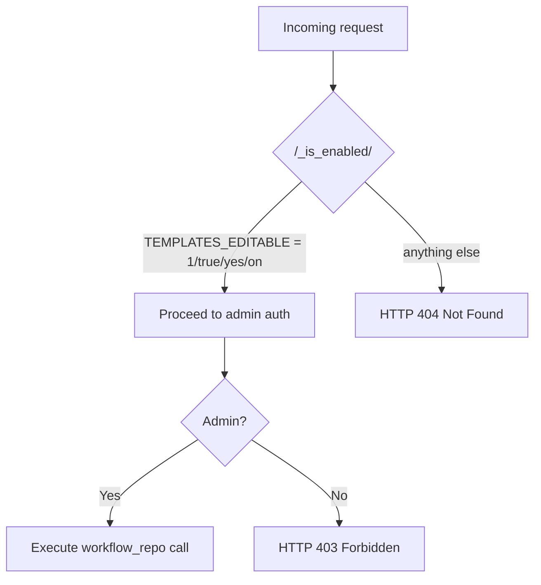

# `api_template_admin` - Optional Template Editor API

## Brief Introduction

`api_template_admin` is a feature-flagged FastAPI router that exposes administrative endpoints for editing the workflow template catalog from the ABStudio UI. It is the **only** write-path for seed templates and is deliberately isolated under the `/template-admin/` prefix so it does not collide with the read-only template routes in [`api_templates`](api_templates.md).

The module is optional: when the environment variable `TEMPLATES_EDITABLE` is not truthy, the router is still mounted but every endpoint returns `404 Not Found`, making the disabled state indistinguishable from a missing route.

---

## Core Functionality

The editor supports the full lifecycle of a catalog template:

| Operation | Endpoint | Purpose |
|-----------|----------|---------|
| Create | `POST /template-admin` | Add a brand-new template row and persist it to the seed sidecar in [`core_workflow_repo`](core_workflow_repo.md). |
| Update | `PUT /template-admin/{id}` | Edit `name`, `description`, `category`, `pattern`, `hitl`, or `graphData`. |
| Delete | `DELETE /template-admin/{id}` | Remove a template row from the database. |
| Save to seed | `POST /template-admin/{id}/save-to-seed` | Rewrite the matching entry in `_SEED_TEMPLATES` so the DB state becomes the new code-level baseline. |
| Reset | `POST /template-admin/{id}/reset` | Restore the row to its current `_SEED_TEMPLATES` definition (re-inserts if deleted). |
| Export snapshot | `GET /template-admin/export-snapshot` | Dump all visible DB rows for manual diff/merge back into `workflow_repo.py`. |
| Status probe | `GET /template-admin/status` | Public probe returning whether the editor is enabled. |

All mutating endpoints require an admin user via [`require_admin`](api_deps.md). The status endpoint is public so the frontend can decide whether to render edit controls without attempting a privileged call.

---

## Architecture

### Module Placement

### Why a Separate Router?

The read path (`GET /templates/{id}`) lives in [`api_templates`](api_templates.md). Putting write operations in the same file would have created route collisions and mixed admin-only mutations with public read operations. The `/template-admin/` prefix keeps the API surface explicit and lets operators disable the entire editor by unsetting one flag.

---

## Component Relationships

### Route Handlers

### Data Flow: Update + Save-to-Seed

### Data Flow: Reset to Seed

---

## Feature Flag Behavior

The `_is_enabled()` helper checks `TEMPLATES_EDITABLE` case-insensitively. `_require_enabled()` raises `HTTPException(404)` before any auth check, ensuring the flag-off state leaks no information about the endpoint's existence.

---

## Security & Authorization

- **Feature flag**: entire router is a no-op when disabled.
- **Admin-only**: all mutating routes depend on [`require_admin`](api_deps.md), which itself depends on [`require_access`](api_deps.md) / `_wrapped_gateway_auth` to produce an [`AuthenticatedUser`](app_models.md).
- **Hidden templates**: [`core_workflow_repo`](core_workflow_repo.md) rejects edits/deletes for `HIDDEN_TEMPLATE_IDS`, returning `404` to the caller.
- **Field whitelist**: `update_template` only accepts `name`, `description`, `category`, `pattern`, `hitl`, and `graphData`; unknown fields are silently ignored.

---

## Error Handling

| Scenario | HTTP Status | Source |
|----------|-------------|--------|
| Editor disabled | 404 | `_require_enabled` |
| Non-admin caller | 403 | `require_admin` |
| Template not found | 404 | `workflow_repo` returns `None` |
| Invalid create payload / duplicate id | 400 | `create_template` returns `None` |
| Template not in seed (reset) | 404 | `reset_template_to_seed` returns `None` |
| Unexpected repository exception | 500 | caught in route, logged with `[AGENT]` prefix |

All unexpected errors are logged via `core.logger.logger` and surfaced as a generic `500` detail to avoid leaking internals.

---

## Integration with the Seed System

The most important design detail is the two-way relationship with [`core_workflow_repo`](core_workflow_repo.md):

1. **DB-first edits**: `update_template` and `delete_template` only touch Postgres.
2. **Seed persistence**: `create_template` and `save_template_to_seed` call `_upsert_seed_entry`, which:
   - Reads `workflow_repo.py` from disk.
   - Locates the `_SEED_TEMPLATES` list bounds.
   - Replaces the existing entry by `id` or appends a new one.
   - Writes to a temp file, fsyncs, and atomically replaces the original via `os.replace`.
   - Updates the in-memory `_SEED_TEMPLATES` and `_TEMPLATES_BY_ID` caches so the running process sees the change immediately.

This makes the catalog under version control reflect exactly what the editor produces, and keeps saved edits across a DB wipe. See [`core_workflow_repo`](core_workflow_repo.md) for the full seed-management implementation.

---

## How It Fits Into the Overall System

- **Template consumers**: [`api_templates`](api_templates.md) (`list_templates`, `get_template_route`, `use_template_route`) and [`api_workflows`](api_workflows.md) read from the same `templates` table populated by this module.
- **Publishing path**: [`core_workflow_repo.publish_workflow_as_template`](core_workflow_repo.md) can also create catalog rows from approved workflows; `api_template_admin` is the manual/admin counterpart.
- **Reseeding**: [`api_templates.reseed_templates_route`](api_templates.md) inserts missing seed IDs but never overwrites existing rows, so admin edits are preserved until explicitly reset.
- **Startup**: [`app_main._lifespan`](app_main.md) initializes the DB and seeds canonical tools/skills; template seeding is handled by the same repository layer.

---

## Removal Recipe

To completely remove the optional editor:

1. Delete `ABStudio/backend/app/api/template_admin.py`.
2. In `app/main.py`, remove the `template_admin` import and its `include_router` entry.
3. (Optional) Delete the "Optional template editor support" block in `app/core/workflow_repo.py` (look for `_EDITABLE_TEMPLATE_FIELDS`).
4. Unset `TEMPLATES_EDITABLE` in the environment.

The read path, seed path, and `use_template` flow have zero dependencies on this module.

---

## Related Documentation

- [`api_templates`](api_templates.md) - read-only template listing, retrieval, use, and reseed.
- [`core_workflow_repo`](core_workflow_repo.md) - template persistence, seed management, and `_SEED_TEMPLATES` patching.
- [`api_deps`](api_deps.md) - authentication and authorization dependencies (`require_access`, `require_admin`).
- [`app_models`](app_models.md) - `AuthenticatedUser` model.
- [`app_main`](app_main.md) - application lifespan and router registration.
