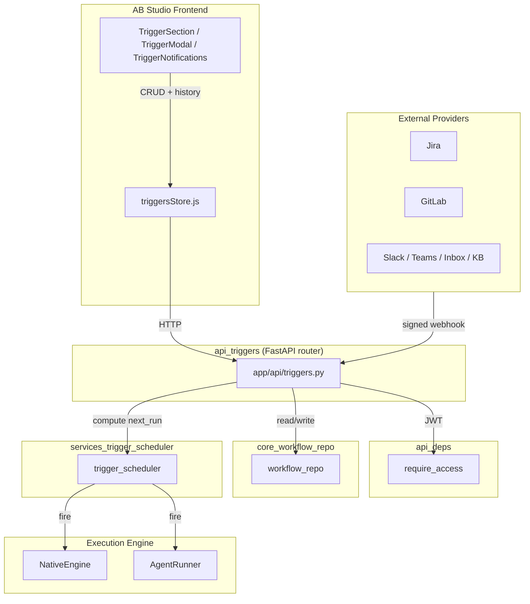
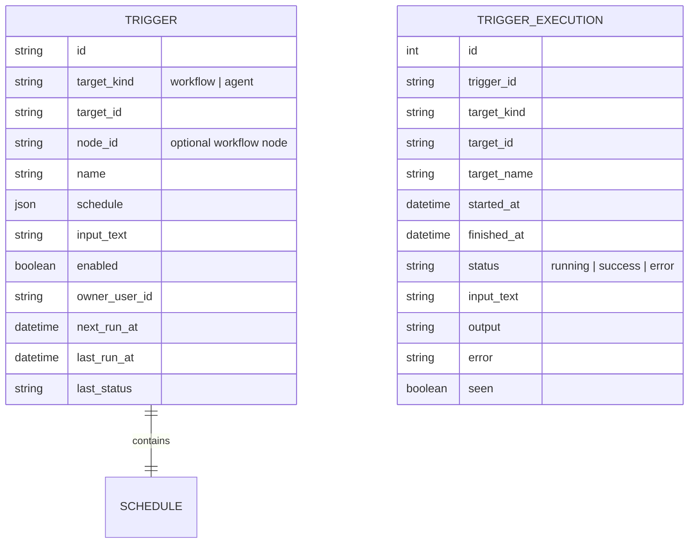
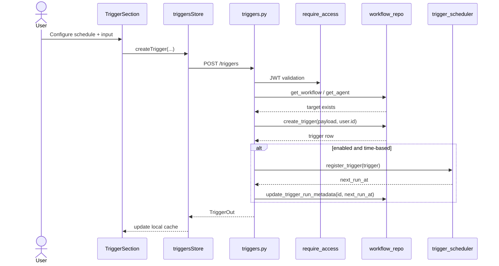
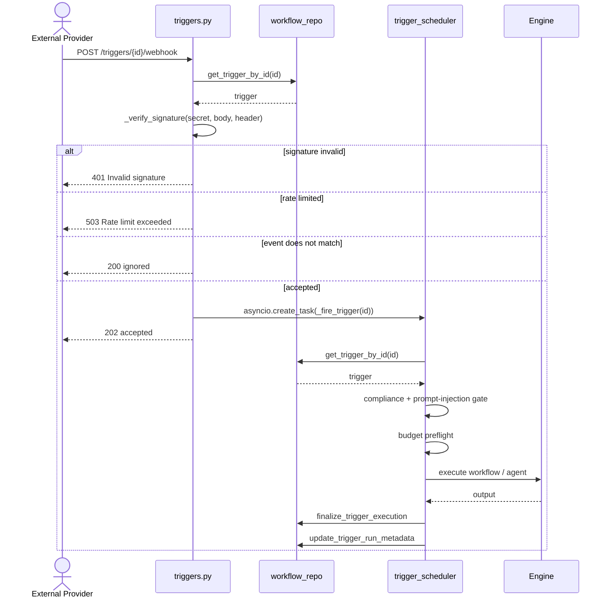
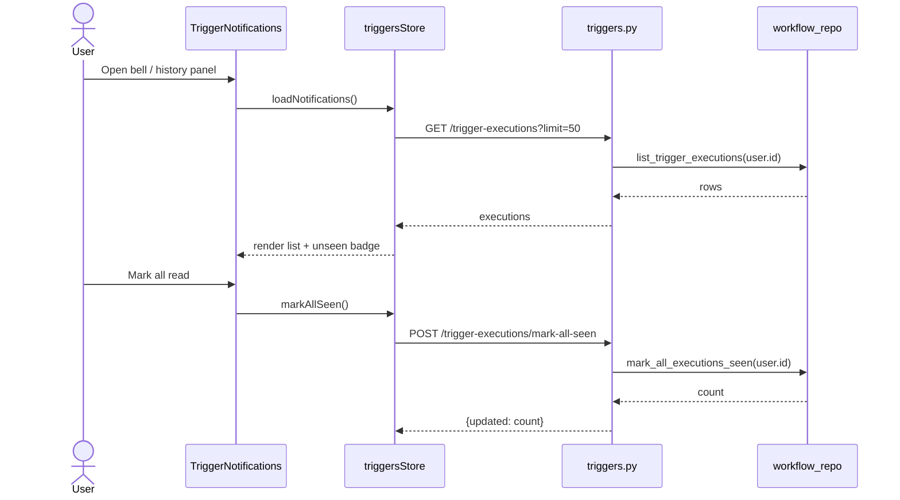

# `api_triggers` — Trigger & Routine Scheduling API

## Brief Introduction

The `api_triggers` module exposes the REST surface for **AB Studio Routines** — scheduled and event-driven executions of workflows and agents. It lets users create, update, list, and delete triggers; inspect execution history; mark runs as seen; and receive signed webhooks from external systems such as Jira, GitLab, Slack, or Teams.

Triggers are persisted in Postgres, dispatched by a dedicated scheduler worker, and executed by the same engine paths used for interactive workflow/agent runs. This module is intentionally thin: it validates requests, delegates persistence to [`core_workflow_repo`](core_workflow_repo.md), and delegates firing to [`services_trigger_scheduler`](services_trigger_scheduler.md).

---

## 1. Module Purpose & Responsibilities

| Responsibility | Description |
| -------------- | ----------- |
| **Trigger CRUD** | Authenticated endpoints to create, read, update, and delete triggers attached to workflows or agents. |
| **Webhook ingestion** | The only *unauthenticated* route (`POST /triggers/{id}/webhook`) that accepts external events after HMAC verification. |
| **Execution history** | List, filter, and delete historical trigger runs; mark individual or all runs as seen. |
| **Feature flags** | Expose runtime feature toggles (e.g., `ABSTUDIO_AGENT_TRIGGERS_ENABLED`) to the frontend. |
| **Security gating** | Signature verification, per-trigger rate limiting, and secret redaction in responses. |

The module does **not** run workflows itself. Execution is delegated to [`services_trigger_scheduler`](services_trigger_scheduler.md), which in turn calls the workflow engine ([`engine_native_engine`](engine_native_engine.md)) or agent runner.

---

## 2. Architecture

### 2.1 High-level component diagram

### 2.2 Module placement in the system

`api_triggers` is one of several FastAPI routers under `ABStudio/backend/app/api/`. It is mounted alongside [`api_workflows`](api_workflows.md), [`api_agents`](api_agents.md), [`api_execution`](api_execution.md), and [`api_chat`](api_chat.md). It reuses the same authentication dependency ([`api_deps`](api_deps.md)) and the same workflow/agent repository ([`core_workflow_repo`](core_workflow_repo.md)) as the rest of AB Studio.

---

## 3. Core Components

### 3.1 Route handlers

| Route | Handler | Purpose |
| ----- | ------- | ------- |
| `GET /triggers/config` | `triggers_config` | Return feature flags (no auth). |
| `GET /triggers` | `list_triggers_route` | List user's triggers, optionally filtered by target kind/id/node. |
| `POST /triggers` | `create_trigger_route` | Create a new trigger; validate target exists. |
| `GET /triggers/{id}` | `get_trigger_route` | Get a single trigger. |
| `PUT /triggers/{id}` | `update_trigger_route` | Update name/schedule/input/enabled; recompute `next_run_at`. |
| `DELETE /triggers/{id}` | `delete_trigger_route` | Delete trigger and deregister from scheduler. |
| `POST /triggers/{id}/webhook` | `trigger_webhook_route` | Ingest signed external events. |
| `GET /trigger-executions` | `list_trigger_executions_route` | List execution history (paginated). |
| `GET /trigger-executions/unseen` | `list_unseen_executions_route` | List unseen completed executions. |
| `GET /trigger-executions/{id}` | `get_execution_route` | Get a single execution. |
| `POST /trigger-executions/{id}/seen` | `mark_execution_seen_route` | Mark one execution seen. |
| `POST /trigger-executions/mark-all-seen` | `mark_all_executions_seen_route` | Mark all executions seen. |
| `DELETE /trigger-executions/{id}` | `delete_execution_route` | Delete one execution. |
| `DELETE /trigger-executions` | `delete_all_executions_route` | Delete all user's executions. |

### 3.2 Helper functions

| Function | Responsibility |
| -------- | -------------- |
| `_trigger_to_out` | Serialize a trigger row for the API. Strips `owner_user_id` and redacts the webhook `secret` to `None`. |
| `_rate_limited` | In-process token-bucket rate limiter keyed by trigger ID. Returns `503` on overload. |
| `_verify_signature` | Constant-time HMAC-SHA256 verification supporting `sha256=<hex>` and bare hex forms. |
| `_event_matches` | Normalize and match event source/type for Jira, GitLab, and generic events. |

---

## 4. Data Models

Trigger shapes are defined in [`app_models`](app_models.md).

### 4.1 Trigger schedule types

### 4.2 Schedule variants

| `type` | Fields | Use case |
| ------ | ------ | -------- |
| `once` | `run_at` | One-shot run at an IST datetime. |
| `hourly` | `at_minute` | Every hour at a specific minute. |
| `daily` | `at_time` | Every day at `HH:MM` IST. |
| `weekdays` | `at_time` | Monday–Friday at `HH:MM` IST. |
| `weekly` | `at_time`, `day_of_week` | Weekly on a chosen day. |
| `custom` | `cron` | 5-field cron expression in IST. |
| `webhook` / `event` | `event_source`, `event_type`, `secret` | Event-driven triggers. |

All times are interpreted in **IST (Asia/Kolkata)** regardless of server timezone.

---

## 5. Data Flows

### 5.1 Creating a scheduled trigger

### 5.2 Webhook ingestion and firing

### 5.3 Execution history and notifications

---

## 6. Security Model

### 6.1 Authentication

All routes except the webhook route require a valid JWT via [`api_deps.require_access`](api_deps.md). The webhook route is intentionally unauthenticated because external providers cannot present AB Studio JWTs.

### 6.2 Webhook security

| Control | Implementation |
| ------- | -------------- |
| **HMAC-SHA256** | `_verify_signature` compares a constant-time HMAC over the raw body. |
| **GitLab token** | `X-Gitlab-Token` is compared directly when present. |
| **Secret redaction** | `_trigger_to_out` sets `schedule.secret` to `None` so the secret is never returned. |
| **Rate limiting** | `_rate_limited` enforces 30 fires per trigger per 60-second window; returns `503` for back-pressure. |
| **Existence hiding** | Missing or non-webhook triggers return generic `404 Not found`. |
| **Disabled triggers** | Return `403 Trigger disabled`. |

### 6.3 Input gating

Before a trigger actually runs, [`services_trigger_scheduler._fire_trigger`](services_trigger_scheduler.md) applies:

1. **Compliance gate (C4)** — blocks PAN, CVV, etc.
2. **Prompt-injection gate (PI2)** — blocks by default for triggers.
3. **Budget preflight** — denies if the owner has exceeded budget.

See [`core_governance`](core_governance.md) and [`services_trigger_scheduler`](services_trigger_scheduler.md) for details.

---

## 7. Scheduler Integration

`api_triggers` does not maintain an in-memory scheduler. Instead:

1. On create/update, it asks [`trigger_scheduler.register_trigger`](services_trigger_scheduler.md) to compute the next fire time.
2. It persists `next_run_at` in the `triggers` table via `workflow_repo.update_trigger_run_metadata`.
3. A separate [`workers/workflow_scheduler_worker`](workers.md) polls the table every 60 seconds and enqueues due triggers to Redis/RQ.
4. The RQ job calls `trigger_scheduler.fire_from_queue`, which runs `_fire_trigger` in a worker process.

This design keeps the API stateless and lets trigger execution survive API server restarts.

---

## 8. Frontend Integration

The frontend trigger UI lives in [`abstudio_frontend/triggers_feature`](abstudio_frontend.md):

- **`triggersStore.js`** — Zustand store for CRUD, history, and notifications.
- **`TriggerSection.jsx`** — Routines panel embedded in agent/workflow editors.
- **`TriggerModal.jsx`** — Modal wrapper for trigger management.
- **`TriggerNotifications.jsx`** — Bell icon and execution detail drawer.
- **`TriggerPicker.jsx`** — Schedule type selector.

The store calls the endpoints documented above and caches triggers per `${kind}:${id}:${nodeId}`.

---

## 9. Error Handling & Observability

- All route failures raise `HTTPException` with appropriate status codes (`400`, `401`, `403`, `404`, `503`).
- Webhook `_fire_trigger` tasks attach a done-callback so unhandled exceptions are logged via `core.logger` instead of being silently dropped.
- Structured logs include `trigger_id`, `target_kind`, `target_id`, `owner`, and `execution_id`.
- Audit events are emitted at fire start, rejection, budget denial, and completion via the platform audit path.

---

## 10. Related Modules

| Module | Relationship |
| ------ | ------------ |
| [`api_deps`](api_deps.md) | JWT authentication dependency. |
| [`app_models`](app_models.md) | Pydantic models for triggers and executions. |
| [`core_workflow_repo`](core_workflow_repo.md) | Postgres persistence for triggers and executions. |
| [`services_trigger_scheduler`](services_trigger_scheduler.md) | Computes next run times and fires triggers. |
| [`engine_native_engine`](engine_native_engine.md) | Executes workflow runs. |
| [`api_agents`](api_agents.md) | Agent CRUD; triggers can target agents. |
| [`api_workflows`](api_workflows.md) | Workflow CRUD; triggers can target workflows. |
| [`abstudio_frontend/triggers_feature`](abstudio_frontend.md) | Frontend UI for triggers. |
| [`workers/workflow_scheduler_worker`](workers.md) | Polls `triggers` table and dispatches due runs. |

---

## 11. Deployment & Configuration

| Environment variable | Effect |
| -------------------- | ------ |
| `ABSTUDIO_AGENT_TRIGGERS_ENABLED` | Exposed via `GET /triggers/config` as `agent_triggers_enabled`. When falsy, the frontend can hide trigger UI. |

No other runtime configuration is required by this module; scheduler cadence and worker behavior are controlled in [`services_trigger_scheduler`](services_trigger_scheduler.md) and [`workers/workflow_scheduler_worker`](workers.md).
