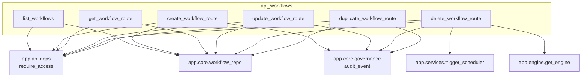
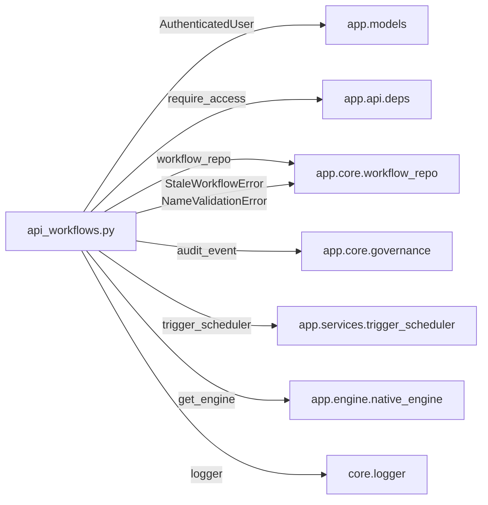
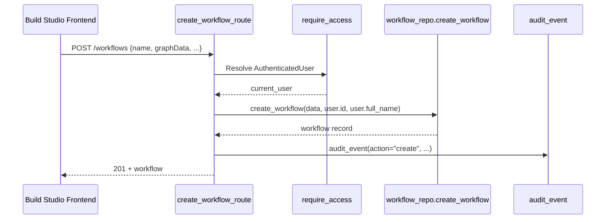
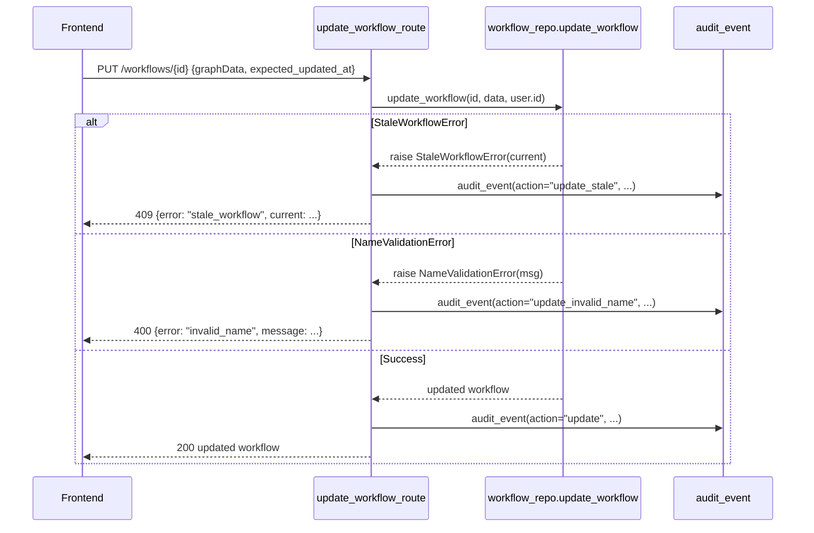
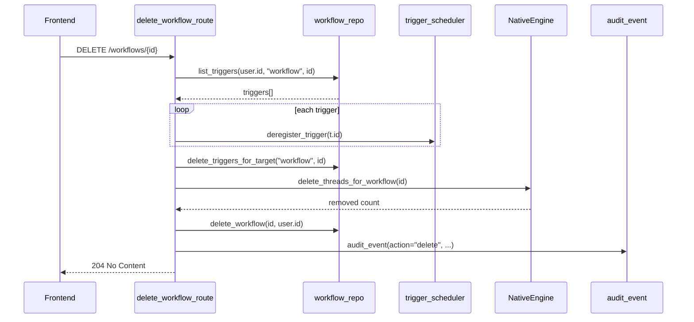

# API Workflows Module

## Introduction

The `api_workflows` module provides the HTTP REST surface for managing workflow definitions in ABStudio. It exposes standard CRUD operations (Create, Read, Update, Delete, Duplicate) for workflow graphs and acts as the bridge between the Build Studio frontend and the persistent workflow repository. Workflow definitions authored through this module are later executed by the [execution](api_execution.md) endpoints, scheduled by the [trigger scheduler](api_triggers.md), and can be promoted to reusable templates via the [template](api_templates.md) and [template admin](api_template_admin.md) modules.

This module is intentionally thin: it validates authentication, delegates persistence to [core_workflow_repo](core_workflow_repo.md), emits audit events through [core_governance](core_governance.md), and handles domain-specific cleanup such as deregistering scheduled triggers and removing associated chat history when a workflow is deleted.

## Module Purpose and Core Functionality

The module is implemented as a FastAPI `APIRouter` mounted under `/workflows`. It owns the lifecycle of a workflow's metadata and graph definition (`graphData`), including:

- **Listing workflows** for the authenticated user.
- **Creating new workflows** with an initial graph, name, description, and optional knowledge-base attachment.
- **Retrieving a single workflow** by ID.
- **Updating a workflow**, including optimistic concurrency control to prevent silent overwrites.
- **Deleting a workflow** and cascading cleanup of triggers and chat threads.
- **Duplicating a workflow** to create a copy with a derived name.

All routes require an authenticated user obtained through [api_deps](api_deps.md)::`require_access`. Administrative elevation is not required for these user-scoped operations; ownership is enforced by the repository layer using `owner_user_id`.

## Architecture and Component Relationships

### Component Overview

### Dependency Diagram

## API Endpoints

| Method | Path | Handler | Purpose |
|--------|------|---------|---------|
| `GET` | `/workflows` | `list_workflows` | Return all workflows owned by the current user, ordered by `updated_at DESC`. |
| `POST` | `/workflows` | `create_workflow_route` | Create a new workflow from the supplied JSON payload. |
| `GET` | `/workflows/{workflow_id}` | `get_workflow_route` | Fetch a single workflow including its full `graphData` and `knowledge` blob. |
| `PUT` | `/workflows/{workflow_id}` | `update_workflow_route` | Update workflow fields with optimistic concurrency and name validation. |
| `DELETE` | `/workflows/{workflow_id}` | `delete_workflow_route` | Delete the workflow, its triggers, and its chat threads. |
| `POST` | `/workflows/{workflow_id}/duplicate` | `duplicate_workflow_route` | Create a copy of an existing workflow. |

### Request/Response Details

#### `GET /workflows`

Returns a list of workflow summaries. The listing intentionally omits the `knowledge` JSONB blob to keep response sizes small; full knowledge is available via `GET /workflows/{id}`.

#### `POST /workflows`

Accepts a JSON object containing:

- `id` (optional): explicit workflow ID; auto-generated if omitted.
- `name`: display name, validated for format and uniqueness.
- `description` (optional): human-readable summary.
- `graphData`: React-Flow compatible graph with `nodes` and `edges`.
- `knowledge` (optional): workflow-level knowledge-base configuration.
- `source_template_id` (optional): template the workflow was instantiated from.

On success returns `201 Created` with the persisted workflow. Duplicate or invalid names surface as `400 Bad Request` with a structured error object.

#### `GET /workflows/{workflow_id}`

Returns the full workflow record. Returns `404 Not Found` if the workflow does not exist or is not owned by the caller.

#### `PUT /workflows/{workflow_id}`

Accepts the same fields as creation. Special behaviors:

- **Optimistic concurrency**: if `expected_updated_at` is provided and does not match the current row, the repository raises `StaleWorkflowError`. The route returns `409 Conflict` with the current server-side row so the frontend can merge changes instead of overwriting.
- **Empty-graph guard**: the repository refuses to overwrite a non-empty graph with an empty `graphData` unless `allow_empty_graph` is explicitly `true`. This prevents frontend autosave races from clobbering user work.
- **Name validation**: duplicate or malformed names return `400 Bad Request`.

#### `DELETE /workflows/{workflow_id}`

Performs best-effort cascade cleanup before deleting the workflow row:

1. Lists triggers targeting this workflow and deregisters each one from the active scheduler.
2. Deletes all trigger rows for the workflow target.
3. Deletes chat threads, HITL snapshots, and loop/condition audit trails via the execution engine's checkpoint store.

Failures during trigger or chat cleanup are logged and audited but do **not** block the workflow deletion. Returns `204 No Content` on success.

#### `POST /workflows/{workflow_id}/duplicate`

Creates a new workflow seeded from the original's fields, with a fresh ID and a name suffixed with "(Copy)". Returns `201 Created` or `404 Not Found` if the source workflow is missing.

## Data Flow

### Create Workflow

### Update Workflow with Concurrency Control

### Delete Workflow with Cascade Cleanup

## Error Handling

The module maps repository-level exceptions to HTTP status codes and structured payloads:

| Exception | HTTP Status | Payload | Scenario |
|-----------|-------------|---------|----------|
| `NameValidationError` | `400 Bad Request` | `{"error": "invalid_name", "message": "..."}` | Duplicate or malformed workflow name. |
| `StaleWorkflowError` | `409 Conflict` | `{"error": "stale_workflow", "current": {...}}` | Concurrent edit detected; server row returned for merge. |
| Missing workflow | `404 Not Found` | `"Workflow not found"` | GET/UPDATE/DUPLICATE target does not exist. |
| Unexpected error | `500 Internal Server Error` | Error string | Logged and audited as `create_error` / `update_error`. |

All error paths emit an `audit_event` so operational issues can be traced back to the user, department, and workflow context.

## Audit and Governance

Every mutating route calls `app.core.governance.audit_event` with the endpoint `abstudio.workflow.crud`. Actions include:

- `create`, `create_invalid_name`, `create_error`
- `update`, `update_stale`, `update_invalid_name`, `update_error`, `update_missing`
- `delete`, `delete_trigger_cleanup_error`, `delete_chat_cleanup_error`
- `duplicate`, `duplicate_missing`

Audit payloads include `user_id`, `email`, `department`, `workflow_id`, `workflow_name`, and error details where applicable. Creating a workflow does **not** auto-submit it for governance approval; submission remains an explicit user action handled elsewhere.

## Integration with Other Modules

- **[core_workflow_repo](core_workflow_repo.md)**: Provides all persistence operations, name validation, optimistic concurrency, and trigger cleanup helpers.
- **[api_execution](api_execution.md)**: Consumes workflow definitions from this module to run them via the native engine.
- **[api_chat](api_chat.md)**: Reads and manages chat threads associated with workflows; `delete_workflow_route` invokes the engine to remove those threads.
- **[api_triggers](api_triggers.md)**: Schedules and fires workflows; this module deregisters and deletes triggers when a workflow is removed.
- **[api_templates](api_templates.md) / [api_template_admin](api_template_admin.md)**: Workflows can be saved as templates or instantiated from templates via `source_template_id`.
- **[api_agents](api_agents.md)**: Agent definitions referenced by workflow nodes are managed separately but executed within workflow runs.
- **[api_deps](api_deps.md)**: Supplies `require_access`, which resolves the `AuthenticatedUser` from the gateway-wrapped JWT.
- **[core_governance](core_governance.md)**: Receives audit events for workflow CRUD operations.
- **[engine_native_engine](engine_native_engine.md)**: The execution engine that runs workflow graphs and provides checkpoint-store cleanup on deletion.

## Notes for Maintainers

- The module deliberately keeps business logic out of the route handlers; any new validation or persistence behavior should generally live in `workflow_repo` rather than here.
- Deletion cleanup is best-effort by design. A failure in trigger deregistration or chat-thread removal is audited but does not abort the workflow deletion, ensuring users can recover from partially configured workflows.
- The duplicate route does not copy chat history or triggers; the new workflow starts with a blank execution context.
- When extending endpoints, preserve the existing audit-event shape so downstream security and compliance dashboards continue to classify workflow CRUD correctly.
