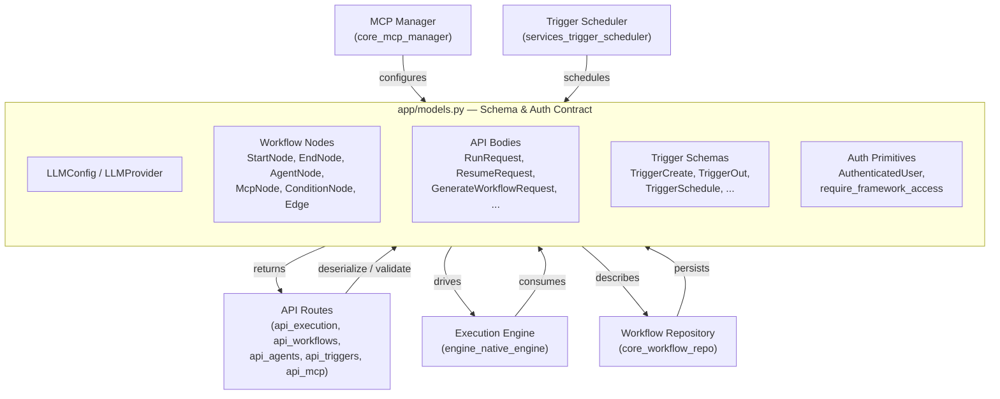
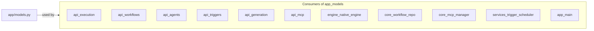
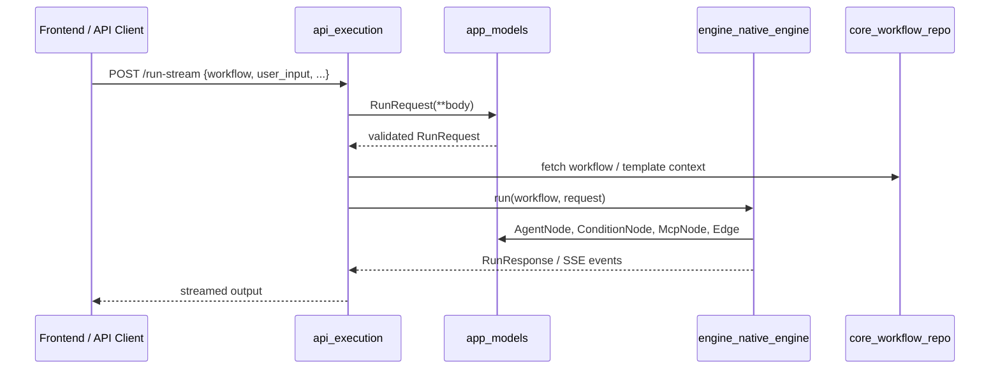
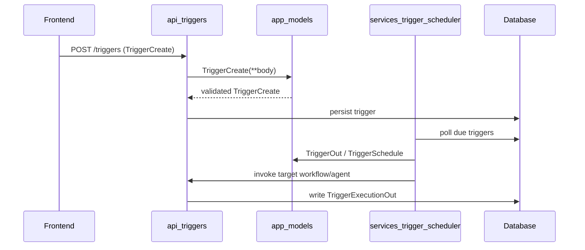
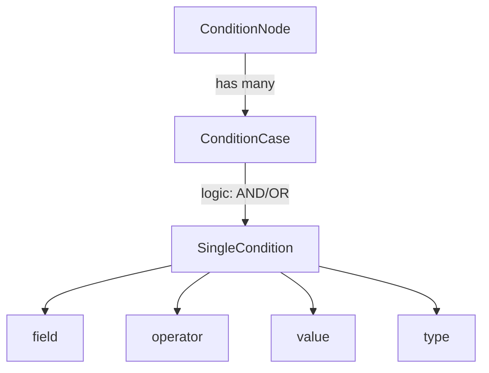
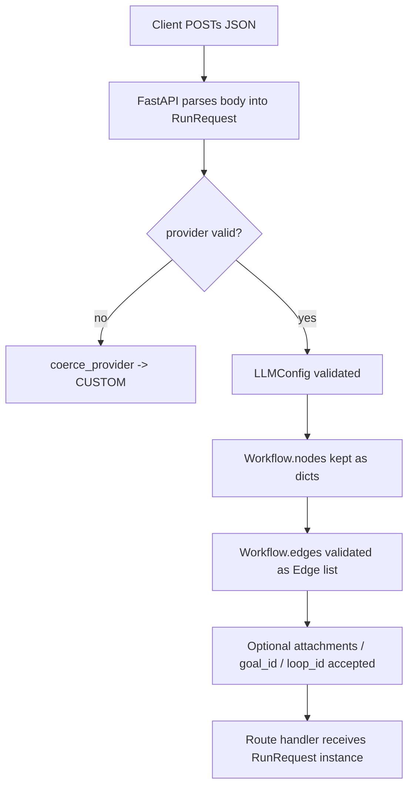
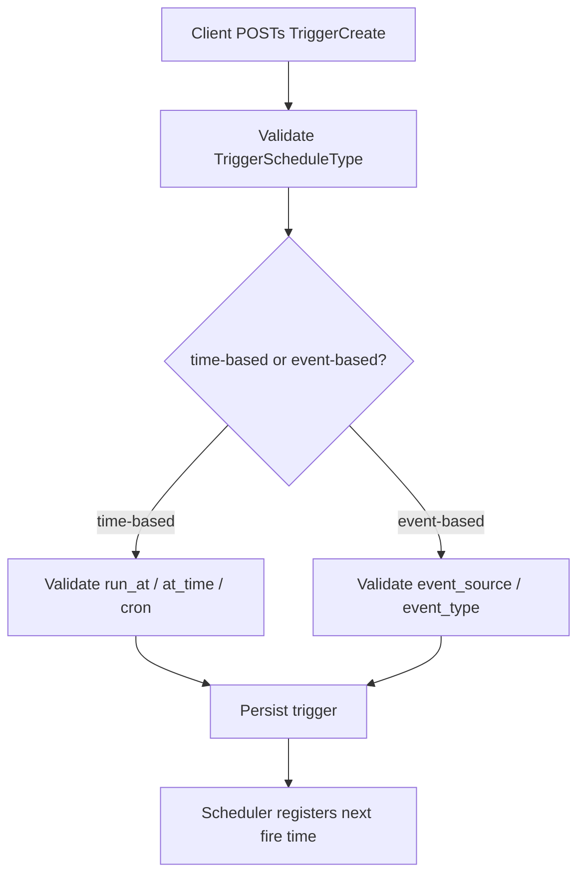

# `app_models` Module

## Brief Introduction

`ABStudio\backend\app\models.py` is the central **schema and authentication contract** for the ABStudio backend. It defines the Pydantic models that every API route, execution engine, and repository layer relies on to exchange structured data. The module is intentionally a single source of truth for:

- **LLM provider configuration** (`LLMProvider`, `LLMConfig`).
- **Workflow graph node types** (`StartNode`, `EndNode`, `AgentNode`, `McpNode`, `ConditionNode`, `Edge`, `Workflow`).
- **API request/response bodies** (`RunRequest`, `ResumeRequest`, `RunResponse`, `GenerateWorkflowRequest`, `GenerateInstructionsRequest`, `McpTestRequest`, etc.).
- **Trigger/routine schemas** (`TriggerCreate`, `TriggerUpdate`, `TriggerOut`, `TriggerExecutionOut`, `TriggerSchedule`, `TriggerScheduleType`, `TriggerTargetKind`).
- **Authentication primitives** (`AuthenticatedUser`, `_get_current_user`, `require_framework_access`).

Because the file is imported by `main.py`, `native_engine.py`, `mcp_manager.py`, and `workflow_repo.py`, changes here affect the entire backend API surface. The current implementation ships with a **standalone/local-dev authentication stub** that accepts every request as an admin user; production deployments replace `_get_current_user()` with real identity-provider logic.

---

## Architecture

### 1. Module Responsibilities

| Responsibility | Description |
|----------------|-------------|
| **Schema definition** | Declares all FastAPI request/response bodies and internal data transfer objects using Pydantic v2. |
| **Workflow DSL** | Defines the typed node model for the visual workflow editor (start, end, agent, condition, MCP). |
| **Trigger DSL** | Defines scheduled and event-driven trigger schemas used by the scheduler service and trigger API. |
| **Auth contract** | Exposes `AuthenticatedUser` and `require_framework_access()` so routes can depend on a uniform user identity. |
| **Validation rules** | Embeds field validators (e.g., coercing unknown LLM providers to `custom`) at the schema layer. |

### 2. High-Level Architecture Diagram



### 3. Component Breakdown

#### 3.1 LLM Configuration

- **`LLMProvider`** — an `Enum` that currently only exposes `CUSTOM`. It exists so future providers can be added without breaking existing payloads.
- **`LLMConfig`** — the canonical model for agent-level LLM settings:
  - `provider`, `api_key`, `model_name`, `temperature`, `max_tokens`, `top_p`, `base_url`.
  - Includes a `coerce_provider` validator that maps legacy/unknown provider strings to `CUSTOM`, making the API backward-compatible.

#### 3.2 Workflow Node Types

The workflow graph is a directed graph of typed nodes connected by `Edge` objects.

| Node | Type Literal | Purpose |
|------|--------------|---------|
| `StartNode` | `"start"` | Entry point of a workflow. |
| `EndNode` | `"end"` | Terminal node. |
| `AgentNode` | `"agent"` | LLM-powered step with `name`, `instructions`, and `llm_config`. |
| `McpNode` | `"mcp"` | External tool invocation via an MCP server type (`McpServerType`). |
| `ConditionNode` | `"condition"` | Branching logic composed of `ConditionCase` objects. |

- **`McpServerType`** — enum of supported MCP server kinds: `github`, `gitlab`, `rest_api`, `postgres`, `weaviate`, `teams`.
- **`SingleCondition`** — one predicate: `{field, operator, value, type}`.
- **`ConditionCase`** — a named branch with a list of `SingleCondition` objects and an `AND`/`OR` logic gate.
- **`Edge`** — `{source, target, sourceHandle}` where `sourceHandle` identifies which condition branch the edge originates from.
- **`Workflow`** — the top-level graph container. `nodes` are kept as raw `dict`s for frontend flexibility; `edges` are strongly typed. Optionally carries a `knowledge` blob inherited by agent nodes.

#### 3.3 API Request/Response Bodies

| Model | Direction | Used By |
|-------|-----------|---------|
| `RunRequest` | Request | `api_execution` (`run_workflow_stream`, `run_workflow`) |
| `ResumeRequest` | Request | `api_execution` (`resume_workflow_stream_endpoint`) |
| `RunResponse` | Response | Execution routes |
| `ExecutionTrace` | Response | Inside `RunResponse` |
| `GenerateInstructionsRequest` / `GenerateInstructionsResponse` | Request/Response | `api_generation` (`generate_instructions`) |
| `GenerateWorkflowRequest` / `GenerateWorkflowResponse` | Request/Response | `api_generation` (`generate_workflow`) |
| `McpTestRequest` / `McpTestResponse` | Request/Response | `api_mcp` (`test_mcp`) |

`RunRequest` is the most heavily evolved schema. In addition to the core `workflow` + `user_input`, it carries:

- `subagents_enabled` — workflow-wide swarm opt-in.
- `goal_id`, `budget`, `loop_id` — Loop Engineering placeholders for outer-loop execution.
- `allowed_connections` — credential-vault scope for sandboxed tool calls.
- `attachments` — structured document uploads from the workflow-preview chat panel.

`ResumeRequest` mirrors many of these fields so that a paused (HITL) run resumes with the same context, including `pending_tool_calls_override` for reviewer-edited tool calls.

#### 3.4 Trigger Schemas

Triggers are ABStudio's "Routines" — scheduled or event-driven invocations of a workflow or agent.

- **`TriggerScheduleType`** — `once`, `hourly`, `daily`, `weekdays`, `weekly`, `custom`, `webhook`, `event`.
- **`TriggerTargetKind`** — `workflow` or `agent`.
- **`TriggerSchedule`** — schedule descriptor with IST-based fields; only the fields relevant to `type` are used.
- **`TriggerCreate`** / **`TriggerUpdate`** — write payloads.
- **`TriggerOut`** — read model including computed `next_run_at`, `last_run_at`, and `last_status`.
- **`TriggerExecutionOut`** — record of a single trigger firing.

See [services_trigger_scheduler.md](services_trigger_scheduler.md) and [api_triggers.md](api_triggers.md) for how these schemas are scheduled and exposed.

#### 3.5 Authentication

- **`AuthenticatedUser`** — the user identity object consumed by routes and engines. Includes hierarchy fields (`ad_level`, `is_hod`, `is_security_team`) and `frameworks` for framework-level access control.
- **`_get_current_user()`** — async dependency that returns a hard-coded local-dev admin in standalone mode.
- **`require_framework_access(framework: str)`** — FastAPI dependency factory. Currently returns the current user without checking framework membership; production implementations can enforce membership here.

---

## Dependencies

### 3rd-Party Libraries

| Library | Usage |
|---------|-------|
| `pydantic` | All `BaseModel` schemas, `Field` constraints, and `field_validator`. |
| `fastapi.Depends` | Wiring `_get_current_user` into dependency injection. |
| `enum.Enum` | `LLMProvider`, `McpServerType`, `TriggerScheduleType`, `TriggerTargetKind`. |

### Internal Module Dependencies

`app_models` is a **leaf-ish schema module**; it does not import business logic. It is imported by:

- [`app_main.md`](app_main.md) — FastAPI application wiring.
- [`api_execution.md`](api_execution.md) — `run_workflow_stream`, `run_workflow`, `resume_workflow_stream_endpoint`.
- [`api_workflows.md`](api_workflows.md) — workflow CRUD routes.
- [`api_agents.md`](api_agents.md) — agent CRUD routes.
- [`api_triggers.md`](api_triggers.md) — trigger CRUD and webhook routes.
- [`api_generation.md`](api_generation.md) — LLM generation helpers.
- [`api_mcp.md`](api_mcp.md) — MCP testing route.
- [`engine_native_engine.md`](engine_native_engine.md) — workflow execution engine.
- [`core_workflow_repo.md`](core_workflow_repo.md) — workflow persistence and template publishing.
- [`core_mcp_manager.md`](core_mcp_manager.md) — MCP session/tool management.
- [`services_trigger_scheduler.md`](services_trigger_scheduler.md) — APScheduler-based trigger dispatch.



---

## Data Flow

### Workflow Execution Flow



### Trigger Lifecycle Flow



---

## Component Interaction

### How Node Types Compose a Workflow

```mermaid
flowchart LR
    Start([StartNode]) --> Agent1[AgentNode]
    Agent1 --> Cond{ConditionNode}
    Cond -- case A --> MCP[McpNode]
    Cond -- case B --> Agent2[AgentNode]
    MCP --> End([EndNode])
    Agent2 --> End

    subgraph legend["Edge Semantics"]
        E1[Edge sourceHandle = "case-a"]
        E2[Edge sourceHandle = "case-b"]
    end
```

### Condition Evaluation Structure



---

## Process Flows

### 1. Validating an Incoming Run Request



### 2. Creating a Trigger



---

## Integration with the Rest of the System

`app_models` sits at the boundary between the HTTP API and the execution/runtime layers. Its design choices directly impact other modules:

- **Frontend workflow editor** — serializes graphs into `Workflow.nodes`/`Workflow.edges`. Because `nodes` are raw `dict`s, the frontend can add new node shapes without a backend redeploy, as long as the engine knows how to interpret them.
- **Native engine** — casts raw node dicts to typed node models (`AgentNode`, `ConditionNode`, etc.) before execution. See [engine_native_engine.md](engine_native_engine.md).
- **Trigger scheduler** — translates `TriggerSchedule` into APScheduler jobs and writes `TriggerExecutionOut` records. See [services_trigger_scheduler.md](services_trigger_scheduler.md).
- **MCP manager** — uses `McpServerType` and `McpNode.config` to discover and invoke tools. See [core_mcp_manager.md](core_mcp_manager.md).
- **Authentication** — routes in `api_deps` and across the backend can depend on `require_framework_access("agent-chain")` to receive an `AuthenticatedUser`. See [api_deps.md](api_deps.md) and [auth/dependencies.py](auth_dependencies.md) in `shared_core`.

---

## Notes for Maintainers

- **Keep this module dependency-light.** Do not import service/repository code here; that would create circular imports.
- **Preserve backward compatibility.** Use Pydantic validators (like `coerce_provider`) and optional fields for new capabilities (`subagents_enabled`, `goal_id`, `loop_id`, `attachments`).
- **IST timezone assumption.** Trigger schedules are interpreted in Asia/Kolkata; the scheduler service is responsible for timezone conversion.
- **Standalone auth stub.** `_get_current_user()` is intentionally permissive. Replace it with real JWT/OAuth validation for production, and update `require_framework_access()` to enforce framework membership.
- **Node extensibility.** `Workflow.nodes` are `List[dict]` rather than `List[WorkflowNode]` to allow the frontend to evolve node shapes independently. The engine validates each node at runtime.
