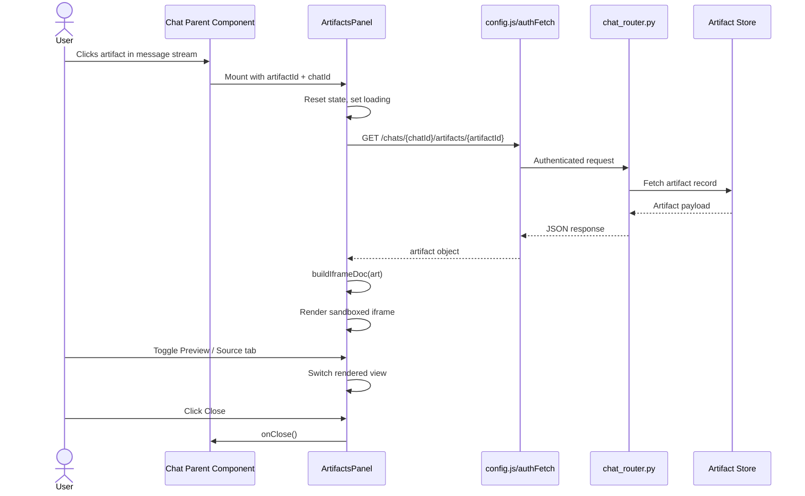
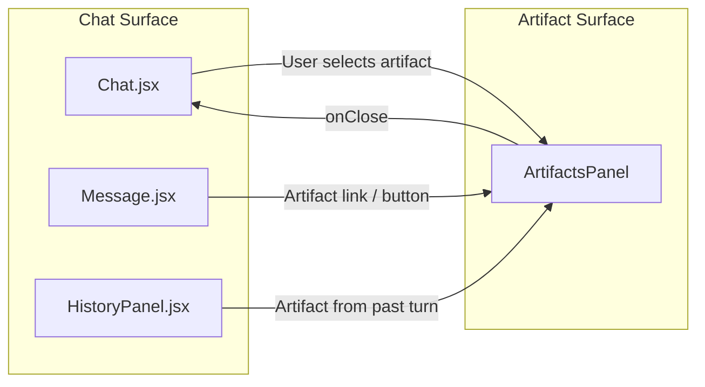
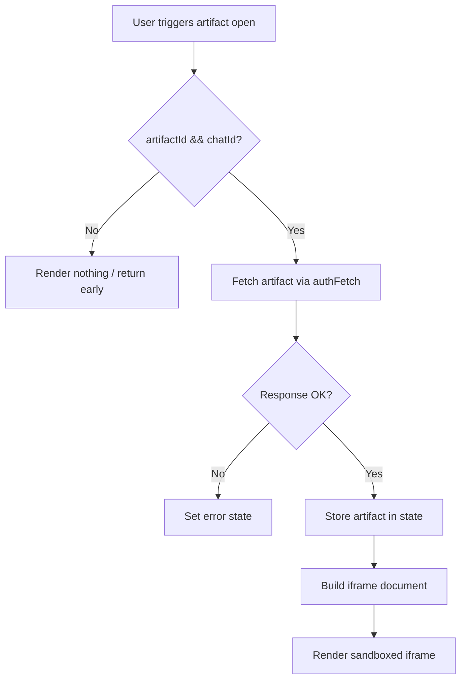
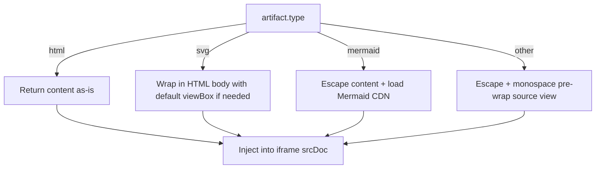

# ArtifactsPanel Module

## Brief Introduction

The `ArtifactsPanel` module is a React component in the `ai-ui` frontend that provides a Claude-Artifacts / ChatGPT-Canvas equivalent experience. It renders a right-pane drawer containing a sandboxed iframe that previews artifact content associated with a specific chat. The panel supports interactive preview of HTML, SVG, and Mermaid diagrams, while other artifact types (markdown, code, React) fall back to a syntax-highlighted source view.

Artifacts are generated outputs produced during chat conversations—such as documents, diagrams, code snippets, or interactive HTML pages—that users may want to inspect, save, or continue editing outside the message stream. The panel isolates these artifacts in a dedicated UI surface so they do not clutter the main chat transcript.

---

## Core Responsibilities

1. **Artifact Retrieval**: Loads a single artifact by `artifactId` and `chatId` from the backend using authenticated fetch.
2. **Type-Aware Rendering**: Converts raw artifact content into a sandboxed HTML document tailored to the artifact type.
3. **Preview / Source Toggle**: Allows users to switch between rendered preview and raw source view.
4. **Sandboxed Isolation**: Embeds rendered content inside an iframe with an empty `sandbox` attribute to mitigate XSS and style leakage.
5. **Error & Loading States**: Displays loading and error feedback while fetching artifact data.

---

## Architecture

```mermaid
flowchart TB
    subgraph Frontend["ai-ui Frontend"]
        AP[ArtifactsPanel.jsx]
        CFG[config.js<br/>authFetch / API_BASE]
        MSG[Message.jsx<br/>Mermaid rendering]
    end

    subgraph Backend["Gateway / API"]
        CR[chat_router.py<br/>get_artifact / list_artifacts]
    end

    subgraph Storage["Storage"]
        DB[(Chat / Artifact Store)]
    end

    AP -->|GET /chats/{chatId}/artifacts/{artifactId}| CFG
    CFG -->|Authenticated request| CR
    CR --> DB
    DB --> CR
    CR -->|JSON artifact| AP
    AP -.->|Reuses mermaid rendering concept| MSG
```

### Component Placement

`ArtifactsPanel` is a top-level overlay component. It is typically mounted by a parent chat view when the user selects an artifact from the message stream or from an artifacts list. It does not manage chat history itself; it only displays the artifact payload.

---

## Component Details

### `ArtifactsPanel`

**Location**: `ai-ui/src/components/ArtifactsPanel.jsx`

**Props**:

| Prop | Type | Description |
|------|------|-------------|
| `artifactId` | `string` | Unique identifier of the artifact to load. |
| `chatId` | `string` | Identifier of the chat that owns the artifact. |
| `onClose` | `function` | Callback invoked when the user closes the panel. |

**Internal State**:

| State | Type | Description |
|-------|------|-------------|
| `art` | `object \| null` | Loaded artifact object (`{ type, title, content, ... }`). |
| `tab` | `"preview" \| "source"` | Active view tab. |
| `error` | `string` | Error message if artifact loading fails. |

**Refs**:

| Ref | Purpose |
|-----|---------|
| `iframeRef` | Reference to the sandboxed iframe element. |

### `buildIframeDoc(art)`

A pure helper function that transforms an artifact object into a self-contained HTML document string for the iframe.

**Supported Types**:

| Type | Behavior |
|------|----------|
| `html` | Injected verbatim as the iframe document. |
| `svg` | Wrapped in a minimal HTML body; if no `<svg>` tag is present, one is added with a default viewBox. |
| `mermaid` | Rendered using the Mermaid CDN library, initialized on load. HTML-special characters are escaped before injection. |
| fallback (markdown / code / react) | Content is HTML-escaped and displayed as pre-wrapped monospace source. |

> **Note**: The fallback source view is intentionally simple. For richer code highlighting or React component execution, additional modules would be required.

---

## Data Flow



---

## Component Interaction



- **Chat.jsx** may maintain the `artifactId`/`chatId` state and conditionally render `ArtifactsPanel`.
- **Message.jsx** can expose an artifact open action when a message contains an artifact reference.
- **HistoryPanel.jsx** may list artifacts across turns and open the panel for any selected one.

For details on how artifacts are created and stored during chat, see the [chat_router](shared_api_routers_chat_router.md) documentation.

---

## Process Flows

### Opening an Artifact



### Rendering by Type



---

## Dependencies

### Internal Dependencies

| Module | Relationship | Description |
|--------|--------------|-------------|
| [config](ai_ui_frontend_config.md) | Imports `API_BASE` and `authFetch` | Provides backend base URL and authenticated HTTP helper. |
| [chat_router](shared_api_routers_chat_router.md) | Backend API consumed | Supplies `GET /chats/{chatId}/artifacts/{artifactId}` and related artifact management endpoints. |
| [Message](message.md) | Conceptual reuse | Uses the same Mermaid rendering approach as chat messages. |
| [Chat](chat.md) | Typical parent / orchestrator | Manages the chat session and artifact selection state. |

### External Dependencies

| Package | Usage |
|---------|-------|
| `react` | Hooks (`useEffect`, `useMemo`, `useRef`, `useState`) and JSX runtime. |
| `lucide-react` | `X`, `Eye`, and `Save` icons for the panel header. |
| `mermaid@11` (CDN) | Loaded dynamically in the iframe for `mermaid` artifact previews. |

---

## Security Considerations

- **Sandboxed iframe**: The iframe uses `sandbox=""`, which applies the most restrictive sandbox policy. This prevents scripts inside the artifact from accessing the parent origin, cookies, or storage.
- **HTML escaping**: Mermaid and fallback content are HTML-escaped before injection to prevent inline script execution.
- **No inline execution of React artifacts**: React-type artifacts are shown as source only, avoiding arbitrary component execution in the parent context.

---

## Extension Points

Future enhancements may include:

- **Rich code preview**: Integrate a syntax highlighter (e.g., Prism or highlight.js) for code and markdown artifacts.
- **React artifact runtime**: A controlled sandbox (e.g., Sandpack or a secure iframe with a bundled runtime) for executing React components.
- **Save / download actions**: Wire the header `Save` button to persist artifacts to local storage or download as files.
- **Versioning**: Display artifact revision history if the backend supports artifact snapshots.

---

## Related Documentation

- [ai_ui_frontend_config.md](ai_ui_frontend_config.md) — Authentication and API configuration.
- [shared_api_routers_chat_router.md](shared_api_routers_chat_router.md) — Backend artifact endpoints.
- [message.md](message.md) — Message rendering including Mermaid diagrams.
- [chat.md](chat.md) — Main chat orchestration component.
